# starVLA 中的 CoT / Thinking / Reasoning：本地代码普查

> 范围：[`/home/luogang/SRC/Robot/starVLA`](../../../starVLA) 本地代码库  
> 对照：LangForce 文本通路见 [`paper/note.md` 第 11 章](paper/note.md#11-文本模态与-llmvlm-技术本地代码实况)  
> 本文依据**真实代码**回答：仓库里有没有 CoT / thinking / reasoning 类技术？若「看起来有」，它们如何实现、如何（或不）影响最终动作。

---

## 目录

0. [导读与检索结论](#0-导读与检索结论)
1. [Category A：名不副实的 `CoT_prompt` 模板](#1-category-a名不副实的-cot_prompt-模板)
2. [Category B：文本生成影响动作 — QwenFast](#2-category-b文本生成影响动作--qwenfast)
3. [Category C：VLM 共训练与 LangForce LLR](#3-category-cvlm-共训练与-langforce-llr)
4. [Category D/E：「Reason」预训练与世界模型](#4-category-dereason预训练与世界模型)
5. [旁路、形似机制与遗留代码](#5-旁路形似机制与遗留代码)
6. [横向对比与适用场景](#6-横向对比与适用场景)
7. [静态结构与动态结构总览](#7-静态结构与动态结构总览)
8. [小结：如何避免误读配置名](#8-小结如何避免误读配置名)

---

## 0. 导读与检索结论

### 0.1 一句话结论

本地 starVLA **不存在**典型 LLM 意义上的多步自然语言 Chain-of-Thought、`<think>` / `reasoning_content` 特殊 token、或「先生成一段思维链再据此出连续动作」的端到端管线。

与「CoT / thinking / reasoning」**形似**的机制可归为五类：

| 类别 | 名称 | 是否真·自然语言 CoT | 是否 `generate()` | 如何影响最终动作 |
|------|------|---------------------|-------------------|------------------|
| **A** | `CoT_prompt` 配置键 | 否（仅 user 包装模板） | 否 | 改条件措辞 → hidden |
| **B** | **QwenFast** | 否（离散 **action token**） | **是** | 生成序列即动作码 |
| **C** | VLA+VLM 共训练 / LangForce LLR | 否（SFT 或 teacher-forced NLL） | 否（VLA 路径） | 间接表征或正则 \(H_Q\) |
| **D** | Cosmos-Reason2 等「Reason」骨干 | 预训练宣传语 | VLA 路径否 | hidden → DiT |
| **E** | WM4A 世界模型 | 「物理推理」特征 | 否 | 视频 DiT 特征 → 动作头 |

全库检索：`CoT_prompt` 广泛存在于 YAML 与各 VLM 的 `build_qwenvl_inputs`；字面量 `think` / `<think>` / `chain_of_thought` / `reasoning_content` **未**作为运行时机制出现。

### 0.2 唯一「generate 直接决定动作」的标准 VLA 路径

[`QwenFast.py`](../../../starVLA/starVLA/model/framework/VLM4A/QwenFast.py) 在 `predict_action` 中调用 `model.generate()`，解码的是 `<robot_action_*>` 一类 **动作特殊 token**，再经 FAST tokenizer 还原为连续动作——这是**离散动作自回归**，不是自然语言思维链。

---

## 1. Category A：名不副实的 `CoT_prompt` 模板

### 1.1 实现（所有主流 Qwen / Cosmos VLM 接口同源）

以 Qwen3-VL 为例：

```126:132:starVLA/starVLA/model/modules/vlm/QWen3.py
            if "CoT_prompt" in self.config.datasets.vla_data:  # If using a grounding prompt to task
                CoT_prompt = self.config.datasets.vla_data.get("CoT_prompt", "")
                prompt = CoT_prompt.replace("{instruction}", instruction)
            else:
                prompt = instruction

            content.append({"type": "text", "text": prompt})
```

注释写的是 “grounding prompt to task”，不是 “chain-of-thought decoding”。同类逻辑见于 `QWen2_5.py`、`QWen3_5.py`、`CosmosReason2.py`、`MiniCPM_V.py`、`Molmo2.py`、`Gemma4.py` 等。

### 1.2 默认 YAML 长什么样

多数 benchmark 配置（SimplerEnv / LIBERO / RoboCasa / Franka 等）类似：

```text
Your task is {instruction}. To identify the key objects for your task.
Locate their bounding boxes in [x1,y1,x2,y2] format.
```

这只是把原始 `lang` **包进更长的 user 提示**。在 QwenGR00T / QwenPI / QwenDual 等框架中：

- forward **只**取 `hidden_states`（或全序列）喂 DiT / 动作头；
- **不**对 bbox JSON 做监督；
- **不**在推理时 `generate` 框坐标再解析。

因此：模板**暗示** grounding，标准训练路径**并未**实现「先说框、再做动作」的 CoT。

### 1.3 谁在用 Category A

几乎所有依赖 `build_qwenvl_inputs` 的框架，例如：

- VLM4A：QwenGR00T、QwenPI / QwenPI_v3、QwenOFT、QwenDual、QwenAdapter、M1、ABot_M0、CosmosGR00T、MiniCPM*、Gemma4*、LangForce（但强制模板退化为 `"{instruction}"`）
- WM4A：若底层仍走同类 VLM 接口组 batch，同样可带 `CoT_prompt`

### 1.4 对最终输出的作用路径

```text
lang  --CoT_prompt.replace-->  user text  --chat_template-->  tokens
  --> VLM forward --> hidden  --> DiT / MLP / Flow  --> continuous actions
```

中间**没有**自然语言 reasoning 文本被生成或被消费。

---

## 2. Category B：文本生成影响动作 — QwenFast

这是仓库内最接近「LLM 文本通道出结果」的 VLA 框架，但生成内容是 **FAST 离散动作码**，不是逐步自然语言推理。

### 2.1 静态结构

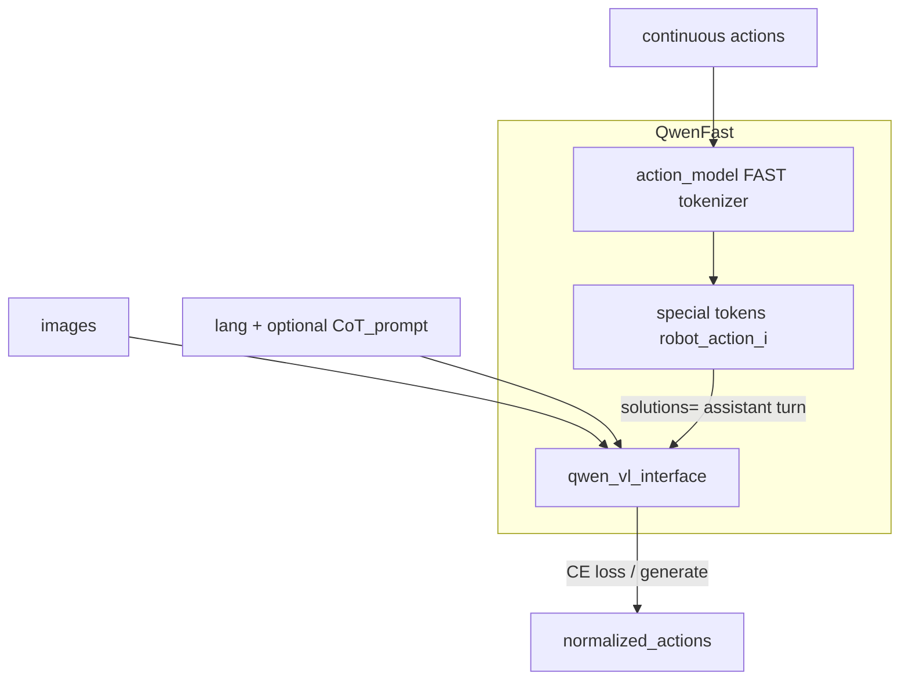

| 组件 | 职责 |
|------|------|
| `qwen_vl_interface` | Instruct 格式前向；训练时算 LM loss；推理时 `generate` |
| `action_model`（FAST） | 连续动作 ↔ fast token ↔ VLM special token 字符串 |
| `map_fast_token_to_vlm_action` | 映射到词表中的 `<robot_action_*>` 串 |

### 2.2 Forward（训练）

```153:176:starVLA/starVLA/model/framework/VLM4A/QwenFast.py
        batch_fast_tokens = self.action_model.encoder_action2fastoken(actions)
        vlm_action_tokens = [self.map_fast_token_to_vlm_action(fast_tokens) for fast_tokens in batch_fast_tokens]
        qwen_inputs = self.qwen_vl_interface.build_qwenvl_inputs(
            images=batch_images, instructions=instructions, solutions=vlm_action_tokens
        )
        ...
        vlm_action_loss = qwenvl_outputs.loss
        ...
        return {"action_loss": vlm_action_loss}
```

要点：

1. 连续 `action` → FAST 编码 → 拼成 **assistant 回合**（`solutions`）。
2. `build_qwenvl_inputs` 在存在 `solutions` 时追加 assistant 消息，并对 labels 做掩码：通常只监督 action token 段（见 `QWen3.py` / `QWen2_5.py` 中 `solutions is not None` 分支）。
3. **Teacher forcing** 的 next-token CE 即为 `action_loss`——没有单独的 DiT / Flow Matching。

```mermaid
sequenceDiagram
  participant Batch as Batch
  participant Fast as FAST_encoder
  participant Build as build_qwenvl_inputs
  participant VLM as QwenVL
  participant Opt as Optimizer

  Batch->>Fast: continuous actions
  Fast->>Build: solutions action token string
  Batch->>Build: images plus lang
  Build->>VLM: input_ids labels
  VLM-->>Opt: action_loss equals LM_CE
  Opt->>VLM: backward
```

### 2.3 Predict（推理）— 真正调用 `generate`

```206:222:starVLA/starVLA/model/framework/VLM4A/QwenFast.py
        qwen_inputs = self.qwen_vl_interface.build_qwenvl_inputs(images=batch_images, instructions=instructions)
        ...
            generated_ids = self.qwen_vl_interface.model.generate(
                **qwen_inputs,
                max_length=2048,
            )
        batch_vlm_action_token_ids = self._extract_action_token_ids(generated_ids)
        batch_fast_action_token_idx = self._decode_action_tokens(batch_vlm_action_token_ids)
        normalized_actions = self.action_model.fast_tokenizer.decode(batch_fast_action_token_idx)
        return {"normalized_actions": normalized_actions}
```

推理时**不传** `solutions`；模型自回归写出 action special tokens，再解码为连续轨迹。

### 2.4 Backward 与「文本如何作用到动作」

| 阶段 | 机制 |
|------|------|
| 训练 | \(\mathcal{L}=-\sum \log P(\text{action\_token}_t \mid v,\ell,\text{tokens}_{<t})\)；梯度更新整个 VLM（及相关 embedding） |
| 推理 | 采样/贪心生成的 token 序列 **就是** 动作的离散表示 |

与自然语言 CoT 的区别：assistant 内容是动作码，不是「先计划再执行」的可读推理。若 YAML 仍带 grounding 式 `CoT_prompt`，那只是加长了 **user** 条件，不会让模型输出 bbox 思维链（除非另接 Category C 的 VLM 数据且你主动去评测自由文本）。

### 2.5 相关但非 Category B

| 框架 | 为何不是「generate 出自然语言再动作」 |
|------|--------------------------------------|
| QwenDiscreteDiffusion | MaskGIT 在 **动作头内部** 迭代离散码，不走 VLM `generate()` |
| QwenOFT | 静态 prompt 插入 `🔍` 占位，对 hidden 做 MLP L1——**不生成** |

---

## 3. Category C：VLM 共训练与 LangForce LLR

### 3.1 `train_starvla_cotrain`：双损失、无 VLA 内 CoT 解码

文档与脚本：[`examples/modelExtensions/CoTrainVLM/`](../../../starVLA/examples/modelExtensions/CoTrainVLM/)。

核心训练步（DeepSpeed / Accelerate 两套路径同构）：

```369:407:starVLA/starVLA/training/train_starvla_cotrain.py
                output_dict = self.model.forward(batch_vla)
                action_loss = output_dict["action_loss"]
            self.model.backward(action_loss)
            ...
                vlm_output = unwrapped.qwen_vl_interface(**batch_vlm)
                vlm_loss = vlm_output.loss * self.config.trainer.loss_scale.vlm
            self.model.backward(vlm_loss)
```

| 损失 | 数据 | 含义 |
|------|------|------|
| `action_loss` | 机器人示范 batch | 由具体框架决定（DiT / Fast CE / OFT L1…） |
| `vlm_loss` | LLaVA 风格对话 JSON | 标准 VLM SFT（只监督 assistant 段） |

`vlm_data.dataset_use` 常可包含 `refcoco_grounding_*`、`vqav2_en` 等——这是 **多任务语言 CE**，用来保/增强视觉–语言对齐。它**不会**在 `model.forward(batch_vla)` 里插入「生成 bbox → 再条件动作」的步骤。

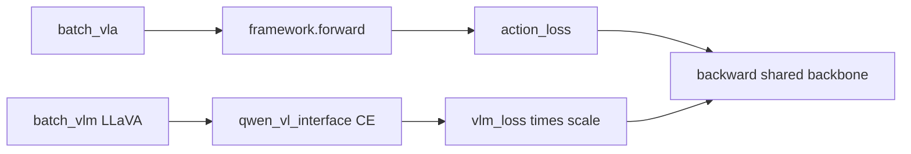

另有 [`train_starvlm.py`](../../../starVLA/starVLA/training/train_starvlm.py) 仅优化 `vlm_loss`（VLM-only）。

### 3.2 LangForce：LLR 不是 CoT

同仓 [`LangForce.py`](../../../starVLA/starVLA/model/framework/VLM4A/LangForce.py)：

- 强制 `CoT_prompt == "{instruction}"`；
- 双分支 teacher-forced 语言 NLL → `kl_loss`（实为 LLR）；
- 推理仅 posterior hidden → DiT，**无** `generate()`。

详见 [`paper/note.md` §11](paper/note.md#11-文本模态与-llmvlm-技术本地代码实况)。此处强调：它用语言 logits 做**正则探针**，不是生成中间思维文本。

---

## 4. Category D/E：「Reason」预训练与世界模型

### 4.1 Cosmos-Reason2 / CosmosGR00T（Category D）

[`CosmosReason2.py`](../../../starVLA/starVLA/model/modules/vlm/CosmosReason2.py) 加载 `nvidia/Cosmos-Reason2-*`（Qwen3-VL 架构上的物理推理微调权重）。接口仍提供：

- `build_qwenvl_inputs` + 可选 `CoT_prompt`（**输入模板**）；
- `generate()`（封装与 `__main__` demo）。

[`CosmosGR00T.py`](../../../starVLA/starVLA/model/framework/VLM4A/CosmosGR00T.py) 的 VLA 路径与 QwenGR00T 同构：`hidden_states[-1]` → Flow-matching DiT；**`predict_action` 不调用 `generate()`**。

结论：「physical reasoning」体现在**预训练表征**；运行时不是逐步文本推理。

### 4.2 WM4A 世界模型（Category E）

`starVLA/model/framework/WM4A/`（WanGR00T / WanPI / WanOFT、CosmoPredict2* 等）：用视频生成 / 预测 DiT 的特征作动作条件，文档称 physics-aligned features。这是**视觉动力学先验**，不是 LLM CoT。

---

## 5. 旁路、形似机制与遗留代码

### 5.1 M1：`chat_with_M1` 与动作解耦

[`M1.py`](../../../starVLA/starVLA/model/framework/VLM4A/M1.py)（InternVLA-M1）：

- 主路径：Qwen + DINO + QFormer → DiT，**无**文本生成；
- `chat_with_M1`：独立 `model.generate(...)` 返回自由文本，**不**接入 `predict_action`。

可用于「顺带聊天」，不是 VLA CoT。

### 5.2 已失效的 bbox CoT 评测

[`trainer_tools.eval_qwenpi`](../../../starVLA/starVLA/training/trainer_utils/trainer_tools.py) 仍写着：

```450:452:starVLA/starVLA/training/trainer_utils/trainer_tools.py
            predicted_solutions, normalized_actions = qwenpi.predict_action_withCoT(
                images=images, instructions=instructions, use_ddim=False, num_ddim_steps=20
            )
```

当前 [`QwenPI.py`](../../../starVLA/starVLA/model/framework/VLM4A/QwenPI.py) **没有** `predict_action_withCoT`；该 eval **未被**活跃训练脚本调用。说明历史上或许设想过「生成 pick/place bbox JSON + 动作」，但**本地现码已无完整管线**。Category A 的 grounding 文案容易让人误以为该管线仍在——以代码为准，它不在。

### 5.3 其他「像语言技术、但不是 CoT」的机制

| 机制 | 文件 | 实际是什么 |
|------|------|------------|
| QwenOFT 动作占位符 | `QwenOFT.py` L174–209 | 指令后缀 `"... <action>🔍…<action>."`，取 `🔍` 处 hidden → MLP L1 |
| π₀.5 离散 state 前缀 | `share_tools.add_discretized_state_to_instruction`；PI05 / OFT | 把本体感觉 bin 写入文本条件，非推理链 |
| QwenDual | `QwenDual.py` | **双视觉**（Qwen+DINOv2），非双分支语言推理 |
| QwenDiscreteDiffusion | 动作头内 MaskGIT | 离散扩散，非 VLM 思维链 |
| VLN-CE `qwenvl_vlm_server` | 导航评测 | 独立 Qwen-VL 文本服务，非核心 VLA 框架 |

QwenOFT 片段（静态结构，无 generate）：

```174:209:starVLA/starVLA/model/framework/VLM4A/QwenOFT.py
        prompt_suffix = f" Please predict the next {self.chunk_len} robot actions: <action>{action_tokens}<action>."
        instructions = [instruction + prompt_suffix for instruction in instructions]
        ...
            action_queries = self._gather_action_token_embeddings(...)
            pred_actions = self.action_model.predict_action(action_queries)
            ...
            action_loss = self.l1_loss(pred_actions, actions_target)
```

---

## 6. 横向对比与适用场景

| 机制 | 真·自然语言 CoT | `generate` | 训练目标 | 推理出动作方式 | 更适合 |
|------|-----------------|------------|----------|----------------|--------|
| `CoT_prompt` 包装 | 否 | 否 | 无（只改输入） | hidden → 连续头 | 提示工程式任务描述 |
| **QwenFast** | 否 | **是** | VLM CE on action tokens | generate → FAST decode | 想要 LLM 式离散动作、无 DiT |
| Cotrain `vlm_loss` | 否（通用 SFT） | 否 | 对话 CE（可含 grounding） | 间接改善 backbone | 抗遗忘、多模态对齐 |
| LangForce LLR | 否 | 否 | FM + LLR | posterior \(H_Q\)→DiT | 抗 vision shortcut |
| Cosmos-Reason2 | 预训练宣称 | VLA 否 | 同 GR00T 族 | hidden→DiT | 要物理先验权重 |
| WM4A | 否 | 否 | 动作头 + WM 特征 | WM 特征→动作头 | 视频世界模型先验 |
| M1 chat | 可选自由文本 | 是（旁路） | 与动作无关 | 不影响动作 | 调试/对话 |

**场景建议：**

- 若目标是「模型边想边说再动手」：**本地 starVLA 没有现成完整实现**；不要把 `CoT_prompt` 或 Cosine-Reason 名字当成已实现。
- 若目标是「用自回归 token 表示动作」：用 **QwenFast**。
- 若目标是「保语言能力 / 接地数据」：用 **cotrain**，并理解它不改 VLA 前向拓扑。
- 若目标是「强迫指令跟随」：用 **LangForce**（见 note §11），仍无自然语言 CoT。

---

## 7. 静态结构与动态结构总览

### 7.1 仓库级静态依赖（与「类 CoT」相关的切面）

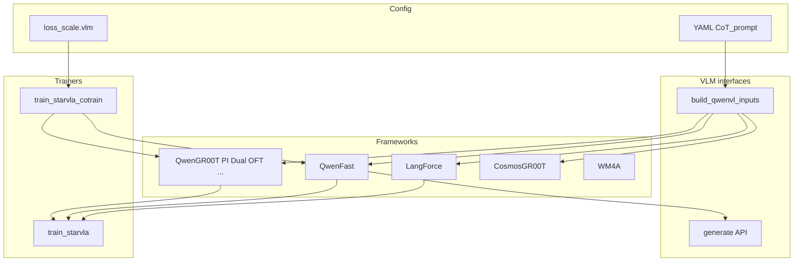

### 7.2 动态：三条典型时间线

**（1）主流 DiT 路径（Category A）**

```text
batch → CoT_prompt 包装 → VLM forward → hidden → DiT FM loss / sample → actions
backward: action_loss → VLM + DiT
```

**（2）QwenFast（Category B）**

```text
train: actions → FAST → solutions → VLM CE → backward
infer: lang+image → generate → extract action tokens → FAST decode → actions
```

**（3）共训练（Category C）**

```text
step: VLA forward/backward(action_loss); then VLM(**batch_vlm)/backward(vlm_loss)
infer: 仍走所选框架的 predict_action（不自动多出一段 CoT）
```

### 7.3 Forward / Backward 对照简表

| 路径 | Forward 文本角色 | Backward 文本相关梯度 |
|------|------------------|------------------------|
| GR00T 族 + `CoT_prompt` | 条件 token | 经动作头损失回传到 VLM |
| QwenFast | 条件 +（训练）action token 目标 | LM CE 直接更新 VLM |
| Cotrain 额外一步 | LLaVA assistant 目标 | `vlm_loss` 更新共享 VLM |
| LangForce | 条件 + LLR 探针 | `main_loss` + prior logits 上的 LLR；post logits detach |
| CosmosGR00T | 同 GR00T | 同 GR00T（换权重初始化） |

---

## 8. 小结：如何避免误读配置名

1. **`CoT_prompt` ≠ Chain-of-Thought。** 它是 `str.replace("{instruction}", …)` 的 user 模板；默认 grounding 文案**不**等于已训练 bbox CoT。
2. **仓库没有 thinking/reasoning 特殊 token 运行时。** Cosmos-Reason2 / WM4A 的「reason」指预训练或物理特征，不是逐步文本思维。
3. **唯一标准 VLA 路径里用 `generate` 定动作的是 QwenFast**——生成的是离散动作码。
4. **共训练**用通用对话 CE 保/增强 VLM，不改变「先 CoT 再动作」的拓扑。
5. **`predict_action_withCoT` / `eval_qwenpi` 是遗留**；不要当作现行 API。
6. 读 LangForce 时另见 [`paper/note.md` §11](paper/note.md#11-文本模态与-llmvlm-技术本地代码实况)：强制 raw instruction + LLR，与 starVLA 默认长 `CoT_prompt` **刻意相反**。

---

*依据：starVLA 本地 `framework/VLM4A|WM4A`、`modules/vlm`、`training/train_starvla*.py`、`examples/modelExtensions/CoTrainVLM`。若 README 宣传语与实现冲突，以可执行代码为准。*

---
---

# starVLA 文本模态全景分析：Task Instruction 如何影响 Action 生成

> **承接前文**：§0–§8 考察了 CoT / thinking / reasoning 类机制。本部分将视角从「是否有 CoT」扩展到**全部文本→动作路径**，系统性地分类、解析每一种方式的实现细节、条件注入机制、forward/backward 数据流、以及 CFG（Classifier-Free Guidance）等核心技术。  
> **代码依据**：`starVLA/model/framework/VLM4A/`、`starVLA/model/modules/action_model/`、`starVLA/model/modules/vlm/`。

---

## 9. 文本模态影响动作生成的完整分类

### 9.0 引言

在 §0–§8 中，我们考察了「仓库里是否有 CoT / reasoning」这个**特定问题**。结论是：仓库中没有端到端自然语言推理链。

但文本模态（task instruction）**当然影响动作生成**——这是 VLA 模型的核心价值。关键问题变成：

> 文本**以何种方式**、**经过哪些组件**、**在什么层级上**影响最终的连续动作输出？

答案不是一种方式，而是**七种**，每种对应不同的架构设计哲学。

### 9.1 分类总览

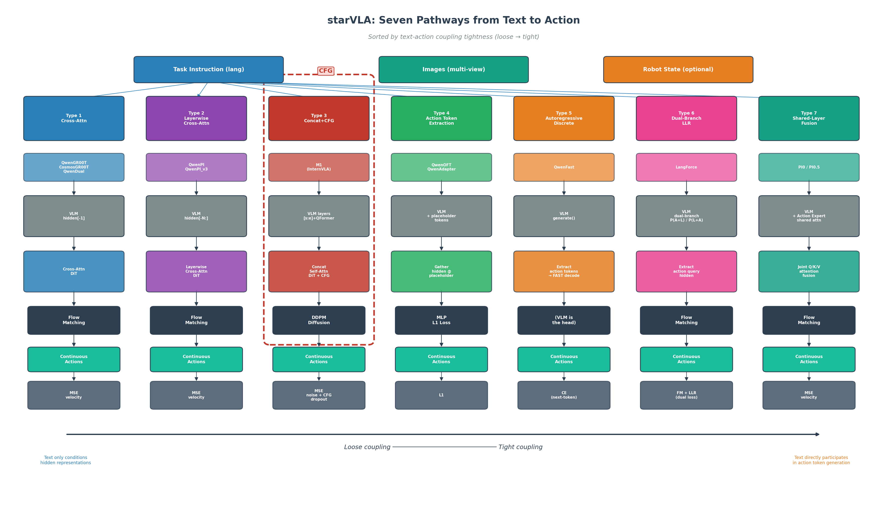

| 类型 | 名称 | 代表框架 | 核心思路 | 动作头 |
|------|------|----------|----------|--------|
| **I** | 隐式条件化 | QwenGR00T, CosmosGR00T, QwenDual | VLM 末层 hidden → DiT cross-attn | Flow Matching |
| **II** | 逐层条件化 | QwenPI, QwenPI_v3, QwenDiscreteDiffusion | VLM 多层 hidden → 逐层 cross-attn DiT | Flow Matching / MaskGIT |
| **III** | 压缩条件化 + CFG | M1 (InternVLA-M1) | VLM 子层 + DINO → QFormer → 拼接 DiT + **CFG** | DDPM Diffusion |
| **IV** | VLM 自注意力传导 | QwenOFT, QwenAdapter | 占位 token 嵌入 VLM → 提取其 hidden → MLP | L1 回归 |
| **V** | 自回归离散动作 | QwenFast | VLM 原生 generate() → FAST 离散 token | VLM 即动作头 |
| **VI** | 语言对数比正则化 | LangForce | 双分支 prior/posterior + LLR loss | Flow Matching |
| **VII** | 共享层注意力融合 | PI0, PI0.5 | VLM 与 Action Expert 共享层级注意力 | Flow Matching |

按**文本与动作的耦合紧密度**排序：

$$\text{Type I (最松)} \longrightarrow \text{Type V / VI / VII (最紧)}$$

下面逐一解析。

### 9.2 Type I：隐式条件化（Hidden-State Cross-Attention）

**代表**：QwenGR00T、CosmosGR00T、QwenDual

**核心思路**：文本仅在 VLM 内部参与注意力计算，产生的**最后一层 hidden state** 作为整体条件，通过 cross-attention 注入一个独立的 DiT 动作头。动作头本身不直接「看到」文本 token。

**比喻**：像一个翻译官——你用中文说需求（文本），翻译官把你的意思消化后用另一种语言传达给工匠（DiT），工匠根据翻译官的转述制作产品（动作）。工匠并不理解中文。

**关键代码路径**（`QwenGR00T.py`）：

```python
# L180: 文本 + 图像 → VLM 输入
qwen_inputs = self.qwen_vl_interface.build_qwenvl_inputs(
    images=batch_images, instructions=instructions
)
# L183-190: VLM 前向 → 取最后一层
qwenvl_outputs = self.qwen_vl_interface(
    **qwen_inputs, output_hidden_states=True, return_dict=True,
)
last_hidden = qwenvl_outputs.hidden_states[-1]  # [B, L, H]

# L216-218: 作为 encoder_hidden_states 传入 DiT
action_loss = self.action_model(
    last_hidden_repeated, actions_target_repeated, state_repeated,
    encoder_attention_mask=backbone_attention_mask,
)
```

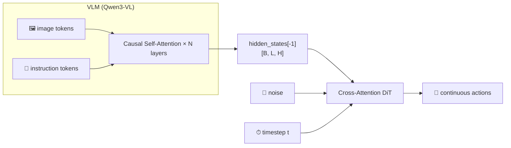

**特点**：

- 文本信息被「压缩」到 VLM 最后一层表征中，动作头通过 cross-attention 读取
- 全序列（image + text tokens）都传给 DiT，包括 padding（通过 `encoder_attention_mask` 屏蔽）
- `repeated_diffusion_steps`（默认 8）：每个 batch 复制 N 份、对应 N 组不同噪声，增加训练中噪声覆盖率

### 9.3 Type II：逐层条件化（Layer-wise Cross-Attention）

**代表**：QwenPI、QwenPI_v3、QwenDiscreteDiffusion

**核心思路**：不仅取 VLM 最后一层，而是取**最后 N 层** hidden states（N = DiT 层数），让 DiT 的第 $i$ 层 cross-attend 到 VLM 的第 $i$ 层。

**比喻**：不再是一个翻译官，而是**多层翻译链**。VLM 处理文本的浅层理解（词汇、句法）传递给 DiT 的浅层（粗动作结构），VLM 的深层理解（语义、任务意图）传递给 DiT 的深层（精细动作细节）。

**关键代码路径**（`QwenPI.py`）：

```python
# L183: 取最后 N 层（N = DiT 层数）
expected_layers = len(self.action_model.model.transformer_blocks)
vl_embs_list = list(qwenvl_outputs.hidden_states[-expected_layers:])
```

在 DiT 内部（`cross_attention_dit.py` L296-316）：

```python
for idx, block in enumerate(self.transformer_blocks):
    if is_layerwise_encoder:
        block_encoder_hidden_states = encoder_hidden_states[idx]  # 第 idx 层用第 idx 个 VLM hidden
    hidden_states = block(
        hidden_states,
        encoder_hidden_states=block_encoder_hidden_states,
        encoder_attention_mask=encoder_attention_mask,
        temb=temb,
    )
```

**QwenPI_v3 的额外改进**：

1. **逐层投影**：每层 VLM hidden 先经过独立的 `LayerNorm + Linear` 压缩到 DiT 隐维度（如 2560 → 1024），减少参数量
2. **离散化 state 注入**（π₀.5 风格）：将本体感觉量化为 256 bin 的文本 token，追加到指令文本中

```python
# QwenPI_v3.py L287-291
instructions = self.add_discretized_state_to_instruction(instructions, state)
state = None  # state 已编码进文本 token
```

这意味着 state 信息也通过文本通道进入 VLM 的注意力，而非单独的编码器。

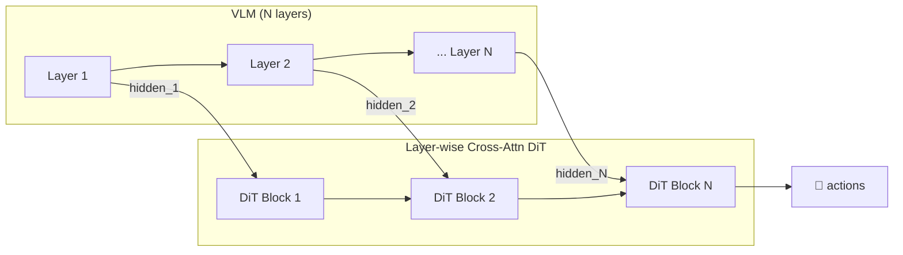

### 9.4 Type III：压缩条件化 + Classifier-Free Guidance

**代表**：M1（InternVLA-M1）

**这是仓库中唯一实现 CFG 的框架**，将在 §11 深入剖析。此处概述其架构。

**核心思路**：VLM 的一段中间层 hidden + DINO 空间特征 → Layer-wise QFormer 压缩到 64 个 token → 拼接（非 cross-attn）进自注意力 DiT，并通过 CFG 在推理时放大文本条件的影响。

**关键代码路径**（`M1.py`）：

```python
# L198-208: 多层 VLM hidden + DINO → QFormer
condition_features = qwenvl_outputs.hidden_states[start_layer:end_layer]
for layer_index in range(len(condition_features)):
    layer_features = torch.cat(
        [condition_features[layer_index], dino_encoded_features], dim=1
    )
    cat_conditions.append(layer_features)
action_condition_feature = self.layer_qformer(cat_conditions)  # [B, 64, D_action]

# L311-338: CFG 推理
if using_cfg:
    noise = torch.cat([noise, noise], 0)
    uncondition = self.action_model.net.z_embedder.uncondition
    z = torch.cat([action_condition_feature, uncondition], 0)
    sample_fn = self.action_model.net.forward_with_cfg
```

**与 Type I/II 的关键区别**：

1. **自注意力而非交叉注意力**：条件 token 与动作 token **拼接**后共同参与自注意力，而非 K/V 来自条件、Q 来自动作
2. **固定数量条件 token**（64）：QFormer 将变长 VLM 序列压缩为定长，降低推理计算量
3. **CFG 训练/推理机制**：训练时随机丢弃条件，推理时用双倍 batch 做条件/无条件插值

### 9.5 Type IV：VLM 自注意力隐式传导

**代表**：QwenOFT、QwenAdapter

**核心思路**：不使用独立的动作头做扩散/流匹配，而是将特殊占位 token（如🔍）嵌入指令文本末尾，让这些 token 在 VLM 的因果自注意力中「吸收」前面所有 image + text token 的信息。最后从 VLM hidden state 中**提取**这些占位位置的表征，用简单 MLP 回归动作。

**比喻**：像在课堂上安排几个「旁听生」（占位 token），他们坐在教室最后排，静静地听完老师（文本 token）和 PPT（图像 token）的全部内容。课后，你只问旁听生的笔记（hidden state），不直接问老师。

**关键代码路径**（`QwenOFT.py`）：

```python
# L174-179: 在指令末尾追加动作占位 token
action_tokens = self.action_token * self.chunk_len  # "🔍🔍🔍🔍🔍🔍🔍🔍"
prompt_suffix = f" Please predict the next {self.chunk_len} robot actions: <action>{action_tokens}<action>."
instructions = [instruction + prompt_suffix for instruction in instructions]

# L191-199: VLM 前向后，提取占位位置的 hidden
last_hidden = qwenvl_outputs.hidden_states[-1]  # [B, L, H]
action_queries = self._gather_action_token_embeddings(
    last_hidden, input_ids, action_token_id=self.action_token_id
)  # [B, chunk_len, H]

# L200: MLP 直接预测
pred_actions = self.action_model.predict_action(action_queries)  # [B, chunk_len, action_dim]
```

`_gather_action_token_embeddings`（L278-330）使用 `torch.isin` + `topk` + `sort` 进行批量化提取，无需 per-sample for 循环。

**QwenAdapter 的区别**：不直接用 VLM 词表的 emoji embedding，而是通过 `register_forward_hook` **替换**占位 token 的 embedding 为可学习 `nn.Parameter`，并提取**所有层**的 hidden states 而非仅最后一层。

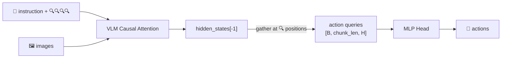

### 9.6 Type V：自回归离散动作生成

**代表**：QwenFast

**核心思路**：把连续动作**离散化**为 FAST token，映射为 VLM 词表中的特殊 token `<robot_action_0>` ~ `<robot_action_2047>`，然后用 VLM 的原生 next-token prediction 来学习和生成动作。文本通过 VLM 的因果注意力**直接**条件化每个动作 token 的生成概率。

**比喻**：像让一个翻译官不仅传话，而是直接用自己的语言**写出**操作指令（动作 token），接收方按字典（FAST 解码器）翻译回物理运动。

**训练**（`QwenFast.py` L125-176）：

```python
# L154: 连续动作 → FAST token
batch_fast_tokens = self.action_model.encoder_action2fastoken(actions)
# L157: FAST token → VLM 词表 token 字符串
vlm_action_tokens = [self.map_fast_token_to_vlm_action(ft) for ft in batch_fast_tokens]
# L160-162: 作为 assistant 回合传入
qwen_inputs = self.qwen_vl_interface.build_qwenvl_inputs(
    images=batch_images, instructions=instructions, solutions=vlm_action_tokens
)
# L172: 标准 VLM 交叉熵损失
vlm_action_loss = qwenvl_outputs.loss
```

**推理**（L178-222）：

```python
# L210: VLM 自回归生成
generated_ids = self.qwen_vl_interface.model.generate(**qwen_inputs, max_length=2048)
# L216-220: 提取动作 token → FAST 解码 → 连续动作
batch_vlm_action_token_ids = self._extract_action_token_ids(generated_ids)
batch_fast_action_token_idx = self._decode_action_tokens(batch_vlm_action_token_ids)
normalized_actions = self.action_model.fast_tokenizer.decode(batch_fast_action_token_idx)
```

**训练时 label masking**：`build_qwenvl_inputs` 在传入 `solutions` 时，会创建 `labels` 张量，将非动作 token 位置设为 `IGNORE_INDEX = -100`（`QWen3.py` L147-169），使得交叉熵损失仅作用于动作 token 段。

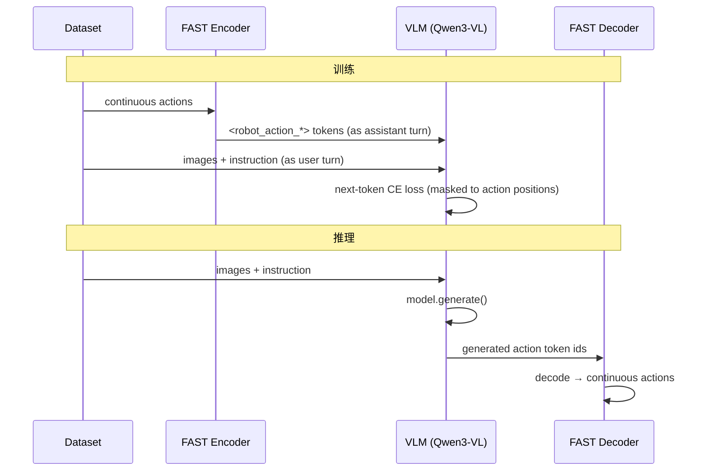

### 9.7 Type VI：语言对数比正则化（LangForce LLR）

**代表**：LangForce

**核心思路**：通过**双分支**架构——先验分支（$V + A + L$）和后验分支（$V + L + A$）——利用因果注意力的方向性差异来度量「动作查询 token 是否真正编码了任务指令信息」，并用 Language Log-Ratio (LLR) loss 正则化这一行为。

**比喻**：想象两种考试安排：
- **先验分支**：先答题（A）再看题目（L）—— A token 看不到 L，所以只能猜
- **后验分支**：先看题目（L）再答题（A）—— A token 充分理解了任务

LLR 度量的是：有了先验分支的 A 的「猜测」后，语言 L 变得多容易预测（相比纯视觉基线）。如果 A 确实编码了任务信息，L 就应该更容易从 A 推断出来。

**关键代码路径**（`LangForce.py`）：

```python
# L756-757: 构造双分支指令
instructions_priori = [self.latent_action_query + example["lang"] for example in examples]      # A + L
instructions_posteriori = [example["lang"] + self.latent_action_query for example in examples]  # L + A

# L808-816: LLR loss
kl_loss = self._compute_language_llr_from_boundaries(
    priori_logits=priori_logits,              # 不 detach → 梯度流向 prior 分支
    posteriori_logits=posteriori_logits,      # detach → 不允许降低 p(L|V) 来膨胀 LLR
    ...
)

# L852-855: 总损失
total_loss = (1 - prior_loss_weight) * main_loss + prior_loss_weight * prior_loss - kl_weight * kl_loss
```

注意 `kl_loss` 前的**负号**：训练**最大化** LLR，即鼓励先验分支的 A 编码更多关于 L 的信息。

LLR 的数学表达：

$$\text{LLR} = \log p(L \mid V, A_{\text{prior}}) - \text{sg}\left[\log p(L \mid V)\right]$$

其中 $\text{sg}[\cdot]$ 表示 stop-gradient（`posteriori_logits.detach()`）。

**补充机制**：
- **Hard-token LLR**：只取后验 NLL 最高的 top-k token 计算 LLR，聚焦「最难」的语言位置
- **Shortcut gate**：当 $\log p(L|V)$ 已经很低时下调 LLR 权重，避免过强的正则化

### 9.8 Type VII：共享层注意力融合（PI0 / PI0.5）

**代表**：PI0、PI0.5（OpenPI 实现）

**核心思路**：VLM 和 Action Expert 是两个独立的 Transformer，但**共享同一个注意力计算**——每层中，VLM 的 Q/K/V 与 Action Expert 的 Q/K/V 拼接后做一次联合注意力。文本 token 的信息通过 K/V 池**实时融入**动作 token 的表征。

**PI0.5 的 adaRMS**：timestep 不通过 cross-attention 注入，而是通过 adaRMS（adaptive RMS normalization）调制 Action Expert 每层的 LayerNorm：

$$\text{output} = \text{RMSNorm}(x) \cdot (1 + \text{scale}) + \text{shift}$$

其中 $(\text{scale}, \text{shift}, \text{gate}) = \text{Linear}(\text{cond})$，$\text{cond} = \text{MLP}(\text{timestep\_emb})$。

---

## 10. 条件注入机制深入解析

前面分类了七种文本→动作路径。本章聚焦一个关键技术问题：**VLM 产生的条件信息如何具体注入到动作头中？**

starVLA 中存在三种主要的条件注入机制，如下图所示：

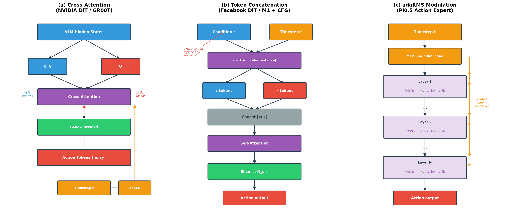

### 10.1 Cross-Attention 条件注入（NVIDIA DiT）

**使用者**：Type I（QwenGR00T）、Type II（QwenPI）、Type VI（LangForce）

**文件**：`starVLA/model/modules/action_model/flow_matching_head/cross_attention_dit.py`

这个 DiT 有两种条件通道，各司其职：

**通道 A — adaLN 处理 timestep**（L45-68）：

timestep $t$ 被编码为一个向量 $\mathbf{e}_t$，然后通过自适应层归一化（Adaptive Layer Normalization）注入每个 transformer block：

$$\mathbf{x} = \text{LayerNorm}(\mathbf{x}) \cdot (1 + \text{scale}_t) + \text{shift}_t$$

其中 $(\text{scale}_t, \text{shift}_t) = \text{Linear}(\text{SiLU}(\mathbf{e}_t))$。

直觉：adaLN 像「调色板」——timestep 告诉网络当前去噪阶段（噪声大还是小），通过 scale 和 shift **全局性地**调节每层特征的分布。

```python
# cross_attention_dit.py L65-67
temb = self.linear(self.silu(temb))
scale, shift = temb.chunk(2, dim=1)
x = self.norm(x) * (1 + scale[:, None]) + shift[:, None]
```

**通道 B — Cross-Attention 处理 VLM 特征**（L167-171）：

VLM hidden states 作为 `encoder_hidden_states`，提供 key (K) 和 value (V)；动作 token 作为 query (Q)：

$$\text{Attn}(Q_{\text{action}}, K_{\text{VLM}}, V_{\text{VLM}}) = \text{softmax}\left(\frac{Q_{\text{action}} K_{\text{VLM}}^T}{\sqrt{d}}\right) V_{\text{VLM}}$$

直觉：cross-attention 像「查阅参考书」——每个动作 token 根据自身当前状态（Q）去 VLM 的全部表征（K/V）中查找最相关的信息。不同动作时间步可以关注不同的文本/图像区域。

```python
# cross_attention_dit.py L167-171
attn_output = self.attn1(
    norm_hidden_states,                             # Q: 动作 token
    encoder_hidden_states=encoder_hidden_states,    # K, V: VLM hidden
    attention_mask=encoder_attention_mask,
)
```

**逐层 vs 单层 cross-attention**：

- **单层模式**（QwenGR00T）：所有 DiT block 共用同一个 VLM hidden（`hidden_states[-1]`）
- **逐层模式**（QwenPI）：DiT block $i$ 使用 VLM 的第 $i$ 层 hidden

```python
# cross_attention_dit.py L306-309
if is_layerwise_encoder:
    block_encoder_hidden_states = encoder_hidden_states[idx]
else:
    block_encoder_hidden_states = encoder_hidden_states
```

**interleave_self_attention 模式**：奇数索引的 block 做纯自注意力（`encoder_hidden_states=None`），偶数索引做 cross-attention。这让动作 token 之间也有独立交互的机会。

**输出层也有 adaLN**（L325-327）：最终预测前，再用 timestep 做一次 scale/shift 调制。

### 10.2 Token Concatenation + Self-Attention（Facebook DiT）

**使用者**：Type III（M1）

**文件**：`starVLA/model/modules/action_model/DiT_modules/models.py`

**核心思路**：不区分 Q/K/V 的来源，而是把条件 token 和动作 token **拼接**成一个长序列，一起做标准自注意力。

```python
# models.py L259-276
def forward(self, x, t, z):
    x = self.x_embedder(x)              # (N, T, D) 动作嵌入
    t = self.t_embedder(t)              # (N, D)    timestep 嵌入
    z = self.z_embedder(z, self.training) # [N, 64, D] 条件嵌入（训练时可能被 dropout）
    c = t.unsqueeze(1) + z              # (N, 64, D) timestep + condition 逐元素加
    x = torch.cat((c, x), dim=1)        # (N, 64+T, D) 拼接
    x = x + self.positional_embedding   # 加位置编码
    for block in self.blocks:
        x = block(x)                    # 标准自注意力
    return x[:, self.num_cond_tokens:, :]  # 只取动作部分
```

直觉：如果 cross-attention 是「查阅参考书」，那么 concatenation + self-attention 就是「同桌讨论」——条件 token 和动作 token 坐在同一张桌子上，互相都能看到对方、影响对方。

**与 cross-attention 的数学对比**：

在 cross-attention 中，动作 token 只能读取条件信息（$Q_{\text{act}} \cdot K_{\text{cond}}$），条件 token 不会被动作 token 影响。

在 self-attention 拼接中，**双向交互**同时发生：

$$\text{SelfAttn}\left(\begin{bmatrix} \mathbf{c} \\ \mathbf{x} \end{bmatrix}\right) \implies \begin{cases} \mathbf{c}' = f(\mathbf{c}, \mathbf{x}) \\ \mathbf{x}' = f(\mathbf{x}, \mathbf{c}) \end{cases}$$

条件 token 也会被动作 token 的当前状态「反向影响」，这使得条件表征可以**适应**当前的去噪阶段。

### 10.3 adaRMS 条件注入（PI0.5 路径）

**使用者**：Type VII（PI0.5）

**文件**：`starVLA/model/modules/vlm/openpi_transformers/gemma/modeling_gemma.py` L46-75

adaRMS 是 adaLN 的变体，用 RMSNorm 替代 LayerNorm，并增加了 gate 输出：

$$(\text{scale}, \text{shift}, \text{gate}) = \text{Linear}(\text{cond}), \quad \text{cond} \in \mathbb{R}^{d_{\text{cond}}}$$

$$\text{output} = \text{RMSNorm}(\mathbf{x}) \cdot (1 + \text{scale}) + \text{shift}$$

gate 用于控制该层的残差连接强度。每一层 transformer block 的 `input_layernorm` 和 `post_attention_layernorm` 都接受同一个 `adarms_cond`（来自 timestep MLP）。

```python
# modeling_gemma.py L70-75
modulation = self.dense(cond)  # cond_dim → dim*3
scale, shift, gate = torch.chunk(modulation, 3, dim=-1)
output = output * (1.0 + scale.float()) + shift.float()
return output.type_as(x), gate.type_as(x)
```

直觉：如果 adaLN 是「调色板」，adaRMS 就是「带开关的调色板」——gate 可以完全关闭某些层的调制，让网络学习哪些层需要 timestep 信息、哪些不需要。

### 10.4 三种机制的对比

| 维度 | Cross-Attention | Concatenation + Self-Attn | adaLN / adaRMS |
|------|----------------|---------------------------|----------------|
| 信息流向 | 单向（cond → action） | 双向（cond ↔ action） | 全局（标量调制） |
| 空间选择性 | 高（每个 Q 选择性注意 K） | 高（但受因果 mask 影响） | 无（同一层所有 token 同样调制） |
| 计算量 | $O(T_a \cdot T_c \cdot d)$ | $O((T_a + T_c)^2 \cdot d)$ | $O(T \cdot d)$ |
| 条件长度敏感度 | 线性增加 | 二次增加 | 无关 |
| 适用场景 | VLM 序列长（数百 token） | 条件已压缩（64 token） | timestep（标量） |

---

## 11. Classifier-Free Guidance（CFG）深入剖析

CFG 是用户特别关注的技术。本章从理论、实现、代码逐行解读三个层面深入分析。

### 11.1 CFG 的理论基础

#### 问题设定

在条件生成模型中，我们希望从条件分布 $p(x|c)$ 采样，其中 $c$ 是条件（如文本描述），$x$ 是生成结果（如动作轨迹）。

**直接条件化的问题**：模型可能对条件不够「敏感」——给不同文本指令，生成的动作差别不大。

**Classifier Guidance 的前身**：早期方法训练一个单独的分类器 $p(c|x)$，利用其梯度引导扩散过程。但需要额外训练分类器。

**CFG 的核心洞见**（Ho & Salimans, 2022）：可以**不训练分类器**，而是让同一个模型同时学习条件和无条件生成，然后在推理时用两者的差异来放大条件信号：

$$\hat{\epsilon}_\theta(x_t, c) = \underbrace{\epsilon_\theta(x_t, \varnothing)}_{\text{无条件预测}} + s \cdot \underbrace{\left[\epsilon_\theta(x_t, c) - \epsilon_\theta(x_t, \varnothing)\right]}_{\text{条件信号（方向）}}$$

其中：
- $\epsilon_\theta(x_t, \varnothing)$：模型在不知道条件时的预测（「无目标时倾向去哪里」）
- $\epsilon_\theta(x_t, c)$：模型在已知条件时的预测（「有目标时倾向去哪里」）
- $s$：引导强度（guidance scale），$s=1$ 退化为标准条件生成，$s>1$ 放大条件影响

#### 直觉类比：GPS 导航

想象你开车去一个目的地（条件 $c$）：

- **无条件预测** $\epsilon_\theta(x_t, \varnothing)$：不看 GPS，凭直觉开（可能漫无目的地往城市中心走）
- **条件预测** $\epsilon_\theta(x_t, c)$：看 GPS 导航（指向正确目的地，但可能不够坚决）
- **CFG 引导**：计算「GPS 指引 $-$ 直觉」的方向差，然后**放大**这个差异——不仅跟着 GPS 走，还格外强调 GPS 与直觉不同的那部分方向。$s$ 越大，越坚决地跟随 GPS。

但 $s$ 过大会「过度修正」——就像过度信赖 GPS 导致忽略真实路况一样。

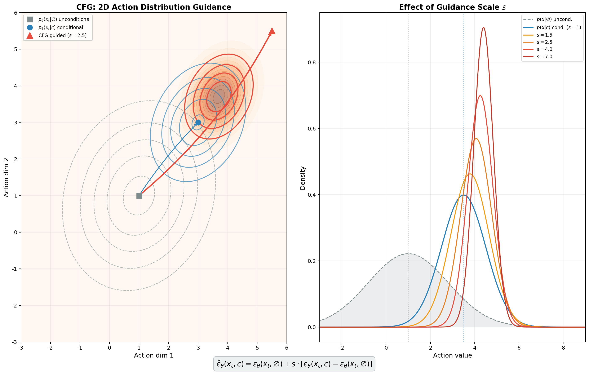

### 11.2 M1 中的 CFG 实现

#### 训练阶段：条件 Dropout

**文件**：`starVLA/model/modules/action_model/DiT_modules/models.py` L72-104

CFG 训练的关键是让模型**同时**学会条件和无条件生成。M1 的做法是**随机丢弃条件**：

```python
class LabelEmbedder(nn.Module):
    def __init__(self, in_size, hidden_size, dropout_prob=0.1, conditions_shape=(1, 1, 4096)):
        super().__init__()
        self.linear = nn.Linear(in_size, hidden_size)
        self.dropout_prob = dropout_prob
        if dropout_prob > 0:
            # 可学习的「无条件」嵌入
            self.uncondition = nn.Parameter(torch.empty(conditions_shape[1:]))  # [64, D]
```

训练时以概率 `dropout_prob`（默认 0.1 = 10%）将整个条件替换为可学习的 `uncondition` 参数：

```python
    def token_drop(self, conditions, force_drop_ids=None):
        if force_drop_ids is None:
            drop_ids = torch.rand(conditions.shape[0], device=conditions.device) < self.dropout_prob
        else:
            drop_ids = force_drop_ids == 1
        conditions = torch.where(
            drop_ids.unsqueeze(1).unsqueeze(1).expand(conditions.shape[0], *self.uncondition.shape),
            self.uncondition,   # 被替换为可学习参数
            conditions,         # 保留原始条件
        )
        return conditions
```

**训练时的数据流**：

$$\text{90\% 的 batch} \xrightarrow{z = \text{real condition}} \text{条件前向} \quad ; \quad \text{10\% 的 batch} \xrightarrow{z = \text{learned } \varnothing} \text{无条件前向}$$

两者共享同一个 DiT 网络，同一个损失函数（MSE noise prediction），只是输入条件不同。

初始化也很重要（L247-248）：

```python
if self.class_dropout_prob > 0:
    nn.init.normal_(self.z_embedder.uncondition, std=0.02)
```

`uncondition` 从小随机值开始，在训练中学习到一个「代表无条件」的嵌入。

#### DiT Forward：条件进入的方式

```python
# models.py L259-276
def forward(self, x, t, z):
    x = self.x_embedder(x)               # 动作嵌入 [N, T, D]
    t = self.t_embedder(t)               # timestep 嵌入 [N, D]
    z = self.z_embedder(z, self.training) # 条件嵌入（训练时可能被 dropout）[N, 64, D]
    c = t.unsqueeze(1) + z               # timestep + 条件逐元素相加 [N, 64, D]
    x = torch.cat((c, x), dim=1)         # 拼接 [N, 64+T, D]
    x = x + self.positional_embedding    # 位置编码
    for block in self.blocks:
        x = block(x)                     # DiTBlock: LayerNorm → Self-Attn → LayerNorm → MLP
    return x[:, self.num_cond_tokens:, :] # 只返回动作部分
```

关键点：`c = t + z`——timestep 和条件是**相加**的，不是分别注入。这意味着 CFG dropout 不仅影响条件信息，也间接影响 timestep 条件化通道（但 timestep 信息仍在 `t` 中保留）。

#### 推理阶段：双倍 batch + 引导公式

**文件**：`models.py` L278-293 + `M1.py` L311-359

推理时，M1 构造一个**双倍大小的 batch**：前半是真实条件，后半是学到的无条件嵌入：

```python
# M1.py L327-338
if using_cfg:
    noise = torch.cat([noise, noise], 0)                    # [2B, T, D]
    uncondition = self.action_model.net.z_embedder.uncondition  # [64, D]
    uncondition = uncondition.unsqueeze(0).expand(B, ...)    # [B, 64, D]
    z = torch.cat([action_condition_feature, uncondition], 0) # [2B, 64, D]
    model_kwargs = dict(z=z, cfg_scale=cfg_scale)
    sample_fn = self.action_model.net.forward_with_cfg
```

DiT 的 `forward_with_cfg` 做一次前向后拆分、应用引导公式：

```python
# models.py L278-293
def forward_with_cfg(self, x, t, z, cfg_scale):
    half = x[:len(x) // 2]
    combined = torch.cat([half, half], dim=0)    # 对称 batch
    model_out = self.forward(combined, t, z)     # 一次前向，条件和无条件
    eps = model_out[:, :, :self.in_channels]
    cond_eps, uncond_eps = torch.split(eps, len(eps) // 2, dim=0)
    half_eps = uncond_eps + cfg_scale * (cond_eps - uncond_eps)  # 🎯 CFG 公式
    eps = torch.cat([half_eps, half_eps], dim=0)
    return torch.cat([eps, rest], dim=2)
```

**去噪循环中的 CFG**：CFG 应用于 DDIM 的每一步。M1 使用 DDIM 采样（默认 5 步，100 扩散步长，余弦平方上限噪声调度）：

```python
# M1.py L344-356
samples = self.action_model.ddim_diffusion.ddim_sample_loop(
    sample_fn,          # forward_with_cfg
    noise.shape,
    noise,
    model_kwargs=model_kwargs,  # 含 z 和 cfg_scale
    eta=0.0,            # DDIM 确定性采样
)
if using_cfg:
    samples, _ = samples.chunk(2, dim=0)  # 丢弃无条件半
```

### 11.3 为什么只有 M1 使用 CFG？

**问题**：starVLA 有 7+ 种框架，为什么只有 M1（InternVLA-M1）实现了 CFG？

**原因分析**：

1. **Flow Matching vs DDPM 的架构差异**：
   - M1 使用 DDPM 扩散（预测噪声 $\epsilon$），CFG 直接作用于噪声预测
   - 其余框架（GR00T、PI、LangForce）使用 Flow Matching（预测速度 $v = x_1 - x_0$），虽然理论上也可以做 CFG，但需要适配

2. **计算成本**：CFG 推理需要**双倍前向**（条件 + 无条件），在实时机器人控制中延迟翻倍是严重问题

3. **替代方案已够用**：
   - Cross-attention 的条件强度可以通过训练调节
   - LangForce 的 LLR 机制提供了另一种强化条件遵循的方式
   - Flow Matching 本身的条件化通常已足够稳健

4. **M1 的历史背景**：M1 继承自 InternVLA-M1，采用了较早期的 Facebook DiT + DDPM 架构设计，CFG 是该架构的标配

### 11.4 CFG 的数学补充

更严格地，CFG 可以被理解为**score function 的加权混合**。在 DDPM 框架下：

$$\nabla_{\mathbf{x}} \log p_s(\mathbf{x} | c) = \nabla_{\mathbf{x}} \log p(\mathbf{x}) + s \cdot \nabla_{\mathbf{x}} \log p(c | \mathbf{x})$$

$$\approx \nabla_{\mathbf{x}} \log p(\mathbf{x}) + s \cdot \left[\nabla_{\mathbf{x}} \log p(\mathbf{x}|c) - \nabla_{\mathbf{x}} \log p(\mathbf{x})\right]$$

$$= (1-s) \cdot \underbrace{\nabla_{\mathbf{x}} \log p(\mathbf{x})}_{\text{无条件 score}} + s \cdot \underbrace{\nabla_{\mathbf{x}} \log p(\mathbf{x}|c)}_{\text{条件 score}}$$

当 $s > 1$，模型采样自一个**比真实后验更尖锐**的分布——条件信号被放大，但代价是多样性降低。在机器人动作生成中，这通常是可接受的（我们希望精确遵循指令，而非生成多样化动作）。

---

## 12. Forward / Backward 数据流详解

### 12.1 Forward 数据流

以下 sequence diagram 展示三种典型路径的 forward 数据流：

**路径 A：Cross-Attention DiT（QwenGR00T）**

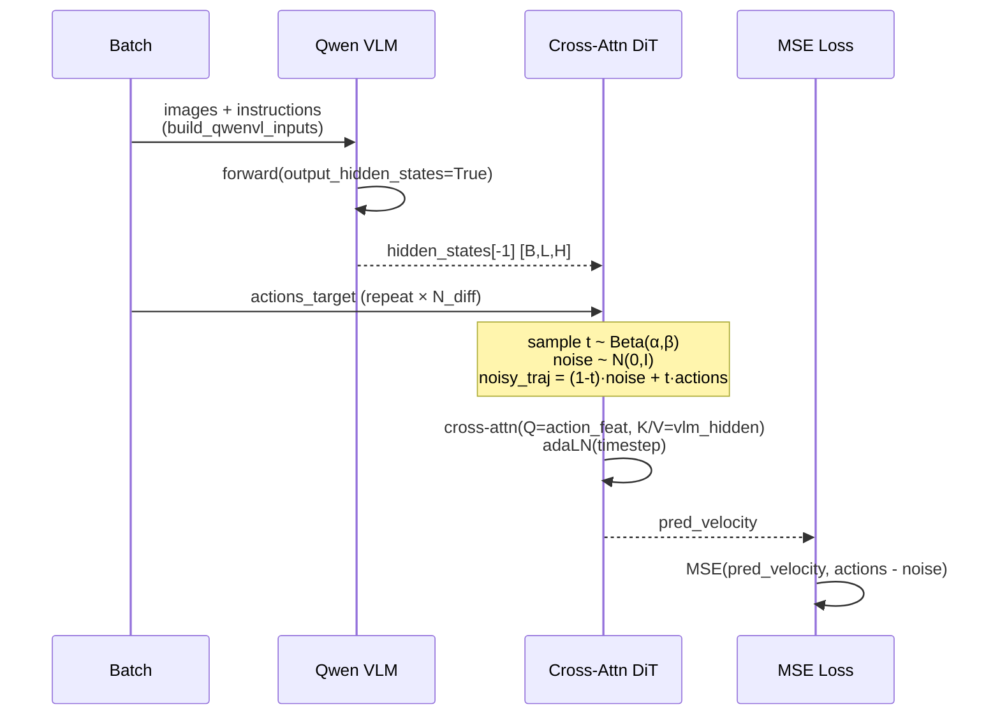

**路径 B：Concatenation DiT + CFG（M1）**

```mermaid
sequenceDiagram
    participant B as Batch
    participant VLM as Qwen VLM
    participant DINO as DINOv2
    participant QF as QFormer
    participant DiT as Concat DiT
    participant Loss as MSE Loss

    B->>VLM: images + instructions
    B->>DINO: images
    VLM-->>QF: hidden_states[s:e]
    DINO-->>QF: spatial features
    QF-->>DiT: condition [B,64,D]
    Note over DiT: z_embedder: 10% drop to uncondition<br/>c = t + z<br/>concat [c; x]
    DiT->>DiT: self-attention × depth
    DiT-->>Loss: pred_noise (slice action part)
    Loss->>Loss: MSE(pred_noise, noise)
```

**路径 C：自回归（QwenFast）**

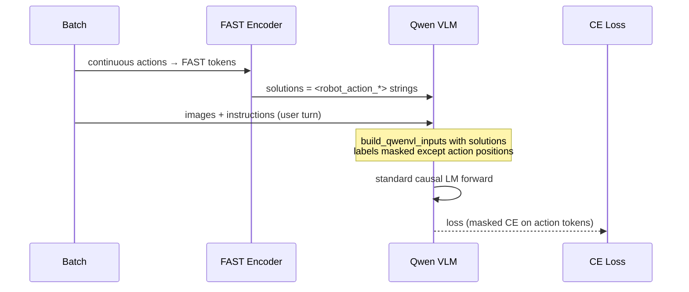

### 12.2 Backward 梯度流

不同路径中，梯度流向 VLM 的方式有显著差异：

| 框架 | 损失类型 | 梯度流向 VLM？ | 梯度流向动作头？ | 特殊 detach |
|------|----------|---------------|----------------|-------------|
| QwenGR00T | MSE velocity | ✅ 通过 `hidden_states[-1]` | ✅ DiT 全部参数 | 无 |
| QwenPI | MSE velocity | ✅ 多层 hidden | ✅ DiT 全部参数 | 无 |
| QwenPI_v3 | MSE velocity | ✅ + 逐层投影 | ✅ | 无 |
| M1 | MSE noise | ✅ 通过 QFormer | ✅ DiT + z_embedder | CFG dropout 10% |
| QwenOFT | L1 | ✅ 通过 gather | ✅ MLP | 无 |
| QwenFast | CE (VLM native) | ✅ 全部 VLM 参数 | ❌ (FAST 无参数) | labels mask |
| LangForce | FM + LLR | ✅ (posterior + prior) | ✅ | `posteriori_logits.detach()` |
| Cotrain | action + vlm CE | ✅ 双损失 | ✅ | 分步 backward |

**LangForce 的梯度流需要特别注意**：

1. `main_loss`（后验分支 FM 损失）→ 梯度流向 VLM + DiT
2. `prior_loss`（先验分支 FM 损失）→ 梯度流向 VLM + DiT（但如果 `detach_prior_cond=True`，先验条件 detach，不传梯度到 VLM 的先验路径）
3. `kl_loss`（LLR）→ `priori_logits` 不 detach（更新先验分支 VLM），`posteriori_logits` detach（不允许降低 $p(L|V)$ 来膨胀 LLR）

### 12.3 损失函数对比

| 损失 | 数学表达 | 预测目标 | 使用者 |
|------|---------|---------|--------|
| MSE velocity | $\|\hat{v} - (x_1 - x_0)\|^2$ | 速度场（flow matching） | GR00T, PI, LangForce, Dual, PI0 |
| MSE noise | $\|\hat{\epsilon} - \epsilon\|^2$ | 噪声（DDPM） | M1 |
| L1 | $\|\hat{x} - x\|_1$ | 动作值（直接回归） | QwenOFT |
| CE (masked) | $-\sum_t \mathbb{1}_{t \in \text{action}} \log p(x_t \mid x_{<t})$ | 下一个 action token | QwenFast |
| LLR | $\log p(L \mid V, A) - \text{sg}[\log p(L \mid V)]$ | 语言可预测性差 | LangForce |

### 12.4 `repeated_diffusion_steps` 的作用

在 Type I/II/VI 的 flow matching 路径中，`repeated_diffusion_steps`（默认 4-8）将每个 batch 复制 N 份：

```python
# QwenGR00T.py L204-205
actions_target_repeated = actions_target.repeat(repeated_diffusion_steps, 1, 1)
last_hidden_repeated = last_hidden.repeat(repeated_diffusion_steps, 1, 1)
```

**目的**：每份复制的 batch 在 flow matching 训练中采样到**不同的随机 timestep $t$** 和**不同的随机噪声 $\epsilon$**。这等价于用同一个 (image, text, action) 样本训练多个不同的去噪任务，增加了 timestep 和噪声的覆盖率，减少梯度方差。

数学上，对于一个样本 $(x_1, c)$，原始训练期望为：

$$\mathcal{L} = \mathbb{E}_{t, \epsilon}\left[\|f_\theta(x_t, c, t) - v\|^2\right]$$

`repeated_diffusion_steps=N` 等价于用 $N$ 个独立的 $(t_i, \epsilon_i)$ 样本来近似这个期望，降低单样本估计的方差。代价是 VLM hidden states 也被复制 N 份，增加了动作头的计算量（但 VLM 前向只做一次）。

---

## 13. 静态结构与动态结构

### 13.1 全仓库静态依赖图

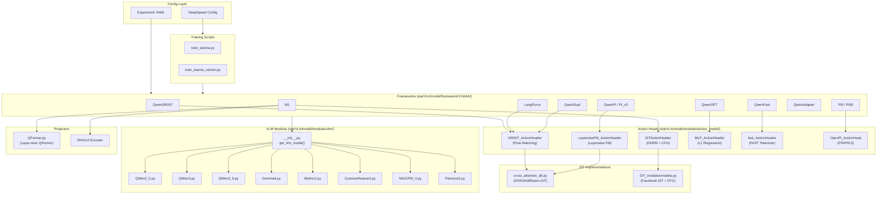

### 13.2 七种路径的动态时间线对比

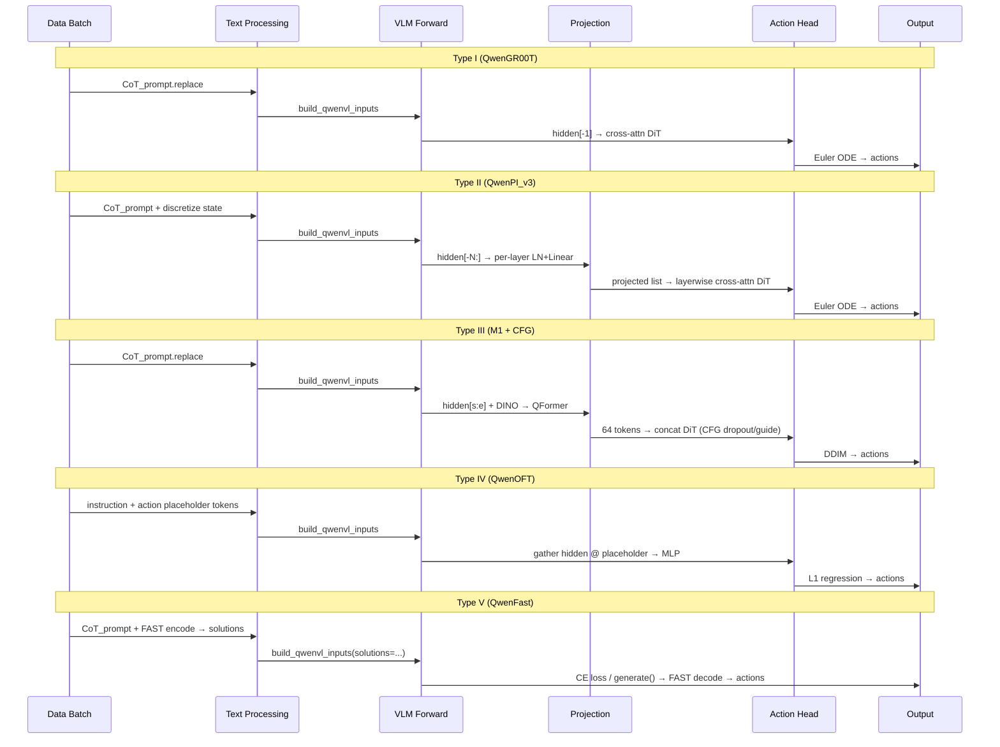

### 13.3 组件间调用关系矩阵

下表标注每个框架**直接调用**的组件：

| 框架 | VLM forward | hidden 提取 | DINO | QFormer | Cross-Attn DiT | Concat DiT | MLP Head | VLM generate | FAST |
|------|:-----------:|:-----------:|:----:|:-------:|:--------------:|:----------:|:--------:|:------------:|:----:|
| QwenGR00T | ✅ | `[-1]` | — | — | ✅ | — | — | — | — |
| QwenPI | ✅ | `[-N:]` | — | — | ✅ (layerwise) | — | — | — | — |
| QwenPI_v3 | ✅ | `[-N:]` + proj | — | — | ✅ (layerwise) | — | — | — | — |
| M1 | ✅ | `[s:e]` | ✅ | ✅ | — | ✅ + CFG | — | — | — |
| QwenOFT | ✅ | `[-1]` @ placeholder | — | — | — | — | ✅ | — | — |
| QwenFast | ✅ | — | — | — | — | — | — | ✅ | ✅ |
| LangForce | ✅ ×2 | `[-1]` @ action query ×2 | — | — | ✅ | — | — | — | — |
| QwenDual | ✅ | `[-1]` + DINOv2 | ✅ | — | ✅ | — | — | — | — |

---

## 14. 总结与横向对比

### 14.1 全维度对比

| 维度 | Type I | Type II | Type III | Type IV | Type V | Type VI | Type VII |
|------|--------|---------|----------|---------|--------|---------|----------|
| 代表 | GR00T | PI/PI_v3 | M1 | OFT | Fast | LangForce | PI0/PI0.5 |
| 文本条件化方式 | cross-attn | layerwise cross-attn | concat + CFG | VLM 因果 attn | VLM generate | dual-branch LLR | shared-layer attn |
| VLM hidden 使用 | 末层 | 末 N 层 | 子层范围 | 末层 (gather) | 不提取 | 末层 (query) | 逐层共享 |
| 动作头参数量 | 中 (DiT) | 中-大 (DiT) | 大 (DiT+QFormer) | 小 (MLP) | 无 | 中 (DiT) | 大 (双 Gemma) |
| 推理耗时 | 中 (Euler ×N) | 中 | 高 (DDIM + CFG ×2) | **低** (单次) | 低 (generate) | 中 (Euler ×N) | 中 |
| 条件遵循强度 | 中 | 高 (逐层) | **最高** (CFG) | 中 | 中 | 高 (LLR 正则) | 高 (共享 attn) |
| 训练复杂度 | 低 | 低 | 中 (CFG dropout) | **最低** | 低 | **最高** (双分支) | 中 |
| 是否用 generate() | 否 | 否 | 否 | 否 | **是** | 否 | 否 |
| 损失函数 | MSE vel. | MSE vel. | MSE noise | L1 | CE | FM + LLR | MSE vel. |

### 14.2 设计权衡分析

**条件强度 vs 计算成本**：Type III（M1 + CFG）条件遵循最强，但推理需双倍 DiT 前向 + DDIM 多步；Type IV（OFT）最快但条件化全靠 VLM 自注意力的隐式传导。

**表征深度 vs 参数效率**：Type II（逐层 cross-attn）让 DiT 访问 VLM 的全部层级表征，但 DiT 层数被绑定为 VLM 层数；QwenPI_v3 的逐层投影缓解了这个问题。

**离散 vs 连续**：Type V（QwenFast）把动作离散化，利用 VLM 原生的语言建模能力，但量化误差不可避免；其余 Type 直接回归连续值。

**显式 vs 隐式语言正则化**：Type VI（LangForce）是唯一显式度量「动作表征是否编码了文本信息」的路径，通过 LLR loss 提供梯度信号；其余路径的文本影响纯粹是隐式的。

### 14.3 选型建议

| 场景 | 推荐 Type | 理由 |
|------|----------|------|
| 需要严格遵循文本指令 | III (M1 + CFG) 或 VI (LangForce) | CFG 放大条件信号；LLR 正则化指令遵循 |
| 实时控制（低延迟） | IV (QwenOFT) | 单次前向，无迭代采样 |
| 利用 VLM 多层语义 | II (QwenPI_v3) | 逐层 cross-attn + 投影压缩 |
| 快速原型验证 | I (QwenGR00T) | 架构最简、代码量最少 |
| 想用 VLM 原生能力 | V (QwenFast) | 无需额外动作头参数 |
| 研究条件化机制 | III (M1) | 唯一有 CFG 的框架，可对比有无 CFG 的效果 |

---

*本章依据：`starVLA/model/framework/VLM4A/` 全部框架文件、`starVLA/model/modules/action_model/` 全部动作头文件、`starVLA/model/modules/vlm/` 全部 VLM 接口文件。代码引用基于本地仓库实际行号。若后续重构导致行号偏移，请以函数名和关键变量名为准。*

---

## 第 15 章：AdaLN / AdaNorm 自适应归一化深入分析

### 15.0 引言：什么是自适应归一化？

在扩散模型（Diffusion Model）和流匹配模型（Flow Matching Model）中，模型需要在**不同的去噪时间步** $t$ 下表现出不同的行为——初期需要大幅修正结构，后期只需微调细节。如何让同一组网络权重在不同 $t$ 下产生截然不同的计算行为？

最直观的方法是把 $t$ 当作一个额外输入拼接到特征中，但这样做条件注入太浅，模型难以在每一层都感知到当前的时间步。**自适应归一化（Adaptive Normalization, AdaNorm）** 提供了一种更优雅的方案：在归一化层（LayerNorm / RMSNorm）之后，用条件信息动态调制仿射变换的 scale 和 shift 参数，让条件信号**渗透到网络的每一层**。

> **直觉类比**：想象你是一位调音师。普通归一化就像把所有乐器的音量统一到标准水平；而自适应归一化则是在统一音量后，根据当前演奏的「乐章段落」（时间步 $t$）为每个乐器单独调节音色、音量和混响——同一套乐器，在不同段落发出完全不同的声音。

数学上，自适应归一化的统一公式可以写为：

$$y = f(x) \cdot (1 + \gamma(c)) + \beta(c)$$

其中 $f(\cdot)$ 是归一化函数（LayerNorm、RMSNorm 或恒等映射），$\gamma(c)$ 和 $\beta(c)$ 是由条件 $c$ 生成的 scale 和 shift 参数。这一公式也被称为 **FiLM（Feature-wise Linear Modulation）** 范式。

在 starVLA 代码库中，我们发现了**四种**属于该范式的自适应归一化变体，它们的使用状态和覆盖范围差异很大：

| 变体 | 归一化函数 $f$ | 输出维度 | 条件来源 | 使用框架数 | 状态 |
|------|--------------|---------|---------|-----------|------|
| **AdaLayerNorm** | LayerNorm | 2 (scale, shift) | timestep $t$ | **14 个** | 主力 |
| **adaRMS** | RMSNorm | 3 (scale, shift, gate) | timestep $t$ | 3 个文件 | 活跃 |
| **modulate()** | LayerNorm | 2 (shift, scale) | — | 0（未调用） | 遗留 |
| **FiLM** | Identity | 2 (gamma, beta) | robot state | 0（未导入） | 遗留 |

接下来我们逐一深入分析。

### 15.1 AdaLayerNorm：starVLA 的主力自适应归一化

#### 15.1.1 数学定义

AdaLayerNorm 的核心公式为：

$$x' = \text{LayerNorm}(x) \cdot (1 + \text{scale}) + \text{shift}$$

其中 scale 和 shift 由 timestep embedding 经过非线性变换生成：

$$(\text{scale}, \text{shift}) = \text{chunk}\Big(\text{Linear}\big(\text{SiLU}(t_{\text{emb}})\big), \; 2\Big)$$

这里 $\text{SiLU}(x) = x \cdot \sigma(x)$（Sigmoid Linear Unit），是一种平滑的激活函数，保证 scale/shift 的生成是一个可学习的非线性映射。

#### 15.1.2 代码实现解读

AdaLayerNorm 定义在 `starVLA/model/modules/action_model/flow_matching_head/cross_attention_dit.py` L45-68：

```python
# cross_attention_dit.py L45-68
class AdaLayerNorm(nn.Module):
    def __init__(self, embedding_dim, norm_elementwise_affine=False,
                 norm_eps=1e-5, chunk_dim=0):
        super().__init__()
        self.chunk_dim = chunk_dim
        output_dim = embedding_dim * 2                    # ← 输出维度是输入的 2 倍
        self.silu = nn.SiLU()                              # ← SiLU 激活
        self.linear = nn.Linear(embedding_dim, output_dim) # ← 投影层
        self.norm = nn.LayerNorm(                           # ← 标准 LayerNorm
            output_dim // 2, norm_eps, norm_elementwise_affine
        )

    def forward(self, x, temb=None):
        temb = self.linear(self.silu(temb))     # [B, 2D]  ← 条件映射
        scale, shift = temb.chunk(2, dim=1)     # 各 [B, D] ← 拆分
        x = self.norm(x) * (1 + scale[:, None]) + shift[:, None]  # ← 调制
        return x
```

**关键设计点解析**：

1. **`output_dim = embedding_dim * 2`**：线性层输出维度是 embedding 维度的 2 倍，因为需要同时生成 scale 和 shift 两组参数。

2. **`norm_elementwise_affine=False`**：LayerNorm 不使用可学习的仿射参数（$\gamma, \beta$），因为仿射变换已经由外部条件提供——如果 LayerNorm 自带仿射，就与条件生成的 scale/shift 产生冗余。

3. **`scale[:, None]` 和 `shift[:, None]`**：增加序列维度以支持广播。temb 形状是 `[B, D]`，而 x 是 `[B, T, D]`，需要在第 1 维（序列长度 T）广播，使得同一 batch 内所有 token 共享相同的调制参数。

4. **`1 + scale`**：使用 $1 + \text{scale}$ 而非直接 $\text{scale}$，是因为初始化时 scale 接近 0，此时 $1 + 0 = 1$，归一化层等价于不做调制，保证训练初期的稳定性。

#### 15.1.3 在 DiT 中的使用位置

AdaLayerNorm 在 NVIDIA DiT 架构中有**两个使用位置**：

**位置 1：每个 BasicTransformerBlock 的自注意力前归一化**

```python
# cross_attention_dit.py L118-119
if norm_type == "ada_norm":
    self.norm1 = AdaLayerNorm(dim)  # ← 用 AdaLayerNorm 替代标准 LayerNorm

# cross_attention_dit.py L159-160 (forward)
if self.norm_type == "ada_norm":
    norm_hidden_states = self.norm1(hidden_states, temb)  # ← 传入 temb
else:
    norm_hidden_states = self.norm1(hidden_states)         # ← 标准 LN 不需要 temb
```

**位置 2：DiT 的输出层（Output Processing）**

```python
# cross_attention_dit.py L324-327
conditioning = temb  # ← 复用 timestep embedding
shift, scale = self.proj_out_1(F.silu(conditioning)).chunk(2, dim=1)
hidden_states = self.norm_out(hidden_states) * (1 + scale[:, None]) + shift[:, None]
```

注意输出层的 adaLN 没有封装成 `AdaLayerNorm` 类，而是用 `proj_out_1`（一个独立的 `nn.Linear(inner_dim, 2 * inner_dim)`，L265）直接实现了相同的逻辑。这是因为输出层只有一个，不需要复用。

#### 15.1.4 数据流：adaLN 在 DiT Block 中的完整路径

```mermaid
graph TD
    subgraph "DiT Forward (cross_attention_dit.py L272-331)"
        T["timestep t<br/>(B,)"] -->|TimestepEncoder| TEMB["temb<br/>(B, D)"]
        
        subgraph "BasicTransformerBlock × N (L296-317)"
            TEMB -->|"SiLU → Linear → chunk"| ADA["adaLN: scale, shift<br/>(B, D) each"]
            X_IN["hidden_states<br/>(B, T, D)"] --> ADA
            ADA -->|"LN(x)*(1+s)+d"| NORM_X["norm_hidden_states"]
            NORM_X --> SA["Self-Attention"]
            SA -->|"+ residual"| SA_OUT["attn_output + x"]
            
            VLM["VLM hidden_states<br/>(B, S, D)"] -->|"K, V"| CA["Cross-Attention"]
            SA_OUT -->|"Q"| CA
            CA -->|"+ residual → LN → FFN → + residual"| BLOCK_OUT["block output"]
        end
        
        TEMB -->|"SiLU → proj_out_1 → chunk"| OUT_ADA["Output adaLN"]
        BLOCK_OUT --> OUT_ADA
        OUT_ADA -->|"LN(x)*(1+s)+d"| PROJ["proj_out_2 (Linear)"]
        PROJ --> ACTION["velocity prediction<br/>(B, T, action_dim)"]
    end
    
    style ADA fill:#e67e22,color:#fff
    style OUT_ADA fill:#e67e22,color:#fff
    style TEMB fill:#f39c12,color:#fff
    style VLM fill:#2980b9,color:#fff
```

**关键观察**：adaLN **仅**注入 timestep 信息，VLM 语义特征通过 **Cross-Attention** 注入。这是一种「分工明确」的设计——timestep 决定「去噪阶段」，VLM 决定「动作语义」。

#### 15.1.5 覆盖范围：14 个框架共享 AdaLayerNorm

AdaLayerNorm 定义在 `cross_attention_dit.py` 中的 `DiT` 类（NVIDIA DiT 架构），但通过以下调用链被 14 个框架间接使用：

```
Framework → ActionHeader.model (DiT 实例) → BasicTransformerBlock.norm1 (AdaLayerNorm)
```

具体地，以下 Action Header 类使用了 `DiT`：

| Action Header | 文件 | 导入 DiT |
|--------------|------|---------|
| `GR00T_ActionHeader` | `GR00T_ActionHeader.py` L20 | `from ...flow_matching_head.cross_attention_dit import DiT` |
| `LayerwiseFM_ActionHeader` | `LayerwiseFM_ActionHeader.py` | 同上 |
| `AML_ActionHeader` | `AML_ActionHeader.py` | 同上 |
| `LayerwiseDiscreteDiffusion_ActionHeader` | `LayerwiseDiscreteDiffusion_ActionHeader.py` | 同上 |

使用这些 Action Header 的框架包括：

| 框架 | 类名 | Action Header |
|------|------|---------------|
| StarVLA-GR00T | QwenGR00T | GR00T_ActionHeader |
| CosmosGR00T | CosmosGR00T | GR00T_ActionHeader |
| QwenDual | QwenDual | GR00T_ActionHeader |
| StarVLA-PI | QwenPI | LayerwiseFM_ActionHeader |
| StarVLA-PI v3 | QwenPI_v3 | LayerwiseFM_ActionHeader |
| QwenDiscreteDiffusion | QwenDiscreteDiffusion | LayerwiseDiscreteDiffusion_ActionHeader |
| LangForce | LangForce | GR00T_ActionHeader |
| Gemma4GR00T | Gemma4GR00T | GR00T_ActionHeader |
| Gemma4PI | Gemma4PI | LayerwiseFM_ActionHeader |
| MiniCPMGR00T | MiniCPMGR00T | GR00T_ActionHeader |
| MiniCPMPI | MiniCPMPI | LayerwiseFM_ActionHeader |
| ABot_M0 | ABot_M0 | AML_ActionHeader |
| WanGR00T | WanGR00T (WM4A) | GR00T_ActionHeader |
| CosmoPredict2GR00T | CosmoPredict2GR00T (WM4A) | GR00T_ActionHeader |

> **小结**：AdaLayerNorm 是 starVLA 中最广泛使用的自适应归一化机制，覆盖了几乎所有基于流匹配（Flow Matching）的框架。它仅负责 timestep 条件注入，与 VLM 语义的 cross-attention 注入互不干扰。

### 15.2 adaRMS：PI0.5 Action Expert 的条件注入

#### 15.2.1 设计动机

PI0.5（Physical Intelligence 0.5）采用了一种不同的架构：它将 VLM（Gemma 2B）与 Action Expert（也是 Gemma 架构）通过**共享注意力层**融合。Action Expert 的每一层 Decoder Layer 都需要感知当前的去噪时间步 $t$。

由于 Action Expert 基于 Gemma 架构（使用 RMSNorm 而非 LayerNorm），其自适应归一化自然也采用了 RMSNorm 变体。但 adaRMS 的设计比 AdaLayerNorm 多了一个关键创新：**gated residual connection**。

#### 15.2.2 数学定义

adaRMS 的公式为：

$$\text{output} = \text{RMSNorm}(x) \cdot (1 + \text{scale}) + \text{shift}$$

$$(\text{scale}, \text{shift}, \text{gate}) = \text{chunk}\Big(\text{Linear}(c), \; 3\Big)$$

其中 RMSNorm 定义为：

$$\text{RMSNorm}(x) = \frac{x}{\sqrt{\frac{1}{d}\sum_{i=1}^{d} x_i^2 + \epsilon}}$$

与 LayerNorm 的区别在于 RMSNorm **不做均值中心化**，只做方差归一化，计算更高效。

**gate 的作用**在残差连接中体现：

$$h_{\text{out}} = h_{\text{residual}} + h_{\text{branch}} \cdot \text{gate}$$

当 gate → 0 时，这一层的变换被完全抑制，输出等于输入；当 gate → 1 时，等价于标准残差连接。

#### 15.2.3 代码实现解读

adaRMS 实现在 `starVLA/model/modules/vlm/openpi_transformers/gemma/modeling_gemma.py` L46-75：

```python
# modeling_gemma.py L46-75
class GemmaRMSNorm(nn.Module):
    def __init__(self, dim, eps=1e-6, cond_dim=None):
        super().__init__()
        self.eps = eps
        self.dim = dim
        self.cond_dim = cond_dim
        if cond_dim is None:
            # 标准 RMSNorm（无条件调制）
            self.weight = nn.Parameter(torch.zeros(dim))
            self.dense = None
        else:
            # adaRMS（有条件调制）
            self.dense = nn.Linear(cond_dim, dim * 3)   # ← 输出 3 倍维度
            nn.init.zeros_(self.dense.weight)            # ← 零初始化！

    def _norm(self, x):
        return x * torch.rsqrt(x.float().pow(2).mean(-1, keepdim=True) + self.eps)

    def forward(self, x, cond=None):
        output = self._norm(x)                            # ← RMSNorm
        if cond is None or self.dense is None:
            output = output * (1.0 + self.weight.float()) # ← 标准模式
            return output.type_as(x), None                # ← gate=None

        modulation = self.dense(cond)                     # ← 条件映射
        if x.ndim == 3:
            modulation = modulation.unsqueeze(1)          # ← 广播到序列维度
        scale, shift, gate = torch.chunk(modulation, 3, dim=-1)  # ← 拆分 3 份
        output = output * (1.0 + scale.float()) + shift.float()  # ← 调制
        return output.type_as(x), gate.type_as(x)         # ← 返回 gate
```

**关键设计点解析**：

1. **`dim * 3`**：与 AdaLayerNorm 的 `dim * 2` 不同，adaRMS 输出 3 倍维度（scale + shift + gate），多出的 gate 用于门控残差连接。

2. **`nn.init.zeros_(self.dense.weight)`**：**零初始化**是一个精心设计的策略。初始时 `self.dense` 的输出全为零，因此 scale=0, shift=0, gate=0。此时：
   - adaRMS 退化为标准 RMSNorm：`output = RMSNorm(x) * (1 + 0) + 0 = RMSNorm(x)`
   - 门控残差退化为恒等映射：`h_out = h_residual + h_branch * 0 = h_residual`
   
   这意味着**训练开始时，Action Expert 的行为完全等价于未加 adaRMS 的基础 Gemma 模型**。条件调制的影响从零开始逐步增长，避免了条件注入对预训练权重的初始冲击。

3. **双模式设计（`cond_dim=None` vs `cond_dim=int`）**：同一个 `GemmaRMSNorm` 类既能作为标准 RMSNorm 使用，也能作为 adaRMS 使用，由构造时的 `cond_dim` 参数控制。

#### 15.2.4 在 GemmaDecoderLayer 中的使用

adaRMS 在 `GemmaDecoderLayer.forward()` 中被调用两次（L310-330）：

```python
# modeling_gemma.py L294-330 (GemmaDecoderLayer)
cond_dim = getattr(config, "adarms_cond_dim", None) \
    if getattr(config, "use_adarms", False) else None
self.input_layernorm = GemmaRMSNorm(config.hidden_size, ..., cond_dim=cond_dim)
self.post_attention_layernorm = GemmaRMSNorm(config.hidden_size, ..., cond_dim=cond_dim)

def forward(self, hidden_states, ..., adarms_cond=None):
    # ── 第一次 adaRMS：注意力前归一化 ──
    residual = hidden_states
    hidden_states, gate = self.input_layernorm(hidden_states, adarms_cond)
    hidden_states, _ = self.self_attn(hidden_states=hidden_states, ...)
    hidden_states = _gated_residual(residual, hidden_states, gate)  # ← 门控残差

    # ── 第二次 adaRMS：FFN 前归一化 ──
    residual = hidden_states
    hidden_states, gate = self.post_attention_layernorm(hidden_states, adarms_cond)
    hidden_states = self.mlp(hidden_states)
    hidden_states = _gated_residual(residual, hidden_states, gate)  # ← 门控残差
    return hidden_states
```

门控残差的实现极为简洁（L181-182）：

```python
# modeling_gemma.py L181-182
def _gated_residual(x, y, gate):
    return x + y if gate is None else x + y * gate
```

#### 15.2.5 adaRMS 与 AdaLayerNorm 的对比

| 特性 | AdaLayerNorm | adaRMS |
|------|-------------|--------|
| 归一化函数 | LayerNorm（均值 + 方差） | RMSNorm（仅方差） |
| 输出维度 | 2（scale, shift） | 3（scale, shift, gate） |
| 门控残差 | 无 | 有（gate 控制子层贡献） |
| 初始化策略 | 默认初始化 | 零初始化（初始等价恒等） |
| 非线性激活 | SiLU（在投影前） | 无（直接线性投影） |
| 位置 | DiT block（自注意力前 + 输出层） | Decoder layer（注意力前 + FFN 前） |
| 每层使用次数 | 1 次 | 2 次 |
| 适用架构 | NVIDIA DiT（独立动作头） | Gemma（VLM + Action Expert 共享） |

> **关键洞察**：adaRMS 的三输出设计（多出的 gate）看似是一个小改动，但其影响深远。gate 机制让模型能够在**不同时间步动态调节每一层的贡献度**——在去噪初期，模型可能需要激进的修正（gate ≈ 1），在后期则只需微调（gate ≈ 0），甚至跳过某些层。这种「软路由」能力是 AdaLayerNorm 不具备的。

### 15.3 遗留 / 未激活的自适应归一化模式

#### 15.3.1 `modulate()` 函数（Facebook DiT 遗产）

在 `starVLA/model/modules/action_model/DiT_modules/models.py` L22-23 定义了一个 `modulate` 函数：

```python
# DiT_modules/models.py L22-23
def modulate(x, shift, scale):
    return x * (1 + scale) + shift
```

这是 Facebook 原始 DiT 论文（[Peebles & Xie, 2023](https://arxiv.org/abs/2212.09748)）中 adaLN-Zero 的标准实现。但在 starVLA 的 Facebook DiT 实现中，这个函数**从未被调用**。

**原因**：starVLA 中的 M1 框架采用了 **token concatenation** 策略替代 adaLN——将条件 token 拼接到动作 token 序列前面，通过 self-attention 实现条件注入。Facebook DiT 中的 `DiTBlock`（L136-153）使用的是**普通 LayerNorm**：

```python
# DiT_modules/models.py L136-153
class DiTBlock(nn.Module):
    def __init__(self, hidden_size, num_heads, ...):
        self.norm1 = nn.LayerNorm(hidden_size, elementwise_affine=False, eps=1e-6)  # ← 普通 LN
        self.norm2 = nn.LayerNorm(hidden_size, elementwise_affine=False, eps=1e-6)  # ← 普通 LN
        ...
    def forward(self, x):
        x = x + self.attn(self.norm1(x))   # ← 无 adaLN 调制
        x = x + self.mlp(self.norm2(x))
        return x
```

`modulate()` 的存在反映了代码移植的痕迹——从原始 Facebook DiT 复制了完整的工具函数，但实际架构选择了不同的条件注入方式。

#### 15.3.2 FiLM 系列（面向 Robot State 的条件调制）

在 `starVLA/model/modules/action_model/spike_action_model_multitimestep.py` 中定义了两个 FiLM 变体：

**FiLMedActionStateModulator**（L228-281）：

```python
# spike_action_model_multitimestep.py L228-281
class FiLMedActionStateModulator(nn.Module):
    def __init__(self, action_hidden_dim, robot_state_dim, projector_hidden_dim=512):
        self.gamma_projector = nn.Sequential(
            nn.LayerNorm(robot_state_dim),
            nn.Linear(robot_state_dim, projector_hidden_dim),
            nn.ReLU(),
            nn.Linear(projector_hidden_dim, action_hidden_dim),
        )
        self.beta_projector = nn.Sequential(...)  # 同构

    def forward(self, actions_hidden_states, robot_states):
        pooled_robot_state = robot_states.mean(dim=1)      # ← 均值池化历史状态
        gamma = self.gamma_projector(pooled_robot_state)    # ← 生成 gamma
        beta = self.beta_projector(pooled_robot_state)      # ← 生成 beta
        modulated = actions_hidden_states * (1 + gamma) + beta  # ← FiLM 调制
        return modulated
```

与 AdaLayerNorm 的核心区别：

1. **无归一化**：FiLM 直接调制原始特征 $x$，不先做 LayerNorm/RMSNorm。公式为 $y = x \cdot (1 + \gamma) + \beta$（$f = \text{Identity}$）。
2. **条件来源不同**：条件是 **robot state**（机器人本体状态），而非 timestep。
3. **未被任何框架导入**：通过 `grep -rl "FiLMed\|GatedFiL" starVLA/model/framework/` 验证，无任何框架文件引用这些类。

**GRU_GatedFiLModulator**（L302-412）是 FiLM 的增强版本，使用 GRU 编码器处理状态历史序列，并通过门控融合机制整合 VLM 特征，但同样未被集成到任何活跃的框架中。

### 15.4 自适应归一化的统一理论视角

#### 15.4.1 FiLM 族谱

starVLA 中的四种自适应归一化都可以统一到 **FiLM（Feature-wise Linear Modulation）** 范式下：

$$y = f(x) \cdot (1 + \gamma(c)) + \beta(c)$$

它们的差异在于三个维度：

1. **归一化函数 $f$**：LayerNorm（均值+方差归一化）→ RMSNorm（仅方差归一化）→ Identity（无归一化）
2. **输出维度**：2（scale, shift）→ 3（scale, shift, gate）
3. **条件来源**：timestep → robot state → 语义条件

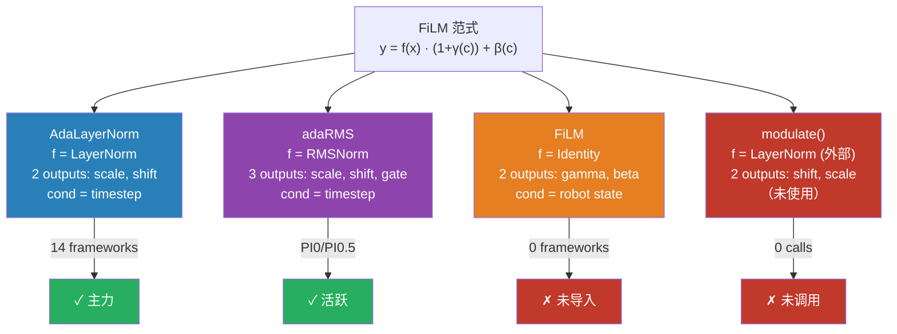

#### 15.4.2 为什么 starVLA 选择了 AdaLayerNorm 而非其他？

这个选择并非偶然，而是与架构设计的整体逻辑一致：

1. **NVIDIA DiT 是 starVLA 流匹配框架的标准动作头**。GR00T N1（NVIDIA 的机器人基础模型）使用 cross-attention DiT + AdaLayerNorm 的组合，starVLA 直接复用了这一架构。

2. **职责分离原则**：在 NVIDIA DiT 中，timestep 通过 adaLN 注入（全局标量调制），VLM 语义通过 cross-attention 注入（逐 token 精细调制）。这种分离让两种条件信息互不干扰，各自通过最适合的机制传递。

3. **adaRMS 的出现是架构适配的结果**。PI0.5 基于 Gemma 架构，Gemma 原生使用 RMSNorm（不使用 LayerNorm），因此条件注入自然适配为 RMSNorm 变体。

4. **FiLM 面向的场景不同**。FiLM 调制的条件是 robot state（低维、物理量），而非 timestep（标量）。它更适合在动作空间中做状态相关的后处理，但目前 starVLA 的主流框架选择了将 state 作为额外 token 拼接到 DiT 输入序列中（如 `GR00T_ActionHeader.forward()` L344-348），而非通过 FiLM 注入。

#### 15.4.3 可视化：自适应归一化族谱

下图展示了 starVLA 中四种自适应归一化变体的族谱关系和使用状态：

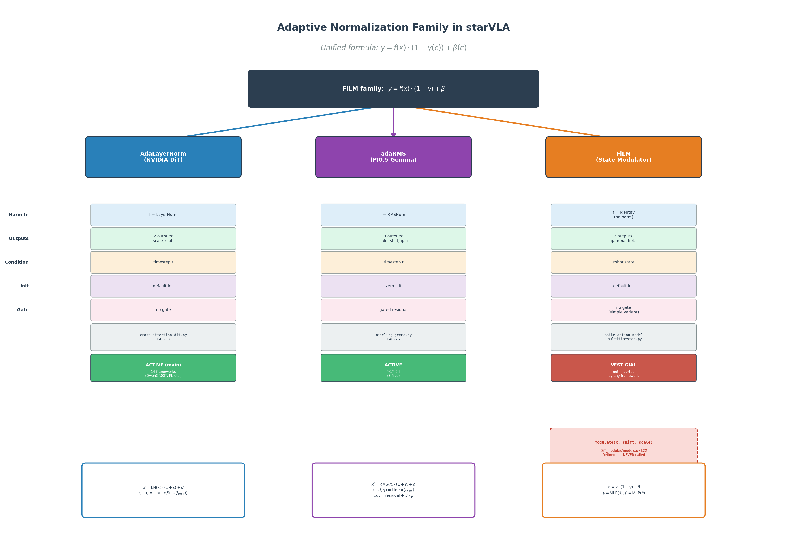

*图 15.1：starVLA 中自适应归一化家族的族谱图。蓝色（AdaLayerNorm）和紫色（adaRMS）是活跃使用的变体，橙色（FiLM）和红色（modulate）是遗留/未激活的变体。*

---

## 第 16 章：CFG vs AdaNorm 对比分析

### 16.0 问题设定

CFG（Classifier-Free Guidance）和 AdaNorm（Adaptive Normalization）都是让条件信息影响生成模型输出的技术，但它们的工作方式截然不同：

- **CFG** 是一种**推理时后处理**技术：模型先分别计算有条件和无条件的输出，然后通过线性插值放大条件信号。它不改变模型结构，只改变推理逻辑。

- **AdaNorm** 是一种**结构性条件注入**技术：通过修改归一化层的仿射参数，让条件信息在训练和推理时都融入模型的每一层计算中。

> **直觉类比**：
> - **CFG** 好比 GPS 导航——你先自由行驶（无条件），再参考目的地方向（有条件），然后 GPS 告诉你「再往目的地方向偏一点」。偏移的力度 $s$ 可以实时调节。
> - **AdaNorm** 好比烹饪中的调味——在炒菜的每一步（每一层）都根据菜谱要求（条件）调整火候和调料量。调味在整个烹饪过程中持续进行，不是最后才加调料。

### 16.1 机制对比

#### 16.1.1 CFG 的工作机制

CFG 的核心公式为：

$$\hat{\epsilon}_\theta(x_t, c) = \epsilon_\theta(x_t, \varnothing) + s \cdot \big[\epsilon_\theta(x_t, c) - \epsilon_\theta(x_t, \varnothing)\big]$$

其中 $s$ 是引导强度（guidance scale）。当 $s = 1$ 时等价于标准条件生成；$s > 1$ 时放大条件信号；$s = 0$ 时退化为无条件生成。

**训练时**：以概率 $p$（starVLA 中 $p = 0.1$）随机丢弃条件，用可学习的 `uncondition` 参数替换，使模型同时学会有条件和无条件生成。

**推理时**：构造 double batch，前半部分传入真实条件，后半部分传入 `uncondition`，一次前向传播得到两组输出后用上述公式合成。

#### 16.1.2 AdaNorm 的工作机制

以 AdaLayerNorm 为例，其核心公式为：

$$x' = \text{LayerNorm}(x) \cdot (1 + \gamma(t)) + \beta(t)$$

条件信息 $t$ 通过可学习的映射 $\gamma(\cdot), \beta(\cdot)$ 转化为逐层的仿射参数。

**训练时和推理时完全相同**：每一层的计算都由条件 $t$ 调制，无需特殊的推理逻辑。

#### 16.1.3 本质差异

| 维度 | CFG | AdaNorm |
|------|-----|---------|
| **作用层面** | 模型输出（后处理） | 模型内部（每一层） |
| **条件注入方式** | 隐式（条件/无条件输出对比） | 显式（仿射参数直接调制） |
| **训练修改** | 仅需条件 dropout | 需修改归一化层结构 |
| **推理修改** | 需 double batch + 公式 | 无额外逻辑 |
| **可调性** | $s$ 可在推理时任意调节 | 训练后固定，不可外部调节 |

### 16.2 starVLA 中的实现对比

#### 16.2.1 CFG 在 M1 中的实现

CFG 在 starVLA 中**仅在 M1 框架**中实现，涉及以下代码路径：

**训练：条件 dropout（10%）**

```python
# DiT_modules/models.py L72-104 — LabelEmbedder
class LabelEmbedder(nn.Module):
    def __init__(self, in_size, hidden_size, dropout_prob=0.1,
                 conditions_shape=(1, 1, 4096)):
        self.linear = nn.Linear(in_size, hidden_size)
        self.dropout_prob = dropout_prob
        if dropout_prob > 0:
            self.uncondition = nn.Parameter(  # ← 可学习的无条件参数
                torch.empty(conditions_shape[1:])
            )

    def token_drop(self, conditions, force_drop_ids=None):
        drop_ids = torch.rand(conditions.shape[0], device=conditions.device) \
                   < self.dropout_prob        # ← 10% 概率掩码
        conditions = torch.where(
            drop_ids.unsqueeze(1).unsqueeze(1).expand(...),
            self.uncondition,                 # ← 替换为 uncondition
            conditions,
        )
        return conditions
```

**推理：double batch + 引导公式**

```python
# DiT_modules/models.py L278-293 — forward_with_cfg
def forward_with_cfg(self, x, t, z, cfg_scale):
    half = x[: len(x) // 2]
    combined = torch.cat([half, half], dim=0)       # ← double batch
    model_out = self.forward(combined, t, z)        # ← 一次前向传播
    eps = model_out[:, :, :self.in_channels]
    cond_eps, uncond_eps = torch.split(eps, len(eps)//2, dim=0)
    half_eps = uncond_eps + cfg_scale * (cond_eps - uncond_eps)  # ← CFG 公式
    eps = torch.cat([half_eps, half_eps], dim=0)
    return torch.cat([eps, rest], dim=2)
```

**M1 框架调用（推理）**：

```python
# M1.py L327-338 — predict_action
if using_cfg:
    noise = torch.cat([noise, noise], 0)               # [2B, T, D]
    uncondition = self.action_model.net.z_embedder.uncondition  # [64, 768]
    uncondition = uncondition.unsqueeze(0).expand(B, ...)       # [B, 64, 768]
    z = torch.cat([action_condition_feature, uncondition], 0)   # [2B, 64, 768]
    model_kwargs = dict(z=z, cfg_scale=cfg_scale)
    sample_fn = self.action_model.net.forward_with_cfg          # ← 使用 CFG 前向
```

#### 16.2.2 AdaLN 在 NVIDIA DiT 中的实现

AdaLN 在每个使用 NVIDIA DiT 的框架中都是默认行为：

```python
# cross_attention_dit.py L189-206 — DiT 默认 norm_type="ada_norm"
class DiT(ModelMixin, ConfigMixin):
    def __init__(self, ..., norm_type="ada_norm", ...):
        for idx in range(num_layers):
            all_blocks += [BasicTransformerBlock(
                ..., norm_type=norm_type, ...  # ← 传递 ada_norm
            )]

# cross_attention_dit.py L118-119 — BasicTransformerBlock 初始化
if norm_type == "ada_norm":
    self.norm1 = AdaLayerNorm(dim)            # ← 使用 AdaLayerNorm

# cross_attention_dit.py L159-160 — forward
norm_hidden_states = self.norm1(hidden_states, temb)  # ← temb 调制
```

**GR00T_ActionHeader 调用（训练）**：

```python
# GR00T_ActionHeader.py L351-357 — forward
t_discretized = (t[:, 0, 0] * self.num_timestep_buckets).long()
action_features = self.action_encoder(noisy_trajectory, t_discretized)
# ...
model_output = self.model(           # ← self.model 是 DiT 实例
    hidden_states=sa_embs,
    encoder_hidden_states=vl_embs,   # ← VLM 特征走 cross-attention
    timestep=t_discretized,          # ← timestep 走 adaLN
)
```

#### 16.2.3 数据流对比图

下图展示了 CFG 与 AdaLN 在模型中的完整数据流对比：

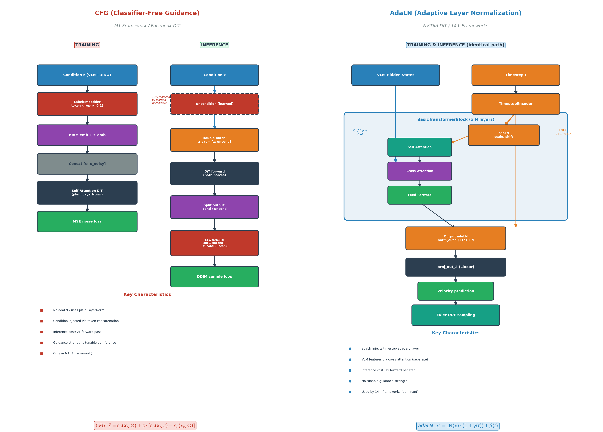

*图 16.1：左图为 CFG 在 M1 框架中的数据流——训练时 10% 条件 dropout，推理时 double batch + 引导公式。右图为 AdaLN 在 NVIDIA DiT 中的数据流——timestep 通过 adaLN 注入每一层，VLM 特征通过 cross-attention 注入。*

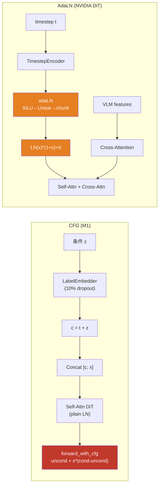

### 16.3 应用场景分析

#### 16.3.1 CFG 更适合的场景

1. **需要推理时调节条件遵循强度**：CFG 的引导强度 $s$ 可以在推理时自由调节，无需重新训练。这在需要灵活控制生成质量与多样性权衡的场景中极为有用。例如，$s = 1.5$ 可能产生更忠实但略显僵硬的动作，$s = 3.0$ 可能更严格遵循指令但动作不够自然。

2. **条件是高维语义信息**：CFG 可以对**任意条件**进行引导（文本、图像、多模态融合后的特征），而 AdaNorm 通常只注入低维标量（timestep）。M1 的 CFG 对的是 QFormer 压缩后的 64 个条件 token（768 维），这是一个高维语义表征。

3. **不想修改模型架构**：CFG 只需要在训练时加入条件 dropout，在推理时修改采样逻辑。模型本身的结构完全不变，适合在现有架构上快速迭代。

#### 16.3.2 AdaNorm 更适合的场景

1. **实时性要求高**：AdaNorm 不增加任何推理成本（仅一个 Linear + chunk 操作），而 CFG 需要**两倍**前向传播。在机器人实时控制中，推理延迟至关重要，这是 AdaNorm 被 14 个框架采用的核心原因。

2. **条件是低维标量（如 timestep）**：timestep 是一个标量，转化为 embedding 后维度与 hidden_states 相同。这种低维条件非常适合通过 AdaNorm 注入——参数量极小（一个 Linear 层），但每一层都能感知。

3. **需要全层级条件渗透**：AdaNorm 在每一层都注入条件信息，而 CFG 只在最终输出层面起作用。对于扩散/流匹配模型来说，不同层负责不同粒度的信息处理（浅层处理结构、深层处理细节），让每一层都感知时间步对生成质量至关重要。

### 16.4 优缺点分析

#### 16.4.1 CFG 的优势与劣势

**优势**：

| 优势 | 说明 | starVLA 代码证据 |
|------|------|-----------------|
| 推理时可调 | 引导强度 $s$ 是超参数，推理时自由设置 | `M1.py` L311: `using_cfg = cfg_scale > 1.0` |
| 架构无关 | 不修改模型内部结构 | `DiTBlock` 使用普通 `nn.LayerNorm`（L143-145） |
| 训练简单 | 只需条件 dropout | `LabelEmbedder.token_drop()` 约 15 行代码 |
| 理论完善 | 有明确的概率解释（后验引导） | 引导公式 $\hat{\epsilon} = \epsilon_\varnothing + s(\epsilon_c - \epsilon_\varnothing)$ |

**劣势**：

| 劣势 | 说明 | 量化影响 |
|------|------|---------|
| 推理翻倍 | 每步需两次前向传播 | 推理时间 ×2，对实时控制不友好 |
| 可能过饱和 | $s$ 过大时分布坍缩 | 生成动作单一、失去多样性 |
| 仅影响输出 | 不影响中间层表征 | 无法逐层细粒度控制 |
| 需学习 uncondition | 增加额外可学习参数 | `self.uncondition = nn.Parameter(...)` |
| 与 Flow Matching 不直接兼容 | 原始 CFG 设计用于 DDPM 的噪声预测 | starVLA 中仅 M1（DDPM）使用 CFG |

#### 16.4.2 AdaNorm 的优势与劣势

**优势**：

| 优势 | 说明 | starVLA 代码证据 |
|------|------|-----------------|
| 零推理开销 | 仅一个 Linear + chunk | `AdaLayerNorm.forward()` 3 行核心代码 |
| 全层级渗透 | 每层都注入条件 | `BasicTransformerBlock` 每个都有 `norm1 = AdaLayerNorm(dim)` |
| 与 Flow Matching 兼容 | velocity 预测天然适配 | 14 个流匹配框架全部使用 |
| 训练推理一致 | 无需特殊推理逻辑 | 同一个 `forward()` 训练和推理都调用 |
| 参数高效 | 每层仅增加 $2D^2$ 参数 | `nn.Linear(D, 2D)` |

**劣势**：

| 劣势 | 说明 | 影响 |
|------|------|------|
| 不可外部调节 | 训练后条件强度固定 | 无法像 CFG 那样推理时微调 |
| 仅适合低维条件 | 高维条件（如 VLM 特征）不适合 | timestep 适合，但文本语义需走 cross-attention |
| 增加模型结构复杂度 | 需修改归一化层实现 | 比 CFG 的「加个 dropout」侵入性更强 |

### 16.5 为什么 starVLA 的流匹配框架不用 CFG？

这是一个值得深入思考的问题。starVLA 中有 14 个框架使用流匹配（Flow Matching），但**没有一个**实现了 CFG。唯一使用 CFG 的 M1 框架采用的是 **DDPM（去噪扩散概率模型）**，而非流匹配。原因有三：

#### 原因 1：数学公式不直接兼容

CFG 的引导公式是为**噪声预测**（$\epsilon$-prediction）设计的：

$$\hat{\epsilon}_\theta = \epsilon_\theta(x_t, \varnothing) + s \cdot (\epsilon_\theta(x_t, c) - \epsilon_\theta(x_t, \varnothing))$$

而流匹配模型预测的是**速度场**（velocity）$v_\theta(x_t, t)$，其 ODE 为：

$$\frac{dx}{dt} = v_\theta(x_t, t, c)$$

虽然可以类比地对 velocity 做引导（$\hat{v} = v_\varnothing + s(v_c - v_\varnothing)$），但这样做的理论保证比 DDPM 弱——velocity 的引导不等价于对数概率梯度的引导，可能导致 ODE 路径偏离流形。

#### 原因 2：流匹配的条件遵循已经很强

流匹配的 ODE 路径比 DDPM 的 SDE 路径更直、更确定（少了随机噪声注入），条件信息的传递衰减更小。加上 AdaLayerNorm 在每层都注入 timestep、cross-attention 在每层都注入 VLM 语义，流匹配框架的条件遵循能力已经足够好，不需要 CFG 额外放大。

#### 原因 3：机器人控制的实时性约束

机器人控制通常要求 50-200ms 的推理延迟。流匹配的 Euler ODE 采样一般需要 4-16 步，每步一次前向传播。如果加上 CFG，每步翻倍为两次前向传播，总推理时间翻倍。在实时控制场景下，这个代价太高。

以 `GR00T_ActionHeader.predict_action()` 为例（L365-419），Euler 循环中每步只调用一次 `self.model()`：

```python
# GR00T_ActionHeader.py L387-414 — predict_action (Euler sampling)
for t in range(num_steps):
    # ...
    model_output = self.model(                  # ← 仅 1 次前向
        hidden_states=sa_embs,
        encoder_hidden_states=vl_embs,
        timestep=timesteps_tensor,
    )
    pred_velocity = pred[:, -self.action_horizon:]
    actions = actions + dt * pred_velocity      # ← Euler 更新
```

如果加上 CFG，这个循环的耗时将翻倍。

### 16.6 能否结合 CFG 与 AdaNorm？

理论上完全可以。实际上，原始 Facebook DiT 论文中的 **adaLN-Zero** 就是同时使用 adaLN 和 CFG 的代表——DiT block 内部用 adaLN 注入 class label + timestep，推理时用 CFG 放大 class label 的引导。

但在 starVLA 中，两者在代码中**没有交叉**：

- **M1**（使用 CFG）的 DiT 是 Facebook 版本，使用**普通 LayerNorm + token concatenation**，没有 adaLN。
- **其他框架**（使用 AdaLayerNorm）的 DiT 是 NVIDIA 版本，没有 CFG。

这不是技术限制，而是架构选择的结果。未来如果需要在流匹配框架中增强条件遵循，一种可能的方案是：

1. **DiT 内部**继续用 AdaLayerNorm 注入 timestep（结构性条件注入）
2. **推理时**对 VLM 特征做 CFG——在 cross-attention 的 KV 上构造条件/无条件对，用引导公式放大 VLM 语义信号
3. 只在需要强化条件遵循的场景启用 CFG（如精确跟踪复杂指令），平时关闭以节省计算

这种「结构性注入 + 可选推理引导」的混合方案能够兼顾 AdaNorm 的全层级渗透和 CFG 的推理时可调性。

### 16.7 总结对比表

| 维度 | CFG（M1） | AdaLN（NVIDIA DiT） | adaRMS（PI0.5） |
|------|----------|-------------------|----------------|
| **本质** | 推理时后处理 | 结构性层级注入 | 结构性层级注入 + 门控 |
| **条件类型** | 高维语义（QFormer 64 token） | 低维标量（timestep） | 低维标量（timestep） |
| **数学公式** | $\hat{\epsilon} = \epsilon_\varnothing + s(\epsilon_c - \epsilon_\varnothing)$ | $\text{LN}(x)(1+s)+d$ | $\text{RMS}(x)(1+s)+d$, gate |
| **推理成本** | ×2 前向传播 | ×1（无额外） | ×1（无额外） |
| **可调性** | $s$ 可调 | 固定 | 固定 |
| **覆盖范围** | 1 个框架 | 14 个框架 | 3 个文件 |
| **训练修改** | 条件 dropout | 替换归一化层 | 替换归一化层 + 零初始化 |
| **扩散类型兼容** | DDPM 最佳 | Flow Matching 最佳 | Flow Matching 最佳 |
| **代码行数** | ~30 行（dropout + forward_with_cfg） | ~24 行（AdaLayerNorm 类） | ~30 行（GemmaRMSNorm 条件分支） |

> **结论**：在 starVLA 中，AdaLN 是绝对的主流选择，因为它与流匹配范式完美匹配、零推理开销、且通过 cross-attention 的配合已经提供了足够强的条件注入能力。CFG 在 M1 框架中作为 DDPM 专属的引导技术存在，代表了一种不同的设计哲学——「推理时调节」vs「训练时嵌入」。两种技术并非竞争关系，而是适用于不同场景的互补工具。

---

*本章依据：`starVLA/model/modules/action_model/flow_matching_head/cross_attention_dit.py`（AdaLayerNorm 定义与使用）、`starVLA/model/modules/vlm/openpi_transformers/gemma/modeling_gemma.py`（adaRMS 实现）、`starVLA/model/modules/action_model/DiT_modules/models.py`（CFG 实现与 modulate 遗留）、`starVLA/model/modules/action_model/spike_action_model_multitimestep.py`（FiLM 变体）、`starVLA/model/framework/VLM4A/M1.py`（CFG 推理流程）、`starVLA/model/modules/action_model/GR00T_ActionHeader.py`（DiT 调用与 Euler 采样）。代码引用基于本地仓库实际行号。*
