# starVLA 多模态输入与融合机制深度分析

> **一句话结论**：starVLA 通过 4 种输入模态（视觉 / 语言 / 本体感知状态 / 动作）、5 种感知骨干（Qwen-VL / PaliGemma / DINOv2 / CosmoPredict2 / Wan2.2）和 12 种融合机制，构建了当前开源 VLA 领域最灵活的可组合研究平台。

---

## 总览表

| 维度 | 内容 |
|------|------|
| **输入模态** | 视觉（多视角 RGB）、语言（指令文本）、本体感知状态（关节/EEF）、动作（训练标签） |
| **视觉骨干** | Qwen-VL ViT、PaliGemma SigLIP、DINOv2、CosmoPredict2 VAE+T5、Wan2.2 VAE+UMT5 |
| **融合机制** | 12 种（详见第 6 章） |
| **动作头** | Flow-matching DiT、Layer-wise FM、MLP L1、FAST 自回归、OpenPI Gemma、MaskGIT 离散扩散、VLA-Adapter 等 |
| **框架数量** | 18+ 注册框架（VLM4A + WM4A 两大家族） |

---

## 目录

- [第 0 章：导读与总览](#第-0-章导读与总览)
- [第 1 章：输入模态分类学](#第-1-章输入模态分类学)
- [第 2 章：视觉模态处理](#第-2-章视觉模态处理)
- [第 3 章：语言/文本处理管线](#第-3-章语言文本处理管线)
- [第 4 章：本体感知状态编码](#第-4-章本体感知状态编码)
- [第 5 章：动作模态编码](#第-5-章动作模态编码)
- [第 6 章：多模态融合机制——核心分析](#第-6-章多模态融合机制核心分析)
- [第 7 章：动作头条件化机制](#第-7-章动作头条件化机制)
- [第 8 章：前向传播数据流分析](#第-8-章前向传播数据流分析)
- [第 9 章：反向传播与梯度流分析](#第-9-章反向传播与梯度流分析)
- [第 10 章：纵向分析——VLA 融合技术演进](#第-10-章纵向分析vla-融合技术演进)
- [第 11 章：横向分析——starVLA 内部框架对比](#第-11-章横向分析starvla-内部框架对比)
- [第 12 章：结论与未来方向](#第-12-章结论与未来方向)

---

## 第 0 章：导读与总览

### 0.1 分析范围

本文对 starVLA 代码库进行深度的多模态输入与融合机制分析，涵盖：

1. **静态架构**：组件图、类层级、模块职责与依赖关系
2. **动态架构**：前向/反向传播数据流、张量形状变换、梯度流向
3. **纵向分析**：VLA 融合技术从 RT-2 到 π₀.5 / GR00T N1.5 的演进史，以及 starVLA 在其中的定位
4. **横向分析**：starVLA 内部 18+ 框架变体的对比，以及与业界同期方案的比较

### 0.2 系统定位

starVLA 不是单一模型，而是一个**可组合的 VLA 研究平台**。其核心设计哲学是：

```
框架 = VLM 骨干 × 动作头 × 融合机制 × 数据管线
```

通过 `@FRAMEWORK_REGISTRY.register("Name")` 注册模式（[base_framework.py:51](starVLA/model/framework/base_framework.py#L51)），用户可以自由组合不同的 VLM 骨干、动作头和融合方式，形成新的框架变体。

### 0.3 架构总览

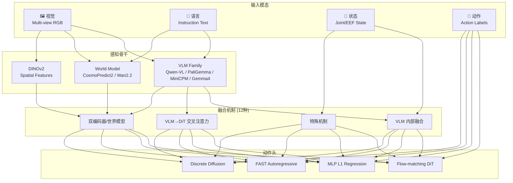
```mermaid
graph TB
    subgraph "输入模态"
        V["🖼️ 视觉<br>Multi-view RGB"]
        L["📝 语言<br>Instruction Text"]
        S["🦾 状态<br>Joint/EEF State"]
        A["🎯 动作<br>Action Labels"]
    end

    subgraph "感知骨干"
        VLM["VLM Family<br>Qwen-VL / PaliGemma / MiniCPM / Gemma4"]
        WM["World Model<br>CosmoPredict2 / Wan2.2"]
        DINO["DINOv2<br>Spatial Features"]
    end

    subgraph "融合机制 (12种)"
        F1["VLM 内部融合"]
        F2["VLM→DiT 交叉注意力"]
        F3["双编码器/世界模型"]
        F4["特殊机制"]
    end

    subgraph "动作头"
        FM["Flow-matching DiT"]
        MLP["MLP L1 Regression"]
        FAST["FAST Autoregressive"]
        DD["Discrete Diffusion"]
    end

    V --> VLM & WM & DINO
    L --> VLM & WM
    S --> F1 & F4
    A --> FM & MLP & FAST & DD

    VLM --> F1 & F2 & F3
    WM --> F3
    DINO --> F3

    F1 & F2 & F3 & F4 --> FM & MLP & FAST & DD
```

---

## 第 1 章：输入模态分类学

> **关键发现**：starVLA 当前支持 4 种输入模态，但不支持深度图、点云、触觉或音频。所有视觉输入均为 RGB 图像。

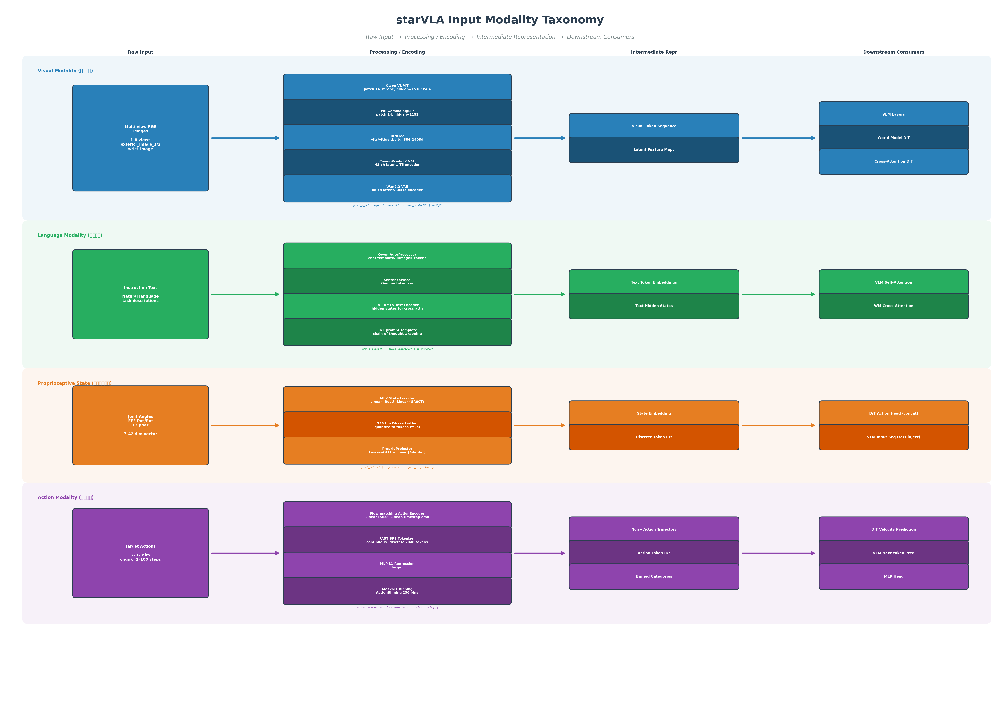

### 1.1 四种输入模态总览

| 模态 | 数据形式 | 维度范围 | 数据来源 | 管线入口 |
|------|----------|----------|----------|----------|
| **视觉** | Multi-view RGB Images | `[B, V, 3, H, W]`，V∈[1,8] | `video.exterior_image_*`, `video.wrist_image` | `_pack_sample()` |
| **语言** | Instruction Text | `[B, str]` | `language.instruction` | `build_qwenvl_inputs()` |
| **状态** | Joint/EEF Vector | `[B, 1, D_s]`，D_s∈[7,42] | `state.eef_position/rotation/gripper` | Framework `forward()` |
| **动作** | Target Action Chunk | `[B, T, D_a]`，T∈[1,100], D_a∈[7,32] | `action.*` | Framework `forward()` |

### 1.2 数据管线架构

数据从原始数据集经过多层处理最终到达框架的 `forward()` 方法：

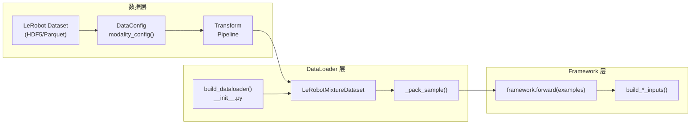
```mermaid
graph LR
    subgraph "数据层"
        DS["LeRobot Dataset<br>(HDF5/Parquet)"]
        DC["DataConfig<br>modality_config()"]
        TR["Transform<br>Pipeline"]
    end

    subgraph "DataLoader 层"
        BD["build_dataloader()<br>__init__.py"]
        LD["LeRobotMixtureDataset"]
        PS["_pack_sample()"]
    end

    subgraph "Framework 层"
        FW["framework.forward(examples)"]
        BI["build_*_inputs()"]
    end

    DS --> DC --> TR --> LD
    BD --> LD --> PS --> FW --> BI
```

`build_dataloader()` 函数（[__init__.py](starVLA/dataloader/__init__.py)）根据配置分发到 `lerobot_datasets` 或 `vlm_datasets`。对于 VLA 训练，核心数据集类是 `LeRobotMixtureDataset`，它根据 `DATASET_NAMED_MIXTURES` 混合多个数据集。

### 1.3 模态配置系统

每种机器人类型通过 `BaseDataConfig` 子类定义其模态配置。以 OXE Droid 数据集为例：

```python
# starVLA/dataloader/gr00t_lerobot/data_config.py
class OxeDroidDataConfig(BaseDataConfig):
    video_keys = [
        "video.exterior_image_1",    # 外部摄像头 1
        "video.exterior_image_2",    # 外部摄像头 2
        "video.wrist_image",         # 手腕摄像头
    ]
    state_keys = [
        "state.eef_position",        # 末端执行器位置 (3D)
        "state.eef_rotation",        # 末端执行器旋转 (quaternion/euler)
        "state.gripper_position",    # 夹爪开合度
    ]
    action_keys = [...]              # 对应的动作维度
    language_keys = ["language.instruction"]
```

`modality_config()` 方法将这些键映射为 `ModalityConfig` 结构：

```python
ModalityConfig = {
    "video": {"keys": [...], "transforms": [Resize, Normalize]},
    "state": {"keys": [...], "metadata": LeRobotStateActionMetadata},
    "action": {"keys": [...], "metadata": LeRobotStateActionMetadata},
    "language": {"keys": ["language.instruction"]},
}
```

`LeRobotStateActionMetadata`（[schema.py](starVLA/dataloader/gr00t_lerobot/schema.py)）定义了每个状态/动作维度的起止索引、旋转类型、是否绝对值、数据类型和范围。

### 1.4 Collate 与 Batch 格式

`collate_fn` 将单样本字典列表打包为批次。每个样本到达 `framework.forward()` 时的格式为：

```python
example = {
    "image": [PIL.Image, PIL.Image, ...],  # List[PIL.Image], 长度 = 视角数
    "lang": "pick up the red cube",         # str, 自然语言指令
    "action": np.ndarray,                   # shape [T, action_dim]
    "state": np.ndarray,                    # shape [1, state_dim], optional
}
```

**重要**：这是一个**模型无关**的接口。无论框架采用何种融合策略，输入格式保持一致——多模态融合的差异完全体现在框架内部的处理逻辑中。

---

## 第 2 章：视觉模态处理

starVLA 中的视觉处理涵盖 5 种不同的感知骨干，可分为三大类：VLM 内置视觉编码器、自监督视觉特征提取器、和世界模型 VAE 编码器。

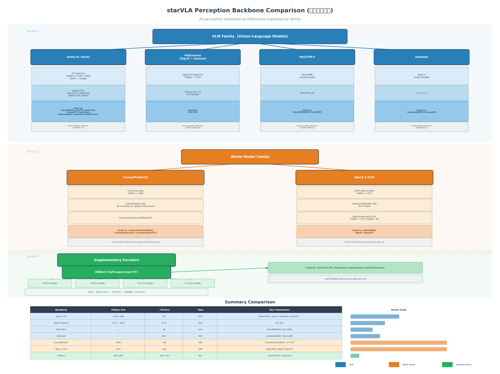

### 2.1 VLM 内置 ViT（Qwen-VL 系列）

Qwen-VL 是 starVLA 中使用最广泛的视觉骨干，被 14+ 框架变体直接使用。

#### 架构细节

Qwen-VL 采用 **NaViT**（Native Resolution ViT）架构，支持任意分辨率的图像输入：

- **Patch Size**: 14×14
- **Hidden Dimension**: 1536（Qwen2.5-VL-3B）/ 3584（Qwen2.5-VL-7B）/ 2048（Qwen3-VL-4B）
- **位置编码**: M-RoPE（Multimodal Rotary Position Embedding），统一处理文本位置和 2D 图像位置
- **视觉 Token 压缩**: 内置的 spatial merge 机制将视觉 token 数量压缩至可控范围

#### 处理流程

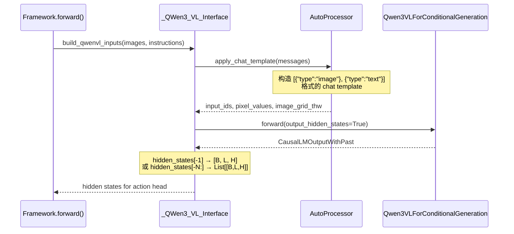
```mermaid
sequenceDiagram
    participant F as Framework.forward()
    participant I as _QWen3_VL_Interface
    participant P as AutoProcessor
    participant V as Qwen3VLForConditionalGeneration

    F->>I: build_qwenvl_inputs(images, instructions)
    I->>P: apply_chat_template(messages)
    Note over P: 构造 [{"type":"image"}, {"type":"text"}]<br>格式的 chat template
    P-->>I: input_ids, pixel_values, image_grid_thw
    I->>V: forward(output_hidden_states=True)
    V-->>I: CausalLMOutputWithPast
    Note over I: hidden_states[-1] → [B, L, H]<br>或 hidden_states[-N:] → List[[B,L,H]]
    I-->>F: hidden states for action head
```

关键代码路径（[QWen3.py:114-171](starVLA/model/modules/vlm/QWen3.py#L114-L171)）：

```python
def build_qwenvl_inputs(self, images, instructions, solutions=None):
    messages = []
    for imgs, instruction in zip(images, instructions):
        content = [{"type": "image", "image": img} for img in imgs]
        # CoT_prompt 模板包装
        if "CoT_prompt" in self.config.datasets.vla_data:
            prompt = CoT_prompt.replace("{instruction}", instruction)
        else:
            prompt = instruction
        content.append({"type": "text", "text": prompt})
        msg = [{"role": "user", "content": content}]
        messages.append(msg)
    # 统一 tokenize + padding
    batch_inputs = self.processor.apply_chat_template(
        messages, tokenize=True, padding=True,
        add_generation_prompt=True, return_dict=True, return_tensors="pt"
    )
    return batch_inputs.to(self.model.device)
```

#### 多视角支持

多视角 RGB 图像以**多个 `{"type":"image"}` 条目**的形式注入到 chat template 中。Qwen-VL 的 `AutoProcessor` 会自动为每张图像分配独立的视觉 token 序列，并用特殊 token `<image>`（ID `151655`）和 `<video>`（ID `151656`）标记边界。

### 2.2 PaliGemma SigLIP 视觉塔

PaliGemma 是 PI0/PI05 框架使用的视觉骨干，采用 SigLIP（Sigmoid Loss for Language-Image Pre-training）视觉编码器：

- **架构**: `SiglipVisionModel`（ViT-So400m/14）
- **Patch Size**: 14×14
- **Hidden Dimension**: 1152
- **特点**: 图像 token 直接线性映射到 Gemma 嵌入空间，无需额外适配器

处理流程通过 `OpenPIPaliGemma` 类（[OpenPIPaliGemma.py](starVLA/model/modules/vlm/OpenPIPaliGemma.py)）实现：

```python
# 图像预处理
image = resize_with_pad(image, target_size=(224, 224))
# SigLIP 编码
vision_outputs = self.vision_model(pixel_values)  # [B, N_patches, 1152]
# 线性映射到 Gemma 空间
image_features = self.multi_modal_projector(vision_outputs)  # [B, N_patches, 2048]
```

与 Qwen-VL 的差异：
- SigLIP 使用固定分辨率（224×224），而 Qwen-VL 支持任意分辨率
- SigLIP 的对比学习预训练使其视觉表示更具语义对齐性
- PaliGemma 将图像作为 "soft prefix" 注入 Gemma 序列的前端

### 2.3 DINOv2 空间特征提取

DINOv2 在 starVLA 中作为**补充**视觉编码器使用，提供细粒度的空间特征：

```python
# starVLA/model/modules/dino_model/dino.py
class DINOv2BackBone:
    DINO_MODELS = {
        "dinov2_vits14": 384,   # ViT-Small
        "dinov2_vitb14": 768,   # ViT-Base
        "dinov2_vitl14": 1024,  # ViT-Large
        "dinov2_vitg14": 1408,  # ViT-Giant
    }

    def __init__(self, model_name="dinov2_vits14"):
        self.model = torch.hub.load("facebookresearch/dinov2", model_name)
        self.transform = transforms.Compose([
            transforms.Resize(224),
            transforms.ToTensor(),
            transforms.Normalize(mean=IMAGENET_MEAN, std=IMAGENET_STD),
        ])
```

**使用场景**：
- **InternVLA-M1**：DINOv2 特征与 VLM 逐层特征拼接后通过 QFormer 聚合
- **QwenDual**：DINOv2 与 Qwen-VL 的双编码器拼接

DINOv2 的核心优势在于其自监督预训练获得的**空间对应性**——同一物体在不同视角下的 patch 特征高度一致，这对机器人精细操作（如抓取定位）至关重要。

### 2.4 世界模型 VAE 编码器

starVLA 的 WM4A（World Model for Action）家族使用视频生成模型的 VAE 编码器进行视觉处理，这是一种独特的视觉表示路线。

#### CosmoPredict2 VAE

```python
# starVLA/model/modules/world_model/CosmoPredict2.py
class _CosmoPredict2_Interface:
    # T5 文本编码器 + VAE + CosmosTransformer3DModel DiT
    # hidden_size = num_heads × head_dim = 2048
```

- **VAE**: 48 通道潜变量空间，8× 空间压缩
- **文本编码器**: T5（hidden=2048）
- **DiT**: CosmosTransformer3DModel

#### Wan2.2-TI2V VAE

```python
# starVLA/model/modules/world_model/Wan2.py
class _Wan2_Interface:
    # UMT5 文本编码器 + AutoencoderKLWan VAE + WanTransformer3D DiT
    # hidden_dim = 3072, num_heads = 48
```

- **VAE**: `AutoencoderKLWan`，48 通道潜变量，8× 空间压缩
- **文本编码器**: UMT5（hidden=3072）
- **DiT**: WanTransformer3D（hidden=3072，48 heads）

世界模型路线的核心思想是：**通过视频预测任务预训练的 DiT 已经学会了物理世界的动力学，其中间特征天然包含了动作相关的信息**。

### 2.5 纵向分析：视觉编码器演进

```
ViT (2021) → CLIP/SigLIP (2022) → DINOv2 (2023) → NaViT/M-RoPE (2024) → WM-VAE (2025)
   │              │                     │                  │                    │
   │         语义对齐           空间对应性         任意分辨率          物理动力学
   │      (文本-图像)        (自监督特征)       (效率+灵活性)       (世界知识)
   └──────────────────────────────────────────────────────────────────────────────
                    从语义理解到物理理解的持续深化
```

| 阶段 | 代表 | 核心能力 | starVLA 实现 |
|------|------|----------|-------------|
| 早期 ViT | ViT-B/L | 通用视觉特征 | DINOv2（补充角色） |
| 语义对齐 | SigLIP | 视觉-语言对齐 | PaliGemma（PI0/PI05） |
| 空间感知 | NaViT | 任意分辨率，空间位置 | Qwen-VL（主力骨干） |
| 物理建模 | WM-VAE | 时空动力学 | CosmoPredict2 / Wan2.2 |

**趋势**：从"理解图片中有什么"到"理解物理世界如何运动"，视觉编码器的角色正在从**感知器**向**世界模拟器**演进。

---

## 第 3 章：语言/文本处理管线

### 3.1 分词器选择

starVLA 支持三种分词器体系，分别对应不同的 VLM 骨干：

| 分词器 | VLM 骨干 | 词表大小 | 特点 |
|--------|----------|----------|------|
| **Qwen AutoProcessor** | Qwen-VL 系列 | 151,664+ | 支持 `<image>`/`<video>` 特殊 token，可扩展 `<robot_action_*>` |
| **SentencePiece** | PaliGemma/Gemma | ~256,000 | 标准 BPE，离散化状态直接编码为文本 |
| **T5/UMT5 Tokenizer** | CosmoPredict2/Wan2.2 | ~32,000/~250,000 | 仅用于世界模型的文本条件化 |

### 3.2 Chat Template 构造

Qwen-VL 系列使用标准的 chat template 格式组织多模态输入：

```python
# 构造的 message 结构
messages = [
    {
        "role": "user",
        "content": [
            {"type": "image", "image": <PIL.Image>},   # 视角 1
            {"type": "image", "image": <PIL.Image>},   # 视角 2
            {"type": "text", "text": "pick up the red cube"},  # 指令
        ]
    }
]
```

`AutoProcessor.apply_chat_template()` 将此结构转化为 token 序列：

```
<|im_start|>user
<|image_pad|>...<|image_pad|>  ← 视角1的视觉tokens
<|image_pad|>...<|image_pad|>  ← 视角2的视觉tokens
pick up the red cube           ← 文本指令tokens
<|im_end|>
<|im_start|>assistant
```

### 3.3 CoT Prompt 模板包装

starVLA 支持 Chain-of-Thought 风格的 prompt 包装，用于引导 VLM 在生成动作前先进行推理：

```python
# QWen3.py:126-129
if "CoT_prompt" in self.config.datasets.vla_data:
    CoT_prompt = self.config.datasets.vla_data.get("CoT_prompt", "")
    prompt = CoT_prompt.replace("{instruction}", instruction)
```

一个典型的 CoT prompt 配置：

```yaml
# YAML config
datasets:
  vla_data:
    CoT_prompt: |
      You are a robot assistant. Given the visual observation and the task
      instruction: "{instruction}", predict the next robot actions.
```

### 3.4 PaliGemma 文本处理

PI0/PI05 使用 `LazyPaliGemmaTokenizer`（[PI0.py:92-133](starVLA/model/framework/VLM4A/PI0.py#L92-L133)）进行文本处理，与 Qwen 系列有显著差异：

```python
class LazyPaliGemmaTokenizer:
    def tokenize(self, prompt, state=None):
        cleaned_text = str(prompt).strip().replace("_", " ")
        if state is not None:
            # 离散化状态直接编码为文本
            discretized_state = np.digitize(state, bins=np.linspace(-1,1,257)[:-1]) - 1
            state_str = " ".join(map(str, discretized_state.tolist()))
            prompt_text = f"Task: {cleaned_text}, State: {state_str};\nAction: "
        else:
            tokens = tokenizer.encode(cleaned_text, add_bos=True) + tokenizer.encode("\n")
        # 固定长度 padding
        tokens = pad_to_length(tokens, self.max_len)
        return tokens, mask
```

关键差异：
- Qwen 使用 `apply_chat_template`（结构化消息），PaliGemma 使用原始文本拼接
- PaliGemma 的状态离散化直接嵌入 prompt 文本，格式为 `"Task: ..., State: 95 133 ...;\nAction: "`
- PaliGemma 使用固定长度 padding（`max_token_len`），Qwen 使用动态 padding

### 3.5 世界模型文本编码

世界模型使用独立的文本编码器，不与 VLM 共享分词器：

- **CosmoPredict2**: T5 编码器（hidden=2048），将指令编码为条件化特征
- **Wan2.2**: UMT5 编码器（hidden=3072），多语言支持

世界模型的文本编码主要用于**条件化视频生成**（文本→视频），而非直接参与动作预测。动作预测仍由下游的动作头完成。

---

## 第 4 章：本体感知状态编码

本体感知状态（proprioceptive state）是机器人当前的关节配置和末端执行器姿态。starVLA 实现了三种截然不同的状态编码方式。

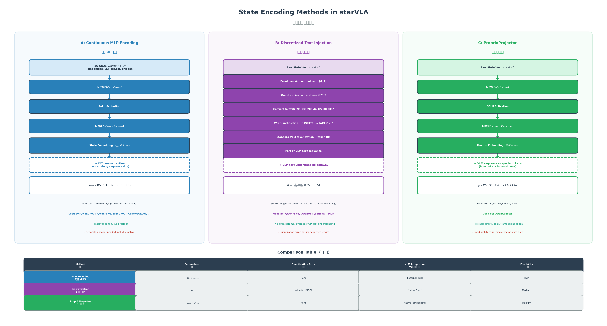

### 4.1 连续 MLP 编码

最直接的方式——通过一个小型 MLP 将状态向量映射到动作头的潜空间：

$$s_{\text{emb}} = W_2 \cdot \text{ReLU}(W_1 \cdot s + b_1) + b_2$$

实现位于 `FlowmatchingActionHead`（[GR00T_ActionHeader.py:52-59](starVLA/model/modules/action_model/GR00T_ActionHeader.py#L52-L59)）：

```python
class MLP(nn.Module):
    def __init__(self, input_dim, hidden_dim, output_dim):
        self.layer1 = nn.Linear(input_dim, hidden_dim)
        self.layer2 = nn.Linear(hidden_dim, output_dim)

    def forward(self, x):
        return self.layer2(F.relu(self.layer1(x)))

# 在 FlowmatchingActionHead.__init__ 中：
self.state_encoder = MLP(
    input_dim=config.state_dim,      # e.g., 7
    hidden_dim=self.hidden_size,     # e.g., 1024
    output_dim=self.input_embedding_dim,  # e.g., 768 (DiT-B) 或 1536 (DiT-L)
)
```

**融合方式**：状态嵌入被拼接到动作序列的开头，作为 DiT 的输入序列的一部分：

```python
# GR00T_ActionHeader.py:344-348
state_features = self.state_encoder(state)  # [B, 1, D]
future_tokens = self.future_tokens.weight.unsqueeze(0).expand(B, -1, -1)  # [B, N_future, D]
action_features = self.action_encoder(noisy_trajectory, t_discretized)    # [B, T, D]
sa_embs = torch.cat((state_features, future_tokens, action_features), dim=1)
# sa_embs shape: [B, 1 + N_future + T, D]
```

**使用框架**: QwenGR00T, CosmosGR00T, WanGR00T, MiniCPMGR00T, Gemma4GR00T 等所有基于 `FlowmatchingActionHead` 的框架。

### 4.2 离散化文本注入（π₀.5 风格）

一种巧妙的做法——将连续状态向量量化为 256 个离散 bin，然后作为**文本 token** 注入到 VLM 的指令序列中：

$$b_i = \left\lfloor \frac{s_i - s_{\min}}{s_{\max} - s_{\min}} \times 255 + 0.5 \right\rfloor$$

在 starVLA 中，状态值被归一化到 $[-1, 1]$ 范围，使用均匀分 bin：

```python
# QwenPI_v3.py:393-400
def state2str_transform(self, state: np.ndarray) -> str:
    """Quantise a state vector into 256 uniform bins and return as space-separated string.
    Follows the π₀.5 convention: bins span [-1, 1] uniformly.
    Example: [-0.5, 0.1, 0.8] -> "95 133 203"
    """
    discretized_state = np.digitize(state, bins=np.linspace(-1, 1, 256 + 1)[:-1]) - 1
    return " ".join(map(str, discretized_state))

# QwenPI_v3.py:402-413
def add_discretized_state_to_instruction(self, instructions, states):
    """Format: '<instruction> [STATE] <bin indices> [ACTION]'"""
    updated_instructions = []
    for instr, state in zip(instructions, states):
        state_str = self.state2str_transform(state[0])
        updated_instructions.append(f"{instr} [STATE] {state_str} [ACTION]")
    return updated_instructions
```

**示例**：

```
原始指令: "pick up the red cube"
原始状态: [-0.5, 0.1, 0.8, 0.0, -0.3, 0.6, 1.0]
离散化后: "pick up the red cube [STATE] 95 133 203 128 89 179 255 [ACTION]"
```

**核心思想**：不需要额外的状态编码器参数。VLM 已经具备理解数字文本的能力，通过将状态"说出来"，让 VLM 用其已有的文本理解能力处理状态信息。

**量化误差分析**：256 bin 的量化步长为 $\Delta = 2/256 \approx 0.0078$，相对误差约 $\pm 0.39\%$。对于归一化到 $[-1,1]$ 的状态值，这个精度足以满足大多数操作任务。

**使用框架**: QwenPI_v3, QwenOFT（可选）, PI05

### 4.3 ProprioProjector（VLA-Adapter 风格）

QwenAdapter 框架使用 `ProprioProjector` 将状态投影到 LLM 的嵌入空间：

$$p = W_2 \cdot \text{GELU}(W_1 \cdot s + b_1) + b_2$$

```python
# QwenAdapter.py
class ProprioProjector(nn.Module):
    def __init__(self, state_dim, hidden_dim, output_dim):
        self.fc1 = nn.Linear(state_dim, hidden_dim)
        self.act = nn.GELU()
        self.fc2 = nn.Linear(hidden_dim, output_dim)

    def forward(self, x):
        return self.fc2(self.act(self.fc1(x)))
```

与 MLP 编码的关键区别：
- 激活函数使用 **GELU**（更平滑的梯度流）而非 ReLU
- 输出维度对齐到 **LLM hidden size**（而非 DiT hidden size）
- 状态嵌入通过 **forward hook** 注入到 VLM 的输入序列中（而非拼接到 DiT 输入）

### 4.4 横向对比

| 方法 | 额外参数 | 量化误差 | VLM 集成 | 灵活性 | 代表框架 |
|------|----------|----------|----------|--------|----------|
| MLP 编码 | $\sim D_s \times D_\text{model}$ | 无 | 外部（DiT 输入） | 高 | QwenGR00T, WanGR00T |
| 离散化文本 | 0 | ~0.4% (1/256) | 原生（文本路径） | 中 | QwenPI_v3, PI05 |
| ProprioProjector | $\sim 2 \times D_s \times D_\text{inner}$ | 无 | 原生（嵌入注入） | 中 | QwenAdapter |

**设计取舍**：

- **MLP 编码**适合需要精确状态信息的场景（如力矩控制），但引入了额外参数
- **离散化文本**零参数开销，利用 VLM 的预训练文本理解能力，但存在量化损失且增加序列长度
- **ProprioProjector** 在 LLM 嵌入空间中操作，可以与文本 token 进行自注意力交互，但固定了状态维度

---

## 第 5 章：动作模态编码

动作模态在训练时作为监督信号，在推理时由模型生成。starVLA 实现了 5 种截然不同的动作编码/解码策略。

### 5.1 Flow-matching ActionEncoder

最常用的动作编码方式，将连续动作与时间步嵌入融合：

$$a_{\text{emb}} = W_3(\text{swish}(W_2([W_1(a) \oplus \text{SinPE}(\tau)])))$$

其中 $\text{SinPE}(\tau)$ 是正弦位置编码生成的时间步嵌入。

实现细节（[GR00T_ActionHeader.py:62-101](starVLA/model/modules/action_model/GR00T_ActionHeader.py#L62-L101)）：

```python
class ActionEncoder(nn.Module):
    def __init__(self, action_dim, hidden_size):
        self.layer1 = nn.Linear(action_dim, hidden_size)         # a → w
        self.layer2 = nn.Linear(2 * hidden_size, hidden_size)    # [a_emb ⊕ τ_emb] → w
        self.layer3 = nn.Linear(hidden_size, hidden_size)        # w → w
        self.pos_encoding = SinusoidalPositionalEncoding(hidden_size)

    def forward(self, actions, timesteps):
        # actions: [B, T, D_a], timesteps: [B]
        a_emb = self.layer1(actions)                              # [B, T, w]
        tau_emb = self.pos_encoding(timesteps.unsqueeze(1).expand(-1, T))  # [B, T, w]
        x = swish(self.layer2(torch.cat([a_emb, tau_emb], dim=-1)))       # [B, T, w]
        return self.layer3(x)                                     # [B, T, w]
```

**Flow-matching 训练**（[GR00T_ActionHeader.py:312-363](starVLA/model/modules/action_model/GR00T_ActionHeader.py#L312-L363)）：

核心公式——噪声轨迹的线性插值与速度预测：

$$x_t = (1-t) \cdot \epsilon + t \cdot x_1 \quad \text{(线性插值)}$$
$$v = x_1 - \epsilon \quad \text{(目标速度)}$$
$$\mathcal{L} = \|v_\theta(x_t, t) - v\|^2 \quad \text{(MSE 损失)}$$

其中 $t \sim \text{Beta}(\alpha, \beta)$ 的噪声调度：

```python
self.beta_dist = Beta(config.noise_beta_alpha, config.noise_beta_beta)  # Beta(1.5, 1.0)

def sample_time(self, batch_size, device, dtype):
    sample = self.beta_dist.sample([batch_size]).clamp(max=self.config.noise_s)  # clamp at 0.999
    return (self.config.noise_s - sample) / self.config.noise_s
```

**推理**——Euler 积分去噪（[GR00T_ActionHeader.py:365-421](starVLA/model/modules/action_model/GR00T_ActionHeader.py#L365-L421)）：

$$x_{t+\Delta t} = x_t + \Delta t \cdot v_\theta(x_t, t)$$

```python
def predict_action(self, vl_embs, state=None):
    actions = torch.randn(B, T, D_a)    # 初始噪声
    dt = 1.0 / num_inference_timesteps   # 步长 (e.g., 0.25 for 4 steps)
    for t in range(num_steps):
        t_cont = t / float(num_steps)
        pred_velocity = model(actions, t_cont)
        actions = actions + dt * pred_velocity   # Euler 步进
    return actions
```

### 5.2 FAST 离散 Token 化

FAST（Fast Action Sequence Tokenizer）将连续动作转化为离散 token 序列，使得动作预测可以复用 VLM 的 next-token prediction 能力：

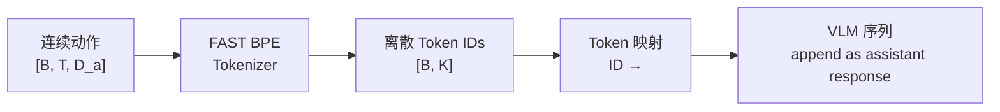
```mermaid
graph LR
    A["连续动作<br>[B, T, D_a]"] --> BPE["FAST BPE<br>Tokenizer"]
    BPE --> DT["离散 Token IDs<br>[B, K]"]
    DT --> MAP["Token 映射<br>ID → <robot_action_*>"]
    MAP --> VLM["VLM 序列<br>append as assistant response"]
```

训练流程（[QwenFast.py:125-176](starVLA/model/framework/VLM4A/QwenFast.py#L125-L176)）：

```python
def forward(self, examples):
    # 1. 连续动作 → FAST tokens
    batch_fast_tokens = self.action_model.encoder_action2fastoken(actions)  # List[List[int]]
    # 2. FAST token ID → VLM 特殊 token 字符串
    vlm_action_tokens = [self.map_fast_token_to_vlm_action(t) for t in batch_fast_tokens]
    # e.g., [42, 17, 891] → "<robot_action_42><robot_action_17><robot_action_891>"
    # 3. 构建 VLM 输入（动作 token 作为 assistant response）
    qwen_inputs = self.qwen_vl_interface.build_qwenvl_inputs(
        images=batch_images, instructions=instructions, solutions=vlm_action_tokens
    )
    # 4. 标准 next-token prediction CE loss
    vlm_action_loss = self.qwen_vl_interface(**qwen_inputs).loss
```

推理流程——需要反向映射（[QwenFast.py:178-222](starVLA/model/framework/VLM4A/QwenFast.py#L178-L222)）：

```python
def predict_action(self, examples):
    # 1. VLM 自回归生成
    generated_ids = self.qwen_vl_interface.model.generate(**qwen_inputs, max_length=2048)
    # 2. 提取动作 token 区间
    batch_vlm_action_token_ids = self._extract_action_token_ids(generated_ids)
    # 3. 映射回 FAST token ID 空间
    batch_fast_action_token_idx = self._decode_action_tokens(batch_vlm_action_token_ids)
    # 4. FAST 解码回连续动作
    normalized_actions = self.action_model.fast_tokenizer.decode(batch_fast_action_token_idx)
```

**特殊 Token 范围**（[QWen3.py:21-23](starVLA/model/modules/vlm/QWen3.py#L21-L23)）：

```python
_ACTION_TOKEN_MIN = 151669   # <robot_action_0>
_ACTION_TOKEN_MAX = 153716   # <robot_action_2047>
```

共 2048 个动作特殊 token（对应 FAST tokenizer 的词表大小）。

### 5.3 MLP L1 回归（OFT）

QwenOFT 使用最简单的动作解码方式——在 VLM 输出的特定位置提取隐状态，通过 MLP 回归连续动作值：

```python
# 注入动作占位符 "🔍" × chunk_len
action_tokens = "🔍" * self.chunk_len
prompt_suffix = f" Please predict the next {self.chunk_len} robot actions: <action>{action_tokens}<action>."
instructions = [instr + prompt_suffix for instr in instructions]
```

VLM 前向传播后，在 "🔍" 位置提取隐状态（[QwenOFT.py:278-330](starVLA/model/framework/VLM4A/QwenOFT.py#L278-L330)）：

```python
def _gather_action_token_embeddings(self, last_hidden, input_ids, action_token_id):
    mask = input_ids == action_token_id  # [B, L]
    # ... 向量化提取最后 chunk_len 个匹配位置
    action_queries = last_hidden.gather(dim=1, index=expanded_index)  # [B, chunk_len, H]
    return action_queries
```

然后通过 MLP 回归预测（来自 `MLP_ActionHeader.py`）：

$$\hat{a} = \text{MLPResNet}(h_{\text{action}})$$
$$\mathcal{L} = \|{a} - \hat{a}\|_1 \quad \text{(L1 损失)}$$

### 5.4 多机器人实体编码器

`CategorySpecificLinear`（[GR00T_ActionHeader.py:25-37](starVLA/model/modules/action_model/GR00T_ActionHeader.py#L25-L37)）支持**不同机器人形态共享同一个动作头**：

```python
class CategorySpecificLinear(nn.Module):
    def __init__(self, num_categories, input_dim, hidden_dim):
        # 每种机器人类型有独立的权重矩阵
        self.W = nn.Parameter(0.02 * torch.randn(num_categories, input_dim, hidden_dim))
        self.b = nn.Parameter(torch.zeros(num_categories, hidden_dim))

    def forward(self, x, cat_ids):
        selected_W = self.W[cat_ids]    # 按类别 ID 索引权重
        selected_b = self.b[cat_ids]
        return torch.bmm(x, selected_W) + selected_b.unsqueeze(1)
```

`MultiEmbodimentActionEncoder` 在此基础上构建了完整的多机器人动作编码器：

```python
class MultiEmbodimentActionEncoder(nn.Module):
    def __init__(self, action_dim, hidden_size, num_embodiments):
        self.W1 = CategorySpecificLinear(num_embodiments, action_dim, hidden_size)
        self.W2 = CategorySpecificLinear(num_embodiments, 2*hidden_size, hidden_size)
        self.W3 = CategorySpecificLinear(num_embodiments, hidden_size, hidden_size)
```

### 5.5 动作编码横向对比

| 编码方式 | 动作空间 | 损失函数 | 推理方式 | 推理速度 | 精度 |
|----------|----------|----------|----------|----------|------|
| Flow-matching | 连续 | MSE velocity | Euler 积分 (4-10步) | 中等 | 高 |
| FAST 离散化 | 离散 2048 | Cross-Entropy | 自回归生成 | 慢（序列生成） | 中 |
| MLP L1 | 连续 | L1 | 单步前向 | 最快 | 中 |
| 离散扩散 MaskGIT | 离散 256 | Cross-Entropy | 迭代解码 | 中等 | 中 |

---

## 第 6 章：多模态融合机制——核心分析

> 这是本文的核心章节。starVLA 实现了 12 种多模态融合机制，可归为 4 大类。每种机制代表了不同的**模态交互哲学**。

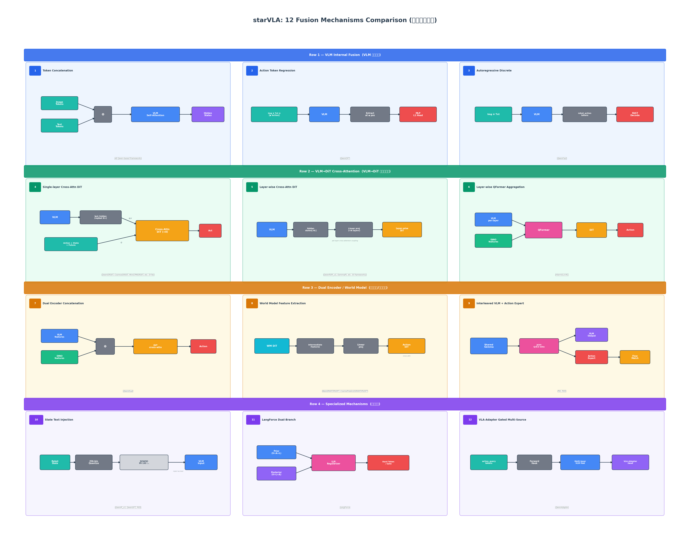

### 融合机制总览

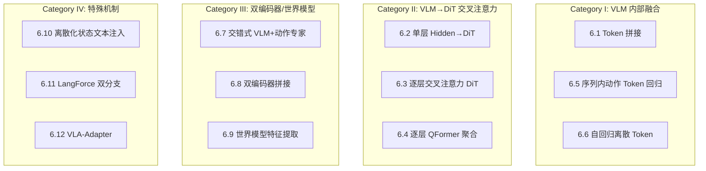
```mermaid
graph TB
    subgraph "Category I: VLM 内部融合"
        F1["6.1 Token 拼接"]
        F5["6.5 序列内动作 Token 回归"]
        F6["6.6 自回归离散 Token"]
    end

    subgraph "Category II: VLM→DiT 交叉注意力"
        F2["6.2 单层 Hidden→DiT"]
        F3["6.3 逐层交叉注意力 DiT"]
        F4["6.4 逐层 QFormer 聚合"]
    end

    subgraph "Category III: 双编码器/世界模型"
        F7["6.7 交错式 VLM+动作专家"]
        F8["6.8 双编码器拼接"]
        F9["6.9 世界模型特征提取"]
    end

    subgraph "Category IV: 特殊机制"
        F10["6.10 离散化状态文本注入"]
        F11["6.11 LangForce 双分支"]
        F12["6.12 VLA-Adapter"]
    end
```

---

### 6.1 VLM 序列内 Token 拼接

**所有 Qwen 框架的基础融合方式。**

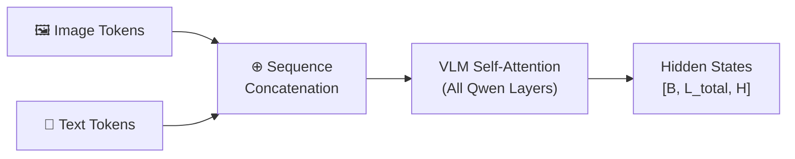
```mermaid
graph LR
    IMG["🖼️ Image Tokens"] --> CAT["⊕ Sequence<br>Concatenation"]
    TXT["📝 Text Tokens"] --> CAT
    CAT --> VLM["VLM Self-Attention<br>(All Qwen Layers)"]
    VLM --> HS["Hidden States<br>[B, L_total, H]"]
```

**原理**：将视觉 token 和文本 token 拼接为一个统一序列，利用 VLM 的**因果自注意力**机制实现跨模态交互。这是最自然、最简单的融合方式——所有模态在同一个序列空间中通过 attention 自由交互。

**数学描述**：

$$\text{Sequence} = [\underbrace{v_1, v_2, \ldots, v_M}_{\text{视觉 tokens}}, \underbrace{t_1, t_2, \ldots, t_N}_{\text{文本 tokens}}]$$

$$h_i^{(l)} = \text{Attention}(Q_i^{(l)}, K_{1:i}^{(l)}, V_{1:i}^{(l)}) \quad \text{(因果 mask)}$$

**代码路径**：`build_qwenvl_inputs()` 构造多模态序列 → VLM 前向 → 提取 hidden states

**重要细节**：Qwen-VL 的视觉 token 经过内部 spatial merge 压缩后，与文本 token 共享相同的嵌入空间。每个视觉 token 通过 M-RoPE 编码了其在原始图像中的 2D 位置。

**优势**：零额外参数，全连接交互，可利用预训练的跨模态注意力。

**劣势**：序列长度与视角数线性增长，计算复杂度 $O(L^2)$。

**使用框架**：所有 Qwen-VL 基础框架（作为基础层，上层机制在此基础上进一步处理 hidden states）。

---

### 6.2 单层 Hidden State → 交叉注意力 DiT

**starVLA 中使用最广泛的动作融合模式。**

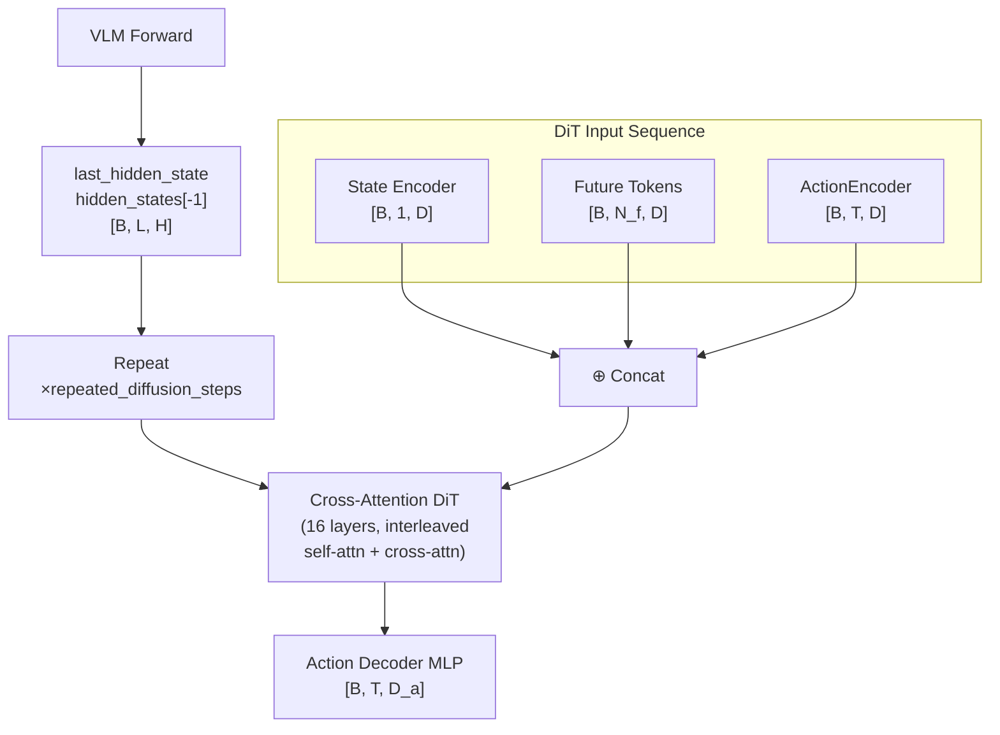
```mermaid
graph TB
    VLM["VLM Forward"] --> LH["last_hidden_state<br>hidden_states[-1]<br>[B, L, H]"]
    LH --> REP["Repeat<br>×repeated_diffusion_steps"]
    REP --> CA["Cross-Attention DiT<br>(16 layers, interleaved<br>self-attn + cross-attn)"]

    subgraph "DiT Input Sequence"
        SE["State Encoder<br>[B, 1, D]"]
        FT["Future Tokens<br>[B, N_f, D]"]
        AE["ActionEncoder<br>[B, T, D]"]
    end

    SE & FT & AE --> CONCAT["⊕ Concat"]
    CONCAT --> CA
    CA --> DEC["Action Decoder MLP<br>[B, T, D_a]"]
```

**核心思想**：VLM 的最后一层 hidden state 作为"上下文记忆"，通过交叉注意力机制影响 DiT 动作头中的去噪过程。

**实现路径**（[QwenGR00T.py:167-221](starVLA/model/framework/VLM4A/QwenGR00T.py#L167-L221)）：

```python
# Step 1: VLM 编码
qwenvl_outputs = self.qwen_vl_interface(**qwen_inputs, output_hidden_states=True)
last_hidden = qwenvl_outputs.hidden_states[-1]  # [B, L, H]

# Step 2: 重复采样（more noise samples per batch）
last_hidden_repeated = last_hidden.repeat(repeated_diffusion_steps, 1, 1)
actions_target_repeated = actions_target.repeat(repeated_diffusion_steps, 1, 1)

# Step 3: 动作头前向
action_loss = self.action_model(
    last_hidden_repeated,          # VLM context → cross-attention K,V
    actions_target_repeated,       # 目标动作（训练用）
    state_repeated,                # 状态嵌入（可选）
)
```

**DiT 内部流程**（[cross_attention_dit.py:272-331](starVLA/model/modules/action_model/flow_matching_head/cross_attention_dit.py#L272-L331)）：

```python
class DiT(ModelMixin, ConfigMixin):
    def forward(self, hidden_states, encoder_hidden_states, timestep):
        temb = self.timestep_encoder(timestep)  # 时间步嵌入

        for idx, block in enumerate(self.transformer_blocks):
            if idx % 2 == 1 and interleave_self_attention:
                # 奇数层：自注意力（动作 token 间交互）
                hidden_states = block(hidden_states, encoder_hidden_states=None, temb=temb)
            else:
                # 偶数层：交叉注意力（动作 attend to VLM hidden）
                hidden_states = block(
                    hidden_states,
                    encoder_hidden_states=encoder_hidden_states,  # VLM context
                    temb=temb,
                )

        # 输出层：AdaLN 调制 + 线性投影
        shift, scale = self.proj_out_1(F.silu(temb)).chunk(2, dim=1)
        hidden_states = self.norm_out(hidden_states) * (1 + scale[:, None]) + shift[:, None]
        return self.proj_out_2(hidden_states)
```

**交错 self/cross-attention 的设计**：偶数层做交叉注意力（从 VLM context 提取信息），奇数层做自注意力（动作序列内部交互）。这种交错模式允许动作序列在"看到"VLM 信息后进行内部推理。

**使用框架**：QwenGR00T, CosmosGR00T, WanGR00T, MiniCPMGR00T, Gemma4GR00T, QwenDual 等（共 9 个框架）

---

### 6.3 逐层交叉注意力 DiT

**QwenPI 系列的核心创新——利用 VLM 的多层特征，而非仅用最后一层。**

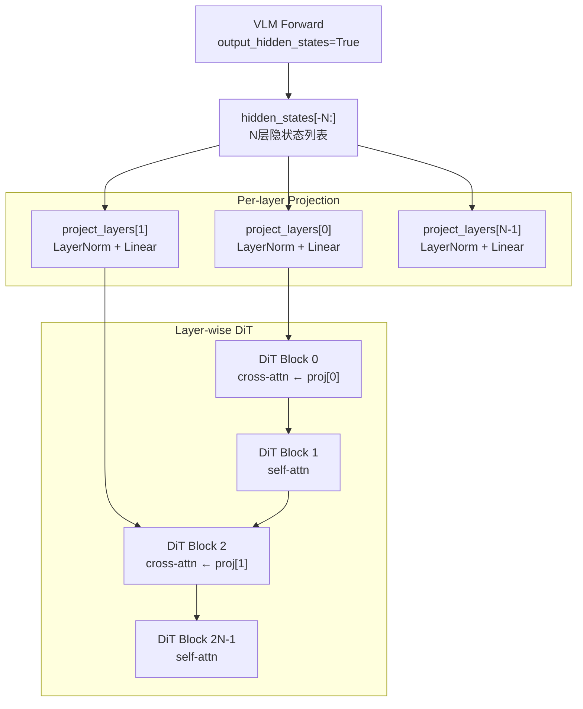
```mermaid
graph TB
    VLM["VLM Forward<br>output_hidden_states=True"] --> HS["hidden_states[-N:]<br>N层隐状态列表"]

    subgraph "Per-layer Projection"
        P1["project_layers[0]<br>LayerNorm + Linear"]
        P2["project_layers[1]<br>LayerNorm + Linear"]
        PN["project_layers[N-1]<br>LayerNorm + Linear"]
    end

    HS --> P1 & P2 & PN

    subgraph "Layer-wise DiT"
        D1["DiT Block 0<br>cross-attn ← proj[0]"]
        D2["DiT Block 1<br>self-attn"]
        D3["DiT Block 2<br>cross-attn ← proj[1]"]
        DN["DiT Block 2N-1<br>self-attn"]
    end

    P1 --> D1
    P2 --> D3
    D1 --> D2 --> D3 --> DN
```

**关键创新**：VLM 的每一层 hidden state 都包含不同抽象级别的信息——底层包含局部视觉特征，顶层包含语义理解。通过逐层交叉注意力，动作头可以同时利用所有层次的信息。

**投影层设计**（[QwenPI_v3.py:217-229](starVLA/model/framework/VLM4A/QwenPI_v3.py#L217-L229)）：

```python
self.project_layers = nn.ModuleList([
    (
        nn.Identity()
        if llm_hidden_size == self.action_dit_hidden_dim
        else nn.Sequential(
            nn.LayerNorm(llm_hidden_size),
            nn.Linear(llm_hidden_size, self.action_dit_hidden_dim),
        )
    )
    for _ in range(self.num_action_dit_layers)
])
```

每个投影层将 VLM hidden state 从 `llm_hidden_size`（如 2048）压缩到 `action_dit_hidden_dim`（如 1024），这是 QwenPI_v3 的关键参数节省手段。

**参数分布**：

```
Module                          Params        %
────────────────────────────────────────────
qwen_vl_interface         4,437,815,808   87.5%
action_model                538,678,305   10.6%
project_layers               94,593,024    1.9%
────────────────────────────────────────────
TOTAL                     5,071,087,137  100.0%
```

投影层仅占总参数的 1.9%，但显著降低了动作头的维度（$D_{\text{DiT}} = 1024$ vs $D_{\text{VLM}} = 2048$），从而减少了约 75% 的动作头参数。

**DiT 内部的逐层路由**（[cross_attention_dit.py:296-316](starVLA/model/modules/action_model/flow_matching_head/cross_attention_dit.py#L296-L316)）：

```python
for idx, block in enumerate(self.transformer_blocks):
    if idx % 2 == 1 and interleave_self_attention:
        hidden_states = block(hidden_states, encoder_hidden_states=None, temb=temb)
    else:
        if is_layerwise_encoder:
            # 逐层路由：每个交叉注意力层使用不同的 VLM hidden state
            block_encoder_hidden_states = encoder_hidden_states[idx]
        else:
            block_encoder_hidden_states = encoder_hidden_states
        hidden_states = block(hidden_states, encoder_hidden_states=block_encoder_hidden_states, temb=temb)
```

**与 6.2 的关键区别**：

| 特征 | 单层 (6.2) | 逐层 (6.3) |
|------|-----------|------------|
| VLM 输出 | `hidden_states[-1]` | `hidden_states[-N:]` |
| DiT 输入 | 所有层共享同一 context | 每层使用不同 VLM 层的特征 |
| 信息利用 | 仅顶层语义 | 多层次（从局部到全局） |
| 额外参数 | 无 | `N × (LN + Linear)` 投影层 |
| 代表 | QwenGR00T (GR00T N1) | QwenPI_v3 (π₀.5 风格) |

**使用框架**: QwenPI, QwenPI_v3, GemmaPI, MiniCPMPI, CosmoPredict2PI, WanPI

---

### 6.4 逐层 QFormer 聚合

**InternVLA-M1 的独特融合方式——使用 QFormer 作为跨模态信息聚合器。**

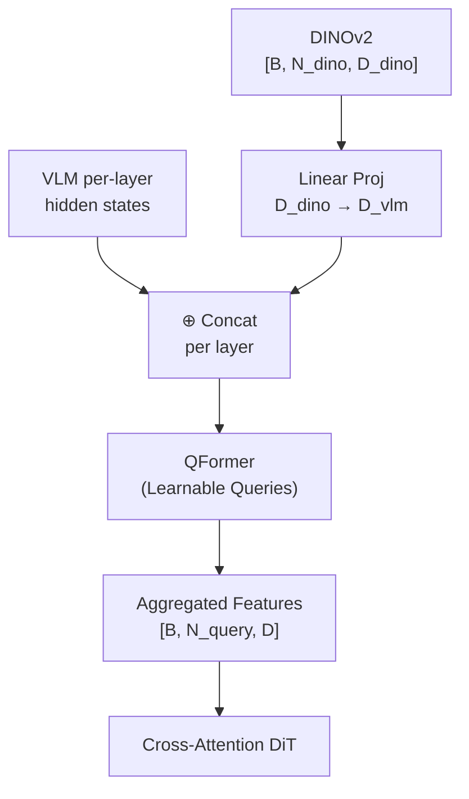
```mermaid
graph TB
    DINO["DINOv2<br>[B, N_dino, D_dino]"] --> PROJ["Linear Proj<br>D_dino → D_vlm"]
    VLM["VLM per-layer<br>hidden states"] --> CONCAT["⊕ Concat<br>per layer"]
    PROJ --> CONCAT

    CONCAT --> QF["QFormer<br>(Learnable Queries)"]
    QF --> AGG["Aggregated Features<br>[B, N_query, D]"]
    AGG --> DiT["Cross-Attention DiT"]
```

M1 框架（[M1.py](starVLA/model/framework/VLM4A/M1.py)）的创新在于：

1. **双编码器特征融合**：Qwen-VL 的 per-layer hidden states 与 DINOv2 的空间特征逐层拼接
2. **QFormer 聚合**：使用可学习 query tokens 从拼接特征中提取固定长度的聚合表示
3. **信息瓶颈**：QFormer 的 query 数量形成天然的信息瓶颈，强制模型提取最相关的信息

```python
# M1.py 核心逻辑
dino_features = self.dino_backbone(images)        # [B, N_patches, D_dino]
dino_projected = self.dino_pro(dino_features)      # [B, N_patches, D_vlm]

# 逐层融合
for layer_idx in range(N):
    vlm_hidden = vlm_hidden_states[layer_idx]      # [B, L_vlm, D_vlm]
    fused = torch.cat([vlm_hidden, dino_projected], dim=1)  # [B, L_vlm+N_patches, D_vlm]
    aggregated = qformer(fused, query_tokens)       # [B, N_query, D_vlm]
```

**优势**：QFormer 作为信息瓶颈，可以在不增加 DiT 计算量的前提下融合多个编码器的特征。

**使用框架**: InternVLA-M1

---

### 6.5 序列内动作 Token 回归（QwenOFT）

**最轻量的融合方式——在 VLM 序列中直接回归动作值。**

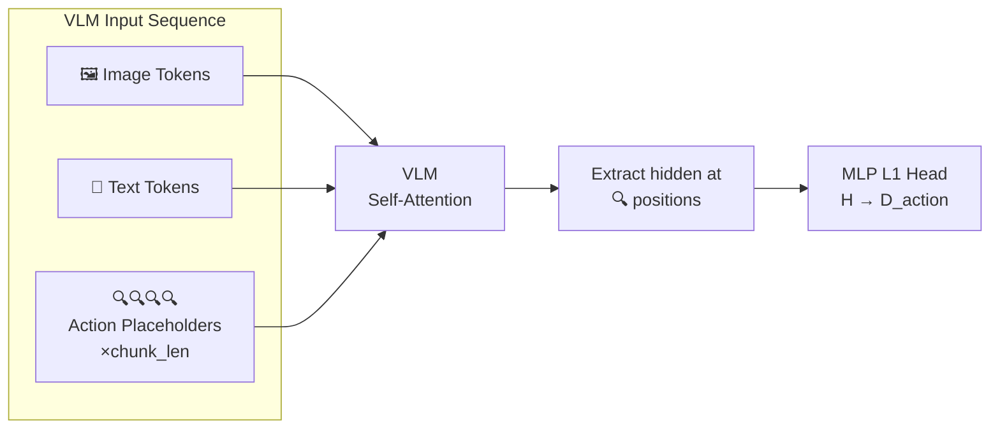
```mermaid
graph LR
    subgraph "VLM Input Sequence"
        IMG["🖼️ Image Tokens"]
        TXT["📝 Text Tokens"]
        ACT["🔍🔍🔍🔍<br>Action Placeholders<br>×chunk_len"]
    end

    IMG --> SA["VLM<br>Self-Attention"]
    TXT --> SA
    ACT --> SA
    SA --> EXTRACT["Extract hidden at<br>🔍 positions"]
    EXTRACT --> MLP["MLP L1 Head<br>H → D_action"]
```

QwenOFT 的核心思想受 OpenVLA-OFT 启发：**不需要单独的动作头**，VLM 本身就是动作预测器。通过在输入序列中注入"🔍"占位符，VLM 的自注意力机制自然地将多模态信息汇聚到这些位置。

**注入方式**（[QwenOFT.py:174-179](starVLA/model/framework/VLM4A/QwenOFT.py#L174-L179)）：

```python
action_tokens = self.action_token * self.chunk_len   # "🔍🔍🔍🔍🔍🔍🔍🔍"
prompt_suffix = f" Please predict the next {self.chunk_len} robot actions: <action>{action_tokens}<action>."
instructions = [instr + prompt_suffix for instr in instructions]
```

**提取方式**（[QwenOFT.py:278-330](starVLA/model/framework/VLM4A/QwenOFT.py#L278-L330)）：

```python
def _gather_action_token_embeddings(self, last_hidden, input_ids, action_token_id):
    mask = input_ids == action_token_id      # [B, L]
    # 向量化提取：取最后 chunk_len 个匹配位置
    topk_pos = masked_pos.topk(k=self.chunk_len, dim=-1).values
    selected_pos = topk_pos.sort(dim=-1).values  # 时间顺序排列
    action_queries = last_hidden.gather(dim=1, index=expanded_index)  # [B, chunk_len, H]
```

**优势**：
- 参数最少（仅需小型 MLP 头）
- 单步前向（无迭代去噪）
- VLM 的因果注意力自然提供了时间先后关系

**劣势**：
- 动作精度受限于 VLM 表示空间
- 无法利用 flow-matching 的逐步精化

**使用框架**: QwenOFT

---

### 6.6 自回归离散动作 Token（QwenFast）

**将动作预测转化为纯语言生成问题。**

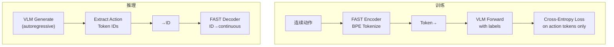
```mermaid
graph TB
    subgraph "训练"
        A["连续动作"] --> FAST_E["FAST Encoder<br>BPE Tokenize"]
        FAST_E --> MAP_E["Token→<robot_action_*>"]
        MAP_E --> VLM_T["VLM Forward<br>with labels"]
        VLM_T --> CE["Cross-Entropy Loss<br>on action tokens only"]
    end

    subgraph "推理"
        VLM_G["VLM Generate<br>(autoregressive)"]
        VLM_G --> EXTRACT["Extract Action<br>Token IDs"]
        EXTRACT --> MAP_D["<robot_action_*>→ID"]
        MAP_D --> FAST_D["FAST Decoder<br>ID→continuous"]
    end
```

**核心设计**：FAST tokenizer 使用 BPE 将连续动作序列编码为离散 token（词表大小 2048），然后映射到 VLM 的扩展词表中。训练时，动作 token 作为 assistant response 的一部分参与标准 next-token prediction。

**Token 映射**（[QwenFast.py:265-272](starVLA/model/framework/VLM4A/QwenFast.py#L265-L272)）：

```python
def map_fast_token_to_vlm_action(self, tokens) -> str:
    return "".join([f"<robot_action_{token}>" for token in tokens])
    # e.g., [42, 17, 891] → "<robot_action_42><robot_action_17><robot_action_891>"
```

**Label Masking**：训练时只在动作 token 位置计算损失（[QWen3.py:147-168](starVLA/model/modules/vlm/QWen3.py#L147-L168)）：

```python
if solutions is not None:
    labels = batch_inputs["input_ids"].clone()
    for i in range(labels.size(0)):
        seq = labels[i]
        mask_seq = (seq >= action_token_min) & (seq <= action_token_max)
        nonzero_indices = torch.nonzero(mask_seq, as_tuple=False)
        if nonzero_indices.numel() > 0:
            first_action_index = nonzero_indices[0].item()
            seq[:first_action_index] = IGNORE_INDEX  # 仅对动作 token 计算 CE loss
```

**与 Flow-matching 的对比**：

| 维度 | 自回归离散 | Flow-matching 连续 |
|------|-----------|-------------------|
| 动作空间 | 离散（2048 tokens） | 连续（ℝ^D） |
| 损失函数 | Cross-Entropy | MSE |
| 推理 | 序列化生成（慢） | 并行 Euler 步进 |
| 精度 | 受 BPE 量化限制 | 理论上无损 |
| 优势 | 复用 VLM 语言能力 | 精确连续控制 |

**使用框架**: QwenFast

---

### 6.7 交错式 VLM + 动作专家（PI0/PI05）

**最复杂的融合方式——两个 Transformer 共享每一层的注意力计算。**

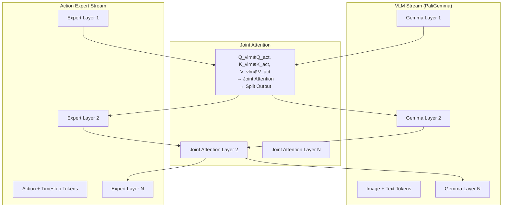
```mermaid
graph TB
    subgraph "VLM Stream (PaliGemma)"
        V_IN["Image + Text Tokens"]
        V_L1["Gemma Layer 1"]
        V_L2["Gemma Layer 2"]
        V_LN["Gemma Layer N"]
    end

    subgraph "Action Expert Stream"
        A_IN["Action + Timestep Tokens"]
        A_L1["Expert Layer 1"]
        A_L2["Expert Layer 2"]
        A_LN["Expert Layer N"]
    end

    subgraph "Joint Attention"
        J1["Q_vlm⊕Q_act, K_vlm⊕K_act, V_vlm⊕V_act<br>→ Joint Attention<br>→ Split Output"]
        J2["Joint Attention Layer 2"]
        JN["Joint Attention Layer N"]
    end

    V_L1 --> J1
    A_L1 --> J1
    J1 --> V_L2 & A_L2
    V_L2 --> J2
    A_L2 --> J2
    J2 --> V_LN & A_LN
```

PI0/PI05 的融合方式（[PI0.py](starVLA/model/framework/VLM4A/PI0.py)）源自 Physical Intelligence 的 π₀ 论文。核心是 `forward_shared_gemma_layer()`：

```python
def forward_shared_gemma_layer(vlm_layer, expert_layer, vlm_hidden, expert_hidden):
    # 1. 分别计算 Q, K, V
    vlm_q, vlm_k, vlm_v = vlm_layer.self_attn.project(vlm_hidden)
    exp_q, exp_k, exp_v = expert_layer.self_attn.project(expert_hidden)

    # 2. 拼接进行联合注意力
    joint_q = torch.cat([vlm_q, exp_q], dim=2)   # concat along seq dim
    joint_k = torch.cat([vlm_k, exp_k], dim=2)
    joint_v = torch.cat([vlm_v, exp_v], dim=2)

    # 3. 统一注意力计算
    joint_output = attention(joint_q, joint_k, joint_v, mask=joint_mask)

    # 4. 分割回各自流
    vlm_output = joint_output[:, :vlm_len, :]
    exp_output = joint_output[:, vlm_len:, :]

    return vlm_output, exp_output
```

**PI05 的增量改进**：
- `discrete_state_input=True`：启用离散化状态注入
- `use_adarms=True`：在 action expert 中使用 adaRMS 归一化（3 输出：scale, shift, gate）

**注意力掩码**（通过 `make_att_2d_masks` / `make_att_4d_masks` 构造）：
- VLM token 可以看到所有 VLM token（因果 mask）
- Action expert token 可以看到所有 VLM token + 所有 action token
- VLM token **不能**看到 action token（单向信息流）

**使用框架**: PI0, PI05

---

### 6.8 双编码器拼接（QwenDual）

**使用 VLM + DINOv2 双编码器的特征拼接。**

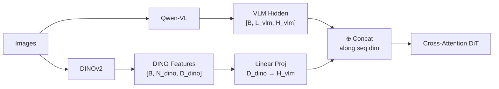
```mermaid
graph LR
    IMG["Images"] --> VLM["Qwen-VL"] & DINO["DINOv2"]
    VLM --> VH["VLM Hidden<br>[B, L_vlm, H_vlm]"]
    DINO --> DH["DINO Features<br>[B, N_dino, D_dino]"]
    DH --> PROJ["Linear Proj<br>D_dino → H_vlm"]
    VH --> CONCAT["⊕ Concat<br>along seq dim"]
    PROJ --> CONCAT
    CONCAT --> DiT["Cross-Attention DiT"]
```

QwenDual 的核心思想：VLM 提供高级语义理解（"这是一个红色方块"），DINOv2 提供精细空间特征（"方块在图像的这个位置"）。两种特征互补。

**使用框架**: QwenDual

---

### 6.9 世界模型特征提取（WM4A 家族）

**使用视频生成模型的中间特征作为动作条件化信号。**

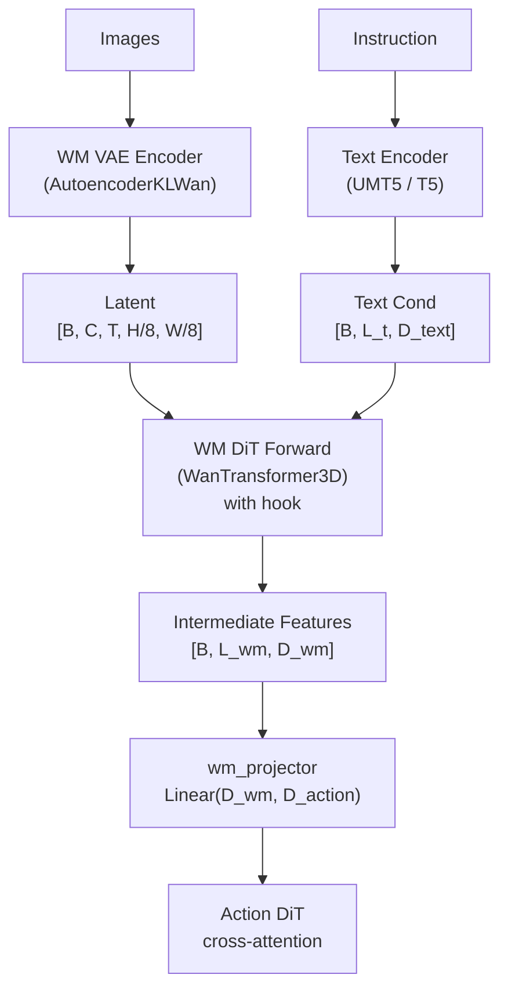
```mermaid
graph TB
    IMG["Images"] --> VAE["WM VAE Encoder<br>(AutoencoderKLWan)"]
    TXT["Instruction"] --> TE["Text Encoder<br>(UMT5 / T5)"]
    VAE --> LAT["Latent<br>[B, C, T, H/8, W/8]"]
    TE --> TC["Text Cond<br>[B, L_t, D_text]"]

    LAT & TC --> WM_DiT["WM DiT Forward<br>(WanTransformer3D)<br>with hook"]
    WM_DiT --> FEAT["Intermediate Features<br>[B, L_wm, D_wm]"]
    FEAT --> PROJ["wm_projector<br>Linear(D_wm, D_action)"]
    PROJ --> A_DiT["Action DiT<br>cross-attention"]
```

实现路径（[WanGR00T.py](starVLA/model/framework/WM4A/WanGR00T.py)）：

```python
# Wan2.2 世界模型的中间特征 → 动作头
wm_features = self.wm_interface.extract_features(images, instruction)  # hook-based
projected = self.wm_projector(wm_features)  # Linear(3072, cross_attn_dim)
action_loss = self.action_model(projected, actions, state)
```

**核心假设**：经过大规模视频预测训练的世界模型已经学会了物理世界的因果关系和动力学规律。其中间特征编码了"接下来会发生什么"的预测信息，这对动作预测是极有价值的。

**使用框架**: WanGR00T, WanPI, WanOFT, CosmoPredict2GR00T, CosmoPredict2PI, CosmoPredict2OFT

---

### 6.10 离散化状态文本注入

本质上是一种**状态→文本**的模态转换，已在第 4.2 节详细分析。在融合层面，它将本体感知状态从"外部数值信号"转化为"VLM 可理解的文本 token"，从而实现状态信息与视觉/语言信息在 VLM 内部的**原生融合**。

```
"pick up the red cube [STATE] 95 133 203 44 127 88 201 [ACTION]"
```

这种做法消除了对额外状态编码器的需求，但引入了约 0.4% 的量化误差和 $D_s + 2$ 个额外文本 token 的序列长度开销。

**使用框架**: QwenPI_v3, QwenOFT（可选）, PI05

---

### 6.11 LangForce 双分支贝叶斯分解

**最理论驱动的融合方式——基于贝叶斯后验分解的双分支架构。**

LangForce（[LangForce.py](starVLA/model/framework/VLM4A/LangForce.py)）将动作条件分布分解为先验和后验：

$$p(a|V, L) = \underbrace{p(a|V, A, L)}_{\text{后验分支}} \cdot \frac{p(a|V, L)}{p(a|V, A, L)} \quad \text{(不精确，仅用于说明分解思想)}$$

实际实现中：
- **Prior 分支** (V+A+L)：视觉 + 动作 + 语言 → 预测动作分布
- **Posterior 分支** (V+L+A)：视觉 + 语言 + 动作 → 精化动作分布
- **LLR 正则化**：Log-Likelihood Ratio 约束先验和后验的一致性
- **Hard-token/Gate 机制**：在推理时仅使用先验分支（因为没有未来动作标签）

```python
# LangForce.py 核心
class LangForce(baseframework):
    def forward(self, examples):
        # Prior branch: 编码 V+A+L
        prior_output = self.prior_branch(images, actions, instructions)
        # Posterior branch: 编码 V+L+A（顺序不同）
        posterior_output = self.posterior_branch(images, instructions, actions)
        # LLR loss: 约束先验 ≈ 后验
        llr_loss = compute_llr(prior_output, posterior_output)
        # 动作 loss
        action_loss = self.action_head(prior_output)
        return {"action_loss": action_loss + λ * llr_loss}
```

**使用框架**: LangForce

---

### 6.12 VLA-Adapter 门控多源注意力

**通过可学习的 action query tokens 和 forward hook 实现轻量级 VLA 适配。**

QwenAdapter（[QwenAdapter.py](starVLA/model/framework/VLM4A/QwenAdapter.py)）的设计思路：

1. 定义可学习的 `action_query` tokens
2. 通过 forward hook 将这些 tokens 注入到 VLM 的中间层
3. 提取 VLM 在 vision + query 位置的多层特征
4. 送入 VLA-Adapter 动作头

```python
# QwenAdapter.py 核心
class QwenAdapter(baseframework):
    def __init__(self, config):
        self.proprio_projector = ProprioProjector(state_dim, hidden, llm_hidden)
        self.action_query = nn.Embedding(num_queries, llm_hidden)

        # Forward hook: 在指定层注入 action_query
        self.qwen_vl_interface.model.register_forward_hook(self._inject_queries)

    def forward(self, examples):
        # VLM forward with injected queries
        outputs = self.qwen_vl_interface(**inputs)
        # Extract features at vision + query positions from multiple layers
        multi_layer_features = extract_features(outputs.hidden_states)
        # VLA-Adapter head
        actions = self.adapter_head(multi_layer_features)
```

**使用框架**: QwenAdapter

---

### 6.13 融合机制总结对比

| # | 机制 | 模态交互位置 | 额外参数 | 推理开销 | 信息利用深度 | 框架数量 |
|---|------|-------------|----------|----------|------------|----------|
| 6.1 | Token 拼接 | VLM 内部 | 0 | 低 | 全层 | 所有 Qwen |
| 6.2 | 单层→DiT | VLM→DiT | DiT params | 中 | 最后 1 层 | 9 |
| 6.3 | 逐层→DiT | VLM→DiT | DiT + proj | 中 | 所有 N 层 | 6 |
| 6.4 | QFormer 聚合 | DINO+VLM→DiT | QFormer + DiT | 中 | 所有 N 层 | 1 |
| 6.5 | 序列内回归 | VLM 内部 | 小 MLP | 低 | 最后 1 层 | 1 |
| 6.6 | 自回归 token | VLM 内部 | 0（共享参数） | 高 | 全层 | 1 |
| 6.7 | 交错专家 | 联合注意力 | Expert params | 高 | 逐层对齐 | 2 |
| 6.8 | 双编码器 | 拼接 | DINO + proj | 中 | 最后 1 层 | 1 |
| 6.9 | 世界模型 | WM→DiT | WM + proj | 高 | WM 中间层 | 6 |
| 6.10 | 状态文本注入 | VLM 内部 | 0 | 低 | 全层 | 3 |
| 6.11 | 双分支分解 | 分离推理 | 2× 分支 | 高 | 全层 | 1 |
| 6.12 | Adapter 注入 | VLM hook | Adapter + queries | 中 | 多层 | 1 |

---

## 第 7 章：动作头条件化机制

动作头中的 Transformer 块需要根据外部条件（时间步 $\tau$、机器人状态 $s$）调制其行为。starVLA 实现了三种条件化机制（Adaptive Normalization 族）和一种推理增强技术（CFG）。


### 7.1 AdaLayerNorm

**starVLA 主力条件化机制，被 14 个框架使用。**

数学表达：

$$x' = \text{LayerNorm}(x) \cdot (1 + s) + d$$
$$(s, d) = \text{Linear}(\text{SiLU}(t_{\text{emb}}))$$

其中 $t_{\text{emb}}$ 是通过 `TimestepEncoder` 生成的时间步嵌入。

实现（[cross_attention_dit.py:45-68](starVLA/model/modules/action_model/flow_matching_head/cross_attention_dit.py#L45-L68)）：

```python
class AdaLayerNorm(nn.Module):
    def __init__(self, embedding_dim):
        output_dim = embedding_dim * 2      # 2 outputs: scale, shift
        self.silu = nn.SiLU()
        self.linear = nn.Linear(embedding_dim, output_dim)
        self.norm = nn.LayerNorm(output_dim // 2)

    def forward(self, x, temb):
        temb = self.linear(self.silu(temb))
        scale, shift = temb.chunk(2, dim=1)
        x = self.norm(x) * (1 + scale[:, None]) + shift[:, None]
        return x
```

**设计要点**：
- `(1 + scale)` 而非 `scale`：确保初始化时（scale≈0）近似恒等变换
- `SiLU` 激活：比 ReLU 平滑，避免梯度死区
- 2 输出：仅 scale 和 shift，无门控

### 7.2 adaRMS（PI0.5 Gemma Action Expert）

PI05 的 action expert 使用 adaRMS 归一化，区别在于使用 **RMSNorm**（无均值中心化）和**门控残差**：

$$x' = \text{RMSNorm}(x) \cdot (1 + s) + d$$
$$(s, d, g) = \text{Linear}(t_{\text{emb}})$$
$$\text{output} = \text{residual} + x' \cdot g$$

3 输出中的 $g$（gate）用于控制该条件化分支对残差连接的贡献强度：

```python
# PI0.py:140-159 — _norm() 函数处理 adaRMS
def _norm(layernorm, hidden_states, cond):
    eps = getattr(layernorm, "variance_epsilon", 1e-6)
    variance = hidden_states.to(torch.float32).pow(2).mean(-1, keepdim=True)
    out = hidden_states * torch.rsqrt(variance + eps)
    scale, shift, gate = dense(cond)[:, None, :].chunk(3, dim=-1)
    return (out * (1 + scale) + shift), gate

# 使用方式
x_normalized, gate = _norm(layernorm, hidden_states, cond=timestep_emb)
output = _gated_residual(residual, x_normalized, gate)
# _gated_residual: return x + y * gate
```

**Zero-init**：adaRMS 使用零初始化策略——训练开始时 scale=shift=gate=0，使条件化分支为恒等映射。这避免了随机初始化对预训练权重的扰动。

### 7.3 FiLM（遗留未使用）

FiLM（Feature-wise Linear Modulation）是条件化的简化形式：

$$x' = x \cdot (1 + \gamma) + \beta$$
$$\gamma = \text{MLP}(\bar{s}), \quad \beta = \text{MLP}(\bar{s})$$

在 starVLA 代码库中，FiLM 仅在 `spike_action_model_multitimestep.py` 中定义，**未被任何框架导入使用**。它是一个"遗留代码"：

```python
# spike_action_model_multitimestep.py
class FiLM(nn.Module):
    # 定义但从未被导入
    # 无 LayerNorm（f = Identity），条件来自 robot state 而非 timestep
```

### 7.4 CFG（分类器无关引导）

CFG（Classifier-Free Guidance）不是归一化机制，而是一种推理增强技术：

$$\tilde{v} = v_\text{uncond} + w \cdot (v_\text{cond} - v_\text{uncond})$$

其中 $w > 1$ 放大了条件化信号的影响。


实现要点：
- **训练时**：`LabelEmbedder` 以 dropout 概率（如 0.1）将条件标签替换为全零嵌入
- **推理时**：`forward_with_cfg` 将批次加倍——一半使用真实条件，一半使用空条件
- **当前状态**：starVLA 代码中 CFG 基础设施已就位（`LabelEmbedder` 在 DiT modules 中），但大多数框架在推理时未启用


### 7.5 条件化机制对比

| 机制 | 归一化函数 | 输出数 | 门控 | 初始化 | 条件来源 | 状态 |
|------|-----------|--------|------|--------|----------|------|
| AdaLayerNorm | LayerNorm | 2 (s,d) | 无 | 默认 | timestep | **主力** |
| adaRMS | RMSNorm | 3 (s,d,g) | 门控残差 | Zero-init | timestep | PI0/PI05 |
| FiLM | Identity | 2 (γ,β) | 无 | 默认 | state | 遗留未用 |
| CFG | — | — | — | — | 标签 dropout | 基础设施就绪 |


---

## 第 8 章：前向传播数据流分析

本章以 4 个代表性框架为例，追踪从原始输入到损失计算的完整数据流，标注每个阶段的张量形状、精度和设备位置。

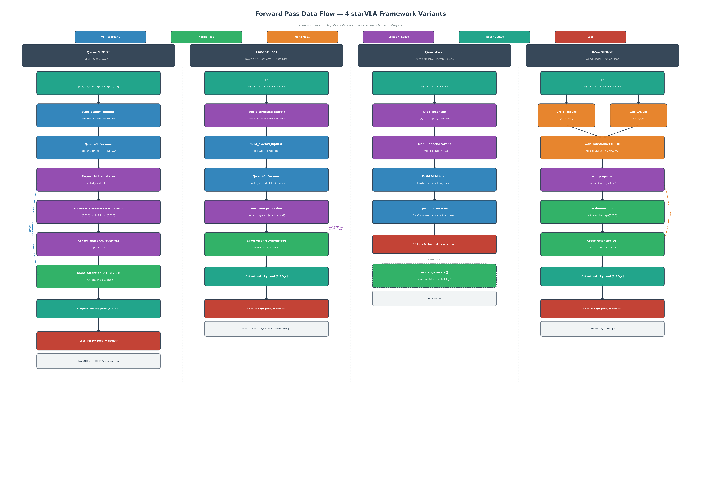

### 8.1 QwenGR00T：标准 VLM → 单层 DiT

**最清晰的数据流，也是理解其他框架的基础。**

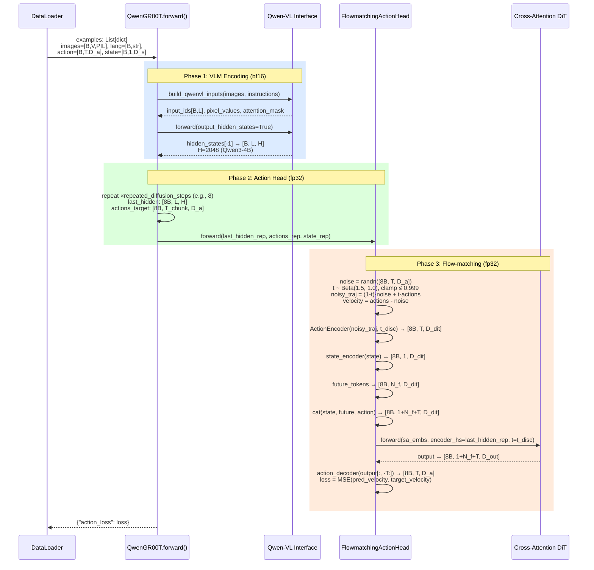
```mermaid
sequenceDiagram
    participant D as DataLoader
    participant F as QwenGR00T.forward()
    participant VLM as Qwen-VL Interface
    participant AH as FlowmatchingActionHead
    participant DiT as Cross-Attention DiT

    D->>F: examples: List[dict]<br>images=[B,V,PIL], lang=[B,str],<br>action=[B,T,D_a], state=[B,1,D_s]

    rect rgb(220, 235, 255)
        Note over F,VLM: Phase 1: VLM Encoding (bf16)
        F->>VLM: build_qwenvl_inputs(images, instructions)
        VLM-->>F: input_ids[B,L], pixel_values, attention_mask
        F->>VLM: forward(output_hidden_states=True)
        VLM-->>F: hidden_states[-1] → [B, L, H]<br>H=2048 (Qwen3-4B)
    end

    rect rgb(220, 255, 220)
        Note over F,AH: Phase 2: Action Head (fp32)
        F->>F: repeat ×repeated_diffusion_steps (e.g., 8)<br>last_hidden: [8B, L, H]<br>actions_target: [8B, T_chunk, D_a]
        F->>AH: forward(last_hidden_rep, actions_rep, state_rep)
    end

    rect rgb(255, 235, 220)
        Note over AH,DiT: Phase 3: Flow-matching (fp32)
        AH->>AH: noise = randn([8B, T, D_a])<br>t ~ Beta(1.5, 1.0), clamp ≤ 0.999<br>noisy_traj = (1-t)·noise + t·actions<br>velocity = actions - noise
        AH->>AH: ActionEncoder(noisy_traj, t_disc) → [8B, T, D_dit]
        AH->>AH: state_encoder(state) → [8B, 1, D_dit]
        AH->>AH: future_tokens → [8B, N_f, D_dit]
        AH->>AH: cat(state, future, action) → [8B, 1+N_f+T, D_dit]
        AH->>DiT: forward(sa_embs, encoder_hs=last_hidden_rep, t=t_disc)
        DiT-->>AH: output → [8B, 1+N_f+T, D_out]
        AH->>AH: action_decoder(output[:, -T:]) → [8B, T, D_a]<br>loss = MSE(pred_velocity, target_velocity)
    end

    F-->>D: {"action_loss": loss}
```

**关键维度传播**（以 Qwen3-VL-4B + DiT-B 为例）：

| 阶段 | 张量 | 形状 | 精度 |
|------|------|------|------|
| VLM 输入 | pixel_values | `[B, 3, H, W]` (变长) | bf16 |
| VLM 输入 | input_ids | `[B, L]` (~200-500 tokens) | int64 |
| VLM 输出 | hidden_states[-1] | `[B, L, 2048]` | bf16 |
| 重复后 | last_hidden_rep | `[8B, L, 2048]` | bf16→fp32 |
| ActionEncoder 输出 | action_features | `[8B, T, 768]` | fp32 |
| State Encoder 输出 | state_features | `[8B, 1, 768]` | fp32 |
| DiT 输入 (sa_embs) | hidden_states | `[8B, 1+32+T, 768]` | fp32 |
| DiT 输出 | pred_velocity | `[8B, T, D_a]` (e.g., 7) | fp32 |

### 8.2 QwenPI_v3：逐层交叉注意力 + 离散化状态

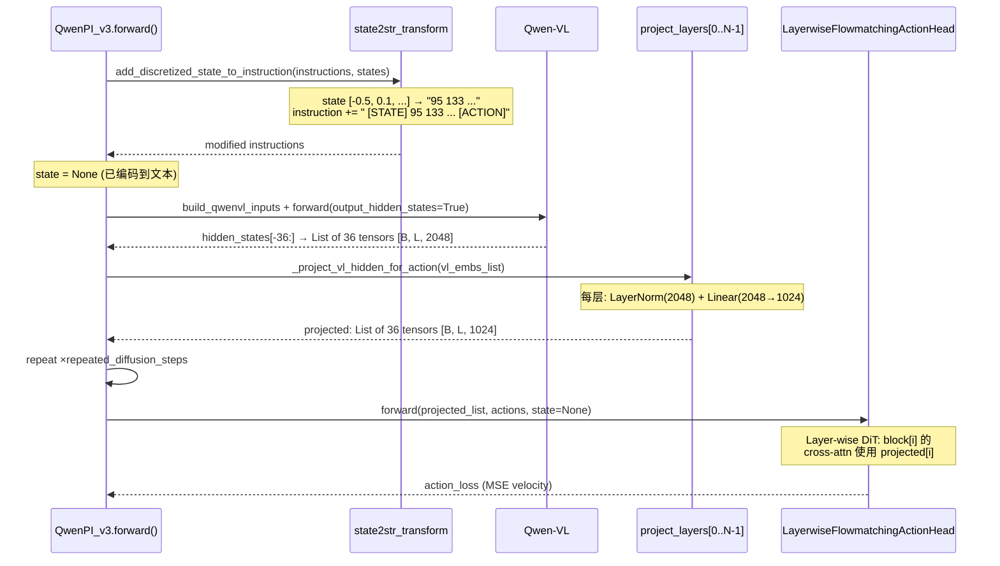
```mermaid
sequenceDiagram
    participant F as QwenPI_v3.forward()
    participant S as state2str_transform
    participant VLM as Qwen-VL
    participant PL as project_layers[0..N-1]
    participant AH as LayerwiseFlowmatchingActionHead

    F->>S: add_discretized_state_to_instruction(instructions, states)
    Note over S: state [-0.5, 0.1, ...] → "95 133 ..."<br>instruction += " [STATE] 95 133 ... [ACTION]"
    S-->>F: modified instructions
    Note over F: state = None (已编码到文本)

    F->>VLM: build_qwenvl_inputs + forward(output_hidden_states=True)
    VLM-->>F: hidden_states[-36:] → List of 36 tensors [B, L, 2048]

    F->>PL: _project_vl_hidden_for_action(vl_embs_list)
    Note over PL: 每层: LayerNorm(2048) + Linear(2048→1024)
    PL-->>F: projected: List of 36 tensors [B, L, 1024]

    F->>F: repeat ×repeated_diffusion_steps

    F->>AH: forward(projected_list, actions, state=None)
    Note over AH: Layer-wise DiT: block[i] 的<br>cross-attn 使用 projected[i]
    AH-->>F: action_loss (MSE velocity)
```

**与 QwenGR00T 的关键差异**：

1. **状态编码路径不同**：状态通过离散化注入文本，在 VLM 内部处理（而非外部 MLP）
2. **VLM 特征利用深度不同**：使用所有 36 层 hidden states（而非仅最后 1 层）
3. **投影层**：每层有独立的 `LayerNorm + Linear`（2048→1024），将 VLM 维度压缩
4. **DiT 层数**：= VLM 层数 × 2（因为每个 VLM 层对应一个 cross-attn block + 一个 self-attn block）

### 8.3 QwenFast：自回归离散 Token

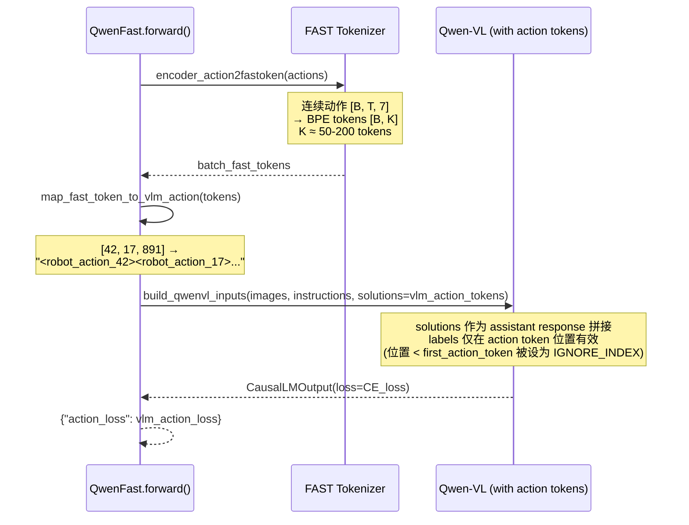
```mermaid
sequenceDiagram
    participant F as QwenFast.forward()
    participant FAST as FAST Tokenizer
    participant VLM as Qwen-VL (with action tokens)

    F->>FAST: encoder_action2fastoken(actions)
    Note over FAST: 连续动作 [B, T, 7]<br>→ BPE tokens [B, K]<br>K ≈ 50-200 tokens
    FAST-->>F: batch_fast_tokens

    F->>F: map_fast_token_to_vlm_action(tokens)
    Note over F: [42, 17, 891] →<br>"<robot_action_42><robot_action_17>..."

    F->>VLM: build_qwenvl_inputs(images, instructions, solutions=vlm_action_tokens)
    Note over VLM: solutions 作为 assistant response 拼接<br>labels 仅在 action token 位置有效<br>(位置 < first_action_token 被设为 IGNORE_INDEX)
    VLM-->>F: CausalLMOutput(loss=CE_loss)

    F-->>F: {"action_loss": vlm_action_loss}
```

**关键特点**：
- **无独立动作头**：完全复用 VLM 的 LM head
- **损失函数**：标准交叉熵（next-token prediction），仅在动作 token 位置计算
- **精度**：VLM 全程 bf16
- **推理**：需要自回归生成（`model.generate()`），比 flow-matching 慢得多

### 8.4 WanGR00T：世界模型 → 动作头

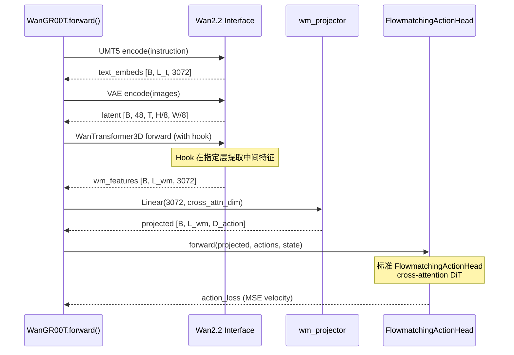
```mermaid
sequenceDiagram
    participant F as WanGR00T.forward()
    participant WM as Wan2.2 Interface
    participant PROJ as wm_projector
    participant AH as FlowmatchingActionHead

    F->>WM: UMT5 encode(instruction)
    WM-->>F: text_embeds [B, L_t, 3072]

    F->>WM: VAE encode(images)
    WM-->>F: latent [B, 48, T, H/8, W/8]

    F->>WM: WanTransformer3D forward (with hook)
    Note over WM: Hook 在指定层提取中间特征
    WM-->>F: wm_features [B, L_wm, 3072]

    F->>PROJ: Linear(3072, cross_attn_dim)
    PROJ-->>F: projected [B, L_wm, D_action]

    F->>AH: forward(projected, actions, state)
    Note over AH: 标准 FlowmatchingActionHead<br>cross-attention DiT
    AH-->>F: action_loss (MSE velocity)
```

**独特之处**：
- 文本条件化通过世界模型的 UMT5 处理（而非 VLM）
- 视觉特征来自 VAE 潜变量 + DiT 中间层（而非 ViT patch 特征）
- 维度较大（3072），需要投影层对齐

---

## 第 9 章：反向传播与梯度流分析

### 9.1 冻结/可训练配置

starVLA 使用 `freeze_backbones()` 和 `build_param_lr_groups()` 两个函数协同管理参数训练策略。

#### freeze_backbones()

通过 YAML 配置字段 `trainer.freeze_modules` 指定需要冻结的模块路径（[trainer_tools.py:192-234](starVLA/training/trainer_utils/trainer_tools.py#L192-L234)）：

```yaml
# 典型配置：冻结 VLM，只训练动作头和投影层
trainer:
  freeze_modules: "qwen_vl_interface"
```

```python
@staticmethod
def freeze_backbones(model, freeze_modules=""):
    patterns = [p.strip() for p in freeze_modules.split(",")]
    for path in patterns:
        module = model
        for attr in path.split("."):
            module = getattr(module, attr)
        for param in module.parameters():
            param.requires_grad = False
```

#### build_param_lr_groups()

支持不同模块使用不同学习率（[trainer_tools.py:92-148](starVLA/training/trainer_utils/trainer_tools.py#L92-L148)）：

```yaml
# 典型配置：VLM 低学习率微调，动作头高学习率训练
trainer:
  learning_rate:
    base: 1e-4                    # 默认（未指定的模块）
    qwen_vl_interface: 2e-5       # VLM 低学习率
    action_model: 5e-4            # 动作头高学习率
    project_layers: 3e-4          # 投影层中等学习率
```

```python
def build_param_lr_groups(model, cfg):
    lr_cfg = cfg.trainer.learning_rate
    base_lr = lr_cfg.get("base", 1e-4)

    for module_name, lr in lr_cfg.items():
        if module_name == "base": continue
        module = resolve_module(model, module_name)
        params = [p for p in module.parameters() if id(p) not in frozen_params]
        param_groups.append({"params": params, "lr": lr, "name": module_name})

    other_params = [p for p in model.parameters()
                    if id(p) not in used_params and id(p) not in frozen_params]
    param_groups.append({"params": other_params, "lr": base_lr, "name": "base"})
```

### 9.2 各框架的梯度流分析

#### QwenGR00T 梯度流

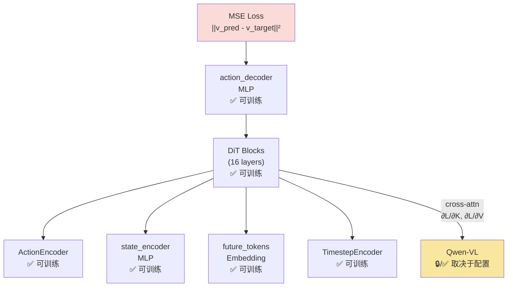
```mermaid
graph TB
    LOSS["MSE Loss<br>||v_pred - v_target||²"] --> AD["action_decoder<br>MLP<br>✅ 可训练"]
    AD --> DiT["DiT Blocks<br>(16 layers)<br>✅ 可训练"]
    DiT --> AE["ActionEncoder<br>✅ 可训练"]
    DiT --> SE["state_encoder<br>MLP<br>✅ 可训练"]
    DiT --> FT["future_tokens<br>Embedding<br>✅ 可训练"]
    DiT --> TE["TimestepEncoder<br>✅ 可训练"]

    DiT -->|"cross-attn<br>∂L/∂K, ∂L/∂V"| VLM["Qwen-VL<br>🔒/✅ 取决于配置"]

    style VLM fill:#f9e79f
    style LOSS fill:#fadbd8
```

**两种典型训练策略**：

1. **冻结 VLM**（`freeze_modules: "qwen_vl_interface"`）：
   - 梯度流在 DiT 的 cross-attention 处截断
   - 仅训练 `action_model`（DiT + MLP）
   - 参数效率高，适合小数据集

2. **端到端微调**（`freeze_modules: ""`）：
   - 梯度从 DiT 通过 cross-attention 的 K/V 投影反向传播到 VLM
   - VLM 使用低学习率（如 2e-5），动作头使用高学习率（如 5e-4）
   - 更好的性能，但需要更多计算和数据

#### QwenPI_v3 梯度流

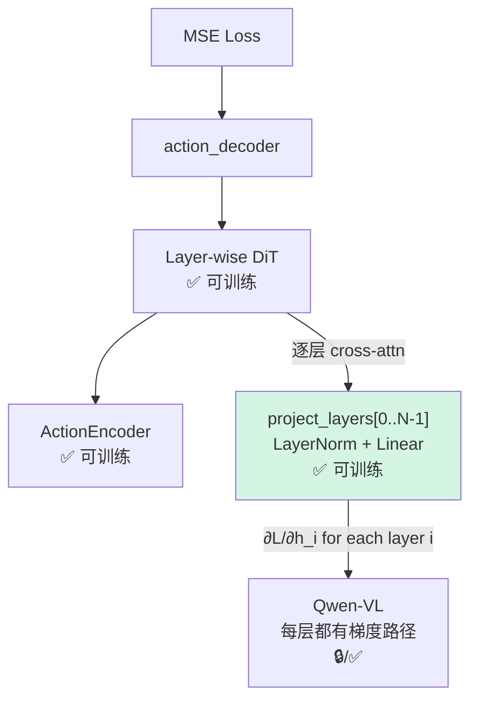
```mermaid
graph TB
    LOSS["MSE Loss"] --> AD["action_decoder"]
    AD --> DiT["Layer-wise DiT<br>✅ 可训练"]
    DiT --> AE["ActionEncoder<br>✅ 可训练"]

    DiT -->|"逐层 cross-attn"| PL["project_layers[0..N-1]<br>LayerNorm + Linear<br>✅ 可训练"]
    PL -->|"∂L/∂h_i for each layer i"| VLM["Qwen-VL<br>每层都有梯度路径<br>🔒/✅"]

    style PL fill:#d5f5e3
```

**投影层的梯度作用**：每个 `project_layers[i]` 的梯度信号会独立传递到 VLM 的第 $i$ 层。这意味着 VLM 的每一层都接收到与其抽象级别相匹配的动作预测梯度——底层接收空间特征相关的梯度，顶层接收语义理解相关的梯度。

#### QwenFast 梯度流

```mermaid
graph TB
    LOSS["CE Loss<br>(action tokens only)"] --> LM["LM Head<br>embed → vocab logits<br>✅ (共享参数)"]
    LM --> VLM["Qwen-VL 全部层<br>✅ 可训练"]

    style LOSS fill:#fadbd8
```

QwenFast 的梯度最为简洁：标准 language modeling 梯度直接从 LM head 流向所有 VLM 参数。**无独立动作模块**，所有参数在统一的 CE loss 下更新。

### 9.3 损失函数总结

| 框架类型 | 损失函数 | 数学表达 | 作用域 |
|----------|----------|----------|--------|
| Flow-matching (GR00T/PI) | MSE velocity | $\|v_\theta(x_t, t) - (x_1 - \epsilon)\|^2$ | 动作头 |
| MLP L1 (OFT) | L1 regression | $\|\hat{a} - a\|_1$ | MLP 头 |
| FAST (autoregressive) | Cross-Entropy | $-\sum_k \log p(a_k \| a_{<k})$ | VLM LM head |
| LangForce | Action + LLR | $\mathcal{L}_\text{action} + \lambda \mathcal{L}_\text{LLR}$ | 双分支 |
| Co-training VLM | VLM CE | $-\sum_t \log p(w_t \| w_{<t})$ | VLM LM head |

**Co-training 损失组合**（通过 `compute_loss()` 路由，[base_framework.py:145-181](starVLA/model/framework/base_framework.py#L145-L181)）：

```python
def compute_loss(self, tag, batch, loss_scale=None):
    scale = (loss_scale or {}).get(tag, 1.0)
    if tag == "vla":
        out = self.forward(batch)        # → {"action_loss": ...}
    elif tag == "vlm":
        out = self.forward_vlm(batch)    # → {"vlm_loss": ...}
    return {k: v * scale for k, v in out.items() if isinstance(v, torch.Tensor)}
```

### 9.4 精度混合策略

starVLA 在前向和反向传播中使用精度混合（mixed precision）：

| 阶段 | 精度 | 原因 |
|------|------|------|
| VLM 前向 | `torch.autocast("cuda", dtype=torch.bfloat16)` | 节省显存，VLM 参数量大 |
| 动作头前向 | `torch.autocast("cuda", dtype=torch.float32)` | 动作预测需要高精度 |
| VLM 反向 | bf16 梯度（DeepSpeed ZeRO 管理） | 自动混合精度 |
| 动作头反向 | fp32 梯度 | 避免梯度下溢 |

代码中的精度切换点：

```python
# QwenGR00T.py:182-193 — 两个 autocast 上下文
with torch.autocast("cuda", dtype=torch.bfloat16):    # VLM 编码
    qwenvl_outputs = self.qwen_vl_interface(**qwen_inputs, output_hidden_states=True)
    last_hidden = qwenvl_outputs.hidden_states[-1]

with torch.autocast("cuda", dtype=torch.float32):     # 动作头
    action_loss = self.action_model(last_hidden_repeated, actions_target_repeated, state_repeated)
```

---

## 第 10 章：纵向分析——VLA 融合技术演进

### 10.1 VLA 发展时间线

```
2022                    2023                    2024                    2025                    2026
  │                       │                       │                       │                       │
  │                    RT-2                    Octo                   π₀.5                  starVLA
  │                  (Google)               (Berkeley)               (PhyIntel)            (社区)
  │                    │                       │                       │                       │
  │               "VLM→Action"          "Transformer                "Flow-matching         "可组合
  │              自回归token           Policy"                    + Gemma Expert"       VLA 平台"
  │              预测动作              多任务扩散                  逐层交叉注意力         12种融合
  │                    │                       │                       │                  5种骨干
  │                    │                    OpenVLA                 GR00T N1             18+框架
  │                    │                  (TRI/Stanford)            (NVIDIA)                │
  │                    │                   "VLM+L1"               "VLM+DiT"                │
  │                    │                    回归头                 Flow-matching             │
  │                    │                       │                       │                       │
  ├──────────────────────────────────────────────────────────────────────────────────────────┤
       语义理解驱动           多模态策略学习          精细动作生成           平台化/组件化
```

### 10.2 四代融合技术演进

#### 第一代：VLM 自回归预测（2023）

**代表**: RT-2, RT-2-X

**核心思想**: 将动作离散化为 token，复用 VLM 的 next-token prediction 能力。

**starVLA 对应**: QwenFast（机制 6.6）

**优势**: 简单、统一、可利用 VLM 预训练
**劣势**: 离散化精度损失、推理速度慢（自回归生成）

#### 第二代：VLM + 独立回归头（2024 上半年）

**代表**: OpenVLA, OpenVLA-OFT, Octo

**核心思想**: VLM 提供特征，独立的 MLP/Transformer 头回归连续动作。

**starVLA 对应**: QwenOFT（机制 6.5）, QwenAdapter（机制 6.12）

**优势**: 保持连续精度、推理快
**劣势**: VLM 特征利用不够深入（仅用最后一层）

#### 第三代：VLM + Flow-matching DiT（2024 下半年）

**代表**: π₀ (Physical Intelligence), GR00T N1 (NVIDIA)

**核心思想**: 使用基于 DiT 的 flow-matching 动作头，通过交叉注意力条件化于 VLM 特征。

**starVLA 对应**: QwenGR00T（机制 6.2）, PI0（机制 6.7）

**优势**: 表达力强的连续动作分布、多步去噪精化
**劣势**: 推理需多步迭代

#### 第四代：逐层融合 + 统一状态编码（2025）

**代表**: π₀.5 (Physical Intelligence), GR00T N1.5 (NVIDIA)

**核心思想**: 利用 VLM 所有层的 hidden states，将状态离散化注入文本，实现更深层的模态融合。

**starVLA 对应**: QwenPI_v3（机制 6.3 + 6.10）, PI05（机制 6.7 + 6.10）

**优势**: 多层次信息利用、零参数状态编码
**劣势**: 参数量大（每层投影层）、离散化状态有精度损失

### 10.3 starVLA 的独特贡献

starVLA 并非实现某一种 VLA，而是**将所有四代技术统一到一个可组合平台**中。用户可以：

1. **复现**：实现 RT-2 风格（QwenFast）、OpenVLA 风格（QwenOFT）、GR00T 风格（QwenGR00T）、π₀ 风格（PI0/PI05）
2. **组合**：将 Qwen-VL 与 GR00T 动作头组合（QwenGR00T）、将世界模型与 flow-matching 组合（WanGR00T）
3. **扩展**：添加新的 VLM 骨干（Gemma4、MiniCPM）或新的动作头

### 10.4 业界前沿对比

| 方案 | 发布时间 | VLM | 动作头 | 融合 | 特点 |
|------|----------|-----|--------|------|------|
| RT-2 | 2023.07 | PaLM-E | Token 预测 | 自回归 | 首个大规模 VLA |
| OpenVLA | 2024.06 | Prismatic-7B | MLP L1 | Token 拼接 | 首个开源 VLA |
| π₀ | 2024.10 | PaliGemma | Flow-matching | 交错专家 | SOTA 实际操作 |
| GR00T N1 | 2024.10 | Eagle-2 | Flow-matching DiT | 交叉注意力 | 多机器人泛化 |
| π₀.5 | 2025.02 | PaliGemma | Flow-matching | 逐层+离散状态 | 零样本泛化 |
| GR00T N1.5 | 2025.05 | Eagle-2 | Flow-matching DiT | 逐层 | 工业级部署 |
| FLOWER | 2025 | Qwen-VL | Flow-matching | 逐层+QFormer | 统一VLM+WM |
| **starVLA** | 2025-2026 | 多种可选 | 多种可选 | **12 种可选** | **可组合平台** |

---

## 第 11 章：横向分析——starVLA 内部框架对比

### 11.1 框架总对比表

| 框架 | VLM 骨干 | 动作头 | 融合机制 | 状态编码 | 参数量级 |
|------|----------|--------|----------|----------|----------|
| **QwenGR00T** | Qwen-VL | FlowmatchingActionHead | 单层→DiT | MLP | ~5B |
| **QwenPI_v3** | Qwen-VL | LayerwiseFM | 逐层→DiT | 离散化文本 | ~5B |
| **QwenFast** | Qwen-VL (Action) | FAST tokenizer | 自回归 token | 无 | ~4.4B |
| **QwenOFT** | Qwen-VL (Action) | MLP L1 | 序列内回归 | 离散化文本(可选) | ~4.5B |
| **QwenDual** | Qwen-VL + DINOv2 | FlowmatchingActionHead | 双编码器→DiT | MLP | ~5.5B |
| **QwenAdapter** | Qwen-VL | VLA-Adapter | Hook 注入 | ProprioProjector | ~4.8B |
| **M1** | Qwen-VL + DINOv2 | DiT | QFormer 聚合 | MLP | ~6B |
| **PI0** | PaliGemma | OpenPI0ActionHead | 交错专家 | 离散化文本 | ~3B |
| **PI05** | PaliGemma | OpenPI05ActionHead | 交错专家+adaRMS | 离散化文本 | ~3B |
| **LangForce** | Qwen-VL | Flow-matching | 双分支分解 | MLP | ~8B |
| **WanGR00T** | Wan2.2 WM | FlowmatchingActionHead | WM→DiT | MLP | ~15B+ |
| **WanPI** | Wan2.2 WM | LayerwiseFM | WM 逐层→DiT | MLP | ~15B+ |
| **CosmoPredict2GR00T** | CosmoPredict2 WM | FlowmatchingActionHead | WM→DiT | MLP | ~10B+ |
| **MiniCPMGR00T** | MiniCPM-V | FlowmatchingActionHead | 单层→DiT | MLP | ~4B |
| **Gemma4GR00T** | Gemma4 | FlowmatchingActionHead | 单层→DiT | MLP | ~5B |
| **QwenDiscreteDiffusion** | Qwen-VL | MaskGIT Discrete | 逐层→DD | MLP | ~5B |

### 11.2 参数分布分析

以 QwenPI_v3（Qwen3-VL-4B + DiT hidden=1024）为参考：

```
┌─────────────────────────────────────────────────────────┐
│                    QwenPI_v3 参数分布                      │
│                                                           │
│  ████████████████████████████████████░░░░░  87.5%  VLM    │
│  █████░░░░░░░░░░░░░░░░░░░░░░░░░░░░░░░░░░  10.6%  动作头  │
│  █░░░░░░░░░░░░░░░░░░░░░░░░░░░░░░░░░░░░░░   1.9%  投影层  │
└─────────────────────────────────────────────────────────┘
```

**跨框架参数分布对比**：

| 框架 | VLM % | 动作头 % | 其他 % |
|------|-------|---------|--------|
| QwenGR00T | ~92% | ~8% | <1% |
| QwenPI_v3 | ~87.5% | ~10.6% | ~1.9% (投影层) |
| QwenFast | ~100% | 0% (共享) | <1% (tokenizer) |
| QwenOFT | ~98% | ~2% (MLP) | 0% |
| PI0 | ~60% (VLM) | ~40% (Expert) | <1% |

**洞察**：
- **VLM 主导**：在大多数框架中，VLM 骨干占总参数的 85-100%
- **PI0 例外**：PI0/PI05 的 action expert 规模与 VLM 相当（~40%），因为它是一个完整的 Gemma 变体
- **QwenFast 极端**：完全不引入额外参数（动作预测复用 VLM 的 LM head）

### 11.3 融合机制维度分析

从不同维度对 12 种融合机制进行雷达图式对比：

| 维度 | Token拼接 | 单层DiT | 逐层DiT | 交错专家 | 自回归 | MLP回归 |
|------|----------|---------|---------|---------|--------|---------|
| 信息利用深度 | ★★★★★ | ★★☆☆☆ | ★★★★★ | ★★★★★ | ★★★★★ | ★★☆☆☆ |
| 额外参数开销 | ★★★★★ | ★★★☆☆ | ★★☆☆☆ | ★☆☆☆☆ | ★★★★★ | ★★★★☆ |
| 推理速度 | ★★★★★ | ★★★☆☆ | ★★★☆☆ | ★★☆☆☆ | ★☆☆☆☆ | ★★★★★ |
| 动作精度 | N/A | ★★★★☆ | ★★★★★ | ★★★★★ | ★★★☆☆ | ★★★☆☆ |
| 实现复杂度 | ★★★★★ | ★★★★☆ | ★★★☆☆ | ★★☆☆☆ | ★★★★☆ | ★★★★★ |

（★ 越多越好，信息利用深度=利用多少层VLM信息；额外参数开销=引入的额外参数越少越好）

### 11.4 设计取舍空间

```mermaid
graph LR
    subgraph "速度优先"
        OFT["QwenOFT<br>单步推理"]
        FAST["QwenFast*<br>*推理慢但简单"]
    end

    subgraph "精度优先"
        PI["QwenPI_v3<br>逐层融合"]
        PI0["PI0/PI05<br>交错专家"]
    end

    subgraph "泛化优先"
        GR["QwenGR00T<br>标准架构"]
        WM["WanGR00T<br>世界模型"]
    end

    subgraph "研究优先"
        LF["LangForce<br>理论驱动"]
        M1["M1<br>多编码器"]
        AD["QwenAdapter<br>轻量适配"]
    end
```

**选择建议**：

- **快速原型验证** → QwenOFT（最快推理，最少参数）
- **最高操作精度** → QwenPI_v3 或 PI05（逐层融合 + flow-matching）
- **多机器人泛化** → QwenGR00T（标准架构，multi-embodiment 支持）
- **利用物理先验** → WanGR00T / CosmoPredict2GR00T（世界模型特征）
- **学术探索** → LangForce（贝叶斯分解）、M1（QFormer 聚合）

---

## 第 12 章：结论与未来方向

### 12.1 关键发现总结

1. **模态覆盖**：starVLA 支持 4 种输入模态（视觉/语言/状态/动作），所有视觉均为 RGB，不支持深度/触觉/点云/音频

2. **融合机制多样性**：12 种融合机制覆盖了从最简单的 token 拼接到最复杂的交错专家注意力的完整谱系

3. **设计趋势**：
   - **从单层到逐层**：VLM hidden state 的利用从仅最后一层（GR00T N1）到所有层（π₀.5/PI_v3）
   - **从外部到内部**：状态编码从外部 MLP 到直接嵌入 VLM 文本（离散化）
   - **从分离到统一**：动作头从独立模块到与 VLM 共享参数（FAST/交错专家）

4. **Flow-matching 主导**：在 18 个框架中，14 个使用 flow-matching 变体作为动作生成方式

5. **条件化机制收敛**：AdaLayerNorm 是事实标准（14 框架使用），adaRMS 仅在 PI05 中出现

### 12.2 未来方向

#### 统一多模态 Token 化

当前 starVLA 的视觉/语言/状态使用不同的 tokenizer 和嵌入空间。一个自然的演进方向是**统一 tokenizer**——将所有模态映射到同一个离散 token 空间，使 VLA 成为一个真正的 sequence-to-sequence 模型。

#### 层次化时序融合

当前所有框架仅处理单帧或少数帧的观察。融入**时序建模**（如 video transformer 的时间注意力）可以捕捉动态信息，这对接触-rich 操作和长 horizon 规划至关重要。

#### 触觉/力觉模态

starVLA 目前不支持触觉/力觉传感器数据。对于精细操作（如装配、线缆操作），力反馈信息是不可或缺的。将力/触觉模态作为新的状态维度或独立编码器是一个重要的扩展方向。

#### 世界模型深度融合

当前 WM4A 家族仅通过 hook 提取中间特征，融合方式较为粗糙。更深层的融合可以包括：
- 在世界模型 DiT 内部注入动作条件化
- 世界模型的视频预测 loss 作为辅助训练信号
- 世界模型生成的"想象"帧作为额外视觉输入

#### VLA 缩放定律

starVLA 的模块化设计使其成为研究 VLA 缩放定律的理想平台：
- VLM 大小 vs 动作精度
- DiT 深度/宽度 vs 任务复杂度
- 训练数据多样性 vs 泛化能力

---

## 参考文件索引

| 文件路径 | 职责 |
|----------|------|
| [base_framework.py](starVLA/model/framework/base_framework.py) | 基类定义、框架注册、`build_framework()` |
| [QwenGR00T.py](starVLA/model/framework/VLM4A/QwenGR00T.py) | Qwen-VL + Flow-matching DiT |
| [QwenPI_v3.py](starVLA/model/framework/VLM4A/QwenPI_v3.py) | 逐层交叉注意力 + 离散化状态 |
| [QwenFast.py](starVLA/model/framework/VLM4A/QwenFast.py) | FAST 自回归离散 token |
| [QwenOFT.py](starVLA/model/framework/VLM4A/QwenOFT.py) | MLP L1 回归 + 动作 token 注入 |
| [PI0.py](starVLA/model/framework/VLM4A/PI0.py) | PaliGemma + Gemma 交错专家 |
| [M1.py](starVLA/model/framework/VLM4A/M1.py) | Qwen-VL + DINOv2 + QFormer |
| [LangForce.py](starVLA/model/framework/VLM4A/LangForce.py) | 双分支贝叶斯分解 |
| [QwenAdapter.py](starVLA/model/framework/VLM4A/QwenAdapter.py) | VLA-Adapter + ProprioProjector |
| [WanGR00T.py](starVLA/model/framework/WM4A/WanGR00T.py) | Wan2.2 世界模型 + 动作头 |
| [GR00T_ActionHeader.py](starVLA/model/modules/action_model/GR00T_ActionHeader.py) | FlowmatchingActionHead |
| [LayerwiseFM_ActionHeader.py](starVLA/model/modules/action_model/LayerwiseFM_ActionHeader.py) | LayerwiseFlowmatchingActionHead |
| [cross_attention_dit.py](starVLA/model/modules/action_model/flow_matching_head/cross_attention_dit.py) | DiT + AdaLayerNorm + BasicTransformerBlock |
| [QWen3.py](starVLA/model/modules/vlm/QWen3.py) | Qwen3-VL 接口包装 |
| [dino.py](starVLA/model/modules/dino_model/dino.py) | DINOv2 视觉骨干 |
| [trainer_tools.py](starVLA/training/trainer_utils/trainer_tools.py) | freeze_backbones, build_param_lr_groups |
| [train_starvla.py](starVLA/training/train_starvla.py) | VLA 训练入口 |

