# starVLA 多模态输入、融合机制与基准表现深度分析

> **一句话结论**：starVLA 通过 4 种输入模态（视觉 / 语言 / 本体感知状态 / 动作）、多类感知骨干和 12 种可组合融合机制覆盖了主流 VLA 动作接口；截至 **2026-07-16** 的公开结果表明，没有脱离 backbone、数据和评测协议而普遍最优的动作头。

---

## 总览表

| 维度 | 内容 |
|------|------|
| **输入模态** | 视觉（多视角 RGB）、语言（指令文本）、本体感知状态（关节/EEF）、动作（训练标签） |
| **视觉骨干** | Qwen-VL ViT、PaliGemma SigLIP、DINOv2、CosmoPredict2 VAE+T5、Wan2.2 VAE+UMT5 |
| **融合机制** | 12 种（详见第 6 章） |
| **动作头** | Flow-matching DiT、Layer-wise FM、MLP L1、FAST 自回归、OpenPI Gemma、MaskGIT 离散扩散、VLA-Adapter 等 |
| **框架数量** | 当前源码含 27 个 registry 名（包含 `QwenFM`、`Pi0/Pi05` 大小写等兼容别名），分属 VLM4A 与 WM4A |
| **证据截止日** | 2026-07-16（动态 leaderboard 需按引用日期重新核对） |

---

## 目录

- [第 0 章：导读与总览](#第-0-章导读与总览)
- [第 1 章：输入模态分类学](#第-1-章输入模态分类学)
- [第 2 章：视觉模态处理](#第-2-章视觉模态处理)
- [第 3 章：语言/文本处理管线](#第-3-章语言文本处理管线)
- [第 4 章：本体感知状态编码](#第-4-章本体感知状态编码)
- [第 5 章：动作模态编码](#第-5-章动作模态编码)
- [第 6 章：多模态融合机制——核心分析与基准证据](#第-6-章多模态融合机制核心分析与基准证据)
- [第 7 章：动作头条件化机制](#第-7-章动作头条件化机制)
- [第 8 章：前向传播数据流分析](#第-8-章前向传播数据流分析)
- [第 9 章：反向传播与梯度流分析](#第-9-章反向传播与梯度流分析)
- [第 10 章：纵向分析——VLA 融合技术演进](#第-10-章纵向分析vla-融合技术演进)
- [第 11 章：横向分析——starVLA 内部框架对比](#第-11-章横向分析starvla-内部框架对比)
- [第 12 章：结论与未来方向](#第-12-章结论与未来方向)

---

## 第 0 章：导读与总览

### 0.1 分析范围

本文对 starVLA 代码库进行深度的多模态输入与融合机制分析，涵盖：

1. **静态架构**：组件图、类层级、模块职责与依赖关系
2. **动态架构**：前向/反向传播数据流、张量形状变换、梯度流向
3. **纵向分析**：VLA 融合技术从 RT-2 到 π₀.5 / GR00T N1.5 的演进史，以及 starVLA 在其中的定位
4. **横向分析**：starVLA 内部 18+ 框架变体的对比，以及与业界同期方案的比较

### 0.2 系统定位

starVLA 不是单一模型，而是一个**可组合的 VLA 研究平台**。其核心设计哲学是：

```
框架 = VLM 骨干 × 动作头 × 融合机制 × 数据管线
```

通过 `@FRAMEWORK_REGISTRY.register("Name")` 注册模式（[base_framework.py:51](../../starVLA/model/framework/base_framework.py#L51)），用户可以自由组合不同的 VLM 骨干、动作头和融合方式，形成新的框架变体。

### 0.3 架构总览

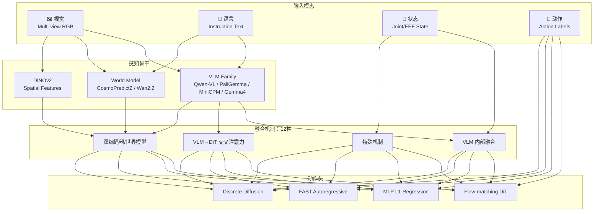

---

## 第 1 章：输入模态分类学

> **关键发现**：starVLA 当前支持 4 种输入模态，但不支持深度图、点云、触觉或音频。所有视觉输入均为 RGB 图像。


### 1.1 四种输入模态总览

| 模态 | 数据形式 | 维度范围 | 数据来源 | 管线入口 |
|------|----------|----------|----------|----------|
| **视觉** | Multi-view RGB Images | `[B, V, 3, H, W]`，V∈[1,8] | `video.exterior_image_*`, `video.wrist_image` | `_pack_sample()` |
| **语言** | Instruction Text | `[B, str]` | `language.instruction` | `build_qwenvl_inputs()` |
| **状态** | Joint/EEF Vector | `[B, 1, D_s]`，D_s∈[7,42] | `state.eef_position/rotation/gripper` | Framework `forward()` |
| **动作** | Target Action Chunk | `[B, T, D_a]`，T∈[1,100], D_a∈[7,32] | `action.*` | Framework `forward()` |

### 1.2 数据管线架构

数据从原始数据集经过多层处理最终到达框架的 `forward()` 方法：

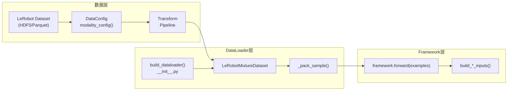

`build_dataloader()` 函数（[__init__.py](../../starVLA/dataloader/__init__.py)）根据配置分发到 `lerobot_datasets` 或 `vlm_datasets`。对于 VLA 训练，核心数据集类是 `LeRobotMixtureDataset`，它根据 `DATASET_NAMED_MIXTURES` 混合多个数据集。

### 1.3 模态配置系统

每种机器人类型通过 `BaseDataConfig` 子类定义其模态配置。以 OXE Droid 数据集为例：

```python
# starVLA/dataloader/gr00t_lerobot/data_config.py
class OxeDroidDataConfig(BaseDataConfig):
    video_keys = [
        "video.exterior_image_1",    # 外部摄像头 1
        "video.exterior_image_2",    # 外部摄像头 2
        "video.wrist_image",         # 手腕摄像头
    ]
    state_keys = [
        "state.eef_position",        # 末端执行器位置 (3D)
        "state.eef_rotation",        # 末端执行器旋转 (quaternion/euler)
        "state.gripper_position",    # 夹爪开合度
    ]
    action_keys = [...]              # 对应的动作维度
    language_keys = ["language.instruction"]
```

`modality_config()` 方法将这些键映射为 `ModalityConfig` 结构：

```python
ModalityConfig = {
    "video": {"keys": [...], "transforms": [Resize, Normalize]},
    "state": {"keys": [...], "metadata": LeRobotStateActionMetadata},
    "action": {"keys": [...], "metadata": LeRobotStateActionMetadata},
    "language": {"keys": ["language.instruction"]},
}
```

`LeRobotStateActionMetadata`（[schema.py](../../starVLA/dataloader/gr00t_lerobot/schema.py)）定义了每个状态/动作维度的起止索引、旋转类型、是否绝对值、数据类型和范围。

### 1.4 Collate 与 Batch 格式

`collate_fn` 将单样本字典列表打包为批次。每个样本到达 `framework.forward()` 时的格式为：

```python
example = {
    "image": [PIL.Image, PIL.Image, ...],  # List[PIL.Image], 长度 = 视角数
    "lang": "pick up the red cube",         # str, 自然语言指令
    "action": np.ndarray,                   # shape [T, action_dim]
    "state": np.ndarray,                    # shape [1, state_dim], optional
}
```

**重要**：这是一个**模型无关**的接口。无论框架采用何种融合策略，输入格式保持一致——多模态融合的差异完全体现在框架内部的处理逻辑中。

---

## 第 2 章：视觉模态处理

starVLA 中的视觉处理涵盖 5 种不同的感知骨干，可分为三大类：VLM 内置视觉编码器、自监督视觉特征提取器、和世界模型 VAE 编码器。


### 2.1 VLM 内置 ViT（Qwen-VL 系列）

Qwen-VL 是 starVLA 中使用最广泛的视觉骨干，被 14+ 框架变体直接使用。

#### 架构细节

Qwen-VL 采用 **NaViT**（Native Resolution ViT）架构，支持任意分辨率的图像输入：

- **Patch Size**: 14×14
- **Hidden Dimension**: 1536（Qwen2.5-VL-3B）/ 3584（Qwen2.5-VL-7B）/ 2048（Qwen3-VL-4B）
- **位置编码**: M-RoPE（Multimodal Rotary Position Embedding），统一处理文本位置和 2D 图像位置
- **视觉 Token 压缩**: 内置的 spatial merge 机制将视觉 token 数量压缩至可控范围

#### 处理流程

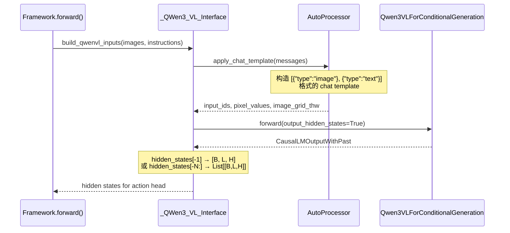

关键代码路径（[QWen3.py:114-171](../../starVLA/model/modules/vlm/QWen3.py#L114-L171)）：

```python
def build_qwenvl_inputs(self, images, instructions, solutions=None):
    messages = []
    for imgs, instruction in zip(images, instructions):
        content = [{"type": "image", "image": img} for img in imgs]
        # CoT_prompt 模板包装
        if "CoT_prompt" in self.config.datasets.vla_data:
            prompt = CoT_prompt.replace("{instruction}", instruction)
        else:
            prompt = instruction
        content.append({"type": "text", "text": prompt})
        msg = [{"role": "user", "content": content}]
        messages.append(msg)
    # 统一 tokenize + padding
    batch_inputs = self.processor.apply_chat_template(
        messages, tokenize=True, padding=True,
        add_generation_prompt=True, return_dict=True, return_tensors="pt"
    )
    return batch_inputs.to(self.model.device)
```

#### 多视角支持

多视角 RGB 图像以**多个 `{"type":"image"}` 条目**的形式注入到 chat template 中。Qwen-VL 的 `AutoProcessor` 会自动为每张图像分配独立的视觉 token 序列，并用特殊 token `<image>`（ID `151655`）和 `<video>`（ID `151656`）标记边界。

### 2.2 PaliGemma SigLIP 视觉塔

PaliGemma 是 PI0/PI05 框架使用的视觉骨干，采用 SigLIP（Sigmoid Loss for Language-Image Pre-training）视觉编码器：

- **架构**: `SiglipVisionModel`（ViT-So400m/14）
- **Patch Size**: 14×14
- **Hidden Dimension**: 1152
- **特点**: 图像 token 直接线性映射到 Gemma 嵌入空间，无需额外适配器

处理流程通过 `OpenPIPaliGemma` 类（[OpenPIPaliGemma.py](../../starVLA/model/modules/vlm/OpenPIPaliGemma.py)）实现：

```python
# 图像预处理
image = resize_with_pad(image, target_size=(224, 224))
# SigLIP 编码
vision_outputs = self.vision_model(pixel_values)  # [B, N_patches, 1152]
# 线性映射到 Gemma 空间
image_features = self.multi_modal_projector(vision_outputs)  # [B, N_patches, 2048]
```

与 Qwen-VL 的差异：
- SigLIP 使用固定分辨率（224×224），而 Qwen-VL 支持任意分辨率
- SigLIP 的对比学习预训练使其视觉表示更具语义对齐性
- PaliGemma 将图像作为 "soft prefix" 注入 Gemma 序列的前端

### 2.3 DINOv2 空间特征提取

DINOv2 在 starVLA 中作为**补充**视觉编码器使用，提供细粒度的空间特征：

```python
# starVLA/model/modules/dino_model/dino.py
class DINOv2BackBone:
    DINO_MODELS = {
        "dinov2_vits14": 384,   # ViT-Small
        "dinov2_vitb14": 768,   # ViT-Base
        "dinov2_vitl14": 1024,  # ViT-Large
        "dinov2_vitg14": 1408,  # ViT-Giant
    }

    def __init__(self, model_name="dinov2_vits14"):
        self.model = torch.hub.load("facebookresearch/dinov2", model_name)
        self.transform = transforms.Compose([
            transforms.Resize(224),
            transforms.ToTensor(),
            transforms.Normalize(mean=IMAGENET_MEAN, std=IMAGENET_STD),
        ])
```

**使用场景**：
- **InternVLA-M1**：DINOv2 特征与 VLM 逐层特征拼接后通过 QFormer 聚合
- **QwenDual**：DINOv2 与 Qwen-VL 的双编码器拼接

DINOv2 的核心优势在于其自监督预训练获得的**空间对应性**——同一物体在不同视角下的 patch 特征高度一致，这对机器人精细操作（如抓取定位）至关重要。

### 2.4 世界模型 VAE 编码器

starVLA 的 WM4A（World Model for Action）家族使用视频生成模型的 VAE 编码器进行视觉处理，这是一种独特的视觉表示路线。

#### CosmoPredict2 VAE

```python
# starVLA/model/modules/world_model/CosmoPredict2.py
class _CosmoPredict2_Interface:
    # T5 文本编码器 + VAE + CosmosTransformer3DModel DiT
    # hidden_size = num_heads × head_dim = 2048
```

- **VAE**: 48 通道潜变量空间，8× 空间压缩
- **文本编码器**: T5（hidden=2048）
- **DiT**: CosmosTransformer3DModel

#### Wan2.2-TI2V VAE

```python
# starVLA/model/modules/world_model/Wan2.py
class _Wan2_Interface:
    # UMT5 文本编码器 + AutoencoderKLWan VAE + WanTransformer3D DiT
    # hidden_dim = 3072, num_heads = 48
```

- **VAE**: `AutoencoderKLWan`，48 通道潜变量，8× 空间压缩
- **文本编码器**: UMT5（hidden=3072）
- **DiT**: WanTransformer3D（hidden=3072，48 heads）

世界模型路线的核心思想是：**通过视频预测任务预训练的 DiT 已经学会了物理世界的动力学，其中间特征天然包含了动作相关的信息**。

### 2.5 纵向分析：视觉编码器演进

```
ViT (2021) → CLIP/SigLIP (2022) → DINOv2 (2023) → NaViT/M-RoPE (2024) → WM-VAE (2025)
   │              │                     │                  │                    │
   │         语义对齐           空间对应性         任意分辨率          物理动力学
   │      (文本-图像)        (自监督特征)       (效率+灵活性)       (世界知识)
   └──────────────────────────────────────────────────────────────────────────────
                    从语义理解到物理理解的持续深化
```

| 阶段 | 代表 | 核心能力 | starVLA 实现 |
|------|------|----------|-------------|
| 早期 ViT | ViT-B/L | 通用视觉特征 | DINOv2（补充角色） |
| 语义对齐 | SigLIP | 视觉-语言对齐 | PaliGemma（PI0/PI05） |
| 空间感知 | NaViT | 任意分辨率，空间位置 | Qwen-VL（主力骨干） |
| 物理建模 | WM-VAE | 时空动力学 | CosmoPredict2 / Wan2.2 |

**趋势**：从"理解图片中有什么"到"理解物理世界如何运动"，视觉编码器的角色正在从**感知器**向**世界模拟器**演进。

---

## 第 3 章：语言/文本处理管线

### 3.1 分词器选择

starVLA 支持三种分词器体系，分别对应不同的 VLM 骨干：

| 分词器 | VLM 骨干 | 词表大小 | 特点 |
|--------|----------|----------|------|
| **Qwen AutoProcessor** | Qwen-VL 系列 | 151,664+ | 支持 `<image>`/`<video>` 特殊 token，可扩展 `<robot_action_*>` |
| **SentencePiece** | PaliGemma/Gemma | ~256,000 | 标准 BPE，离散化状态直接编码为文本 |
| **T5/UMT5 Tokenizer** | CosmoPredict2/Wan2.2 | ~32,000/~250,000 | 仅用于世界模型的文本条件化 |

### 3.2 Chat Template 构造

Qwen-VL 系列使用标准的 chat template 格式组织多模态输入：

```python
# 构造的 message 结构
messages = [
    {
        "role": "user",
        "content": [
            {"type": "image", "image": <PIL.Image>},   # 视角 1
            {"type": "image", "image": <PIL.Image>},   # 视角 2
            {"type": "text", "text": "pick up the red cube"},  # 指令
        ]
    }
]
```

`AutoProcessor.apply_chat_template()` 将此结构转化为 token 序列：

```
<|im_start|>user
<|image_pad|>...<|image_pad|>  ← 视角1的视觉tokens
<|image_pad|>...<|image_pad|>  ← 视角2的视觉tokens
pick up the red cube           ← 文本指令tokens
<|im_end|>
<|im_start|>assistant
```

### 3.3 CoT Prompt 模板包装

starVLA 支持 Chain-of-Thought 风格的 prompt 包装，用于引导 VLM 在生成动作前先进行推理：

```python
# QWen3.py:126-129
if "CoT_prompt" in self.config.datasets.vla_data:
    CoT_prompt = self.config.datasets.vla_data.get("CoT_prompt", "")
    prompt = CoT_prompt.replace("{instruction}", instruction)
```

一个典型的 CoT prompt 配置：

```yaml
# YAML config
datasets:
  vla_data:
    CoT_prompt: |
      You are a robot assistant. Given the visual observation and the task
      instruction: "{instruction}", predict the next robot actions.
```

### 3.4 PaliGemma 文本处理

PI0/PI05 使用 `LazyPaliGemmaTokenizer`（[PI0.py:92-133](../../starVLA/model/framework/VLM4A/PI0.py#L92-L133)）进行文本处理，与 Qwen 系列有显著差异：

```python
class LazyPaliGemmaTokenizer:
    def tokenize(self, prompt, state=None):
        cleaned_text = str(prompt).strip().replace("_", " ")
        if state is not None:
            # 离散化状态直接编码为文本
            discretized_state = np.digitize(state, bins=np.linspace(-1,1,257)[:-1]) - 1
            state_str = " ".join(map(str, discretized_state.tolist()))
            prompt_text = f"Task: {cleaned_text}, State: {state_str};\nAction: "
        else:
            tokens = tokenizer.encode(cleaned_text, add_bos=True) + tokenizer.encode("\n")
        # 固定长度 padding
        tokens = pad_to_length(tokens, self.max_len)
        return tokens, mask
```

关键差异：
- Qwen 使用 `apply_chat_template`（结构化消息），PaliGemma 使用原始文本拼接
- PaliGemma 的状态离散化直接嵌入 prompt 文本，格式为 `"Task: ..., State: 95 133 ...;\nAction: "`
- PaliGemma 使用固定长度 padding（`max_token_len`），Qwen 使用动态 padding

### 3.5 世界模型文本编码

世界模型使用独立的文本编码器，不与 VLM 共享分词器：

- **CosmoPredict2**: T5 编码器（hidden=2048），将指令编码为条件化特征
- **Wan2.2**: UMT5 编码器（hidden=3072），多语言支持

世界模型的文本编码主要用于**条件化视频生成**（文本→视频），而非直接参与动作预测。动作预测仍由下游的动作头完成。

---

## 第 4 章：本体感知状态编码

本体感知状态（proprioceptive state）是机器人当前的关节配置和末端执行器姿态。starVLA 实现了三种截然不同的状态编码方式。


### 4.1 连续 MLP 编码

最直接的方式——通过一个小型 MLP 将状态向量映射到动作头的潜空间：

$$s_{\text{emb}} = W_2 \cdot \text{ReLU}(W_1 \cdot s + b_1) + b_2$$

实现位于 `FlowmatchingActionHead`（[GR00T_ActionHeader.py:52-59](../../starVLA/model/modules/action_model/GR00T_ActionHeader.py#L52-L59)）：

```python
class MLP(nn.Module):
    def __init__(self, input_dim, hidden_dim, output_dim):
        self.layer1 = nn.Linear(input_dim, hidden_dim)
        self.layer2 = nn.Linear(hidden_dim, output_dim)

    def forward(self, x):
        return self.layer2(F.relu(self.layer1(x)))

# 在 FlowmatchingActionHead.__init__ 中：
self.state_encoder = MLP(
    input_dim=config.state_dim,      # e.g., 7
    hidden_dim=self.hidden_size,     # e.g., 1024
    output_dim=self.input_embedding_dim,  # e.g., 768 (DiT-B) 或 1536 (DiT-L)
)
```

**融合方式**：状态嵌入被拼接到动作序列的开头，作为 DiT 的输入序列的一部分：

```python
# GR00T_ActionHeader.py:344-348
state_features = self.state_encoder(state)  # [B, 1, D]
future_tokens = self.future_tokens.weight.unsqueeze(0).expand(B, -1, -1)  # [B, N_future, D]
action_features = self.action_encoder(noisy_trajectory, t_discretized)    # [B, T, D]
sa_embs = torch.cat((state_features, future_tokens, action_features), dim=1)
# sa_embs shape: [B, 1 + N_future + T, D]
```

**使用框架**: QwenGR00T, CosmosGR00T, WanGR00T, MiniCPMGR00T, Gemma4GR00T 等所有基于 `FlowmatchingActionHead` 的框架。

### 4.2 离散化文本注入（π₀.5 风格）

一种巧妙的做法——将连续状态向量量化为 256 个离散 bin，然后作为**文本 token** 注入到 VLM 的指令序列中：

$$b_i = \left\lfloor \frac{s_i - s_{\min}}{s_{\max} - s_{\min}} \times 255 + 0.5 \right\rfloor$$

在 starVLA 中，状态值被归一化到 $[-1, 1]$ 范围，使用均匀分 bin：

```python
# QwenPI_v3.py:393-400
def state2str_transform(self, state: np.ndarray) -> str:
    """Quantise a state vector into 256 uniform bins and return as space-separated string.
    Follows the π₀.5 convention: bins span [-1, 1] uniformly.
    Example: [-0.5, 0.1, 0.8] -> "95 133 203"
    """
    discretized_state = np.digitize(state, bins=np.linspace(-1, 1, 256 + 1)[:-1]) - 1
    return " ".join(map(str, discretized_state))

# QwenPI_v3.py:402-413
def add_discretized_state_to_instruction(self, instructions, states):
    """Format: '<instruction> [STATE] <bin indices> [ACTION]'"""
    updated_instructions = []
    for instr, state in zip(instructions, states):
        state_str = self.state2str_transform(state[0])
        updated_instructions.append(f"{instr} [STATE] {state_str} [ACTION]")
    return updated_instructions
```

**示例**：

```
原始指令: "pick up the red cube"
原始状态: [-0.5, 0.1, 0.8, 0.0, -0.3, 0.6, 1.0]
离散化后: "pick up the red cube [STATE] 95 133 203 128 89 179 255 [ACTION]"
```

**核心思想**：不需要额外的状态编码器参数。VLM 已经具备理解数字文本的能力，通过将状态"说出来"，让 VLM 用其已有的文本理解能力处理状态信息。

**量化误差分析**：256 bin 的量化步长为 $\Delta = 2/256 \approx 0.0078$，相对误差约 $\pm 0.39\%$。对于归一化到 $[-1,1]$ 的状态值，这个精度足以满足大多数操作任务。

**使用框架**: QwenPI_v3, QwenOFT（可选）, PI05

### 4.3 ProprioProjector（VLA-Adapter 风格）

QwenAdapter 框架使用 `ProprioProjector` 将状态投影到 LLM 的嵌入空间：

$$p = W_2 \cdot \text{GELU}(W_1 \cdot s + b_1) + b_2$$

```python
# QwenAdapter.py
class ProprioProjector(nn.Module):
    def __init__(self, state_dim, hidden_dim, output_dim):
        self.fc1 = nn.Linear(state_dim, hidden_dim)
        self.act = nn.GELU()
        self.fc2 = nn.Linear(hidden_dim, output_dim)

    def forward(self, x):
        return self.fc2(self.act(self.fc1(x)))
```

与 MLP 编码的关键区别：
- 激活函数使用 **GELU**（更平滑的梯度流）而非 ReLU
- 输出维度对齐到 **LLM hidden size**（而非 DiT hidden size）
- 状态嵌入通过 **forward hook** 注入到 VLM 的输入序列中（而非拼接到 DiT 输入）

### 4.4 横向对比

| 方法 | 额外参数 | 量化误差 | VLM 集成 | 灵活性 | 代表框架 |
|------|----------|----------|----------|--------|----------|
| MLP 编码 | $\sim D_s \times D_\text{model}$ | 无 | 外部（DiT 输入） | 高 | QwenGR00T, WanGR00T |
| 离散化文本 | 0 | ~0.4% (1/256) | 原生（文本路径） | 中 | QwenPI_v3, PI05 |
| ProprioProjector | $\sim 2 \times D_s \times D_\text{inner}$ | 无 | 原生（嵌入注入） | 中 | QwenAdapter |

**设计取舍**：

- **MLP 编码**适合需要精确状态信息的场景（如力矩控制），但引入了额外参数
- **离散化文本**零参数开销，利用 VLM 的预训练文本理解能力，但存在量化损失且增加序列长度
- **ProprioProjector** 在 LLM 嵌入空间中操作，可以与文本 token 进行自注意力交互，但固定了状态维度

---

## 第 5 章：动作模态编码

动作模态在训练时作为监督信号，在推理时由模型生成。starVLA 实现了 5 种截然不同的动作编码/解码策略。

### 5.1 Flow-matching ActionEncoder

最常用的动作编码方式，将连续动作与时间步嵌入融合：

$$a_{\text{emb}} = W_3(\text{swish}(W_2([W_1(a) \oplus \text{SinPE}(\tau)])))$$

其中 $\text{SinPE}(\tau)$ 是正弦位置编码生成的时间步嵌入。

实现细节（[GR00T_ActionHeader.py:62-101](../../starVLA/model/modules/action_model/GR00T_ActionHeader.py#L62-L101)）：

```python
class ActionEncoder(nn.Module):
    def __init__(self, action_dim, hidden_size):
        self.layer1 = nn.Linear(action_dim, hidden_size)         # a → w
        self.layer2 = nn.Linear(2 * hidden_size, hidden_size)    # [a_emb ⊕ τ_emb] → w
        self.layer3 = nn.Linear(hidden_size, hidden_size)        # w → w
        self.pos_encoding = SinusoidalPositionalEncoding(hidden_size)

    def forward(self, actions, timesteps):
        # actions: [B, T, D_a], timesteps: [B]
        a_emb = self.layer1(actions)                              # [B, T, w]
        tau_emb = self.pos_encoding(timesteps.unsqueeze(1).expand(-1, T))  # [B, T, w]
        x = swish(self.layer2(torch.cat([a_emb, tau_emb], dim=-1)))       # [B, T, w]
        return self.layer3(x)                                     # [B, T, w]
```

**Flow-matching 训练**（[GR00T_ActionHeader.py:312-363](../../starVLA/model/modules/action_model/GR00T_ActionHeader.py#L312-L363)）：

核心公式——噪声轨迹的线性插值与速度预测：

$$x_t = (1-t) \cdot \epsilon + t \cdot x_1 \quad \text{(线性插值)}$$
$$v = x_1 - \epsilon \quad \text{(目标速度)}$$
$$\mathcal{L} = \|v_\theta(x_t, t) - v\|^2 \quad \text{(MSE 损失)}$$

其中 $t \sim \text{Beta}(\alpha, \beta)$ 的噪声调度：

```python
self.beta_dist = Beta(config.noise_beta_alpha, config.noise_beta_beta)  # Beta(1.5, 1.0)

def sample_time(self, batch_size, device, dtype):
    sample = self.beta_dist.sample([batch_size]).clamp(max=self.config.noise_s)  # clamp at 0.999
    return (self.config.noise_s - sample) / self.config.noise_s
```

**推理**——Euler 积分去噪（[GR00T_ActionHeader.py:365-421](../../starVLA/model/modules/action_model/GR00T_ActionHeader.py#L365-L421)）：

$$x_{t+\Delta t} = x_t + \Delta t \cdot v_\theta(x_t, t)$$

```python
def predict_action(self, vl_embs, state=None):
    actions = torch.randn(B, T, D_a)    # 初始噪声
    dt = 1.0 / num_inference_timesteps   # 步长 (e.g., 0.25 for 4 steps)
    for t in range(num_steps):
        t_cont = t / float(num_steps)
        pred_velocity = model(actions, t_cont)
        actions = actions + dt * pred_velocity   # Euler 步进
    return actions
```

### 5.2 FAST 离散 Token 化

FAST（Fast Action Sequence Tokenizer）将连续动作转化为离散 token 序列，使得动作预测可以复用 VLM 的 next-token prediction 能力：

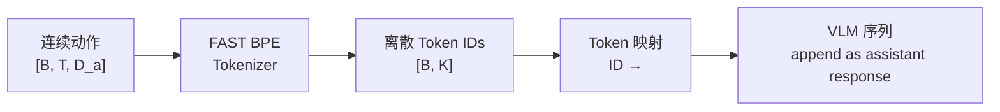

训练流程（[QwenFast.py:125-176](../../starVLA/model/framework/VLM4A/QwenFast.py#L125-L176)）：

```python
def forward(self, examples):
    # 1. 连续动作 → FAST tokens
    batch_fast_tokens = self.action_model.encoder_action2fastoken(actions)  # List[List[int]]
    # 2. FAST token ID → VLM 特殊 token 字符串
    vlm_action_tokens = [self.map_fast_token_to_vlm_action(t) for t in batch_fast_tokens]
    # e.g., [42, 17, 891] → "<robot_action_42><robot_action_17><robot_action_891>"
    # 3. 构建 VLM 输入（动作 token 作为 assistant response）
    qwen_inputs = self.qwen_vl_interface.build_qwenvl_inputs(
        images=batch_images, instructions=instructions, solutions=vlm_action_tokens
    )
    # 4. 标准 next-token prediction CE loss
    vlm_action_loss = self.qwen_vl_interface(**qwen_inputs).loss
```

推理流程——需要反向映射（[QwenFast.py:178-222](../../starVLA/model/framework/VLM4A/QwenFast.py#L178-L222)）：

```python
def predict_action(self, examples):
    # 1. VLM 自回归生成
    generated_ids = self.qwen_vl_interface.model.generate(**qwen_inputs, max_length=2048)
    # 2. 提取动作 token 区间
    batch_vlm_action_token_ids = self._extract_action_token_ids(generated_ids)
    # 3. 映射回 FAST token ID 空间
    batch_fast_action_token_idx = self._decode_action_tokens(batch_vlm_action_token_ids)
    # 4. FAST 解码回连续动作
    normalized_actions = self.action_model.fast_tokenizer.decode(batch_fast_action_token_idx)
```

**特殊 Token 范围**（[QWen3.py:21-23](../../starVLA/model/modules/vlm/QWen3.py#L21-L23)）：

```python
_ACTION_TOKEN_MIN = 151669   # <robot_action_0>
_ACTION_TOKEN_MAX = 153716   # <robot_action_2047>
```

共 2048 个动作特殊 token（对应 FAST tokenizer 的词表大小）。

### 5.3 MLP L1 回归（OFT）

QwenOFT 使用最简单的动作解码方式——在 VLM 输出的特定位置提取隐状态，通过 MLP 回归连续动作值：

```python
# 注入动作占位符 "🔍" × chunk_len
action_tokens = "🔍" * self.chunk_len
prompt_suffix = f" Please predict the next {self.chunk_len} robot actions: <action>{action_tokens}<action>."
instructions = [instr + prompt_suffix for instr in instructions]
```

VLM 前向传播后，在 "🔍" 位置提取隐状态（[QwenOFT.py:278-330](../../starVLA/model/framework/VLM4A/QwenOFT.py#L278-L330)）：

```python
def _gather_action_token_embeddings(self, last_hidden, input_ids, action_token_id):
    mask = input_ids == action_token_id  # [B, L]
    # ... 向量化提取最后 chunk_len 个匹配位置
    action_queries = last_hidden.gather(dim=1, index=expanded_index)  # [B, chunk_len, H]
    return action_queries
```

然后通过 MLP 回归预测（来自 `MLP_ActionHeader.py`）：

$$\hat{a} = \text{MLPResNet}(h_{\text{action}})$$
$$\mathcal{L} = \|{a} - \hat{a}\|_1 \quad \text{(L1 损失)}$$

### 5.4 多机器人实体编码器

`CategorySpecificLinear`（[GR00T_ActionHeader.py:25-37](../../starVLA/model/modules/action_model/GR00T_ActionHeader.py#L25-L37)）支持**不同机器人形态共享同一个动作头**：

```python
class CategorySpecificLinear(nn.Module):
    def __init__(self, num_categories, input_dim, hidden_dim):
        # 每种机器人类型有独立的权重矩阵
        self.W = nn.Parameter(0.02 * torch.randn(num_categories, input_dim, hidden_dim))
        self.b = nn.Parameter(torch.zeros(num_categories, hidden_dim))

    def forward(self, x, cat_ids):
        selected_W = self.W[cat_ids]    # 按类别 ID 索引权重
        selected_b = self.b[cat_ids]
        return torch.bmm(x, selected_W) + selected_b.unsqueeze(1)
```

`MultiEmbodimentActionEncoder` 在此基础上构建了完整的多机器人动作编码器：

```python
class MultiEmbodimentActionEncoder(nn.Module):
    def __init__(self, action_dim, hidden_size, num_embodiments):
        self.W1 = CategorySpecificLinear(num_embodiments, action_dim, hidden_size)
        self.W2 = CategorySpecificLinear(num_embodiments, 2*hidden_size, hidden_size)
        self.W3 = CategorySpecificLinear(num_embodiments, hidden_size, hidden_size)
```

### 5.5 动作编码横向对比

| 编码方式 | 动作空间 | 损失函数 | 推理方式 | 推理速度 | 精度 |
|----------|----------|----------|----------|----------|------|
| Flow-matching | 连续 | MSE velocity | Euler 积分 (4-10步) | 中等 | 高 |
| FAST 离散化 | 离散 2048 | Cross-Entropy | 自回归生成 | 慢（序列生成） | 中 |
| MLP L1 | 连续 | L1 | 单步前向 | 最快 | 中 |
| 离散扩散 MaskGIT | 离散 256 | Cross-Entropy | 迭代解码 | 中等 | 中 |

---

## 第 6 章：多模态融合机制——核心分析与基准证据

> 本章以当前本地源码为第一事实来源，并补充截至 **2026-07-16（UTC+8）** 可核验的论文、官方项目页、模型卡和 leaderboard。这里的“融合机制”描述视觉、语言、状态、历史与动作流在哪里、以何种注意力关系发生交互；“动作头条件化”描述动作解码器如何接收这些条件并生成动作。二者相关，但不是同一个概念。

### 6.0 阅读口径：机制不是排行榜的唯一自变量

同一种融合机制可以配不同 VLM、训练数据、动作空间和推理预算；同一个模型也常组合多种机制。因此不能把最终成功率简单归因于某一个模块。本章采用以下证据等级：

| 等级 | 证据类型 | 本章使用方式 |
|---|---|---|
| A | 官方统一复测或主办方控制的真机评测 | 可以在同一赛道内排序，必须标注日期 |
| B | 官方提交榜或官方模型卡 | 可比较同协议提交，注明是否作者自报 |
| C | 同一论文/项目中的静态实验表 | 适合论文内部对比与消融，不外推为全局 SOTA |
| D | 跨论文社区聚合 | 仅作线索，不用于严格架构结论 |

特别注意：

1. CALVIN 的 D→D、ABCD→D、ABC→D 不是同一协议。
2. SimplerEnv 的 Google Robot Visual Matching、Variant Aggregation、WidowX/Bridge 不能混排。
3. RoboCasa GR-1 Tabletop、RoboCasa Kitchen 与 RoboCasa365 不是同一任务集。
4. RoboTwin 的 50 demonstrations 与 50+500 demonstrations、Clean/Easy 与 Randomized/Hard 必须分开。
5. LIBERO 单 suite 策略、四 suite 单一策略以及 LIBERO-Plus 零样本评测不能直接互换。

### 6.0.1 四大类、十二种机制

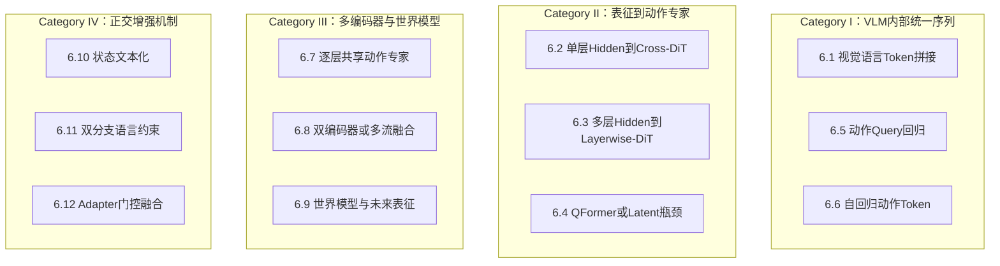

其中 6.1 是 Qwen-VL 系模型的基础层；6.10 是可叠加在 6.3、6.5、6.7 上的状态编码方式；6.11、6.12 也会复用其他动作头。因而十二类是“机制维度”，不是互斥的十二个模型家族。

### 6.0.2 本地模型 × 主融合机制 × 动作头条件化

| 本地模型 | 主融合机制 | 动作头 | 视觉/语言条件如何进入动作头 | state / time 条件 | 训练目标与推理 |
|---|---|---|---|---|---|
| QwenGR00T、Gemma4GR00T、MiniCPMGR00T、CosmosGR00T | 6.2 | `FlowmatchingActionHead` | 最后一层 hidden 作所有 cross-attn 的 K/V | state MLP 拼接；time→AdaLN | velocity MSE；Euler |
| QwenPI / QwenFM | 6.3 | `LayerwiseFlowmatchingActionHead` | `hidden_states[-N:]` 按 block 下标路由 | state MLP；time→AdaLN | velocity MSE；Euler/RTC |
| QwenPI_v3 | 6.3 + 6.10 | 同上 | 每层 LN+Linear 压缩后逐层路由 | state 量化进文本；time→AdaLN | velocity MSE；Euler/RTC |
| QwenDiscreteDiffusion | 6.3 | `LayerwiseDiscreteDiffusionActionHead` | 多层 VLM hidden 作逐层 K/V | 离散动作 token；迭代 mask | CE/BCE，可选 L1；MaskGIT |
| InternVLA-M1 | 6.4 + 6.8 | `DiTActionHeader` | VLM 多层+DINO→QFormer→定长条件 | timestep embed；CFG | 噪声 MSE；DDIM |
| QwenOFT | 6.5，可叠加 6.10 | `L1RegressionActionHead` | VLM 内 action placeholder hidden | 可选 state 文本化 | L1；单次前向 |
| QwenFast | 6.6 | VLM LM head + FAST tokenizer | 动作本身成为 assistant token | 无独立 DiT 条件化 | CE；自回归生成 |
| PI0 / PI05 | 6.7；PI05+6.10 | `OpenPI0/05ActionHead` | VLM prefix 与 action expert 每层联合注意力 | PI0 state token；PI05 state 文本化、adaRMS | velocity MSE；Euler+KV cache |
| QwenDual | 6.8 + 6.2 | `FlowmatchingActionHead` | Qwen hidden 与 DINO token 拼接后作 K/V | state MLP；time→AdaLN | velocity MSE；Euler |
| Wan/CosmoPredict2 GR00T | 6.9 + 6.2 | `FlowmatchingActionHead` | 世界模型最后层特征作 K/V | state MLP；time→AdaLN | velocity MSE；Euler |
| Wan/CosmoPredict2 PI | 6.9 + 6.3 | `LayerwiseFlowmatchingActionHead` | 世界模型多 block 特征逐层作 K/V | state MLP；time→AdaLN | velocity MSE；Euler |
| Wan/CosmoPredict2 OFT | 6.9 + 6.5 | MLP L1 | 世界模型特征池化后展开动作 query | 可选 state 文本化 | L1；单次前向 |
| LangForce | 6.11 + 6.2 | `FlowmatchingActionHead` | 双 VLM 前向产生 latent-action-query context | PMI/LLR 语言约束 + FM | 复合损失；源码推理用 posterior 顺序 |
| QwenAdapter | 6.12 | `VLA_Adapter_L1RegressionActionHead` | embedding hook 注入 query，多层特征门控融合 | `ProprioProjector` | L1；单次前向 |
| ABot_M0 | 多视觉编码器 + 6.2 | `AML_ActionHeader` | Qwen-VL 与 VGGT 表征融合后作 K/V | state/time 同 FM | 带 mask 的 FM |

---

### 6.1 VLM 序列内 Token 拼接

#### 机制与动作头条件化

视觉 patch 经视觉塔和 projector 映射到语言隐藏空间，与文本 token 组成统一序列：

$$X=[x_{\text{vision}},x_{\text{text}},x_{\text{optional-state}},x_{\text{optional-action-query}}]$$

VLM 内部先完成视觉—语言融合，之后模型可选择：

- 把最后层或多层 hidden 作为外置动作头的 K/V（6.2、6.3）；
- 在 action query 位置直接回归动作（6.5、6.12）；
- 用 LM head 生成离散动作 token（6.6）；
- 与动作专家做逐层联合注意力（6.7）。

因此，6.1 本身没有唯一动作头。它决定的是基础多模态表征，不能把后续成绩单独归功于“token 拼接”。

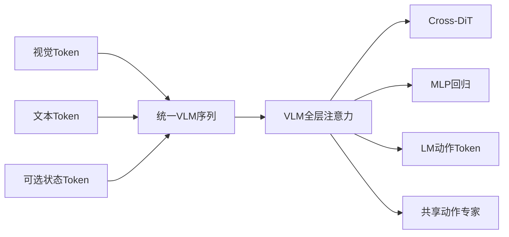

#### 使用模型

- 本地：所有 Qwen-VL、Gemma4、MiniCPM、Cosmos-Reason2 VLM 路线。
- 外部：OpenVLA/OFT、Qwen-RobotManip、GR00T N1.x、LangForce、RLDX-1 等都先进行某种视觉—语言 token 融合。

#### Benchmark 解读

同样使用 VLM token 融合，LIBERO 可从 π0-FAST 的 85.5 到 Qwen-RobotManip-Context 的 99.2；差距主要来自数据、backbone、动作接口和训练策略。6.1 是必要基础，不是可独立排名的动作解码算法。

---

### 6.2 单层 Hidden State → 交叉注意力 Flow-DiT

#### 代码事实

`QwenGR00T.py` 取 `hidden_states[-1]`。动作头把 noisy action、future tokens 与可选 state token 组成 Query 序列；VLM 最后一层作为 cross-attention 的 K/V；flow timestep 同时进入 `ActionEncoder` 和 AdaLayerNorm。

$$x_t=(1-t)\epsilon+t a,\qquad v^\*=a-\epsilon$$

$$\mathcal{L}_{FM}=\lVert v_\theta(x_t,t,c)-v^\*\rVert_2^2$$

当 `interleave_self_attention=True` 时，偶数 block cross-attend VLM，奇数 block 做动作序列 self-attention；单层 context 会被所有 cross block 复用。

#### 使用模型与变体

- 本地：QwenGR00T、Gemma4GR00T、MiniCPMGR00T、CosmosGR00T、QwenDual（双编码器先拼接）、LangForce（latent query context）、ABot_M0，以及 WM4A 的 GR00T 变体。
- 外部近邻：GR00T N1/N1.6/N1.7、Qwen-RobotManip、DM0 等“语义 VLM/System-2 + 连续动作专家/System-1”模型。外部实现可能选择中间层或多个层，不应假定与本地 `hidden_states[-1]` 完全相同。

#### 代表成绩

| 模型与协议 | 成绩 | 证据与解释 |
|---|---:|---|
| StarVLA-GR00T Qwen3，LIBERO 四套件单策略 | 96.5 Avg | 本仓库同表 C；Spatial/Object/Goal/Long=97.8/98.8/97.4/92.0 |
| StarVLA-GR00T Qwen2.5-Action，CALVIN D→D | 3.786 平均链长 | 本仓库 C；不可与 ABC→D 榜混排 |
| StarVLA-GR00T，DOMINO clean dynamic α=0.1 | SR 6.10 / MS 28.60 | 本仓库 C |
| StarVLA-GR00T-Qwen3，RoboCasa GR-1 Tabletop | 47.8 Avg | 24 tasks，50 rollouts/task，C |
| Qwen3VL-GR00T Bridge+RT-1，SimplerEnv WidowX | 65.3 | 本仓库模型卡 B |
| Qwen-RobotManip-Context，LIBERO | 99.2 | 官方仓库/论文 C；benchmark-specific checkpoint |
| Qwen-RobotManip-Context，RoboTwin Easy/Hard | 93.7 / 94.0 | 官方仓库 C |
| Qwen-RobotManip-Context，LIBERO-Plus | 91.4 | OOD 七扰动，论文 C |
| Qwen-RobotManip，RoboCasa365 | 35.9 | 论文 C；2026-07-09 动态榜已有更高提交，不能称当前第一 |
| Qwen-RobotManip，RoboChallenge Table30 v1 generalist | SR 45.0 / Score 59.83 | 官方项目引用的比赛结果 B，注意不是 Table30 V2 |
| DM0，RoboChallenge Table30 Specialist / Generalist | SR 62.0 / 37.33；Score 72.25 / 49.08 | Dexbotic 官方文档 B；两个赛道不能混排 |
| GR00T N1.7，LIBERO | 约 96.5–96.99 | NVIDIA/LeRobot 两条评测路径，配置不同，C |

#### 结论

单层 cross-DiT 的优势是接口清晰、context 缓存简单、动作流有充分 self-attention；缺点是所有动作层只能读取同一语义层。Qwen-RobotManip 表明规模化数据与对齐可让该范式取得很强 OOD 成绩，但不能据此证明“最后一层优于逐层”。

---

### 6.3 逐层 Hidden State → Layer-wise Cross-DiT

#### 正确的本地路由规则

本地 QwenPI 系列遵循：

```text
N = num_vl_layers = num_dit_blocks
vl_embs_list = hidden_states[-N:]
cross block idx 使用 encoder_hidden_states[idx]
```

**不是** `2N` 个 DiT block。还必须区分：

- `interleave_self_attention=False`：N 个 block 全部 cross-attn，VLM N 层一一使用；
- `interleave_self_attention=True`：奇数 block 是 self-attn，只有偶数下标 VLM hidden 被使用，奇数下标列表元素不会进入 cross-attn。

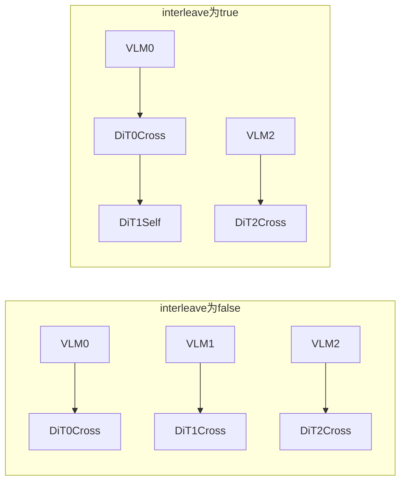

QwenPI 让 DiT hidden 与 VLM hidden 同维；QwenPI_v3 为每个层设置独立 `LayerNorm+Linear`，如 2560→1024，并把 state 离散为文本。公开的 `Qwen3VL-PI_v3-Bridge-RT_1` checkpoint 使用 `interleave_self_attention=false`，与代码默认值必须分开陈述。

#### 使用模型

- 本地连续 FM：QwenPI/QwenFM、QwenPI_v3、Gemma4PI、MiniCPMPI、WanPI、CosmoPredict2PI。
- 本地离散扩散：QwenDiscreteDiffusion，复用逐层 K/V，但把动作改成 MaskGIT 式离散恢复。
- 外部近邻：Discrete Diffusion VLA 的“统一离散扩散”思想相近，但其论文实现不是本地 LayerwiseFM 的同一代码；不能把两者混为同一架构。

#### 代表成绩

| 模型与协议 | 成绩 | 解释 |
|---|---:|---|
| StarVLA-π Qwen3，LIBERO | 95.7 Avg | 98.8/99.6/95.8/88.4；Long 弱于同表 OFT/GR00T |
| StarVLA-π Qwen3，LIBERO-Plus 零样本 | 77.0 Total | 本仓库同一 LIBERO checkpoint C |
| Qwen3VL-PI_v3 Bridge+RT-1，SimplerEnv WidowX | 69.8 | 50k checkpoint；四任务 62.5/100/79.2/37.5 |
| QwenPI Qwen2.5-Action，CALVIN D→D | 3.576 | 同表低于 GR00T 3.786 与 PI0.5 3.885 |
| StarVLA-π-Qwen3，RoboCasa GR-1 Tabletop | 43.9 | 同表低于 OFT 48.8、GR00T 47.8 |
| Discrete Diffusion VLA，LIBERO | 96.3–96.4 | 论文版本口径略有变化，C |
| Discrete Diffusion VLA，SimplerEnv-Fractal | VM 71.2 / Overall 64.1 | C |
| Discrete Diffusion VLA，SimplerEnv-Bridge | Overall 54.2 | OpenReview/修订版；早期页面曾报 49.3，采用最新摘要并注明版本差异 |

#### 消融含义

受控 StarVLA LIBERO 表中，Qwen3-VL 的 OFT/GR00T/π/FAST 分别为 96.6/96.5/95.7/95.4。逐层 FM 并未在饱和的域内评测中胜出；但 PI_v3 在相近 Bridge+RT-1 设置下比 Qwen3VL-GR00T 高 4.5 个百分点。该差异同时包含 state 文本化、DiT 压缩、checkpoint 与 `interleave` 配置，不能当成纯“逐层特征”消融。

---

### 6.4 逐层 QFormer / Latent Bottleneck 聚合

#### 本地机制

InternVLA-M1 将 DINOv2 空间 token 投影后，与 VLM 多层 hidden 分层拼接；QFormer 用固定 learned queries 压缩变长 context。压缩结果不是 LayerwiseFM 的 K/V 列表，而是送入 `DiTActionHeader` 的定长条件；其动作生成是 DDPM 噪声预测、DDIM 采样，并支持 CFG。

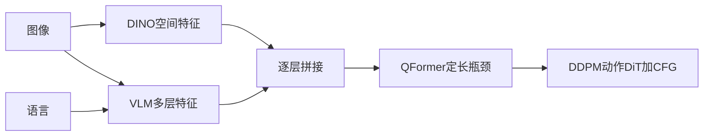

#### 使用模型与演进

- 本地：InternVLA-M1。
- 外部演进：InternVLA-A1.5 不再只是静态 QFormer 压缩，而用 foresight tokens 查询未来相关 latent，并以 mixture/shared Transformer 将理解、未来表征和 flow action expert 结合。它应视为 6.4+6.9 的演进近邻，而非 M1 的同构实现。

#### 代表成绩

| 模型 | Benchmark | 成绩 |
|---|---|---:|
| InternVLA-M1 | LIBERO | 95.9 Avg |
| InternVLA-M1 | SimplerEnv Google VM / VA / WidowX | 80.7 / 76.0 / 71.7 |
| InternVLA-M1 | DOMINO | SR 5.40 / MS 27.57 |
| InternVLA-A1.5 | LIBERO | 98.9 Avg |
| InternVLA-A1.5 | LIBERO-Plus 零样本 | 84.8 Total |
| InternVLA-A1.5 | RoboTwin 2.0 | 93.2 Avg |
| InternVLA-A1.5 | SimplerEnv WidowX | 80.8 |
| InternVLA-A1.5 | DOMINO | SR 27.7 / MS 39.8 |

InternVLA-A1.5 论文消融：去掉 video loss 后 LIBERO-Plus 84.8→78.0、RoboTwin 93.2→91.1；去掉 foresight tokens 后 LIBERO-Plus 77.9、RoboTwin 90.2、DOMINO 23.8。这比单看最终分数更直接支持“未来 latent + 瓶颈查询”的贡献。

---

### 6.5 序列内动作 Query + MLP/OFT 连续回归

#### 机制与条件化

QwenOFT 在 prompt 中放置 action placeholder。VLM 的自注意力把视觉、语言和可选 state 信息汇聚到这些位置，再用小 MLP 对每个 query 做连续动作回归：

$$\hat a_{1:H}=\operatorname{MLP}\left(h_{\text{query},1:H}^{(L)}\right),\qquad
\mathcal{L}=\lVert \hat a-a\rVert_1$$

它没有 flow timestep、AdaLN 或迭代采样。WanOFT/CosmoPredict2OFT 则对世界模型特征做池化并展开 chunk query，和 QwenOFT 的“VLM placeholder gather”不是完全相同的输入路径。

#### 使用模型

- 本地：QwenOFT、WanOFT、CosmoPredict2OFT。
- 外部：OpenVLA-OFT；部分并行动作 query 回归模型也属于相邻路线。

#### 代表成绩

| 模型与协议 | 成绩 | 说明 |
|---|---:|---|
| OpenVLA-OFT，LIBERO | 97.1 Avg | 论文 C；比原 OpenVLA 76.5 大幅提升 |
| StarVLA-OFT Qwen3，LIBERO | 96.6 Avg | 同表本地最高；Long 93.8 |
| StarVLA-OFT Qwen3，LIBERO-Plus | 75.0 Total | 零样本 C |
| StarVLA-OFT，RoboTwin 50 demos | Easy 50.38 | 与官方不同数据口径时不可混排 |
| StarVLA-OFT，RoboTwin 50+500 demos | Easy 88.18 / Hard 88.32 | 数据扩展设置 |
| StarVLA-OFT-Qwen3，RoboCasa GR-1 Tabletop | 48.8 Avg | 本地同表第一 |
| StarVLA-OFT，DOMINO | SR 10.86 / MS 30.49 | 本地四类动作头最高，但低于 PUMA SR 17.20 |
| Qwen3VL-OFT Bridge+RT-1，SimplerEnv WidowX | 42.7 | 说明域内 MLP 高分不自动迁移到 real-to-sim |

#### 结论

OpenVLA-OFT 和 StarVLA 受控表证明，简单 L1 并不是“低精度动作头”。其关键优势是单步、稳定、吞吐高；短板是缺少显式多模态动作分布和迭代纠错。在多峰动作或严重 OOD 场景，性能更依赖 VLM 表征与数据覆盖。

---

### 6.6 自回归离散动作 Token / FAST

#### 机制与条件化

FAST 对连续轨迹做频域/量化压缩与 BPE，再映射到扩展 action vocabulary。动作条件化完全发生在 VLM causal self-attention 内，LM head 使用 CE 预测下一个动作 token。

$$a_{1:H}\xrightarrow{\text{FAST}}z_{1:K},\qquad
\mathcal{L}_{AR}=-\sum_k\log p(z_k\mid I,L,z_{<k})$$

优点是统一语言模型接口、训练基础设施成熟；缺点是串行解码、早期错误传播与量化误差。

#### 使用模型

- 本地：QwenFast。
- 外部：π0-FAST/OpenPI FAST、OpenVLA-FAST 及相关动作 token VLA。

#### 代表成绩

| 模型与协议 | 成绩 |
|---|---:|
| StarVLA-FAST Qwen3，LIBERO | 95.4 Avg |
| StarVLA-FAST Qwen2.5，LIBERO-Plus | 48.9 Total |
| StarVLA-FAST，DOMINO | SR 5.74 / MS 20.66 |
| Qwen2.5-FAST Bridge+RT-1，SimplerEnv WidowX | 58.6 |
| π0-FAST，LIBERO | 85.5 Avg |
| π0-FAST，LIBERO-Plus（StarVLA引用表） | 61.6 Total |
| π0-FAST，RoboArena 聚合快照 | 约 1581±31 Elo |

RoboArena 是动态聚合和 pairwise 真机评价，不能与 LIBERO 百分比合成。FAST 的核心价值更偏训练/部署统一和压缩效率，而不是在所有 benchmark 上取得最高成功率。

---

### 6.7 逐层共享 VLM + Action Expert（π0 系）

#### 机制与动作条件化

PI0/PI05 不是“VLM 完成后把最后层送给 DiT”。VLM prefix 与 action suffix 在每个 Gemma 层分别投影 Q/K/V，沿序列维联合 attention，再切回两条流。mask 保证动作 expert 可读 VLM，VLM 不读未来动作。

PI0 将 state 和 noisy action/time 嵌入 suffix；PI05 把 state 离散进 prefix，并用 timestep 生成 adaRMS 的 scale/shift/gate。推理可缓存 prefix KV，再对 action suffix 做 Euler 积分。

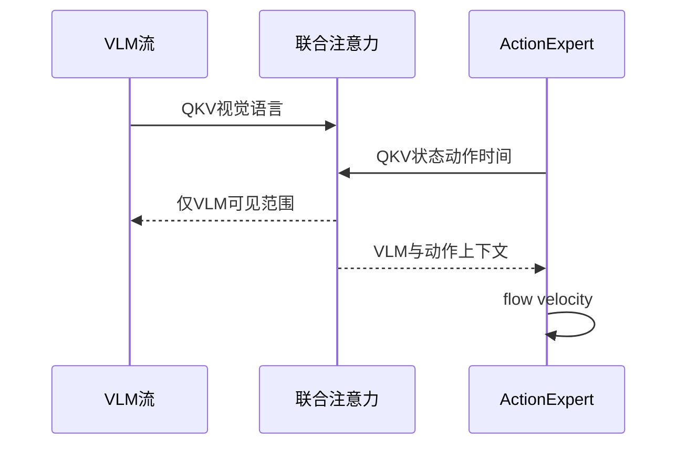

#### 使用模型与演进

- 本地：PI0、PI05。
- 外部：Physical Intelligence π0、π0.5；π0.7 延续动作专家，加入丰富 context（语言、subgoal image、执行 metadata）和 Knowledge Insulation：动作 expert 可读取 VLM 表征，但连续动作梯度不反向破坏 VLM 的预训练知识。π0.7 暂无足够统一的公共模拟表，不把官方真实机器人曲线换算成榜单名次。

#### 代表成绩

| 模型与协议 | 成绩 |
|---|---:|
| StarVLA/OpenPI PI05，CALVIN D→D | 3.885 平均链长 |
| StarVLA OpenPI 复现，LIBERO | 最高约 97.30 Avg（具体 FP32 eval 配置） |
| π0，LIBERO | 94.1 Avg |
| π0.5，LIBERO | 约 96.9 Avg |
| π0.5，LIBERO-PRO | Total 0.53，官方项目表快照第一 |
| π0.5，RoboChallenge Table30 Specialist | SR 42.67 / Score 61.84 |
| π0.5，RoboChallenge Table30 Generalist | SR 17.67 / Score 31.27 |
| π0.5，RoboArena 聚合快照 | 约 1612±32 Elo |

π0.5 的强项是跨任务与长程层次控制，但分数高度依赖其预训练和后训练数据。共享专家机制无法单独解释全部收益。

---

### 6.8 双编码器拼接与多流交互

#### 本地机制

QwenDual 同时用 Qwen-VL 和 DINOv2。DINO patch 经线性投影后，与 VLM 最后一层 token 沿序列维拼接，整体作为单层 FM DiT 的 K/V。它没有 QFormer，也不是逐层双编码器。

ABot_M0 是更复杂的相邻类型：引入 VGGT 几何表征并与 VLM 交互，最终仍由 AML/flow head 生成动作。

#### 外部扩展：多流而非简单拼接

RLDX-1 的 Multi-Stream Action Transformer 为视觉、语言、状态、动作、历史/记忆等建立专用 stream，再通过 joint/self/cross-stream interaction 融合，动作由少步 flow matching 生成。它属于 6.8 的“多源分流—交互”扩展，而不是 QwenDual 的逐 token `cat` 同构实现。

#### 代表成绩

| 模型 | Benchmark | 成绩 |
|---|---|---:|
| RLDX-1 | LIBERO | 97.8 |
| RLDX-1 | LIBERO-Plus | 86.7 |
| RLDX-1 | SimplerEnv Google VM / VA / WidowX | 81.5 / 77.4 / 71.9 |
| RLDX-1 | RoboCasa Kitchen / GR-1 Tabletop | 70.6 / 58.7 |
| RLDX-1 | RoboCasa365 论文表 / 2026-07-09榜单 | 32.1 / 36.0 |
| ABot-M0 | LIBERO-Plus（StarVLA引用表） | 80.5 |
| ABot-M0.5 | RoboCasa365 2026-07-09榜单 | 40.3 |

本地 QwenDual 没有独立公开的受控 benchmark 表，因此不能判断 DINO 拼接本身贡献多少。RLDX-1 的成绩支持多流设计的潜力，但同时包含大规模数据与专用训练。

---

### 6.9 世界模型特征、未来 Latent 与 World-Action Model

#### 本地 WM4A 三种出口

1. `WanGR00T/CosmoPredict2GR00T`：取世界模型最后层特征→单层 FM DiT。
2. `WanPI/CosmoPredict2PI`：对 world-model blocks 注册 hook，逐层特征→LayerwiseFM。
3. `WanOFT/CosmoPredict2OFT`：特征池化→MLP L1。

WanGR00T 的最后层路径并非 hook；WanPI 才是逐 block hook。WanPI 有 per-layer projector，CosmoPredict2PI 可直接使用匹配维度，文档应区分。

#### 2026 外部代表

- DreamZero：在大规模视频扩散骨干中联合建模未来视频 latent 与动作，约 7 Hz；不是“先生成完整视频再调用独立 policy”。
- Kairos：VideoDiT 与 ActionDiT/mixed attention 联合世界—动作建模；公开 RoboTwin 与 LIBERO-Plus 权重。
- InternVLA-A1.5：训练期以视频/未来 latent 监督 foresight tokens，部署时无需完整生成视频。
- WorldDreamer：世界模型路线，在 RoboCasa365 动态榜有公开提交。

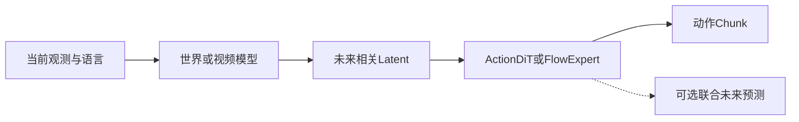

#### 代表成绩

| 模型与协议 | 成绩 | 证据边界 |
|---|---:|---|
| DreamZero，RoboArena | 约 1737±43 Elo | 动态聚合；截至快照领先，不是模拟 SR |
| Kairos，LIBERO-Plus | 89.0 Total | 官方模型/项目 C；部分文稿提到联合设置 90.8，需按版本区分 |
| Kairos，RoboTwin 2.0 | Clean 96.9 / Randomized 95.2 / Avg 96.1 | 官方项目 C |
| Kairos，WorldModelBench Robot | 9.30 | 世界模型指标，不与动作 SR 混排 |
| InternVLA-A1.5 | LIBERO-Plus 84.8；DOMINO SR 27.7 | 视频 loss/foresight 有明确消融 |
| WorldDreamer，RoboCasa365 | Overall 35.3 | 2026-07-09官方提交榜 B |

世界模型路线在扰动鲁棒性和动态任务上显示优势，但计算、训练数据和闭环延迟更高。最有价值的证据不是“会生成漂亮视频”，而是未来表征消融是否改善动作成功率。

---

### 6.10 离散化状态文本注入

#### 机制

将归一化 proprioception 分到 256 bins，转成数字 token 并附加到指令：

```text
pick up the red cube [STATE] 95 133 203 44 127 88 201 [ACTION]
```

这让 state 在 VLM 内与图像、语言共同融合，并可移除动作头外部 `state_encoder`。量化步长约为 $2/256=0.0078125$；误差上界与归一化、边界 clipping 方式相关，不能笼统写成固定“0.4% 精度损失”。

#### 使用模型

- 本地：QwenPI_v3、QwenOFT（可选）、WanOFT/CosmoPredict2OFT、PI05。
- 外部：π0.5 及一些沿用其 state-as-token 思想的模型。

#### Benchmark 证据与限制

QwenPI_v3 的 SimplerEnv WidowX 69.8、PI05 的 CALVIN D→D 3.885 都使用或对齐该思想；但这些实验同时改变动作专家、backbone 或训练配置。当前仓库没有“仅打开 state 文本化、其他完全不变”的公开消融，因此不能宣称这些增益由状态文本化单独产生。

适用场景是多 embodiment 统一接口、希望 VLM 直接理解 state 与语言关系；不适合状态极高维、精度要求高或 tokenizer 对数字表示效率很差的场景。

---

### 6.11 LangForce 双分支贝叶斯 / PMI 语言约束

#### 源码核验后的机制

本地 LangForce 并非两个独立 VLM。它复用同一 `qwen_vl_interface` 做两次前向，通过 latent action queries 与语言 token 的顺序构造 prior/posterior 表征，再以 PMI/LLR、hard-token/gate 与 FM action loss联合优化。

需修正旧文档的两点：

1. 不是伪代码中的 `self.prior_branch` 与 `self.posterior_branch` 两套网络；
2. 当前本地 `predict_action()` 注释与实现使用 **posterior token order**，不能写成“推理只用 prior”。

#### 动作头条件化

从 latent action query 位置提取 hidden，作为 `FlowmatchingActionHead` 的 context；动作侧仍使用 noisy action、state MLP、future tokens 和 timestep AdaLN。LangForce 的创新主要在“迫使动作依赖语言”，而不是新的数值动作解码器。

#### 代表成绩

| Benchmark | QwenGR00T baseline | LangForce | 增益 |
|---|---:|---:|---:|
| LIBERO Avg | 96.5 | 98.4 | +1.9 |
| LIBERO Goal | 97.4 | 99.4 | +2.0 |
| SimplerEnv Avg | 55.2 | 66.5 | +11.3 |
| RoboCasa Avg | 47.8 | 52.6 | +4.8 |

LIBERO 四 suite 为 Spatial/Object/Goal/Long=99.2/99.6/99.4/95.2。以上来自 LangForce 论文/官方模型卡 C。其 vision-only 消融在 Goal 上显著下降，直接支持“语言歧义场景需要抑制视觉捷径”的论点，比单纯平均分更有解释力。

---

### 6.12 VLA-Adapter：Query 注入与门控多源注意力

#### 正确的本地机制

QwenAdapter 在文本中放置 placeholder，并在 `get_input_embeddings()` 上注册 forward hook，把相应位置的 embedding 替换为可学习 `action_query`。它不是在任意 VLM 中间层直接注入 query。

VLM forward 后，从多层 hidden 中提取 vision patch 与 action query 表征；`VLA_Adapter_L1RegressionActionHead` 通过多层 gated self/task/adapter attention 融合。state 由 `ProprioProjector` 作为额外 K/V；最终 L1 回归动作，没有 flow timestep。

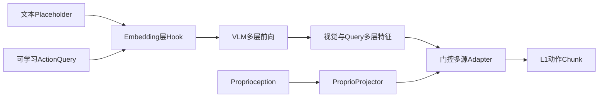

#### 使用模型与成绩

- 本地：QwenAdapter。
- DOMINO clean dynamic α=0.1：SR 4.40 / MS 24.31。
- 当前仓库没有 LIBERO/SimplerEnv 的完整同设置 QwenAdapter 表，也没有门控层数、query 注入、proprio projector 的公开逐项消融。

其优势是冻结大部分 VLM 时参数效率高、可读取多层视觉信息；缺点是多层特征缓存与 Adapter 结构复杂，现有公开成绩不足以证明它优于 OFT 或 FM 主线。

---

### 6.13 机制级横向比较

| 机制 | 条件进入动作的方式 | 连续/离散 | 典型 NFE | 优势 | 主要风险 | 代表模型 |
|---|---|---|---:|---|---|---|
| 6.2 单层 Cross-DiT | 最后/选定 hidden 作 K/V | 连续 FM | 4–10 | 清晰、成熟、易扩展 | 单层信息瓶颈 | GR00T、Qwen-RobotManip |
| 6.3 逐层 Cross-DiT | 多层 hidden 分层作 K/V | 连续 FM/离散 DD | 4–12 | 多层语义、细粒度控制 | 层路由和显存复杂 | QwenPI_v3、QwenDD |
| 6.4 Latent/QFormer | 定长查询压缩 context | DDPM/FM | 多步 | 固定通信量、可引入 foresight | 瓶颈可能丢信息 | M1、InternVLA-A1.5 |
| 6.5 OFT/MLP | action query hidden→MLP | 连续回归 | 1 | 最快、稳定、参数少 | 多峰表达弱 | OpenVLA-OFT、QwenOFT |
| 6.6 FAST | VLM causal 生成动作 token | 离散 AR | token 数 | 统一 LM 接口、训练高效 | 串行与量化误差 | π0-FAST、QwenFast |
| 6.7 共享专家 | VLM/action 每层联合 attention | 连续 FM | 4–10 | 逐层深耦合、prefix cache | 参数和实现复杂 | π0.5、π0.7 |
| 6.8 多编码器/多流 | token concat 或 cross-stream | 多为 FM | 4–10 | 空间、记忆、触觉互补 | 数据与同步成本高 | QwenDual、RLDX-1 |
| 6.9 世界动作模型 | 未来 latent 与 ActionDiT 交互 | 联合生成/FM | 较高 | 动态、鲁棒、长程潜力 | 延迟、训练成本、评测不成熟 | Kairos、DreamZero |
| 6.11 双分支语言约束 | latent query+PMI/LLR→FM | 连续 FM | 推理近 FM | 抑制视觉捷径 | 双前向训练成本 | LangForce |
| 6.12 Adapter | 多层 hidden 门控→L1 | 连续回归 | 1 | 参数高效、多源可插拔 | 证据仍少 | QwenAdapter |

6.1 与 6.10 是正交输入机制，未在表中作为独立动作解码器排序。

---

### 6.14 按 Benchmark 的模型总对比

#### 6.14.1 LIBERO：域内已接近饱和

在 StarVLA 同一 Qwen3-VL、30K steps、四 suite 单策略表中：

| 动作路线 | Spatial | Object | Goal | Long | Avg |
|---|---:|---:|---:|---:|---:|
| FAST | 97.3 | 97.4 | 96.3 | 90.6 | 95.4 |
| OFT | 97.8 | 98.6 | 96.2 | 93.8 | 96.6 |
| 逐层 π | 98.8 | 99.6 | 95.8 | 88.4 | 95.7 |
| 单层 GR00T | 97.8 | 98.8 | 97.4 | 92.0 | 96.5 |
| LangForce | 99.2 | 99.6 | 99.4 | 95.2 | 98.4 |

结论：OFT 在无迭代动作头下仍达到 96.6；逐层 π 在 Spatial/Object 最高但 Long 较弱；LangForce 对 Goal 的提升最能体现语言条件化价值。LIBERO 平均分已不足以单独区分通用能力，应配合 LIBERO-Plus/PRO。

外部 2026 作者表中 Qwen-RobotManip-Context 99.2、InternVLA-A1.5 98.9、RLDX-1 97.8 都很高，但训练数据、checkpoint 与评测实现不完全一致，不组成官方统一 Top 3。

#### 6.14.2 LIBERO-Plus：更能区分鲁棒融合

| 模型 | 机制侧重点 | Total |
|---|---|---:|
| Qwen-RobotManip-Context | 大规模对齐 + continuous action expert | 91.4 |
| Kairos | 世界—动作联合建模 | 89.0 |
| RLDX-1 | 多流交互 + FM | 86.7 |
| InternVLA-A1.5 | foresight latent + FM | 84.8 |
| ABot-M0 | VLM+几何表征 | 80.5 |
| StarVLA-π Qwen3 | 逐层 Cross-DiT | 77.0 |
| StarVLA-OFT Qwen3 | Action query + MLP | 75.0 |

这些大多是作者运行的 C 级结果；官方 LIBERO-Plus 统一复测表截至当前的已合入项目可能不同。趋势上，数据对齐、多流/未来表征比单纯换解码头更有帮助。

#### 6.14.3 SimplerEnv：必须分机器人和渲染协议

- StarVLA Bridge+RT-1 WidowX：PI_v3 69.8 > GR00T 65.3 > FAST 58.6 > OFT 42.7。
- RLDX-1 论文：Google VM/VA/WidowX=81.5/77.4/71.9。
- InternVLA-A1.5：WidowX 80.8。
- Discrete Diffusion VLA：Fractal VM 71.2、Overall 64.1；Bridge Overall 54.2。

以上不能合成一个 SimplerEnv 总榜。Bridge/WidowX 的受控结果更支持 flow/逐层头处理连续轨迹；Google Robot 数据则反映不同 embodiment 和训练源。

#### 6.14.4 CALVIN：长时程链必须按 split

StarVLA D→D 同表：PI0.5 3.885 > GR00T Qwen2.5-Action 3.786 > QwenPI Qwen2.5-Action 3.576。ABC→D 官方榜中的 FLOWER 4.53、UniVLA 4.41 等不能与这些 D→D 数字直接比较。这里没有证据证明逐层 Cross-DiT 优于单层或共享专家；PI0.5 的层次/state 设计更适合链式任务，但数据与训练实现也不同。

#### 6.14.5 RoboTwin、RoboCasa 与动态任务

| Benchmark/协议 | 代表结果 | 观察 |
|---|---|---|
| RoboTwin 作者自报全任务聚合 | Kairos 96.1；InternVLA-A1.5 93.2；StarVLA-OFT 50+500 demos 约88.3 | checkpoint、训练 demonstrations 与聚合方式不同，只能作趋势参考 |
| RoboCasa GR-1 Tabletop | RLDX-1 58.7；StarVLA-OFT 48.8；GR00T 47.8；π 43.9 | 多流设计和数据规模优势明显 |
| RoboCasa365 2026-07-09榜 | Xiaomi-Robotics-1 57.4；ABot-M0.6 46.6；ABot-M0.5 40.3；RLDX-1 36.0；WorldDreamer 35.3 | 官方提交榜 B；长程 composite-unseen 仍远未解决 |
| DOMINO α=0.1 | InternVLA-A1.5 SR 27.7；PUMA 17.2；StarVLA-OFT 10.86 | 未来 latent/动态训练比静态 LIBERO 分数更有区分度 |

#### 6.14.6 真机 leaderboard 与竞赛

- RoboChallenge 必须区分 Table30 v1/v2、Specialist/Generalist。Qwen-RobotManip 在 v1 generalist 报 SR 45.0/Score 59.83；π0.5 的不同赛道成绩不能直接与之混排。
- RoboArena 使用 pairwise Bradley–Terry/Elo，DreamZero、π0.5、π0-FAST 的 Elo 反映真机偏好，不是绝对任务成功率。
- ManipArena、BEHAVIOR Challenge 等比赛应按赛季和赛道引用，不能用静态论文“Rank 1”覆盖后续动态榜。

---

### 6.15 消融结论、设计选择与研究空白

#### 已有证据较强的结论

1. **轻量动作头并不天然弱**：OpenVLA-OFT 97.1、StarVLA-OFT 96.6 表明 parallel query + L1 在域内任务上非常强。
2. **语言约束应在有歧义的任务上评估**：LangForce 在 LIBERO Goal 与 OOD SimplerEnv/RoboCasa 的提升，比在饱和 Spatial/Object 上更有意义。
3. **未来 latent 对 OOD/动态任务有效**：InternVLA-A1.5 去除 video loss 或 foresight tokens 后，LIBERO-Plus、RoboTwin、DOMINO 均下降。
4. **逐层路由的收益依赖实现**：`interleave` 是否跳过奇数 VLM 层、是否有 per-layer projector，会改变“逐层融合”的实际含义。
5. **动作离散化不必等于纯 AR**：Discrete Diffusion VLA 通过并行恢复和 re-mask，在 LIBERO 接近连续 OFT，并改善 OOD 语言扰动。

#### 仍不能从现有表格推出的结论

1. 不能仅凭 PI_v3 69.8 vs GR00T 65.3 证明逐层 hidden 必然更优，因为还有 state、投影、checkpoint 和路由配置差异。
2. 不能用 Kairos/DreamZero 的世界模型得分证明视频生成质量必然转化为闭环控制；需要 action-only、joint world-action 与等算力消融。
3. 不能把 LIBERO 98–99% 当作真实机器人 generalist 能力；RoboCasa365 composite-unseen、RoboChallenge 和动态任务更有区分度。
4. 不能把不同赛道的 Elo、SR、process score 与平均链长归一成一个“总冠军”。

#### 按目标选择机制

| 目标 | 优先路线 | 理由 |
|---|---|---|
| 低延迟、易训练、域内精调 | OFT/MLP | 1 NFE，LIBERO/RoboCasa Tabletop 已有强结果 |
| 连续多峰动作、短 chunk 精细控制 | 单层或逐层 Flow-DiT | 连续速度场、并行 chunk、可做 RTC |
| 统一离散接口且希望并行纠错 | Discrete Diffusion | 比 AR 更并行，可 re-mask |
| 多 embodiment、复杂传感器 | 多流 Transformer | 模态专用 stream，扩展 state/tactile/history |
| 动态、扰动和长时程 | Foresight / World-Action Model | 显式未来表征，已有 OOD 消融支持 |
| 指令歧义与组合泛化 | LangForce/语言约束 + 强动作头 | 抑制视觉捷径 |
| 参数高效适配冻结 VLM | Adapter 或 OFT | 小头、单步、训练成本低 |

---

### 6.16 主要来源

#### 本地代码与结果

- [QwenGR00T.py](../../starVLA/model/framework/VLM4A/QwenGR00T.py)
- [QwenPI.py](../../starVLA/model/framework/VLM4A/QwenPI.py)
- [QwenPI_v3.py](../../starVLA/model/framework/VLM4A/QwenPI_v3.py)
- [LayerwiseFM_ActionHeader.py](../../starVLA/model/modules/action_model/LayerwiseFM_ActionHeader.py)
- [cross_attention_dit.py](../../starVLA/model/modules/action_model/flow_matching_head/cross_attention_dit.py)
- [PI0.py](../../starVLA/model/framework/VLM4A/PI0.py)
- [M1.py](../../starVLA/model/framework/VLM4A/M1.py)
- [LangForce.py](../../starVLA/model/framework/VLM4A/LangForce.py)
- [QwenAdapter.py](../../starVLA/model/framework/VLM4A/QwenAdapter.py)
- [Model Zoo](../../docs/model_zoo.md)
- [LIBERO 结果](../../examples/simBenchmarks/LIBERO/README.md)
- [CALVIN 结果](../../examples/simBenchmarks/calvin/README.md)
- [RoboTwin 结果](../../examples/simBenchmarks/Robotwin/README.md)
- [DOMINO 结果](../../examples/simBenchmarks/DOMINO/README.md)
- [2026 Benchmark 与赛事汇总](../l/bnchmrk_ls.md)

#### 外部论文、项目与榜单

- [OpenVLA-OFT](https://arxiv.org/abs/2502.19645)
- [π0.5](https://www.pi.website/blog/pi05) 与 [openpi](https://github.com/Physical-Intelligence/openpi)
- [π0.7](https://arxiv.org/abs/2604.15483)
- [GR00T N1](https://arxiv.org/abs/2503.14734) 与 [Isaac-GR00T](https://github.com/NVIDIA/Isaac-GR00T)
- [LangForce](https://arxiv.org/abs/2601.15197)
- [Qwen-RobotManip](https://arxiv.org/abs/2606.17846)
- [DM0](https://arxiv.org/abs/2602.14974)
- [RLDX-1](https://arxiv.org/abs/2605.03269)
- [InternVLA-A1.5](https://arxiv.org/abs/2607.04988)
- [Discrete Diffusion VLA](https://arxiv.org/abs/2508.20072)
- [Kairos](https://arxiv.org/abs/2606.16533)
- [DreamZero](https://arxiv.org/abs/2602.15922)
- [RoboCasa365 Leaderboard](https://robocasa.ai/leaderboard.html)
- [RoboTwin Leaderboard](https://robotwin-platform.github.io/leaderboard)
- [RoboChallenge](https://robochallenge.ai/leaderboard)
- [VLA Evaluation Harness](https://allenai.github.io/vla-evaluation-harness/leaderboard/)

---

## 第 7 章：动作头条件化机制

动作头中的 Transformer 块需要根据外部条件（时间步 $\tau$、机器人状态 $s$）调制其行为。starVLA 实现了三种条件化机制（Adaptive Normalization 族）和一种推理增强技术（CFG）。


### 7.1 AdaLayerNorm

**starVLA 的主力连续动作条件化机制。** 它被 GR00T、LayerwiseFM、LayerwiseDiscreteDiffusion 及其 VLM/WM 变体复用；具体框架数会随 registry 扩展变化，因此不使用容易过时的固定计数。

数学表达：

$$x' = \text{LayerNorm}(x) \cdot (1 + s) + d$$
$$(s, d) = \text{Linear}(\text{SiLU}(t_{\text{emb}}))$$

其中 $t_{\text{emb}}$ 是通过 `TimestepEncoder` 生成的时间步嵌入。

实现（[cross_attention_dit.py:45-68](../../starVLA/model/modules/action_model/flow_matching_head/cross_attention_dit.py#L45-L68)）：

```python
class AdaLayerNorm(nn.Module):
    def __init__(self, embedding_dim):
        output_dim = embedding_dim * 2      # 2 outputs: scale, shift
        self.silu = nn.SiLU()
        self.linear = nn.Linear(embedding_dim, output_dim)
        self.norm = nn.LayerNorm(output_dim // 2)

    def forward(self, x, temb):
        temb = self.linear(self.silu(temb))
        scale, shift = temb.chunk(2, dim=1)
        x = self.norm(x) * (1 + scale[:, None]) + shift[:, None]
        return x
```

**设计要点**：
- `(1 + scale)` 而非 `scale`：确保初始化时（scale≈0）近似恒等变换
- `SiLU` 激活：比 ReLU 平滑，避免梯度死区
- 2 输出：仅 scale 和 shift，无门控

### 7.2 adaRMS（PI0.5 Gemma Action Expert）

PI05 的 action expert 使用 adaRMS 归一化，区别在于使用 **RMSNorm**（无均值中心化）和**门控残差**：

$$x' = \text{RMSNorm}(x) \cdot (1 + s) + d$$
$$(s, d, g) = \text{Linear}(t_{\text{emb}})$$
$$\text{output} = \text{residual} + x' \cdot g$$

3 输出中的 $g$（gate）用于控制该条件化分支对残差连接的贡献强度：

```python
# PI0.py:140-159 — _norm() 函数处理 adaRMS
def _norm(layernorm, hidden_states, cond):
    eps = getattr(layernorm, "variance_epsilon", 1e-6)
    variance = hidden_states.to(torch.float32).pow(2).mean(-1, keepdim=True)
    out = hidden_states * torch.rsqrt(variance + eps)
    scale, shift, gate = dense(cond)[:, None, :].chunk(3, dim=-1)
    return (out * (1 + scale) + shift), gate

# 使用方式
x_normalized, gate = _norm(layernorm, hidden_states, cond=timestep_emb)
output = _gated_residual(residual, x_normalized, gate)
# _gated_residual: return x + y * gate
```

**Zero-init**：adaRMS 使用零初始化策略——训练开始时 scale=shift=gate=0，使条件化分支为恒等映射。这避免了随机初始化对预训练权重的扰动。

### 7.3 FiLM（遗留未使用）

FiLM（Feature-wise Linear Modulation）是条件化的简化形式：

$$x' = x \cdot (1 + \gamma) + \beta$$
$$\gamma = \text{MLP}(\bar{s}), \quad \beta = \text{MLP}(\bar{s})$$

在 starVLA 代码库中，FiLM 仅在 `spike_action_model_multitimestep.py` 中定义，**未被任何框架导入使用**。它是一个"遗留代码"：

```python
# spike_action_model_multitimestep.py
class FiLM(nn.Module):
    # 定义但从未被导入
    # 无 LayerNorm（f = Identity），条件来自 robot state 而非 timestep
```

### 7.4 CFG（分类器无关引导）

CFG（Classifier-Free Guidance）不是归一化机制，而是一种推理增强技术：

$$\tilde{v} = v_\text{uncond} + w \cdot (v_\text{cond} - v_\text{uncond})$$

其中 $w > 1$ 放大了条件化信号的影响。


实现要点：
- **训练时**：`LabelEmbedder` 以 dropout 概率（如 0.1）将条件标签替换为全零嵌入
- **推理时**：`forward_with_cfg` 将批次加倍——一半使用真实条件，一半使用空条件
- **当前状态**：starVLA 代码中 CFG 基础设施已就位（`LabelEmbedder` 在 DiT modules 中），但大多数框架在推理时未启用


### 7.5 条件化机制对比

| 机制 | 归一化函数 | 输出数 | 门控 | 初始化 | 条件来源 | 状态 |
|------|-----------|--------|------|--------|----------|------|
| AdaLayerNorm | LayerNorm | 2 (s,d) | 无 | 默认 | timestep | **主力** |
| adaRMS | RMSNorm | 3 (s,d,g) | 门控残差 | Zero-init | timestep | PI05 |
| FiLM | Identity | 2 (γ,β) | 无 | 默认 | state | 遗留未用 |
| CFG | — | — | — | — | 标签 dropout | 基础设施就绪 |


---

## 第 8 章：前向传播数据流分析

本章以 4 个代表性框架为例，追踪从原始输入到损失计算的完整数据流，标注每个阶段的张量形状、精度和设备位置。


### 8.1 QwenGR00T：标准 VLM → 单层 DiT

**最清晰的数据流，也是理解其他框架的基础。**

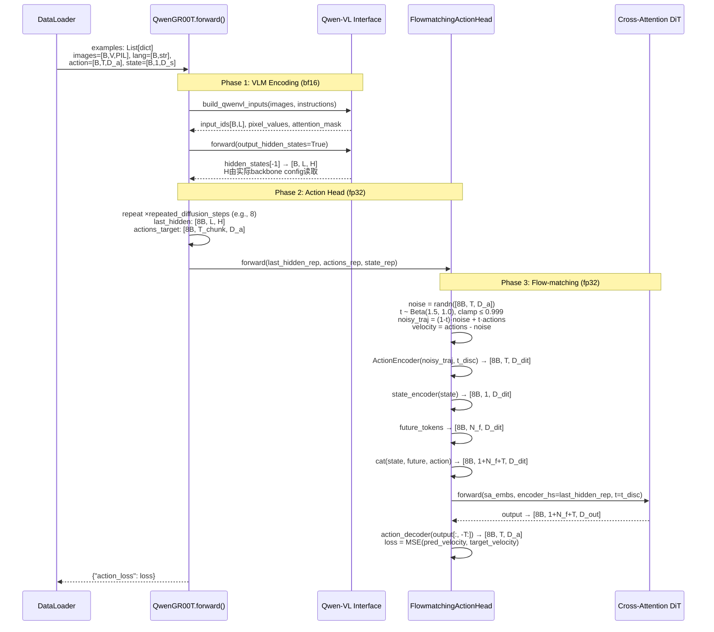

**关键维度传播**（以公开 Qwen3-VL-4B checkpoint 的 `H=2560` + DiT-B 为例；代码运行时以实际 config 为准）：

| 阶段 | 张量 | 形状 | 精度 |
|------|------|------|------|
| VLM 输入 | pixel_values | `[B, 3, H, W]` (变长) | bf16 |
| VLM 输入 | input_ids | `[B, L]` (~200-500 tokens) | int64 |
| VLM 输出 | hidden_states[-1] | `[B, L, 2560]` | bf16 |
| 重复后 | last_hidden_rep | `[8B, L, 2560]` | bf16→fp32 |
| ActionEncoder 输出 | action_features | `[8B, T, 768]` | fp32 |
| State Encoder 输出 | state_features | `[8B, 1, 768]` | fp32 |
| DiT 输入 (sa_embs) | hidden_states | `[8B, 1+32+T, 768]` | fp32 |
| DiT 输出 | pred_velocity | `[8B, T, D_a]` (e.g., 7) | fp32 |

### 8.2 QwenPI_v3：逐层交叉注意力 + 离散化状态

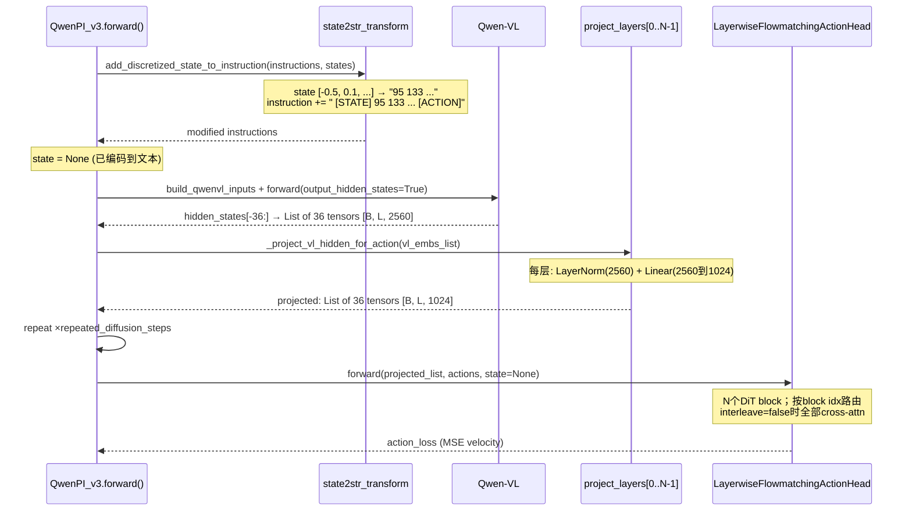

**与 QwenGR00T 的关键差异**：

1. **状态编码路径不同**：状态通过离散化注入文本，在 VLM 内部处理（而非外部 MLP）
2. **VLM 特征利用深度不同**：保留 36 层 hidden states；发布的 Bridge-RT-1 checkpoint 设置 `interleave_self_attention=false`，因此 36 层均进入对应 cross-attn。若使用代码默认 `interleave=true`，奇数 block 为 self-attn，奇数下标 VLM hidden 不参与 cross-attn
3. **投影层**：每层有独立的 `LayerNorm + Linear`（公开 checkpoint 为 2560→1024），将 VLM 维度压缩；其他 backbone 以运行时 hidden size 为准
4. **DiT 层数**：`num_dit_blocks = num_vl_layers = 36`，不是 72；是否交错 self-attn 由同一组 36 个 block 内的 `interleave_self_attention` 决定

### 8.3 QwenFast：自回归离散 Token

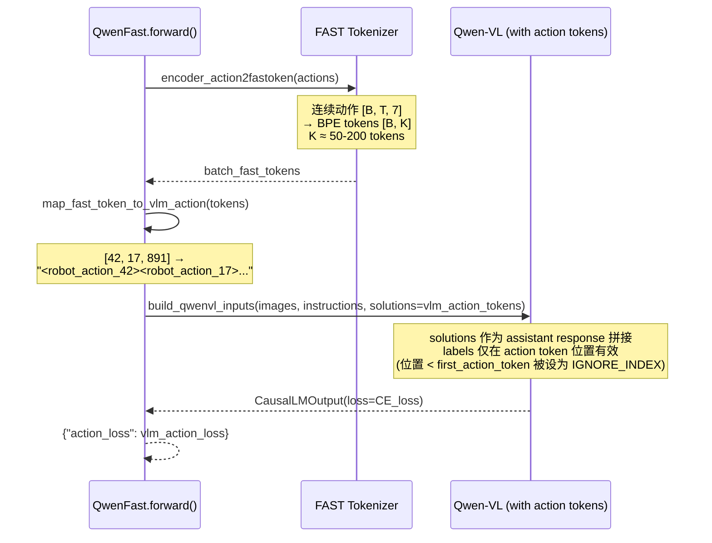

**关键特点**：
- **无独立动作头**：完全复用 VLM 的 LM head
- **损失函数**：标准交叉熵（next-token prediction），仅在动作 token 位置计算
- **精度**：VLM 全程 bf16
- **推理**：需要自回归生成（`model.generate()`），比 flow-matching 慢得多

### 8.4 WanGR00T：世界模型 → 动作头

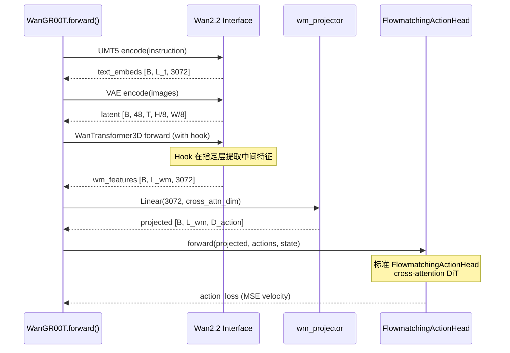

**独特之处**：
- 文本条件化通过世界模型的 UMT5 处理（而非 VLM）
- 视觉特征来自 VAE 潜变量 + DiT 中间层（而非 ViT patch 特征）
- 维度较大（3072），需要投影层对齐

---

## 第 9 章：反向传播与梯度流分析

### 9.1 冻结/可训练配置

starVLA 使用 `freeze_backbones()` 和 `build_param_lr_groups()` 两个函数协同管理参数训练策略。

#### freeze_backbones()

通过 YAML 配置字段 `trainer.freeze_modules` 指定需要冻结的模块路径（[trainer_tools.py:192-234](../../starVLA/training/trainer_utils/trainer_tools.py#L192-L234)）：

```yaml
# 典型配置：冻结 VLM，只训练动作头和投影层
trainer:
  freeze_modules: "qwen_vl_interface"
```

```python
@staticmethod
def freeze_backbones(model, freeze_modules=""):
    patterns = [p.strip() for p in freeze_modules.split(",")]
    for path in patterns:
        module = model
        for attr in path.split("."):
            module = getattr(module, attr)
        for param in module.parameters():
            param.requires_grad = False
```

#### build_param_lr_groups()

支持不同模块使用不同学习率（[trainer_tools.py:92-148](../../starVLA/training/trainer_utils/trainer_tools.py#L92-L148)）：

```yaml
# 典型配置：VLM 低学习率微调，动作头高学习率训练
trainer:
  learning_rate:
    base: 1e-4                    # 默认（未指定的模块）
    qwen_vl_interface: 2e-5       # VLM 低学习率
    action_model: 5e-4            # 动作头高学习率
    project_layers: 3e-4          # 投影层中等学习率
```

```python
def build_param_lr_groups(model, cfg):
    lr_cfg = cfg.trainer.learning_rate
    base_lr = lr_cfg.get("base", 1e-4)

    for module_name, lr in lr_cfg.items():
        if module_name == "base": continue
        module = resolve_module(model, module_name)
        params = [p for p in module.parameters() if id(p) not in frozen_params]
        param_groups.append({"params": params, "lr": lr, "name": module_name})

    other_params = [p for p in model.parameters()
                    if id(p) not in used_params and id(p) not in frozen_params]
    param_groups.append({"params": other_params, "lr": base_lr, "name": "base"})
```

### 9.2 各框架的梯度流分析

#### QwenGR00T 梯度流

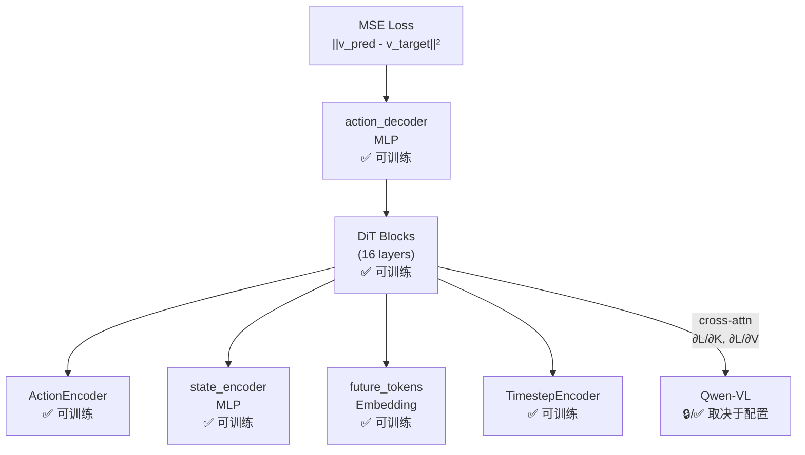

**两种典型训练策略**：

1. **冻结 VLM**（`freeze_modules: "qwen_vl_interface"`）：
   - 梯度流在 DiT 的 cross-attention 处截断
   - 仅训练 `action_model`（DiT + MLP）
   - 参数效率高，适合小数据集

2. **端到端微调**（`freeze_modules: ""`）：
   - 梯度从 DiT 通过 cross-attention 的 K/V 投影反向传播到 VLM
   - VLM 使用低学习率（如 2e-5），动作头使用高学习率（如 5e-4）
   - 更好的性能，但需要更多计算和数据

#### QwenPI_v3 梯度流

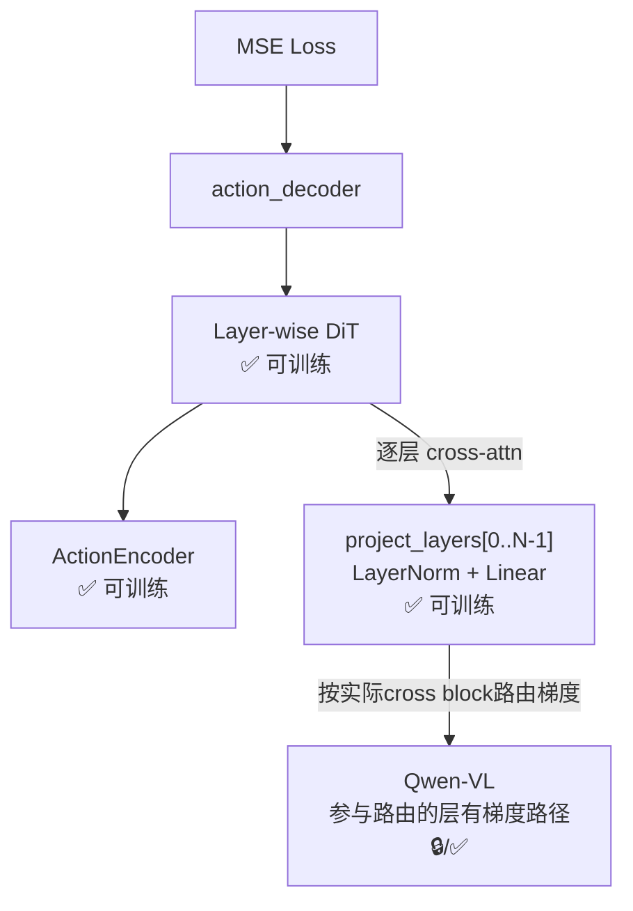

**投影层的梯度作用**：`interleave_self_attention=false` 时，每个 `project_layers[i]` 都通过对应 cross-attn 向 VLM hidden 建立梯度路径。`interleave=true` 时，奇数 DiT block 为 self-attn，对应奇数下标 projector 输出未被动作头使用，不能声称所有 VLM 层都收到独立动作梯度。即使全部层参与，所谓“底层只学空间、顶层只学语义”也只是常见表征解释，不是该代码直接保证的监督分解。

#### QwenFast 梯度流

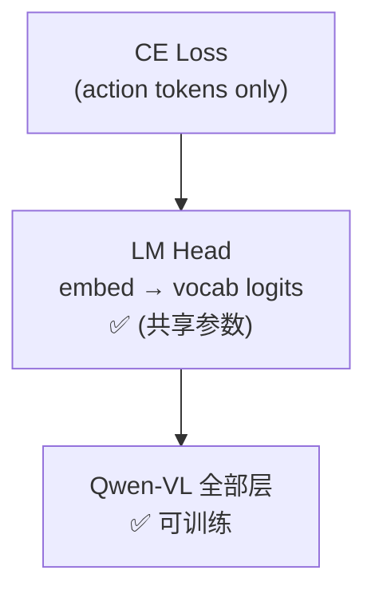

QwenFast 的梯度最为简洁：标准 language modeling 梯度直接从 LM head 流向所有 VLM 参数。**无独立动作模块**，所有参数在统一的 CE loss 下更新。

### 9.3 损失函数总结

| 框架类型 | 损失函数 | 数学表达 | 作用域 |
|----------|----------|----------|--------|
| Flow-matching (GR00T/PI) | MSE velocity | $\|v_\theta(x_t, t) - (x_1 - \epsilon)\|^2$ | 动作头 |
| MLP L1 (OFT) | L1 regression | $\|\hat{a} - a\|_1$ | MLP 头 |
| FAST (autoregressive) | Cross-Entropy | $-\sum_k \log p(a_k \| a_{<k})$ | VLM LM head |
| LangForce | Action + LLR | $\mathcal{L}_\text{action} + \lambda \mathcal{L}_\text{LLR}$ | 双分支 |
| Co-training VLM | VLM CE | $-\sum_t \log p(w_t \| w_{<t})$ | VLM LM head |

**Co-training 损失组合**（通过 `compute_loss()` 路由，[base_framework.py:145-181](../../starVLA/model/framework/base_framework.py#L145-L181)）：

```python
def compute_loss(self, tag, batch, loss_scale=None):
    scale = (loss_scale or {}).get(tag, 1.0)
    if tag == "vla":
        out = self.forward(batch)        # → {"action_loss": ...}
    elif tag == "vlm":
        out = self.forward_vlm(batch)    # → {"vlm_loss": ...}
    return {k: v * scale for k, v in out.items() if isinstance(v, torch.Tensor)}
```

### 9.4 精度混合策略

starVLA 在前向和反向传播中使用精度混合（mixed precision）：

| 阶段 | 精度 | 原因 |
|------|------|------|
| VLM 前向 | `torch.autocast("cuda", dtype=torch.bfloat16)` | 节省显存，VLM 参数量大 |
| 动作头前向 | `torch.autocast("cuda", dtype=torch.float32)` | 动作预测需要高精度 |
| VLM 反向 | bf16 梯度（DeepSpeed ZeRO 管理） | 自动混合精度 |
| 动作头反向 | fp32 梯度 | 避免梯度下溢 |

代码中的精度切换点：

```python
# QwenGR00T.py:182-193 — 两个 autocast 上下文
with torch.autocast("cuda", dtype=torch.bfloat16):    # VLM 编码
    qwenvl_outputs = self.qwen_vl_interface(**qwen_inputs, output_hidden_states=True)
    last_hidden = qwenvl_outputs.hidden_states[-1]

with torch.autocast("cuda", dtype=torch.float32):     # 动作头
    action_loss = self.action_model(last_hidden_repeated, actions_target_repeated, state_repeated)
```

---

## 第 10 章：纵向分析——VLA 融合技术演进

### 10.1 VLA 发展时间线

```
2022                    2023                    2024                    2025                    2026
  │                       │                       │                       │                       │
  │                    RT-2                    Octo                   π₀.5                  starVLA
  │                  (Google)               (Berkeley)               (PhyIntel)            (社区)
  │                    │                       │                       │                       │
  │               "VLM→Action"          "Transformer                "Flow-matching         "可组合
  │              自回归token           Policy"                    + Gemma Expert"       VLA 平台"
  │              预测动作              多任务扩散                  逐层交叉注意力         12种融合
  │                    │                       │                       │                  5种骨干
  │                    │                    OpenVLA                 GR00T N1             18+框架
  │                    │                  (TRI/Stanford)            (NVIDIA)                │
  │                    │                   "VLM+L1"               "VLM+DiT"                │
  │                    │                    回归头                 Flow-matching             │
  │                    │                       │                       │                       │
  ├──────────────────────────────────────────────────────────────────────────────────────────┤
       语义理解驱动           多模态策略学习          精细动作生成           平台化/组件化
```

### 10.2 四代融合技术演进

#### 第一代：VLM 自回归预测（2023）

**代表**: RT-2, RT-2-X

**核心思想**: 将动作离散化为 token，复用 VLM 的 next-token prediction 能力。

**starVLA 对应**: QwenFast（机制 6.6）

**优势**: 简单、统一、可利用 VLM 预训练
**劣势**: 离散化精度损失、推理速度慢（自回归生成）

#### 第二代：VLM + 独立回归头（2024 上半年）

**代表**: OpenVLA, OpenVLA-OFT, Octo

**核心思想**: VLM 提供特征，独立的 MLP/Transformer 头回归连续动作。

**starVLA 对应**: QwenOFT（机制 6.5）, QwenAdapter（机制 6.12）

**优势**: 保持连续精度、推理快
**劣势**: 若只读取最后层，可能丢失中间层空间细节；但 action-query 方案也可抽取多层特征，不能把所有 MLP/OFT 一概归为“仅最后一层”

#### 第三代：VLM + Flow-matching DiT（2024 下半年）

**代表**: π₀ (Physical Intelligence), GR00T N1 (NVIDIA)

**核心思想**: 使用基于 DiT 的 flow-matching 动作头，通过交叉注意力条件化于 VLM 特征。

**starVLA 对应**: QwenGR00T（机制 6.2）, PI0（机制 6.7）

**优势**: 表达力强的连续动作分布、多步去噪精化
**劣势**: 推理需多步迭代

#### 第四代：逐层融合、共享专家与统一状态编码（2025）

**代表**: π₀.5 (Physical Intelligence)、GR00T N1.5/N1.6 (NVIDIA)、InternVLA-M1

**核心思想**: 通过共享 action expert、选择或路由多层 VLM 表征、状态 token 化或 latent bottleneck，实现更深层的语义—动作交互。不同模型并不都“使用 VLM 所有层”。

**starVLA 对应**: QwenPI_v3（机制 6.3 + 6.10）, PI05（机制 6.7 + 6.10）

**优势**: 多层次信息利用、零参数状态编码
**劣势**: 参数量大（每层投影层）、离散化状态有精度损失

#### 第五代：多流对齐、语言约束与 World-Action Model（2026）

**代表**: Qwen-RobotManip、LangForce、RLDX-1、InternVLA-A1.5、DreamZero、Kairos、π₀.7

**核心思想**: 从“换一个动作头”转向数据与表征对齐、多流交互、未来 latent、世界—动作联合建模，以及显式抑制视觉捷径。

**证据**: 这类模型主要在 LIBERO-Plus、RoboTwin Randomized、RoboCasa365、DOMINO 和真机赛道上体现差异，而不是只追求已接近饱和的 LIBERO 域内分数。

**风险**: 训练数据、推理算力和评测协议差异巨大，尚缺覆盖所有模型的统一复测。

### 10.3 starVLA 的独特贡献

starVLA 并非实现某一种 VLA，而是**将所有四代技术统一到一个可组合平台**中。用户可以：

1. **复现**：实现 RT-2 风格（QwenFast）、OpenVLA 风格（QwenOFT）、GR00T 风格（QwenGR00T）、π₀ 风格（PI0/PI05）
2. **组合**：将 Qwen-VL 与 GR00T 动作头组合（QwenGR00T）、将世界模型与 flow-matching 组合（WanGR00T）
3. **扩展**：添加新的 VLM 骨干（Gemma4、MiniCPM）或新的动作头

### 10.4 业界前沿对比

| 方案 | 发布时间 | VLM | 动作头 | 融合 | 特点 |
|------|----------|-----|--------|------|------|
| RT-2 | 2023.07 | PaLM-E | Token 预测 | 自回归 | 首个大规模 VLA |
| OpenVLA | 2024.06 | Prismatic-7B | MLP L1 | Token 拼接 | 首个开源 VLA |
| π₀ | 2024.10 | PaliGemma | Flow-matching | 交错专家 | 开创共享动作专家路线 |
| GR00T N1 | 2024.10 | Eagle-2 | Flow-matching DiT | 交叉注意力 | 多机器人泛化 |
| π₀.5 | 2025.04 | PaliGemma | Flow-matching | 共享专家+离散状态 | 层次化与开放世界泛化 |
| GR00T N1.5/N1.6 | 2025 | Eagle 系 | Flow-matching DiT | 双系统动作专家 | 多 embodiment 部署 |
| InternVLA-M1 | 2025 | Qwen-VL+DINO | DDPM DiT | QFormer latent 瓶颈 | 固定通信量、CFG |
| Qwen-RobotManip | 2026.06 | Qwen-VL | 连续动作专家 | 规模化对齐 | 强 OOD 与跨 embodiment |
| RLDX-1 | 2026.05 | 多模态 backbone | Flow-matching | 多流交互 | 状态/历史/触觉扩展 |
| InternVLA-A1.5 | 2026.07 | Qwen3.5 | Flow-matching expert | foresight latent | 动态与组合泛化 |
| DreamZero / Kairos | 2026 | 视频/世界模型 | 联合 ActionDiT | World-Action | 未来建模与动作联合 |
| **starVLA** | 2025-2026 | 多种可选 | 多种可选 | **12 种可选** | **可组合平台** |

---

## 第 11 章：横向分析——starVLA 内部框架对比

### 11.1 框架总对比表

| 框架 | VLM 骨干 | 动作头 | 融合机制 | 状态编码 | 参数量级 |
|------|----------|--------|----------|----------|----------|
| **QwenGR00T** | Qwen-VL | FlowmatchingActionHead | 单层→DiT | MLP | ~5B |
| **QwenPI_v3** | Qwen-VL | LayerwiseFM | 逐层→DiT | 离散化文本 | ~5B |
| **QwenFast** | Qwen-VL (Action) | FAST tokenizer | 自回归 token | 无 | ~4.4B |
| **QwenOFT** | Qwen-VL (Action) | MLP L1 | 序列内回归 | 离散化文本(可选) | ~4.5B |
| **QwenDual** | Qwen-VL + DINOv2 | FlowmatchingActionHead | 双编码器→DiT | MLP | ~5.5B |
| **QwenAdapter** | Qwen-VL | VLA-Adapter | Hook 注入 | ProprioProjector | ~4.8B |
| **InternVLA-M1** | Qwen-VL + DINOv2 | DDPM DiT + CFG | QFormer 聚合 | 无显式 state 路径 | ~6B |
| **PI0** | PaliGemma | OpenPI0ActionHead | 交错专家 | 连续 state projection | ~3B |
| **PI05** | PaliGemma | OpenPI05ActionHead | 交错专家+adaRMS | 离散化文本 | ~3B |
| **LangForce** | Qwen-VL | Flow-matching | 同一 VLM 双前向 + PMI/LLR | MLP | 取决于 backbone；并非两套 VLM 参数 |
| **WanGR00T** | Wan2.2 WM | FlowmatchingActionHead | WM→DiT | MLP | ~15B+ |
| **WanPI** | Wan2.2 WM | LayerwiseFM | WM 逐层→DiT | MLP | ~15B+ |
| **CosmoPredict2GR00T** | CosmoPredict2 WM | FlowmatchingActionHead | WM→DiT | MLP | ~10B+ |
| **MiniCPMGR00T** | MiniCPM-V | FlowmatchingActionHead | 单层→DiT | MLP | ~4B |
| **Gemma4GR00T** | Gemma4 | FlowmatchingActionHead | 单层→DiT | MLP | ~5B |
| **QwenDiscreteDiffusion** | Qwen-VL | MaskGIT Discrete | 逐层→DD | MLP | ~5B |

### 11.2 参数分布分析

以 QwenPI_v3（Qwen3-VL-4B + DiT hidden=1024）为参考：

```
┌─────────────────────────────────────────────────────────┐
│                    QwenPI_v3 参数分布                      │
│                                                           │
│  ████████████████████████████████████░░░░░  87.5%  VLM    │
│  █████░░░░░░░░░░░░░░░░░░░░░░░░░░░░░░░░░░  10.6%  动作头  │
│  █░░░░░░░░░░░░░░░░░░░░░░░░░░░░░░░░░░░░░░   1.9%  投影层  │
└─────────────────────────────────────────────────────────┘
```

**跨框架参数分布对比**：

| 框架 | VLM % | 动作头 % | 其他 % |
|------|-------|---------|--------|
| QwenGR00T | ~92% | ~8% | <1% |
| QwenPI_v3 | ~87.5% | ~10.6% | ~1.9% (投影层) |
| QwenFast | ~100% | 0% (共享) | <1% (tokenizer) |
| QwenOFT | ~98% | ~2% (MLP) | 0% |
| PI0 | ~60% (VLM) | ~40% (Expert) | <1% |

**洞察**：
- **VLM 主导**：在大多数框架中，VLM 骨干占总参数的 85-100%
- **PI0 例外**：PI0/PI05 的 action expert 规模与 VLM 相当（~40%），因为它是一个完整的 Gemma 变体
- **QwenFast 极端**：完全不引入额外参数（动作预测复用 VLM 的 LM head）

### 11.3 融合机制维度分析

第 6.13 节已按条件路径、动作空间、NFE、优势和风险给出机制矩阵。这里不再用主观星级把“动作精度”归因给单个结构，因为公开结果表明：

- 同一 Qwen3-VL 的 LIBERO 表中，OFT 96.6、GR00T 96.5、逐层 π 95.7、FAST 95.4，结构复杂度与域内平均分并不单调。
- SimplerEnv Bridge+RT-1 中，PI_v3 69.8 高于 GR00T 65.3、FAST 58.6、OFT 42.7，连续生成与逐层条件在该设置更有优势。
- LIBERO-Plus、DOMINO、RoboCasa365 更依赖数据对齐、未来 latent、多流信息和语言约束，而不只是解码器类别。

因此选型应同时报告 backbone、训练数据、动作 horizon、NFE 和评测协议。

### 11.4 设计取舍空间

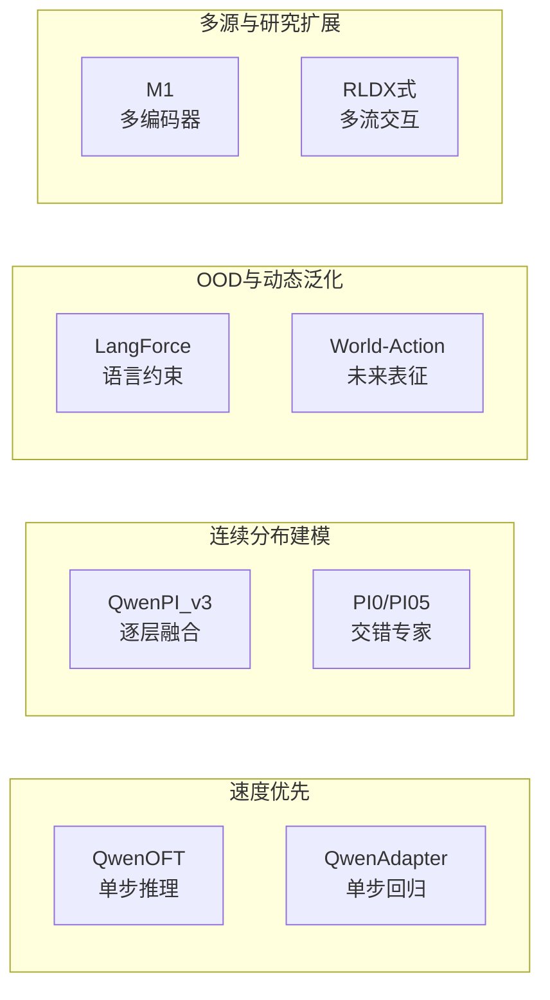

**选择建议**：

- **快速原型与低延迟** → QwenOFT / QwenAdapter（单次回归，头部小）
- **连续多峰轨迹** → QwenGR00T / QwenPI_v3 / PI05（flow matching，需多步推理）
- **指令歧义** → LangForce 或其他显式语言约束路线
- **动态与长时程** → foresight latent / World-Action Model；需同时评估延迟
- **多机器人、多传感器** → multi-stream 或类别专用 action encoder；性能取决于跨 embodiment 对齐数据

---

## 第 12 章：结论与未来方向

### 12.1 关键发现总结

1. **模态覆盖**：starVLA 支持 4 种输入模态（视觉/语言/状态/动作），所有视觉均为 RGB，不支持深度/触觉/点云/音频

2. **融合机制多样性**：12 种融合机制覆盖了从最简单的 token 拼接到最复杂的交错专家注意力的完整谱系

3. **设计趋势**：
   - **从单层到多层/共享层**：本地 GR00T 复用最后层，PI 系按 block 路由多层 hidden，π0 系让 VLM 与 action expert 逐层联合注意力；三者不是同一种“逐层”
   - **从外部到内部**：状态编码从外部 MLP 到直接嵌入 VLM 文本（离散化）
   - **从分离到统一**：动作头从独立模块到与 VLM 共享参数（FAST/交错专家）

4. **Flow-matching 主导但非唯一**：GR00T、PI、WM4A 和 LangForce 大量复用 flow matching；同时存在 OFT L1、FAST AR、MaskGIT 离散扩散和 M1 DDPM

5. **条件化机制分化**：FM/Layerwise DiT 主力使用 timestep→AdaLayerNorm；PI05 使用 adaRMS；M1 使用 timestep/label embedding+CFG；OFT/Adapter 无扩散时间条件

### 12.2 未来方向

#### 统一多模态 Token 化

当前 starVLA 的视觉/语言/状态使用不同的 tokenizer 和嵌入空间。一个自然的演进方向是**统一 tokenizer**——将所有模态映射到同一个离散 token 空间，使 VLA 成为一个真正的 sequence-to-sequence 模型。

#### 层次化时序融合

当前所有框架仅处理单帧或少数帧的观察。融入**时序建模**（如 video transformer 的时间注意力）可以捕捉动态信息，这对接触-rich 操作和长 horizon 规划至关重要。

#### 触觉/力觉模态

starVLA 目前不支持触觉/力觉传感器数据。对于精细操作（如装配、线缆操作），力反馈信息是不可或缺的。将力/触觉模态作为新的状态维度或独立编码器是一个重要的扩展方向。

#### 世界模型深度融合

当前 WM4A 家族仅通过 hook 提取中间特征，融合方式较为粗糙。更深层的融合可以包括：
- 在世界模型 DiT 内部注入动作条件化
- 世界模型的视频预测 loss 作为辅助训练信号
- 世界模型生成的"想象"帧作为额外视觉输入

#### VLA 缩放定律

starVLA 的模块化设计使其成为研究 VLA 缩放定律的理想平台：
- VLM 大小 vs 动作精度
- DiT 深度/宽度 vs 任务复杂度
- 训练数据多样性 vs 泛化能力

---

## 参考文件索引

| 文件路径 | 职责 |
|----------|------|
| [base_framework.py](../../starVLA/model/framework/base_framework.py) | 基类定义、框架注册、`build_framework()` |
| [QwenGR00T.py](../../starVLA/model/framework/VLM4A/QwenGR00T.py) | Qwen-VL + Flow-matching DiT |
| [QwenPI_v3.py](../../starVLA/model/framework/VLM4A/QwenPI_v3.py) | 逐层交叉注意力 + 离散化状态 |
| [QwenFast.py](../../starVLA/model/framework/VLM4A/QwenFast.py) | FAST 自回归离散 token |
| [QwenOFT.py](../../starVLA/model/framework/VLM4A/QwenOFT.py) | MLP L1 回归 + 动作 token 注入 |
| [PI0.py](../../starVLA/model/framework/VLM4A/PI0.py) | PaliGemma + Gemma 交错专家 |
| [M1.py](../../starVLA/model/framework/VLM4A/M1.py) | Qwen-VL + DINOv2 + QFormer |
| [LangForce.py](../../starVLA/model/framework/VLM4A/LangForce.py) | 双分支贝叶斯分解 |
| [QwenAdapter.py](../../starVLA/model/framework/VLM4A/QwenAdapter.py) | VLA-Adapter + ProprioProjector |
| [WanGR00T.py](../../starVLA/model/framework/WM4A/WanGR00T.py) | Wan2.2 世界模型 + 动作头 |
| [GR00T_ActionHeader.py](../../starVLA/model/modules/action_model/GR00T_ActionHeader.py) | FlowmatchingActionHead |
| [LayerwiseFM_ActionHeader.py](../../starVLA/model/modules/action_model/LayerwiseFM_ActionHeader.py) | LayerwiseFlowmatchingActionHead |
| [cross_attention_dit.py](../../starVLA/model/modules/action_model/flow_matching_head/cross_attention_dit.py) | DiT + AdaLayerNorm + BasicTransformerBlock |
| [QWen3.py](../../starVLA/model/modules/vlm/QWen3.py) | Qwen3-VL 接口包装 |
| [dino.py](../../starVLA/model/modules/dino_model/dino.py) | DINOv2 视觉骨干 |
| [trainer_tools.py](../../starVLA/training/trainer_utils/trainer_tools.py) | freeze_backbones, build_param_lr_groups |
| [train_starvla.py](../../starVLA/training/train_starvla.py) | VLA 训练入口 |
