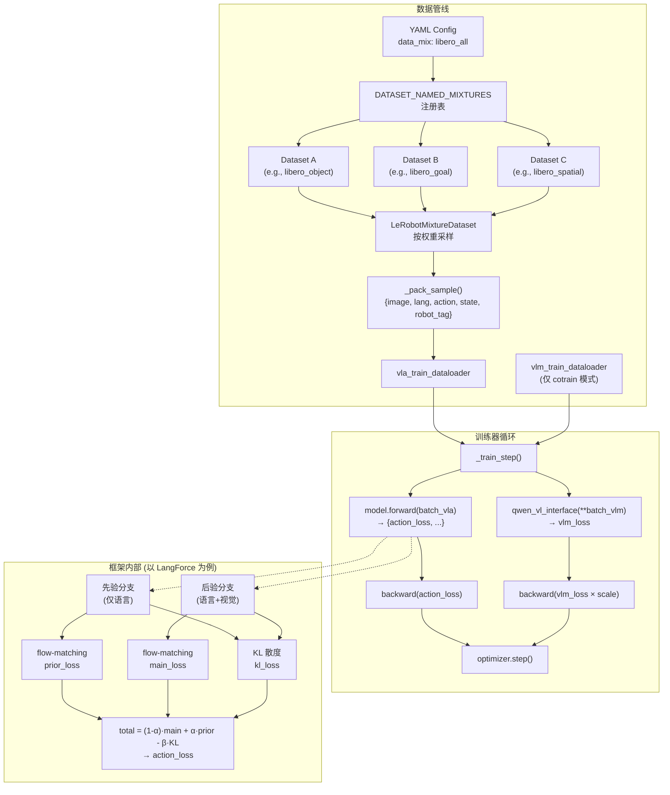

# starVLA 补充分析

> 本文档收录对 starVLA 代码库的补充专题分析，与 [starVLA_mdal_fuse.md](starVLA_mdal_fuse.md) 互为姊妹篇。

---

## 第 1 章  多任务 (Multi-task) 与多 Loss 训练机制深度分析

### 1.0 结论先行

**starVLA 支持多任务与多 Loss 训练，但方式分层且有局限。**

多任务能力的核心是 **"语言条件化 + 数据混合"** 驱动——本质上是一个以自然语言为任务描述的泛化策略网络，而非传统的多 head、多 loss 分支架构。多 Loss 训练仅在协训练模式（VLA + VLM）下通过双数据流实现，且 loss 组合策略较简单（固定权重加权）。

### 1.1 多任务训练的三个层面

starVLA 通过 **三个层面** 实现多任务训练：

#### 1.1.1 语言条件化的数据混合（主要机制）

这是 starVLA 实现多任务泛化的核心手段。其原理是：**将不同的操作任务统一表示为「自然语言指令 + 示范轨迹」对，模型学习一个以语言为条件的统一策略 $\pi(a_t | o_t, l)$，无需为每个任务设计独立的网络分支。**

##### 数据混合注册表

混合配置定义在 [`mixtures.py`](../../starVLA/dataloader/gr00t_lerobot/mixtures.py) 以及各 benchmark 目录下的 `data_config.py` 文件中。注册表的数据结构为：

```python
# starVLA/dataloader/gr00t_lerobot/mixtures.py
DATASET_NAMED_MIXTURES = {
    # mixture_name → [(dataset_name, sampling_weight, robot_type)]
    "libero_all": [
        ("libero_object_no_noops_1.0.0_lerobot", 1.0, "libero_franka"),
        ("libero_goal_no_noops_1.0.0_lerobot",   1.0, "libero_franka"),
        ("libero_spatial_no_noops_1.0.0_lerobot", 1.0, "libero_franka"),
        ("libero_10_no_noops_1.0.0_lerobot",      1.0, "libero_franka"),
    ],
    "bridge_rt_1": [
        ("bridge_orig_1.0.0_lerobot",             1.0, "oxe_bridge"),
        ("fractal20220817_data_0.1.0_lerobot",    1.0, "oxe_rt1"),
    ],
    "robotwin_all": [  # 96 个不同操作任务
        ("Clean/adjust_bottle",  1.0, "robotwin"),
        ("Clean/beat_block_hammer", 1.0, "robotwin"),
        # ... 共 96 条
    ],
    # ...
}
```

代表性的混合规模：

| 混合名 | 数据集数 | 任务数 | 机器人类型 |
|--------|---------|-------|-----------|
| `libero_goal` | 1 | 10 | Franka |
| `libero_all` | 4 | 130 | Franka |
| `bridge_rt_1` | 2 | ~100+ | Bridge + RT-1 (跨域) |
| `robotwin_all` | 96 | 48×2 | RobotWin 双臂 |
| `fourier_gr1_unified_1000` | 24 | 24 | Fourier GR1 人形 |

##### LeRobotMixtureDataset 的采样机制

[`LeRobotMixtureDataset`](../../starVLA/dataloader/gr00t_lerobot/datasets.py#L2161) 负责在训练时按权重从多个数据集中采样：

```python
# starVLA/dataloader/gr00t_lerobot/datasets.py:2161-2278
class LeRobotMixtureDataset(Dataset):
    def __init__(self, data_mixture, mode, balance_dataset_weights=True,
                 balance_trajectory_weights=True, seed=42, ...):
        # 1. 收集各数据集及其权重
        for dataset, weight in data_mixture:
            datasets.append(dataset)
            dataset_sampling_weights.append(weight)

        # 2. 可选: 按数据量平衡权重
        if self.balance_dataset_weights:
            self._dataset_sampling_weights *= self._dataset_lengths
            # 效果: 大数据集被采样的概率更高，避免小数据集被过采样

        # 3. 可选: 按轨迹长度加权
        if self.balance_trajectory_weights:
            trajectory_sampling_weights *= dataset.trajectory_lengths
            # 效果: 长轨迹(复杂任务)被采样的概率更高
```

该机制的关键特性：

- **权重归一化**：所有数据集权重在初始化时归一化为概率分布
- **容错处理**：跳过空数据集、处理零权重和 NaN 情况
- **主数据集标记**：权重为 1.0 的数据集被标记为主数据集（`_primary_dataset_indices`），用于统计量计算

##### 样本打包 (_pack_sample)

所有数据集的输出通过 [`_pack_sample()`](../../starVLA/dataloader/gr00t_lerobot/datasets.py#L1379) 统一为模型消费的格式：

```python
# starVLA/dataloader/gr00t_lerobot/datasets.py:1379-1416
def _pack_sample(self, data: dict) -> dict:
    sample = {
        "action": action,       # np.ndarray [T, action_dim]
        "image": step_images,   # List[PIL.Image] (多视角)
        "lang": language,       # str (自然语言任务指令)
        "robot_tag": self.tag   # str (机器人实体标识)
    }
    if include_state:
        sample["state"] = state  # np.ndarray [1, state_dim]
    return sample
```

**任务区分完全依赖 `lang` 字段**——即自然语言指令。模型不需要知道 "这是任务 #5"，只需要理解 "pick up the red block and place it on the plate"。

##### 语言条件化的任务模板

许多实验配置中使用 Chain-of-Thought 提示模板来丰富任务描述：

```yaml
# 典型 YAML 配置
vla_data:
  CoT_prompt: "Your task is {instruction}. To identify the key objects
               for your task. Locate their bounding boxes in
               [x1,y1,x2,y2] format."
```

`{instruction}` 会被替换为数据集中每条轨迹的 `language_instruction`，例如：

```
"Your task is pick up the red block and place it on the plate.
 To identify the key objects for your task. Locate their bounding
 boxes in [x1,y1,x2,y2] format."
```

这使得 VLM 骨干在理解任务语义的同时，可以利用视觉定位能力（边界框预测）来辅助动作生成。

> **与传统多任务学习的区别**：传统方法（如 MT-Opt、Gato）通常用 task ID 或 one-hot 向量区分任务，需要预定义任务集合。starVLA 的方式更接近 RT-2 / Octo 的 "language-conditioned policy" 范式——任务集合是开放的，泛化到未见过的任务描述成为可能。

---

#### 1.1.2 多机器人实体支持 (Multi-embodiment)

starVLA 通过 `CategorySpecificLinear` 模块支持**多机器人实体共享训练**——不同的机器人共享 VLM 骨干和 DiT 注意力层，但各自拥有独立的 action encoder/decoder 权重。

```python
# starVLA/model/modules/action_model/GR00T_ActionHeader.py:25-37
class CategorySpecificLinear(nn.Module):
    """Maintains separate weight matrices for each embodiment category."""
    def __init__(self, num_categories, input_dim, output_dim):
        super().__init__()
        # [num_categories, output_dim, input_dim] 独立权重矩阵
        self.weight = nn.Parameter(
            torch.randn(num_categories, output_dim, input_dim))
        self.bias = nn.Parameter(
            torch.zeros(num_categories, output_dim))

    def forward(self, x, category_idx):
        # 按 category_idx 索引对应的权重矩阵
        W = self.weight[category_idx]   # [B, out, in]
        b = self.bias[category_idx]     # [B, out]
        return torch.bmm(W, x.unsqueeze(-1)).squeeze(-1) + b
```

该模块被用于 `ActionEncoder`（[GR00T_ActionHeader.py:44-45](../../starVLA/model/modules/action_model/GR00T_ActionHeader.py#L44-L45)），支持最多 `max_num_embodiments=32` 种不同的机器人实体：

```python
# starVLA/model/modules/action_model/GR00T_ActionHeader.py:99-113
class ActionEncoder(nn.Module):
    def __init__(self, action_dim, hidden_size, num_embodiments):
        self.W1 = CategorySpecificLinear(num_embodiments, action_dim, hidden_size)
        self.W2 = CategorySpecificLinear(num_embodiments, 2*hidden_size, hidden_size)
        self.W3 = CategorySpecificLinear(num_embodiments, hidden_size, hidden_size)
```

三个 action head 实现都包含此机制：

| Action Head | 文件 |
|-------------|------|
| `FlowmatchingActionHead` | [`GR00T_ActionHeader.py`](../../starVLA/model/modules/action_model/GR00T_ActionHeader.py) |
| `LayerwiseFlowmatchingActionHead` | [`LayerwiseFM_ActionHeader.py`](../../starVLA/model/modules/action_model/LayerwiseFM_ActionHeader.py) |
| `AML_FlowmatchingActionHead` | [`AML_ActionHeader.py`](../../starVLA/model/modules/action_model/AML_ActionHeader.py) |

每个样本通过 `_pack_sample` 中的 `robot_tag` 字段标识其所属的机器人实体，该 tag 在 `data_config.py` 中定义。

> **架构意义**：这种设计使得 VLM 的视觉-语言理解能力在不同机器人间共享（因为"理解任务"是通用的），而机器人特有的运动学约束（action dimension、action space 等）通过独立的 encoder/decoder 权重来适配。

---

#### 1.1.3 VLA + VLM 协训练（Co-training）

[`train_starvla_cotrain.py`](../../starVLA/training/train_starvla_cotrain.py) 中的 `VLAMTrainer` 实现了**双数据流、双任务**的协训练：

```
┌─────────────────────────────────────────────────────┐
│                   VLAMTrainer._train_step            │
│                                                      │
│  ┌──────────────┐       ┌───────────────────┐        │
│  │ vla_dataloader│       │ vlm_dataloader    │        │
│  │ (robot data)  │       │ (captioning/QA)   │        │
│  └──────┬───────┘       └────────┬──────────┘        │
│         │                        │                    │
│         ▼                        ▼                    │
│  model.forward(batch_vla)   qwen_vl(**batch_vlm)     │
│         │                        │                    │
│         ▼                        ▼                    │
│    action_loss              vlm_loss × 0.1            │
│         │                        │                    │
│    backward(action_loss)    backward(vlm_loss)        │
│         │                        │                    │
│         └────────┬───────────────┘                    │
│                  ▼                                    │
│           optimizer.step()                            │
└─────────────────────────────────────────────────────┘
```

关键实现细节（[train_starvla_cotrain.py:358-426](../../starVLA/training/train_starvla_cotrain.py#L358-L426)）：

```python
def _train_step(self, batch_vla, batch_vlm):
    # === 路径 A: DeepSpeed 引擎（ZeRO-2/3）===
    if hasattr(self.model, "is_gradient_accumulation_boundary"):
        # 动作预测任务
        output_dict = self.model.forward(batch_vla)
        action_loss = output_dict["action_loss"]
        self.model.backward(action_loss)

        # VLM 语言理解任务
        vlm_output = unwrapped.qwen_vl_interface(**batch_vlm)
        vlm_loss = vlm_output.loss * self.config.trainer.loss_scale.vlm
        self.model.backward(vlm_loss)

        self.model.step()
        return {"action_dit_loss": action_loss.item(),
                "vlm_loss": vlm_loss.item()}

    # === 路径 B: Accelerate 标准路径 ===
    with self.accelerator.accumulate(self.model):
        output_dict = self.model.forward(batch_vla)
        action_loss = output_dict["action_loss"]
        self.accelerator.backward(action_loss)

        vlm_output = unwrapped.qwen_vl_interface(**batch_vlm)
        vlm_loss = vlm_output.loss * self.config.trainer.loss_scale.vlm
        self.accelerator.backward(vlm_loss)

        self.optimizer.step()
```

YAML 配置中的协训练参数：

```yaml
# examples/modelExtensions/CoTrainVLM/train_files/starvla_cotrain_libero.yaml
datasets:
  vlm_data:
    dataset_py: vlm_datasets
    dataset_use: sharegpt4v_coco  # VLM 数据源
    per_device_batch_size: 4
  vla_data:
    dataset_py: lerobot_datasets
    data_mix: libero_goal          # VLA 数据源
    per_device_batch_size: 16

trainer:
  loss_scale:
    vla: 1.0    # 动作损失权重
    vlm: 0.1    # VLM 损失权重 (通常远小于 VLA)
```

> **设计动机**：VLM 协训练的目的是在微调 VLM 骨干做动作预测时，保持其语言理解和视觉-语言对齐能力不退化（类似于 catastrophic forgetting 的缓解）。`loss_scale.vlm=0.1` 意味着 VLM 任务是辅助性的。

---

### 1.2 多 Loss 训练机制

#### 1.2.1 训练器层面的 Loss 架构

starVLA 提供 4 个独立的训练入口，对应不同的 loss 组合：

| 训练器 | 入口文件 | Loss 组成 | 使用场景 |
|--------|---------|----------|---------|
| `VLATrainer` | [`train_starvla.py`](../../starVLA/training/train_starvla.py) | 仅 `action_loss` | 纯动作预测训练 |
| `VLAMTrainer` (cotrain) | [`train_starvla_cotrain.py`](../../starVLA/training/train_starvla_cotrain.py) | `action_loss` + `vlm_loss` | VLA + VLM 协训练 |
| `VLAMTrainer` (vlm-only) | [`train_starvlm.py`](../../starVLA/training/train_starvlm.py) | 仅 `vlm_loss` | 纯 VLM 微调 |
| VLN Trainer | [`train_starvln.py`](../../starVLA/training/train_starvln.py) | HF Trainer 管理 | 视觉-语言导航 |

`VLATrainer` 的 [`_train_step`](../../starVLA/training/train_starvla.py#L402-L428) 最为简洁：

```python
def _train_step(self, batch_vla, batch_vlm=None):
    with self.accelerator.accumulate(self.model):
        self.optimizer.zero_grad()
        with torch.autocast("cuda", dtype=torch.bfloat16):
            output_dict = self.model.forward(batch_vla)
            action_loss = output_dict["action_loss"]
            total_loss = action_loss
        self.accelerator.backward(total_loss)
        # ...
    return {"action_dit_loss": action_loss.item()}
```

**关键发现**：训练器**只提取 `output_dict["action_loss"]`** 进行反向传播。框架 `forward()` 返回的其他 loss 键不会被训练器使用——多 loss 的组合必须在框架内部完成。

#### 1.2.2 框架内部的 Loss 组合

大多数框架只返回单一 `action_loss`，但 **LangForce** 是唯一的例外，它在 `forward()` 内部组合了三个损失函数：

```python
# starVLA/model/framework/VLM4A/LangForce.py:852-863
# === Step 5: Total loss ===
total_loss = (
    (1.0 - self.prior_loss_weight) * main_loss    # 后验分支 flow-matching
    + self.prior_loss_weight * prior_loss           # 先验分支 flow-matching
    - self.kl_weight * kl_loss                      # 语言对数似然比 (LLR)
)

return {
    "action_loss": total_loss,             # ← 参与梯度更新
    "main_loss": main_loss.detach(),       # ← 仅日志（detach!）
    "prior_loss": prior_loss.detach(),     # ← 仅日志（detach!）
    "kl_loss": kl_loss.detach(),           # ← 仅日志（detach!）
}
```

LangForce 的三个 loss 分量：

| Loss | 公式 | 含义 |
|------|------|------|
| `main_loss` | $\mathcal{L}_\text{FM}(f_\theta(z_t, c_\text{post}), u_t)$ | 后验条件（V+L+action query）下的 flow-matching 速度预测损失 |
| `prior_loss` | $\mathcal{L}_\text{FM}(f_\theta(z_t, c_\text{prior}), u_t)$ | 先验条件（仅 L，无 V）下的 flow-matching 速度预测损失 |
| `kl_loss` | $D_\text{KL}(p_\text{post} \| p_\text{prior})$ | 语言对数似然比，衡量语言对动作预测的贡献度 |

总损失公式：

$$\mathcal{L}_\text{total} = (1-\alpha) \cdot \mathcal{L}_\text{main} + \alpha \cdot \mathcal{L}_\text{prior} - \beta \cdot D_\text{KL}$$

其中 $\alpha$ = `prior_loss_weight`，$\beta$ = `kl_weight`（默认 0.1）。

> **注意**：$-\beta \cdot D_\text{KL}$ 项的负号意味着训练**最大化** KL 散度——鼓励后验分支比先验分支提供更多信息（即鼓励 VLM 真正"看到"视觉信息，而非仅依赖语言先验）。这是 LangForce 论文的核心思想。

#### 1.2.3 各框架返回的 action_loss 类型汇总

| 框架 | `action_loss` 的实际损失类型 | 组合方式 |
|------|---------------------------|---------|
| QwenGR00T / QwenDual / M1 / ABot_M0 / CosmosGR00T / WanGR00T / MiniCPMGR00T / Gemma4GR00T | Flow-matching velocity MSE | 单一损失 |
| QwenPI / QwenPI_v3 / WanPI / CosmoPredict2PI / MiniCPMPI / Gemma4PI | Flow-matching velocity MSE (layer-wise) | 单一损失 |
| QwenOFT | L1 回归 | 单一损失 |
| QwenFast | 交叉熵 (next-token) | 单一损失 |
| QwenDiscreteDiffusion | 交叉熵 (MaskGIT) | 单一损失 |
| QwenAdapter | Flow-matching velocity MSE | 单一损失 |
| PI0 / PI05 | Flow-matching velocity MSE | 单一损失 |
| **LangForce** | **(1-α)·main + α·prior - β·KL** | **三元组合** |

#### 1.2.4 `compute_loss` 统一接口（预留扩展点）

[`base_framework.py:145-181`](../../starVLA/model/framework/base_framework.py#L145-L181) 定义了一个基于 tag 路由的统一 loss 计算接口：

```python
def compute_loss(self, tag: str, batch, loss_scale: dict = None):
    """Unified forward entry-point: route to the right forward by tag.

    The trainer calls model.compute_loss(tag, batch) for every
    (tag, batch) pair produced by DataLoaderManager.
    """
    if not self.supports_training_tag(tag):
        return None

    scale = (loss_scale or {}).get(tag, 1.0)

    if tag == "vla":
        out = self.forward(batch)
    elif tag == "vlm":
        out = self.forward_vlm(batch)
    else:
        return None

    # Apply loss scale and filter to Tensor values only
    return {k: v * scale for k, v in out.items()
            if isinstance(v, torch.Tensor)}
```

配合 `supports_training_tag()` 方法：

```python
def supports_training_tag(self, tag: str) -> bool:
    if tag == "vla":
        return type(self).forward is not baseframework.forward
    if tag == "vlm":
        return hasattr(self, "qwen_vl_interface") or \
               type(self).forward_vlm is not baseframework.forward_vlm
    return False
```

**当前状态**：该接口已设计完成，但 **现有的四个训练器都没有调用它**。它们仍然直接调用 `model.forward()` 和 `qwen_vl_interface()`。这是一个为未来更灵活的多任务路由（如增加 `"world"` tag 进行世界模型训练）预留的扩展点。

---

### 1.3 当前不支持的多任务/多 Loss 能力

| 能力 | 状态 | 说明 |
|------|------|------|
| 任务 ID 路由到不同 head | 不支持 | 用语言条件化代替，无需预定义任务集合 |
| 多目标优化 (GradNorm / MGDA / Pareto) | 不支持 | loss 简单加权相加，权重为静态标量 |
| 逐样本动态 loss 权重 | 不支持 | `loss_scale` 是 YAML 中的全局常量 |
| 课程学习 / 任务调度 | 不支持 | `LeRobotMixtureDataset` 做均匀随机采样 |
| 3+ 种训练任务同步协训练 | 不支持 | 最多 VLA + VLM 两路，`compute_loss` 支持扩展但未启用 |
| 任务特定的评估指标 | 部分支持 | `eval_action_model` 仅计算全局 MSE，不区分任务 |
| 动态数据集混合比例 | 不支持 | 混合权重在初始化时固定，训练中不调整 |

---

### 1.4 数据流全景图



---

### 1.5 与业界方案的对比

| 维度 | starVLA | RT-2 / Octo | GR00T N1.5 | π₀.5 |
|------|---------|------------|------------|------|
| 任务区分 | 语言条件化 | 语言条件化 | 语言 + 实体 tag | 语言 + 离散化状态 |
| 数据混合 | 注册表 + 权重采样 | 手动比例 | 注册表 + 权重 | 大规模混合 |
| 多 Loss | VLA + VLM (可选) | 仅 action | action + VLM | action |
| 多实体 | CategorySpecificLinear | 不支持 | CategorySpecificLinear | 不支持 (统一 action space) |
| Loss 平衡 | 静态权重 | N/A | 静态权重 | N/A |
| 协训练 | VLA + VLM 双流 | 不支持 | VLA + VLM | 不支持 |

> **关键洞察**：starVLA 的多任务架构与 NVIDIA GR00T N1/N1.5 高度同源（`CategorySpecificLinear` 直接来自 GR00T 代码库），但在协训练维度上走得更远（加入了 VLM 协训练通道）。相比 π₀/π₀.5 的纯 action-only 训练，starVLA 通过 VLM 协训练保持了骨干的语言理解能力，这对零样本任务泛化是有利的。

---

### 1.6 小结

starVLA 的多任务能力总结如下：

1. **多任务 = 数据混合 + 语言条件化**：通过 `DATASET_NAMED_MIXTURES` 注册表混合不同任务的数据集，以自然语言指令区分任务，学习统一的条件策略 $\pi(a_t | o_t, l)$
2. **多实体 = CategorySpecificLinear**：共享 VLM 骨干 + 独立 action encoder/decoder 权重，支持最多 32 种机器人实体
3. **多 Loss = VLA + VLM 协训练**：两个独立的数据流、两次独立的反向传播、`loss_scale` 静态加权
4. **框架内 Loss 组合**：LangForce 是唯一实现三元 loss 组合的框架（main + prior + KL）
5. **扩展点就绪但未启用**：`compute_loss(tag, batch)` 接口支持未来增加更多训练任务类型

**主要局限**：缺少动态 loss 平衡（如 GradNorm）、课程学习、任务特定评估、以及 3+ 种任务的同步训练支持。这些在当前的研究平台定位下是合理的权衡——简单的静态混合已经在 LIBERO、SimplerEnv、RobotWin 等 benchmark 上取得了有效的多任务泛化结果。
