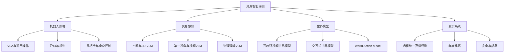
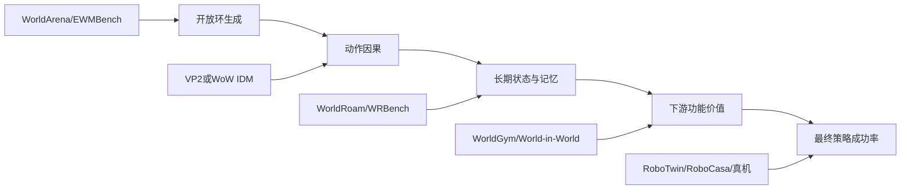

# 2026 机器人与具身智能 Benchmark、Leaderboard 与赛事全景

> **统计截止日：2026-07-15（UTC+8）**
>
> 本文聚焦机器人、具身智能、Vision-Language-Action（VLA）、World Action Model（WAM）、机器人世界模型，以及与机器人直接相关的空间/物理/视频 VLM。通用 LLM、纯数学/代码榜、纯图像生成榜不在范围内。
>
> 动态榜单会持续变化。本文优先采用官网、官方榜单、官方仓库、论文和 OpenReview；社区聚合仅作索引。找不到统一且可比的官方排名时，本文明确写“无可信 Top 5”，不把不同论文、数据量或评测协议下的自报成绩拼成伪榜单。

## 目录

- [1. 如何阅读本文](#1-如何阅读本文)
- [2. 总览与聚合入口](#2-总览与聚合入口)
- [3. 机器人操作与 VLA](#3-机器人操作与-vla)
- [4. 具身导航、交互与任务规划](#4-具身导航交互与任务规划)
- [5. 世界模型与 World Action Model](#5-世界模型与-world-action-model)
- [6. 机器人相关 VLM：空间、物理与视频理解](#6-机器人相关-vlm空间物理与视频理解)
- [7. 灵巧操作、人形、移动操作、自动驾驶与安全](#7-灵巧操作人形移动操作自动驾驶与安全)
- [8. 2026 年重要比赛与挑战](#8-2026-年重要比赛与挑战)
- [9. 推荐评测组合](#9-推荐评测组合)
- [10. 结论与常见陷阱](#10-结论与常见陷阱)

---

## 1. 如何阅读本文

### 1.1 领域关系

### 1.2 证据等级

| 标记 | 含义 | 能否直接称为 Top 5 |
|---|---|---|
| **A：官方统一复测** | 主办方控制环境、协议或真机并复核提交 | 可以，但仍需注明赛道和日期 |
| **B：官方提交榜** | 官方接收结果，部分由作者自报 | 可以，需注明自报/验证状态 |
| **C：论文静态表** | 同一篇论文内统一实验 | 只能称“论文快照 Top 5” |
| **D：社区聚合** | 从不同论文抓取，协议可能不同 | 不应直接称 SOTA |
| **N/A** | 无榜单、榜单停服、少于五个可比条目 | 不补造 Top 5 |

### 1.3 排名的默认规则

1. 采用官网默认主指标；指标越低越好时标注 `↓`。
2. 不混排不同机器人、输入模态、训练数据量、仿真/真机、闭源 API 与特权 Oracle。
3. 比赛榜列团队/提交系统；它们不一定有论文、代码或可下载权重。
4. “代码”优先指官方实现；“未公开”不等于不存在内部实现。

---

## 2. 总览与聚合入口

### 2.1 VLA Evaluation Harness

- **定位**：截至 2026 年覆盖 18 个仿真 benchmark、约 1,885 个模型/配置的最大 VLA 结果聚合，并提供 WebSocket + Docker 的统一执行框架。
- **入口**：[Leaderboard](https://allenai.github.io/vla-evaluation-harness/leaderboard/)｜[论文](https://arxiv.org/abs/2603.13966)｜[代码](https://github.com/allenai/vla-evaluation-harness)
- **价值**：适合发现论文、协议和已有成绩。
- **限制**：官网明确说明主要由 AI 辅助维护，跨论文协议尚未完全标准化，不能把“全部 benchmark”过滤结果直接当严格总榜。

### 2.2 Awesome-WAM

- **定位**：World Action Model 的综述、论文索引与 benchmark 趋势页；将预测世界和动作生成统一到 WAM 范式。
- **入口**：[项目](https://openmoss.ai/Awesome-WAM/)｜[Leaderboard](https://openmoss.github.io/Awesome-WAM/leaderboard/)｜[论文](https://arxiv.org/abs/2605.12090)｜[代码](https://github.com/OpenMOSS/Awesome-WAM)
- **限制**：它不是一个统一测试集；不同 VLA/WAM benchmark 的分数不能合成一个“WAM 总分”。

### 2.3 OpenVLM / VLMEvalKit

- **定位**：支持 200+ VLM、80+ 图像/视频 benchmark 的统一评测工具，覆盖 Spatial457、CV-Bench、WorldSense、Video-MME/v2、MVBench、VSI-Bench 等机器人相关项目。
- **入口**：[OpenVLM Leaderboard](https://huggingface.co/spaces/opencompass/open_vlm_leaderboard)｜[代码](https://github.com/open-compass/VLMEvalKit)｜[论文](https://arxiv.org/abs/2407.11691)
- **限制**：其默认综合榜以通用 VLM 能力为主，不等价于机器人能力榜。

### 2.4 其他结果索引

- [EvoMind VLA SOTA](https://sota.evomind-tech.com/)：LIBERO、CALVIN、RoboTwin 等社区聚合，证据等级 D。
- [Tektonian VLA Benchmark](https://tektonian.com/vla-benchmark)：论文成绩聚合，证据等级 D。
- [VLA Leaderboard](https://vlaleaderboard.com/)：社区模型索引，证据等级 D。
- [EvalAI](https://eval.ai/) 与 [Codabench](https://www.codabench.org/)：大量历史挑战的官方提交平台；部分旧 test server 已停止。

---

## 3. 机器人操作与 VLA

### 3.1 LIBERO

- **说明**：130 个语言条件桌面操作任务，含 Spatial、Object、Goal、LIBERO-10/Long 等套件；最初面向终身学习，后来成为 VLA 最常用仿真评测之一。
- **指标**：任务成功率；原始终身学习协议还报告 Forward/Backward Transfer。
- **资源**：[官网](https://libero-project.github.io/)｜[论文](https://arxiv.org/abs/2306.03310)｜[代码](https://github.com/Lifelong-Robot-Learning/LIBERO)
- **榜单状态**：**无可信统一 Top 5（N/A）**。rollout 数、相机、初始状态、数据混合、动作 chunk 和终止语义经常不同。
- **代表结果**：OpenVLA-OFT 论文报告四套件平均约 97.1%；[论文](https://arxiv.org/abs/2502.19645)｜[代码](https://github.com/moojink/openvla-oft)。这是论文自报，不等价于官方榜冠军。

### 3.2 LIBERO-Plus

- **说明**：在相机、机器人初态、语言、光照、背景、传感器噪声和物体布局七个维度上测试鲁棒性，共约 10,030 个实例。
- **资源**：[论文](https://arxiv.org/abs/2510.13626)｜[代码与官方结果](https://github.com/sylvestf/LIBERO-plus)
- **主指标**：七类扰动成功率的 Total 平均。
- **证据**：官方统一复测表（A）；另有尚未合入统一复测的论文自报值。

| 排名 | 模型 | Total | 论文 | 代码/权重 |
|---:|---|---:|---|---|
| 1 | OpenVLA-OFT+ | 79.6 | [OpenVLA-OFT](https://arxiv.org/abs/2502.19645) | [代码](https://github.com/moojink/openvla-oft) · [权重](https://huggingface.co/Sylvest/openvla-7b-oft-finetuned-libero-plus-mixdata) |
| 2 | OpenVLA-OFT | 69.6 | [论文](https://arxiv.org/abs/2502.19645) | [代码](https://github.com/moojink/openvla-oft) |
| 3 | RIPT-VLA | 68.4 | [仓库入口](https://github.com/Ariostgx/ript-vla) | [代码](https://github.com/Ariostgx/ript-vla) |
| 4 | OpenVLA-OFT_m | 67.9 | [论文](https://arxiv.org/abs/2502.19645) | [权重](https://huggingface.co/moojink/openvla-7b-oft-finetuned-libero-spatial-object-goal-10) |
| 5 | π₀-FAST | 61.6 | [openpi](https://github.com/Physical-Intelligence/openpi) | [代码/权重](https://github.com/Physical-Intelligence/openpi) |

### 3.3 LIBERO-PRO

- **说明**：用对象、初始位置、语义、任务和环境变化诊断策略是否依赖动作序列或布局记忆。
- **资源**：[官网](https://zxy-mllab.github.io/LIBERO-PRO-Webpage/)｜[论文](https://arxiv.org/abs/2510.03827)｜[代码/榜单](https://github.com/Zxy-MLlab/LIBERO-PRO)
- **指标**：五类泛化扰动的归一化 Total。

| 排名 | 模型 | Total | 论文/代码 |
|---:|---|---:|---|
| 1 | π₀.5 | 0.53 | [openpi](https://github.com/Physical-Intelligence/openpi) |
| 2 | OpenVLA | 0.52 | [论文](https://arxiv.org/abs/2406.09246) · [代码](https://github.com/openvla/openvla) |
| 3 | X-VLA | 0.46 | [论文](https://arxiv.org/abs/2502.19417) |
| 4 | π₀ | 0.44 | [openpi](https://github.com/Physical-Intelligence/openpi) |
| 5 | MolmoAct | 0.41 | [代码/权重](https://github.com/allenai/MolmoAct) |

### 3.4 CALVIN

- **说明**：34 个桌面子任务；测试连续执行五条自然语言指令的长时序能力。
- **资源**：[官方榜单](http://calvin.cs.uni-freiburg.de/)｜[论文](https://arxiv.org/abs/2112.03227)｜[代码](https://github.com/mees/calvin)
- **指标**：连续完成 1–5 项任务的比例与平均链长（0–5）。
- **协议**：必须分开 D→D、ABCD→D 和 **ABC→D 泛化**。下表仅列 ABC→D。

| 排名 | 模型 | 平均链长 | 论文 | 代码/权重 |
|---:|---|---:|---|---|
| 1 | FLOWER | 4.53 | [论文](https://arxiv.org/abs/2509.04996) | [代码](https://github.com/intuitive-robots/flower_vla_calvin) |
| 2 | UniVLA | 4.41 | [论文](https://arxiv.org/abs/2506.19850) | [代码/权重](https://github.com/baaivision/univla) |
| 3 | Seer-Large | 4.28 | [论文](https://arxiv.org/abs/2412.15109) | [代码/权重](https://github.com/OpenRobotLab/Seer) |
| 4 | GR-MG | 4.04 | [论文](https://arxiv.org/abs/2408.14368) | [代码/权重](https://github.com/bytedance/GR-MG) |
| 5 | MoDE | 4.01 | [论文](https://arxiv.org/abs/2412.12953) | [代码/权重](https://github.com/intuitive-robots/MoDE_Diffusion_Policy) |

### 3.5 SimplerEnv

- **说明**：在 SAPIEN 仿真中代理评测 Google Robot 与 WidowX/BridgeData 策略，关注仿真—真机排序相关性。
- **资源**：[官网](https://simpler-env.github.io/)｜[论文](https://openreview.net/forum?id=LZh48DTg71)｜[代码](https://github.com/simpler-env/SimplerEnv)
- **指标**：任务成功率、Pearson correlation、Mean Maximum Rank Violation（MMRV）。
- **榜单状态**：**无可信统一 Top 5（N/A）**。Visual Matching、Variant Aggregation、WidowX 及资产/渲染版本不可混排。

### 3.6 RoboTwin 2.0

- **说明**：50 个双臂任务，强域随机化和多机器人支持；同时提供可扩展数据生成管线。
- **资源**：[官网/榜单](https://robotwin-platform.github.io/leaderboard)｜[论文](https://arxiv.org/abs/2506.18088)｜[代码](https://github.com/RoboTwin-Platform/RoboTwin)
- **指标**：每任务 100 次评测的 Easy/Clean 与 Hard/Randomized 成功率。
- **证据**：官方统一复测（A）。Easy 和 Hard 排名不同。

| Easy 排名 | 模型 | Easy | Hard | 论文/代码 |
|---:|---|---:|---:|---|
| 1 | DP3 | 55.24% | 4.96% | [3D Diffusion Policy](https://github.com/YanjieZe/3D-Diffusion-Policy) |
| 2 | π₀ | 46.42% | 16.34% | [openpi](https://github.com/Physical-Intelligence/openpi) |
| 3 | RDT | 34.50% | 13.72% | [代码/权重](https://github.com/thu-ml/RoboticsDiffusionTransformer) |
| 4 | ACT | 29.74% | 1.74% | [论文/代码](https://github.com/tonyzhaozh/act) |
| 5 | Diffusion Policy | 28.04% | 0.64% | [论文/代码](https://github.com/real-stanford/diffusion_policy) |

> Hard 榜按成功率为 π₀、RDT、DP3、ACT、Diffusion Policy。Easy 高分不能代表强视觉泛化。

### 3.7 RoboCasa365

- **说明**：365 个厨房任务、2,500 个厨房、3,200+ 物体和 2,200+ 小时数据；榜单采用 50 个目标任务。
- **资源**：[官网](https://robocasa.ai/)｜[榜单](https://robocasa.ai/leaderboard.html)｜[提交仓库](https://github.com/robocasa-benchmark/leaderboard)｜[RoboCasa365 论文](https://arxiv.org/abs/2603.04356)｜[代码](https://github.com/robocasa/robocasa)
- **指标**：Overall，以及 Atomic-Seen、Composite-Seen、Composite-Unseen。
- **快照**：榜单更新于 2026-07-09（B）。

| 排名 | 模型 | Overall | 三个 split | 论文 | 代码/权重 |
|---:|---|---:|---|---|---|
| 1 | Xiaomi-Robotics-1 | 57.4 | 80.2 / 57.1 / 32.1 | 未公开 | 未公开 |
| 2 | ABot-M0.6 | 46.6 | 79.4 / 48.3 / 7.9 | M0.6 未公开；[M0.5](https://arxiv.org/abs/2607.00678) | M0.6 未公开 |
| 3 | ABot-M0.5 | 40.3 | 75.6 / 37.7 / 3.3 | [论文](https://arxiv.org/abs/2607.00678) | [代码](https://github.com/amap-cvlab/ABot-Manipulation) |
| 4 | RLDX-1 | 36.0 | 67.6 / 27.9 / 8.5 | [论文](https://arxiv.org/abs/2605.03269) | [代码/权重](https://github.com/RLWRLD/RLDX-1) |
| 5 | WorldDreamer | 35.3 | 66.3 / 26.7 / 9.0 | [提交记录](https://github.com/robocasa-benchmark/leaderboard/blob/main/submissions_md/worlddreamer_2026_06_20.md) | [代码](https://github.com/worldAgents-c/world_dreamer_server-robocasa365-multi_task) · [权重](https://huggingface.co/WorldAgents-c/world_dreamer-robocasa365-multi_task) |

### 3.8 ManiSkill 2/3

- **说明**：GPU 并行 SAPIEN 操作平台，覆盖 RL、IL、刚体/关节/软体、视觉/点云/触觉和多个 embodiment。
- **资源**：[官网](https://maniskill.ai/)｜[ManiSkill2 论文](https://arxiv.org/abs/2302.04659)｜[ManiSkill3 论文](https://arxiv.org/abs/2410.00425)｜[代码](https://github.com/haosulab/ManiSkill)
- **指标**：任务成功率、normalized return、样本效率、仿真吞吐量。
- **榜单状态**：存在历史挑战页，但没有覆盖全部任务与 VLA 的单一可信 Top 5；状态/RGB/RGB-D、单任务/多任务和任务子集不能混排。

### 3.9 RLBench

- **说明**：CoppeliaSim/PyRep 上的 100+ 视觉操作任务，支持运动规划示教、少样本和多任务学习。
- **资源**：[官网](https://sites.google.com/view/rlbench)｜[论文](https://arxiv.org/abs/1909.12271)｜[代码](https://github.com/stepjam/RLBench)
- **指标**：平均任务成功率。
- **榜单状态**：**无可信 Top 5**；10/18/74/100 任务协议、demo 数、相机和关键帧设置不同。PerAct、RVT/RVT-2、Act3D、3D Diffuser Actor 是常见基线，但不应跨协议排序。

### 3.10 Meta-World / Meta-World+

- **说明**：50 个 Sawyer 连续控制任务，服务多任务 RL 与 meta-RL；Meta-World+ 修正版本、奖励和统计报告问题。
- **资源**：[官网](https://meta-world.github.io/)｜[代码](https://github.com/Farama-Foundation/Metaworld)｜[Meta-World+ 论文](https://arxiv.org/abs/2505.11289)
- **指标**：MT10/MT50 平均成功率与 IQM。
- **榜单状态**：无持续官方总榜。Meta-World+ 统一复现实验中，MT50 V2 的 MOORE 72.0、SM 65.8、PaCo 58.4 仅是论文静态结果，不是动态 Top 5。

### 3.11 VLABench

- **说明**：100 类任务、2,000+ 物体，强调隐式意图、常识、物理知识、长时推理；同时支持 VLM workflow 与端到端 VLA。
- **资源**：[官网](https://vlabench.github.io/)｜[论文](https://arxiv.org/abs/2412.18194)｜[代码](https://github.com/OpenMOSS/VLABench)
- **指标**：六条 track 的成功率、Intention Score、Progress Score，以及技能/参数预测。
- **榜单状态**：官网仍标注完整标准榜 “Coming Soon”，**无可信 Top 5**。

### 3.12 RoboMME

- **说明**：16 个长时任务，诊断 temporal、spatial、object、procedural 四类记忆。
- **资源**：[官网](https://robomme.github.io/)｜[榜单](https://robomme.github.io/leaderboard.html)｜[论文](https://arxiv.org/abs/2603.04639)｜[评测代码](https://github.com/RoboMME/robomme_benchmark)｜[策略代码](https://github.com/RoboMME/robomme_policy_learning)
- **指标**：每任务 50 episode 的平均成功率及四类记忆分数。

| 排名 | 系统 | Overall | 说明/资源 |
|---:|---|---:|---|
| 1 | GroundSG + Oracle | 84.08% | 使用特权记忆解析，不应与普通端到端 VLA 等价 |
| 2 | SimpleSG + Oracle | 49.58% | Oracle 设置 |
| 3 | FrameSamp + Modular | 44.51% | RoboMME 官方基线 |
| 4 | MemER | 42.38% | [项目/论文](https://jen-pan.github.io/memer/) |
| 5 | TokenDrop + Modular | 38.04% | RoboMME 官方基线 |

### 3.13 BEHAVIOR-1K

- **说明**：OmniGibson 上 1,000 类真实需求驱动家庭活动，包含导航、双臂操作、液体、柔性体和热状态。
- **资源**：[官网](https://behavior.stanford.edu/)｜[论文](https://arxiv.org/abs/2403.09227)｜[代码](https://github.com/StanfordVL/BEHAVIOR-1K)｜[Challenge](https://behavior.stanford.edu/challenge/)
- **指标**：完整任务成功率和 BDDL partial-credit Q-score。
- **状态**：2026 赛季 7 月启动，截止本文日期尚无结果。下表是 2025 held-out test，不能冒充 2026 榜。

| 排名 | 团队 | Q-score | Full SR | 论文/代码 |
|---:|---|---:|---:|---|
| 1 | Robot Learning Collective | 0.2599 | 0.124 | [方案](https://robot-learning-collective.github.io/winning-behavior-1k-challenge.html) · [论文](https://arxiv.org/abs/2512.06951) |
| 2 | Comet / NVIDIA | 0.2514 | 0.114 | 官方页有报告入口，完整制品未公开 |
| 3 | SimpleAI Robot | 0.1591 | 0.108 | 未公开 |
| 4 | The North Star / Huawei CRI | 0.1204 | 0.076 | 未公开 |
| 5 | Embodied Intelligence | 0.0947 | 0.052 | Privileged 赛道；未公开 |

### 3.14 FurnitureBench

- **说明**：真实 Franka 家具组装与 FurnitureSim，强调插接、旋拧和长时精细接触。
- **资源**：[官网](https://clvrai.github.io/furniture-bench/)｜[论文](https://www.roboticsproceedings.org/rss19/p041.html)｜[代码](https://github.com/clvrai/furniture-bench)
- **指标**：single-skill 成功率、完成 phase/subtask 数、完整家具成功率。
- **榜单状态**：无统一 Top 5；后续论文常只测试 one-leg 或 square-table。

### 3.15 MolmoSpaces-Bench

- **说明**：约 23 万场景、13 万资产，跨 MuJoCo、Isaac、ManiSkill 的导航与操作基准。
- **资源**：[官网](https://allenai.github.io/molmospaces/)｜[榜单](https://molmospaces.allen.ai/leaderboard/ms)｜[论文](https://arxiv.org/abs/2602.11337)｜[代码](https://github.com/allenai/molmospaces)
- **指标**：任务成功率、Oracle/End success、覆盖率、joint jerk。
- **过滤条件**：Combined、非 MolmoBot 数据、四任务；截至 2026-07-15。

| 排名 | 模型 | SR | 类型 | 代码状态 |
|---:|---|---:|---|---|
| 1 | PrimeR0 | 60.3% | VLA | 未公开 |
| 2 | WALL-OSS-0.5 | 53.8% | VLA | 开源，入口见榜单 |
| 3 | Cosmos3-Nano-Policy | 53.0% | WAM | 开源，入口见榜单 |
| 4 | Vana-Policy | 47.9% | WAM | 未公开 |
| 5 | Psi-R2 | 46.4% | WAM | 未公开 |

### 3.16 MIKASA-Robo / MIKASA-Robo-VLA

- **说明**：记忆密集型桌面操作；VLA 版扩展为约 90 个语言条件任务和 10 种记忆类型。
- **资源**：[官网](https://mikasarobo.github.io/)｜[论文](https://arxiv.org/abs/2502.10550)｜[代码](https://github.com/CognitiveAISystems/MIKASA-Robo)
- **榜单状态**：有结果 JSON 规范但尚无稳定公开提交榜，**无 Top 5**。

### 3.17 RoboCerebra

- **说明**：60 个测试任务，评估 System 2 规划、反思、子任务分解和记忆。
- **资源**：[官网](https://robocerebra.github.io/)｜[论文](https://openreview.net/forum?id=0JtNyaHbNx)｜[代码](https://github.com/buaa-colalab/RoboCerebra)
- **榜单状态**：论文统一实验，不是持续榜；无可信 Top 5。

### 3.18 VLA-Arena

- **说明**：170 个任务，按 Safety、Distractor、Extrapolation、Long Horizon 四轴及 L0–L2 难度诊断 VLA。
- **资源**：[官网/多轴榜](https://vla-arena.github.io/)｜[论文](https://arxiv.org/abs/2512.22539)｜[代码](https://github.com/PKU-Alignment/VLA-Arena)
- **指标**：成功率；安全任务还报告 Cumulative Cost。
- **榜单状态**：多维 Pareto 榜，没有一个不会丢失关键信息的单一 Top 5。

### 3.19 Open6DOR

- **说明**：2,447 个开放语言指令的 6-DoF 桌面重排任务，包含 Position、Rotation、6DoF 三轨。
- **资源**：[官网](https://pku-epic.github.io/Open6DOR/)｜[论文](https://openreview.net/forum?id=RclUiexKMt)｜[代码](https://github.com/Selina2023/Open6DOR)
- **榜单状态**：以论文和赛道结果为主，无持续统一 Top 5。

### 3.20 VLA-REPLICA

- **说明**：基于低成本 SO-101、可由不同实验室复刻的真机基准，含 10 个 ID 和 8 个 OOD 任务。
- **资源**：[官网/榜单](https://irvlutd.github.io/VLAReplica/)｜[论文](https://arxiv.org/abs/2605.20774)｜[代码](https://github.com/IRVLUTD/VLAReplica)
- **协议**：相同 500 条 demo 微调，每任务五次；作者视频复核或统一评测 checkpoint。

| ID 排名 | 模型 | ID SR | OOD SR | 代码 |
|---:|---|---:|---:|---|
| 1 | π₀.5 | 0.54 | 0.35 | [openpi](https://github.com/Physical-Intelligence/openpi) |
| 2 | π₀ | 0.34 | 0.30 | [openpi](https://github.com/Physical-Intelligence/openpi) |
| 3 | SmolVLA | 0.26 | 0.30 | 见官网模型入口 |
| 4 | ACT | 0.18 | 0.075 | [代码](https://github.com/tonyzhaozh/act) |
| 5 | DiT-D | 0.16 | 未列入 OOD 前五 | 见官网 |

> OOD 第五为 X-VLA 0.075；ID 与 OOD 必须分榜。

### 3.21 RoboArena

- **说明**：DROID 机器人网络上的分布式双盲 A/B 真机评测，独立评测者选择任务。
- **资源**：[官网/榜单](https://robo-arena.github.io/leaderboard)｜[论文](https://proceedings.mlr.press/v305/atreya25a.html)
- **指标**：Bradley–Terry/Elo 类分数及标准差。
- **快照**：2026-07-15；动态榜曾清理可疑评测，需保留日期。

| 排名 | 模型 | 分数 | 论文/代码 |
|---:|---|---:|---|
| 1 | DreamZero | 1737 ± 43.1 | [论文](https://arxiv.org/abs/2602.15922) · [代码/权重](https://github.com/dreamzero0/dreamzero) |
| 2 | π₀.5-DROID | 1612 ± 32.0 | [openpi](https://github.com/Physical-Intelligence/openpi) |
| 3 | π₀-FAST-DROID | 1581 ± 30.9 | [openpi](https://github.com/Physical-Intelligence/openpi) |
| 4 | PaliGemma-VQ-DROID | 1548 ± 31.0 | 精确 checkpoint 见榜单 |
| 5 | PaliGemma-Diffusion-DROID | 1533 ± 31.0 | 精确 checkpoint 见榜单 |

### 3.22 RoboChallenge / Table30 V2

- **说明**：集中式远程真机评测，多机器人平台、OOD、零样本与过程评分。
- **资源**：[榜单](https://robochallenge.ai/leaderboard)｜[技术报告](https://robochallenge.ai/robochallenge_techreport.pdf)｜[数据](https://huggingface.co/datasets/RoboChallenge/Table30v2)
- **指标**：Success Rate 与过程 Score。

| 排名 | 提交 | SR | Score | 论文/代码 |
|---:|---|---:|---:|---|
| 1 | my16 / Tymtbo | 30.67% | 41.27 | 未公开 |
| 2 | Qwen-RobotManip | 27.33% | 42.45 | [论文](https://arxiv.org/abs/2606.17846) · [代码](https://github.com/QwenLM/Qwen-RobotManip) |
| 3 | Atlas_generalist_0612 | 24.67% | 37.27 | 未公开 |
| 4 | JV0 / JIIOV | 16.00% | 27.58 | 未公开 |
| 5 | mc / mcBrains | 15.33% | 23.63 | 未公开 |

### 3.23 RoboDojo

- **说明**：统一 sim-and-real 基准，42 个仿真、18 个真实任务，覆盖泛化、记忆、精细、长时和开放语义。
- **资源**：[官网/榜单](https://robodojo-benchmark.com/leaderboard)｜[论文](https://arxiv.org/abs/2607.04434)｜[代码](https://github.com/RoboDojo-Benchmark/RoboDojo)｜[XPolicyLab](https://github.com/XPolicyLab/XPolicyLab)
- **指标**：平均 partial-credit Score / Success Rate；组织方云端验证并采用 anti-gaming protocol。

| 仿真排名 | 模型 | Score / SR |
|---:|---|---:|
| 1 | Xiaomi-Robotics-1 | 20.07 / 13.93% |
| 2 | Hy-Embodied-0.5-VLA | 13.07 / 8.80% |
| 3 | Spatial Forcing | 12.38 / 8.04% |
| 4 | π₀.5 | 11.41 / 6.91% |
| 5 | X-VLA | 10.13 / 6.52% |

真机前五依次为 π₀.5（22.90/12.80%）、InternVLA-A1（12.00/7.20%）、GalaxeaVLA G0（9.00/4.40%）、Xiaomi-Robotics-0（7.90/3.90%，[项目](https://xiaomi-robotics-0.github.io/)）、X-VLA（7.60/3.30%）。

### 3.24 RobotArena ∞

- **说明**：把真实机器人视频自动转换为数字孪生，以 VLM progress 和人类成对偏好比较策略，试图低成本扩展真机评测。
- **资源**：[官网](https://robotarenainf.github.io/)｜[论文](https://openreview.net/forum?id=OutljIofvS)
- **指标**：最后 30% 帧的 VLM progress 均值与 Bradley–Terry 人类偏好。
- **榜单状态**：官网提供可视化，但未发布稳定的完整机器可读数值表；论文中 π₀、X-VLA 位于前列，不能据图形位置补造精确 Top 5。

---

## 4. 具身导航、交互与任务规划

### 4.1 Habitat Navigation Challenge

- **说明**：Habitat/HM3D 中的 ObjectNav、ImageNav、Instance-ImageNav。
- **资源**：[挑战页](https://aihabitat.org/challenge/2023/)｜[EvalAI](https://eval.ai/web/challenges/challenge-page/1992/overview)｜[代码](https://github.com/facebookresearch/habitat-challenge)｜[Habitat 论文](https://arxiv.org/abs/1904.01201)
- **指标**：Success、SPL、NE、SoftSPL、碰撞率。
- **榜单状态**：最后一届独立官方导航挑战停在 2023；动态接口无法稳定导出当前完整排名，**不列伪 Top 5**。

### 4.2 R2R

- **说明**：Matterport3D 离散导航图上的英文 Vision-and-Language Navigation 奠基基准。
- **资源**：[EvalAI](https://eval.ai/web/challenges/challenge-page/97/overview)｜[论文](https://arxiv.org/abs/1711.07280)｜[代码](https://github.com/peteanderson80/Matterport3DSimulator/tree/master/tasks/R2R)
- **指标**：NE、SR、OSR、SPL、nDTW、SDTW、CLS。
- **榜单状态**：官方动态榜接口当前不可稳定核验完整 Top 5。

### 4.3 RxR / RxR-Habitat

- **说明**：英语、印地语、泰卢固语多语言 VLN；Habitat 版迁移到连续低层控制。
- **资源**：[RxR 榜](https://ai.google.com/research/rxr/competition?active_tab=leaderboard)｜[Habitat 榜](https://ai.google.com/research/rxr/habitat?active_tab=leaderboard)｜[论文](https://arxiv.org/abs/2010.07954)｜[代码/数据](https://github.com/google-research-datasets/RxR)
- **指标**：nDTW 主排名，并报告 NE、SR、SPL、SDTW。
- **榜单状态**：页面当前未稳定返回排名行；不转录二手 Top 5。

### 4.4 VLN-CE / R2R-CE

- **说明**：把 R2R 迁移到 Habitat 连续环境，要求低层移动与视觉控制。
- **资源**：[EvalAI](https://eval.ai/web/challenges/challenge-page/719/overview)｜[论文](https://arxiv.org/abs/2004.02857)｜[代码](https://github.com/jacobkrantz/VLN-CE)
- **状态**：官方于 2026-01 关闭 test server，今后建议报告 `val-unseen`；没有继续更新的官方 test Top 5。

### 4.5 REVERIE

- **说明**：根据远程语言描述导航并定位对象，联合评估导航与 referring expression grounding。
- **资源**：[官网/榜单](https://yuankaiqi.github.io/REVERIE_Challenge/leaderboard.html)｜[EvalAI](https://eval.ai/web/challenges/challenge-page/606/overview)｜[论文](https://arxiv.org/abs/1904.10151)｜[代码](https://github.com/YuankaiQi/REVERIE)
- **指标**：Nav SR/SPL、RGS、RGSPL。按截至日期的 RGSPL：

| 排名 | 方法 | RGSPL | 备注 |
|---:|---|---:|---|
| 1 | RREx-BoT Pre-Explore | 40.57 | 预探索设置 |
| 2 | OSMaN | 32.95 | 使用真值对象和地图，特权设置 |
| 3 | ATENA | 31.95 | 标准方法 |
| 4 | trash | 28.13 | 未公开论文/代码 |
| 5 | VinciG | 28.06 | 榜单未给代码 |

> 前五包含特权设置，不能当作标准无特权模型的公平总榜。

### 4.6 SOON

- **说明**：开放词汇、自由描述目标对象及周边关系的远程对象导航。
- **资源**：[EvalAI](https://eval.ai/web/challenges/challenge-page/1275/overview)｜[论文](https://arxiv.org/abs/2103.17158)｜[常用实现](https://github.com/cshizhe/VLN-DUET)
- **榜单状态**：官方动态榜无法稳定导出完整结果；无静态官方 Top 5。

### 4.7 GOAT-Bench

- **说明**：每 episode 连续完成 5–10 个类别、语言描述或图像指定的开放词汇目标，测试终身导航和记忆。
- **资源**：[官网](https://mukulkhanna.github.io/goat-bench/)｜[论文](https://arxiv.org/abs/2404.06609)｜[代码](https://github.com/Ram81/goat-bench)
- **榜单状态**：官网展示论文基线，没有持续提交式官方 Top 5。

### 4.8 AI2-THOR / RoboTHOR / ProcTHOR

- **说明**：AI2-THOR 是可交互室内环境；RoboTHOR 建立仿真—真机对应；ProcTHOR 程序化生成大规模房屋。
- **资源**：[AI2-THOR](https://ai2thor.allenai.org/)｜[代码](https://github.com/allenai/ai2thor)｜[RoboTHOR Challenge](https://ai2thor.allenai.org/robothor/challenge/)｜[ProcTHOR](https://procthor.allenai.org/)｜[ProcTHOR 代码](https://github.com/allenai/procthor)
- **榜单状态**：RoboTHOR 为历史挑战；ProcTHOR 是环境/训练基准，无 2026 统一 Top 5。

### 4.9 ALFRED

- **说明**：在 AI2-THOR 中按目标与分步语言完成拾取、放置、加热、冷却、清洁等长程任务。
- **资源**：[官网/榜单](https://askforalfred.com/leaderboard/leaderboard.html)｜[论文](https://arxiv.org/abs/1912.01734)｜[代码](https://github.com/askforalfred/alfred)
- **指标**：Task SR、Goal-Condition Success 及路径长度加权版本。
- **状态**：自动榜自 2025-04 起废弃，改为邮件提交；当前页面不能核验参赛行，**无当前 Top 5**。

### 4.10 TEACh

- **说明**：Commander 与 Follower 通过自然对话完成 AI2-THOR 家庭任务，含 EDH、TfD、TATC。
- **资源**：[论文](https://doi.org/10.1609/aaai.v36i2.20097)｜[代码](https://github.com/alexa/teach)
- **状态**：官方代码注明 EDH leaderboard 不活跃，推荐本地 `divided_test_seen/unseen`；无当前 Top 5。

### 4.11 VirtualHome

- **说明**：用程序描述并执行家庭活动的高层多智能体环境，是 Watch-and-Help、LoTa-Bench 与 EAI 的基础。
- **资源**：[官网](http://virtual-home.org/)｜[论文](https://openaccess.thecvf.com/content_cvpr_2018/html/Puig_VirtualHome_Simulating_Household_CVPR_2018_paper.html)｜[代码](https://github.com/xavierpuigf/virtualhome)
- **状态**：环境本身无统一总榜；不同下游任务不可混排。

### 4.12 EmbodiedBench

- **说明**：1,128 个测试任务；EB-ALFRED、EB-Habitat 测高层规划，EB-Navigation、EB-Manipulation 测低层控制。
- **资源**：[官网](https://embodiedbench.github.io/)｜[论文](https://proceedings.mlr.press/v267/yang25f.html)｜[代码](https://github.com/EmbodiedBench/EmbodiedBench)｜[CVPR 2026 Challenge](https://embodiedbench.github.io/challenge.html)
- **指标**：Success Rate，并按常识、复杂指令、视觉、空间、长程规划细分。

| Open 排名 | 团队 | EB-ALFRED | EB-Navigation | 平均 |
|---:|---|---:|---:|---:|
| 1 | NJU-LAMDA-SZ | 83.33 | 81.67 | 82.50 |
| 2 | Ideal-Embody | 66.33 | 56.33 | 61.33 |
| 3 | vla-number-one | 65.77 | 44.33 | 55.05 |
| 4 | team233 | 42.33 | 43.00 | 42.67 |
| 5 | EBSkills | 24.67 | 50.33 | 37.50 |

Held-out 决赛为 NJU-LAMDA-SZ 52.2、Ideal-Embody 48.7、Team233 36.4、EBSkills 24.9；第三支 Open 队退赛，因此只有四个有效名次。

### 4.13 Embodied Agent Interface

- **说明**：在 BEHAVIOR 与 VirtualHome 上统一评估 Goal Interpretation、Subgoal Decomposition、Action Sequencing、Transition Modeling。
- **资源**：[官网](https://embodied-agent-interface.github.io/)｜[论文](https://arxiv.org/abs/2410.07166)｜[代码](https://github.com/embodied-agent-interface/embodied-agent-interface)
- **指标**：逻辑 F1、Goal/Execution SR、规划可行性、hallucination/顺序/affordance 错误。
- **状态**：四模块和两个环境没有唯一总排名；论文领先组包括 o1-preview、Claude-3.5 Sonnet、Gemini 1.5 Pro，但不构成官方 Top 5。

### 4.14 LoTa-Bench

- **说明**：自动评估 LLM 家务任务规划，组合 ALFRED/AI2-THOR 与 WAH-NL/VirtualHome。
- **资源**：[官网](https://choi-jaewoo.github.io/LoTa-Bench/)｜[论文](https://arxiv.org/abs/2402.08178)｜[代码](https://github.com/lbaa2022/LLMTaskPlanning)
- **状态**：论文实验和本地框架，无持续官方榜。

### 4.15 OpenEQA

- **说明**：1,600+ 开放词汇问题、180+ 真实环境，支持 episodic-memory 与 active EQA。
- **资源**：[官网](https://open-eqa.github.io/)｜[论文](https://doi.org/10.1109/CVPR52733.2024.01560)｜[代码](https://github.com/facebookresearch/open-eqa)
- **指标**：LLM-Match/人工正确性与主动探索效率。
- **状态**：官方代码已归档，无持续提交榜；原论文 GPT-4V 48.5、人类 85.9。

### 4.16 ActionEQA

- **说明**：基于 DROID、BridgeData V2、RT-1 的动作接口问答，覆盖高/中/低层动作、状态预测与动作反推。
- **资源**：[官网/榜单](https://actioneqa.github.io/)｜[论文](https://openreview.net/forum?id=HY2ruqdMt4)｜[代码](https://github.com/ActionEQA/ActionEQA_TMLR_2026)
- **指标**：各数据源、层级、方向 Accuracy 与 Overall。

| 排名 | 模型 | Overall | 开源状态 |
|---:|---|---:|---|
| 1 | Gemini-2.5-Pro | 58.4% | 闭源 |
| 2 | Gemini-2.5-Flash | 46.9% | 闭源 |
| 3 | GPT-4.1 | 46.4% | 闭源 |
| 4 | GLM-4.5V | 46.2% | 开放权重 |
| 5 | Gemini-2.0-Flash | 45.5% | 闭源 |

### 4.17 RoboSpatial / RoboSpatial-Home

- **说明**：约 1M 图像、5K 3D scans、3M 空间关系；Home 集含 350 个真实 RGB-D 问题。
- **资源**：[官网](https://chanh.ee/RoboSpatial/)｜[论文](https://arxiv.org/abs/2411.16537)｜[数据生成代码](https://github.com/NVlabs/RoboSpatial)｜[评测](https://github.com/chanhee-luke/RoboSpatial-Eval)
- **状态**：公开强结果包括 Qwen3-VL-235B-Thinking 73.9、RoboBrain2.5-8B 73.0、SpaceTools-3B 70.4；CVPR 2026 挑战第一 RoboSpatialBrain 80.9（[报告/代码](https://github.com/YuxiangXie2003/RoboSpatialBrain)）。官方未公开完整前五，故不补造。

### 4.18 PointArena

- **说明**：Point-Bench 约 1,000 个语言引导像素指向任务，另有 Point-Battle 人类偏好 Arena 与 Point-Act 真机验证。
- **资源**：[官网/榜单](https://pointarena.github.io/)｜[论文](https://arxiv.org/abs/2505.09990)｜[代码](https://github.com/PointArena/PointArena)｜[数据](https://huggingface.co/datasets/PointArena/pointarena-data)
- **Point-Bench Top 5**：Molmo2-8B 72.7、Molmo2-4B 71.9、Molmo2-O-7B 70.9、Poivre-7B(T=2) 67.584、Gemini-Robotics-ER-1.5 67.1。模型链接以榜单行为准。

### 4.19 ESI-Bench

- **说明**：在 OmniGibson 中把空间智能升级为主动 perception–action loop，3,081+ 实例、10 大类、29 子类。
- **资源**：[官网](https://esi-bench.github.io/)｜[论文](https://arxiv.org/abs/2605.18746)｜[代码](https://github.com/ESI-Bench/ESI-Bench)｜[数据](https://huggingface.co/datasets/ESI-Bench/esi-bench)
- **状态**：论文比较 Passive、Active、3D 重建和 Oracle，无持续官方 Top 5。

### 4.20 ENACT

- **说明**：由 BEHAVIOR 长程交互生成 8,972 个问题，测试 forward world model 与 inverse action model。
- **资源**：[官网](https://enact-embodied-cognition.github.io/)｜[论文](https://arxiv.org/abs/2511.20937)｜[挑战](https://enact-embodied-cognition.github.io/challenge/)
- **指标**：Pairwise Accuracy、Task Accuracy 与 horizon 分解。
- **状态**：CVPR 2026 挑战页截至截止日仍无正式结果。

### 4.21 经典 EmbodiedQA

- **说明**：代理先在 House3D 中导航，再回答环境相关问题，是“行动后问答”范式的早期奠基基准。
- **资源**：[论文](https://arxiv.org/abs/1711.11543)｜[代码](https://github.com/facebookresearch/EmbodiedQA)
- **指标**：答案准确率、最终距离变化、导航进展。
- **状态**：历史静态 benchmark，无持续官方 Top 5。

### 4.22 ERQA-Plus

- **说明**：1,766 个 QA、711 张机器人视角图像，诊断感知、动作、社会交互、导航环境和常识。
- **资源**：[论文/结果](https://arxiv.org/abs/2606.17639)｜[代码](https://github.com/LUNAProject22/erqa-plus)｜[数据](https://huggingface.co/datasets/huggingdas/erqa-plus)
- **指标**：MCQ Accuracy 与开放问答 SBERT 相似度。
- **论文 MCQ Top 5**：Qwen3-VL-32B-Thinking 83.4、Qwen3-VL-8B 81.9、RoboBrain2.5-8B 80.8、MiniCPM-V-4.5-8B 79.4、RoboRefer-8B 69.6；这是论文固定实验表。

---

## 5. 世界模型与 World Action Model

### 5.1 WorldModelBench

- **说明**：评测视频生成模型作为世界模型的能力，覆盖 Robotics、Driving、Industry、Human、Gaming、Animation、Natural 七域、56 子域。
- **资源**：[官网/榜单](https://worldmodelbench-team.github.io/)｜[论文](https://arxiv.org/abs/2502.20694)｜[代码](https://github.com/WorldModelBench-Team/WorldModelBench)｜[数据](https://huggingface.co/datasets/Efficient-Large-Model/worldmodelbench)｜[Judge](https://huggingface.co/Efficient-Large-Model/vila-ewm-qwen2-2b)
- **指标**：Instruction Following、Physics Adherence、Common Sense，总分约 10。
- **证据**：论文固定快照（C），不是 2026 实时模型榜。

| 排名 | 模型 | 总分 | 论文/代码 |
|---:|---|---:|---|
| 1 | Kling 1.5 | 8.82 | 闭源 |
| 2 | MiniMax | 8.59 | 闭源 |
| 3 | Mochi-official | 8.37 | [代码](https://github.com/genmoai/models) |
| 4 | Runway Gen-3 | 8.08 | 闭源 |
| 5 | Luma Dream Machine | 7.72 | 闭源 |

### 5.2 WorldBench

- **说明**：425 个可控物理场景，测试运动物理、物体永久性、支撑关系、尺度/透视和低层物理参数。
- **资源**：[官网/结果](https://world-bench.github.io/)｜[论文](https://arxiv.org/abs/2601.21282)
- **指标**：视频 foreground mIoU、background RMSE；语言子集 Accuracy。
- **状态**：严格可比的视频配置只有三个，无法列 Top 5。mIoU：Cosmos Diffusion 7B/33f 0.4508、Cosmos AR 5B 0.4225、Cosmos Diffusion 7B/121f 0.2573。长 rollout 明显退化。

### 5.3 WorldScore

- **说明**：统一比较 3D、4D、T2V、I2V 世界生成；3,000 个带相机轨迹的 next-scene 样例。
- **资源**：[官网/榜单](https://haoyi-duan.github.io/WorldScore/)｜[论文](https://arxiv.org/abs/2504.00983)｜[代码](https://github.com/haoyi-duan/WorldScore)｜[数据](https://huggingface.co/datasets/Howieeeee/WorldScore)
- **指标**：Controllability、Quality、Dynamics；Static 与 Dynamic 必须分榜。

| Static 排名 | 模型 | 分数 | 论文/代码 |
|---:|---|---:|---|
| 1 | Voyager | 77.62 | [项目](https://voyager-world.github.io/) |
| 2 | WonderWorld | 72.69 | [论文](https://arxiv.org/abs/2406.09394) · [代码](https://github.com/KovenYu/WonderWorld) |
| 3 | LucidDreamer | 70.40 | [论文](https://arxiv.org/abs/2311.13384) |
| 4 | WonderJourney | 63.75 | [论文](https://arxiv.org/abs/2312.03884) |
| 5 | CogVideoX-I2V | 62.15 | [论文](https://arxiv.org/abs/2408.06072) · [代码](https://github.com/THUDM/CogVideo) |

Dynamic 前五为 CogVideoX-I2V 59.12、Gen-3 57.58、LTX-Video 56.54（[代码](https://github.com/Lightricks/LTX-Video)）、Hailuo 56.36、Voyager 54.53。

### 5.4 WorldArena

- **说明**：基于 RoboTwin 2.0 Clean-50，同时评价视频感知与 Data Engine、Policy Evaluator、Action Planner 三类功能价值。
- **资源**：[官网](https://world-arena.ai/)｜[在线榜](https://huggingface.co/spaces/WorldArena/WorldArena)｜[论文](https://arxiv.org/abs/2602.08971)｜[代码](https://github.com/tsinghua-fib-lab/WorldArena)｜[数据](https://huggingface.co/datasets/WorldArena/WorldArena_Robotwin2.0)
- **指标**：论文 16 项 EWMScore；在线 Track 1 实际为 15 项 `EWMScore_P`，两者不能混排。
- **在线 Track 1 快照**：

| 排名 | 提交 | EWMScore_P | 论文/代码 |
|---:|---|---:|---|
| 1 | UNIS | 73.64 | 未公开 |
| 2 | SisyphusWorld | 73.06 | 未公开 |
| 3 | BWM-Fast | 72.71 | 未公开 |
| 4 | SACWM | 72.67 | 未公开 |
| 5 | DexWorldEngine | 72.66 | 未公开 |

论文 16 指标快照前五为 Wan 2.6 61.86、CtrlWorld 59.70（[代码](https://github.com/Robert-gyj/Ctrl-World)）、Veo 3.1 58.87、IRASim 58.12（[代码](https://github.com/bytedance/IRASim)）、CogVideoX 57.90。

### 5.5 WorldRoamBench

- **说明**：600+ 案例，测试开放世界交互模型 10–60 秒的动作、视觉、物理和回访记忆。
- **资源**：[官网/榜单](https://worldroam.amap.com/)｜[论文](https://arxiv.org/abs/2606.31672)
- **快照**：官网标注更新至 2026-06-26。

| 第一人称排名 | 模型 | 总分 | 开源状态 |
|---:|---|---:|---|
| 1 | Genie 3 | 73.81 | 闭源 |
| 2 | Happy Oyster | 71.06 | 闭源 |
| 3 | Lyra 2.0 | 70.32 | [论文](https://arxiv.org/abs/2604.13036) · [代码](https://github.com/nv-tlabs/lyra) |
| 4 | HY-World 1.5 | 70.29 | [论文](https://arxiv.org/abs/2512.14614) · [代码](https://github.com/Tencent-Hunyuan/HY-WorldPlay) |
| 5 | LingBot-World | 64.25 | [论文](https://arxiv.org/abs/2601.20540) · [代码](https://github.com/Robbyant/lingbot-world) |

第三人称只有四个合格条目：Happy Oyster、Genie 3、LingBot-World、HY-World 1.5。

### 5.6 Omni-WorldBench

- **说明**：面向 4D 世界模型的 interaction-centric 评测，关注动作导致的中间状态和最终结果。
- **资源**：[论文](https://arxiv.org/abs/2603.22212)｜[官方仓库](https://github.com/AMAP-ML/Omni-WorldBench)
- **指标**：Interaction Effect Fidelity、视频质量、相机/对象控制与 AgenticScore。

| 排名 | 模型 | AgenticScore | 论文/代码 |
|---:|---|---:|---|
| 1 | Wan 2.2 | 75.92 | [论文](https://arxiv.org/abs/2503.20314) · [代码](https://github.com/Wan-Video/Wan2.2) |
| 2 | Cosmos-Predict | 75.42 | [代码](https://github.com/nvidia-cosmos/cosmos-predict2.5) |
| 3 | OpenSora 2 | 74.71 | [论文](https://arxiv.org/abs/2503.09642) · [代码](https://github.com/hpcaitech/Open-Sora) |
| 4 | HunyuanWorld | 74.36 | [论文](https://arxiv.org/abs/2507.21809) · [代码](https://github.com/Tencent-Hunyuan/HunyuanWorld-1.0) |
| 5 | WonderWorld | 74.02 | [论文](https://arxiv.org/abs/2406.09394) · [代码](https://github.com/KovenYu/WonderWorld) |

### 5.7 WBench

- **说明**：289 个 case、1,058 个 interaction turn，覆盖导航、主体动作、事件编辑、视角切换。
- **资源**：[官网/榜单](https://meituan-longcat.github.io/WBench/)｜[论文](https://arxiv.org/abs/2605.25874)｜[代码](https://github.com/meituan-longcat/WBench)｜[数据](https://huggingface.co/datasets/meituan-longcat/WBench)
- **指标**：22 项 Quality、Setting、Interaction、Consistency、Physical 指标。

| 排名 | 模型 | Average | 论文/代码 |
|---:|---|---:|---|
| 1 | LingBot-World v2fast | 79.4 | [代码](https://github.com/Robbyant/lingbot-world) |
| 2 | Kling 3.0 | 79.1 | API，闭源 |
| 3 | LingBot-World base-camera | 78.5 | [代码](https://github.com/Robbyant/lingbot-world) |
| 4 | Wan 2.7 | 78.5 | API；同版本权重未公开 |
| 5 | HY-World 1.5 ar-distill | 78.2 | [代码](https://github.com/Tencent-Hunyuan/HY-WorldPlay) |

### 5.8 EWMBench

- **说明**：基于 AgiBot World 的机器人操作视频世界模型评测，强调场景一致、动作运动和语义对齐。
- **资源**：[论文](https://arxiv.org/abs/2505.09694)｜[代码](https://github.com/AgibotTech/EWMBench)｜[数据](https://huggingface.co/datasets/agibot-world/EWMBench)｜[评测模型](https://huggingface.co/agibot-world/EWMBench-model)
- **指标**：DINOv2 视觉一致性、HSD/nDTW 运动、BLEU/CLIP 语义。

| 排名 | 模型 | 综合分 | 论文/代码 |
|---:|---|---:|---|
| 1 | EnerVerse_FT | 4.7010 | [论文](https://arxiv.org/abs/2501.01895) · [动作版代码](https://github.com/AgibotTech/EnerVerse-AC) |
| 2 | LTX_FT | 4.5493 | [基础代码](https://github.com/Lightricks/LTX-Video)，FT 权重未公开 |
| 3 | Kling | 3.8698 | 闭源 |
| 4 | Hailuo | 3.4125 | 闭源 |
| 5 | Cosmos | 3.2872 | [代码](https://github.com/nvidia-cosmos/cosmos-predict2.5) |

### 5.9 DreamGen Bench

- **说明**：NVIDIA DreamGen 中检验视频模型能否生成可用于训练机器人的数据；覆盖 RoboCasa 和 GR1。
- **资源**：[官网](https://research.nvidia.com/labs/gear/dreamgen/)｜[论文](https://arxiv.org/abs/2505.12705)｜[代码/Benchmark](https://github.com/NVIDIA/GR00T-Dreams)
- **指标**：Instruction Following、Physical Adherence，以及经 IDM/LAPA 恢复动作后的下游策略成功率。
- **状态**：仅四个领域微调模型，无 Top 5。论文四项平均约为 Cosmos-SFT 69.58、Wan2.1-SFT 65.68、CogVideoX-SFT 52.49、Hunyuan-SFT 38.09。

### 5.10 Genie Sim 3.0

- **说明**：机器人仿真、数据生成和策略评测平台，含 Instruction、Robust、Manipulation、Spatial、Sim2Real。
- **资源**：[代码与基线](https://github.com/AgibotTech/genie_sim)｜[论文](https://arxiv.org/abs/2601.02078)｜[AgiBot Challenge](https://agibot-world.com/challenge/open-session/)
- **状态**：仅四个官方基线，无 Top 5。Manipulation：π₀.5 0.58、ACoT-VLA 0.48、GR00T-N1.7 0.44、π₀ 0.35。

### 5.11 VideoPhy-2

- **说明**：200 个动作中心场景，测试语义遵循与物理常识的联合成功。
- **资源**：[官网](https://videophy2.github.io/)｜[论文](https://arxiv.org/abs/2503.06800)｜[代码/数据](https://github.com/Hritikbansal/videophy)
- **榜单**：新版 Verified 的当前领先 Wan2.2-A14B 55.4；旧公开页前五为 Wan2.1 32.6、CogVideoX 25.0、Cosmos-Diff 24.1、Sora 23.3、Ray2 20.3。两个版本不可混排。

### 5.12 PhyGenBench

- **说明**：160 个 prompt、27 条物理规律，覆盖机械、光学、热力学、材料。
- **资源**：[官网](https://phygenbench123.github.io/)｜[论文](https://proceedings.mlr.press/v267/meng25c.html)｜[代码](https://github.com/OpenGVLab/PhyGenBench)
- **论文快照 Top 5**：Sora 0.55、Hailuo 0.55、Vidu 0.54、Gen-3 0.51、Kling 0.49；均以项目页所列版本为准。

### 5.13 Physics-IQ Verified

- **说明**：以真实物理实验视频为真值；Verified 修订原版 57.6% 样例和 34.8% prompt，旧榜与新榜 Kendall \(\tau=0.46\)。
- **资源**：[论文](https://arxiv.org/abs/2606.18943)｜[代码/榜单](https://github.com/google-deepmind/physics-iq-benchmark)

| 排名 | 模型 | Verified |
|---:|---|---:|
| 1 | Magi-1 24B + GeoPhys V2V | 58.2 ± 1.8 |
| 2 | Magi-1 24B V2V | 48.4 ± 1.1 |
| 3 | Cosmos3-Super I2V | 39.5 ± 0.8 |
| 4 | Grok Imagine Video | 34.8 ± 0.6 |
| 5 | Magi-1 + GeoPhys I2V | 33.7 ± 1.4 |

### 5.14 iWorld-Bench

- **说明**：33 万视频、4,900 个评测任务，用统一 Action Generation Framework 对齐文本、one-hot 和相机参数。
- **资源**：[官网](https://iworld-bench.com/)｜[论文](https://arxiv.org/abs/2605.03941)｜[代码](https://github.com/EmbodiedCity/iWorld-Bench)｜[榜单](https://huggingface.co/spaces/EmbodiedCity/iWorld-Bench)
- **Top 5**：HY-World 1.5 0.7873、videox-fun-Wan 0.7474、HunyuanVideo-1.5 0.7188、AC3D 0.7149、CogVideoX-I2V 0.6963。

### 5.15 WorldOlympiad

- **说明**：1,000 个长视频，含机器人 400、游戏 400、真实世界 200，测试物理、3D 几何和交互。
- **资源**：[官网/榜单](https://alibaba-damo-academy.github.io/WorldOlympiad/)｜[论文](https://arxiv.org/abs/2606.11129)｜[代码](https://github.com/alibaba-damo-academy/WorldOlympiad)
- **Top 5**：LingBot-World 0.683、Cosmos-Predict-2.5 0.671、Rolling Forcing 0.610、Yume-1.5 0.604、LongLive 0.584。

### 5.16 WRBench

- **说明**：将相机运动视为可观测性干预，测试物体离开视野后是否持续演化，而非被“冻结”。
- **资源**：[官网](https://jinplu.github.io/WRBench/)｜[论文](https://arxiv.org/abs/2606.20545)｜[代码](https://github.com/JinPLu/WRBench)｜[榜单](https://huggingface.co/spaces/WRBench/wrbench-leaderboard)
- **状态**：官方强调 D1–D6 诊断 profile，并按控制范式分榜，不推荐压成单一 Top 5。

### 5.17 WorldSimBench

- **说明**：显式视觉/条件/具身质量 + 隐式 video-to-action 操作评测，覆盖开放世界、CARLA 和机器人。
- **资源**：[论文](https://proceedings.mlr.press/v267/qin25f.html)｜[代码](https://github.com/iranqin/WorldSimBench)
- **状态**：按场景分别评测，无合理单一 Top 5。

### 5.18 VP²

- **说明**：经典 action-conditioned robot video prediction 控制评测；把视频预测器接入 MPC，直接测 RoboSuite/RoboDesk 控制成功率。
- **资源**：[官网](https://s-tian.github.io/projects/vp2/)｜[论文](https://arxiv.org/abs/2304.13723)｜[代码/数据](https://github.com/s-tian/vp2)
- **状态**：论文比较约五种配置，未维护动态榜。重要结论是 LPIPS/FVD/SSIM 与控制成功率经常排序冲突。

### 5.19 WorldGym

- **说明**：动作条件视频世界模型中进行 Monte Carlo rollout，由 VLM 给 reward，以世界模型代理真机策略评估。
- **资源**：[官网](https://world-model-eval.github.io/abstract)｜[论文](https://arxiv.org/abs/2506.00613)｜[代码](https://github.com/world-model-eval/world-model-eval)
- **状态**：只有三项策略实验：RT-1-X 世界/真机 15.5/18.5%，Octo 23.82/20.0%，OpenVLA 67.4/70.6%；无 Top 5。

### 5.20 World-in-World

- **说明**：把视觉世界模型封装为闭环环境，统一支持 Active Recognition、Active EQA、Image-Goal Navigation、Robot Manipulation。
- **资源**：[官网](https://world-in-world.github.io/)｜[论文](https://arxiv.org/abs/2510.18135)｜[代码](https://github.com/World-In-World/world-in-world)｜[数据](https://huggingface.co/datasets/zonszer/WIW_datasets)
- **状态**：各任务尺度和动作空间不同，无单一 Top 5。

### 5.21 MIND

- **说明**：250 个 UE5 交互视频，覆盖第一/第三人称、共享/变化动作空间，测试长期记忆、场景一致、动作泛化和视觉质量。
- **资源**：[官网](https://csu-jpg.github.io/MIND.github.io/)｜[论文](https://arxiv.org/abs/2602.08025)｜[代码](https://github.com/CSU-JPG/MIND)｜[数据](https://huggingface.co/datasets/CSU-JPG/MIND)
- **状态**：官方仍标注 “Leaderboard coming soon”，无正式 Top 5。

### 5.22 WorldMark / World Model Arena

- **说明**：500 个统一场景/动作案例，覆盖 20/40/60 秒、第一/第三人称和三档难度；统一 WASD 到模型原生控制。
- **资源**：[WorldMark](https://alaya-studio.github.io/WorldMark/)｜[论文](https://arxiv.org/abs/2604.21686)｜[Arena](https://warena.ai/)
- **指标**：视觉质量、控制对齐、世界一致性；Arena 对不同维度分别计算 Elo。
- **状态**：官方不提供单一综合 Top 5。YUME、HY-Game、Genie 3 分别在不同维度领先。

### 5.23 WoW-World-Eval

- **说明**：609 条机器人操作数据、五项能力、22 个指标，并通过 Human/IDM Turing Test 检验生成 rollout 是否可用于恢复真机动作。
- **资源**：[论文](https://arxiv.org/abs/2601.04137)｜[项目](https://wow-world-model.github.io/)
- **真机论文结果**：WoW-Wan 40.74%、WoW-Cosmos2 18.52%、Kling 9.88%、Hailuo 2.47%；其余模型接近 0。只有四个非零主要结果，故不补 Top 5。

### 5.24 PredBench 与经典机器人视频预测数据

- **说明**：统一视频预测协议，机器人部分覆盖 BAIR Robot Pushing、RoboNet、BridgeData，常用输入 2 帧、预测 10 帧。
- **资源**：[PredBench 论文](https://arxiv.org/abs/2407.08418)｜[代码](https://github.com/OpenEarthLab/PredBench)｜[BAIR 数据](https://rail.eecs.berkeley.edu/datasets/)｜[RoboNet](https://www.robonet.wiki/)｜[BridgeData V2](https://bridgedata-v2.github.io/)｜[DROID](https://droid-dataset.github.io/)
- **指标**：PSNR、SSIM、LPIPS、FVD；它们衡量预测图像质量，不直接等价于控制能力。
- **状态**：不同数据集必须分榜，无机器人统一 Top 5。

### 5.25 WorldEval

- **说明**：Policy2Vec 将策略隐表示注入视频世界模型，用生成视频评估 Diffusion Policy、OpenVLA、DexVLA、π₀ 等策略。
- **资源**：[论文](https://arxiv.org/abs/2505.19017)｜[代码](https://github.com/liyaxuanliyaxuan/Worldeval)
- **指标**：VLM 成功判定、Pearson \(r\)、MMRV、FID。
- **状态**：方法论文实验，无公共统一模型榜。

### 5.26 4DWorldBench

- **说明**：评测 Image/Text/Video-to-3D/4D，覆盖感知质量、条件对齐、物理真实性和 4D 一致性。
- **资源**：[官网](https://yeppp27.github.io/4DWorldBench.github.io/)｜[论文](https://openaccess.thecvf.com/content/CVPR2026/html/Lu_4DWorldBench_A_Comprehensive_Evaluation_Framework_for_3D4D_World_Generation_Models_CVPR_2026_paper.html)
- **状态**：输入模态差异很大，官方按任务分榜。4D 类综合前列为 DiffusionAsShader 0.763、CamI2V 0.697、ReCamMaster 0.685、TrajectoryCrafter 0.670、Vista 0.617；不能解读为跨模态统一 Top 5。

### 5.27 VBench-2.0

- **说明**：通用视频生成基础能力筛选，覆盖 Human Fidelity、Controllability、Creativity、Physics、Commonsense 共 18 维；与机器人间接相关。
- **资源**：[官网](https://vchitect.github.io/VBench-2.0-project/)｜[论文](https://arxiv.org/abs/2503.21755)｜[代码](https://github.com/Vchitect/VBench)｜[榜单](https://huggingface.co/spaces/Vchitect/VBench_Leaderboard)
- **状态**：多维榜且非机器人动作条件评测，不用其总分替代 EWMBench/WorldArena。

---

## 6. 机器人相关 VLM：空间、物理与视频理解

### 6.1 Spatial457

- **说明**：457 个合成 3D 场景，覆盖多物体、2D/3D 定位、姿态、遮挡、碰撞与物理交互，分五级难度。
- **资源**：[官网](https://xingruiwang.github.io/projects/Spatial457/)｜[论文](https://arxiv.org/abs/2502.08636)｜[代码](https://github.com/XingruiWang/Spatial457)｜[数据](https://huggingface.co/datasets/RyanWW/Spatial457)
- **指标**：Accuracy 与难度退化 RPDR。
- **论文最难 6D Spatial Top 5**：PO3D-VQA 71.06、Gemini-1.5-Pro 39.36、GPT-4o 37.01、InternVL2-8B 34.30、Qwen2-VL-7B-Instruct 33.75。

### 6.2 SpatialBench

存在两个同名项目：

1. **视频空间认知版**：15 项任务、五层空间认知；[论文](https://arxiv.org/abs/2511.21471)｜[代码](https://github.com/XPR2004/SpatialBench)。论文最优 Gemini-2.5-Pro 74.23，无完整动态 Top 5。
2. **Spatial Foundation Model 版**：深度、位姿、轨迹、点云、长序列 3D 重建；[官网/榜单](https://ropedia.github.io/SpatialBench/)｜[论文](https://arxiv.org/abs/2605.27367)｜[代码](https://github.com/Ropedia/SpatialBench)。AbsRel、AUC@30、ATE、F-Score 是多目标指标，无唯一总榜。

### 6.3 BLINK

- **说明**：3,807 道多图选择题，覆盖相对深度、对应、多视图、定位、计数等 14 类视觉能力。
- **资源**：[官网/榜单](https://zeyofu.github.io/blink/)｜[论文](https://arxiv.org/abs/2404.12390)｜[代码](https://github.com/zeyofu/BLINK_Benchmark)｜[数据](https://huggingface.co/datasets/BLINK-Benchmark/BLINK)
- **Test Top 5**：GPT-4o 59.0、GPT-4 Turbo 53.9、GPT-4V Preview 51.3、Gemini Pro 1.0 45.7、LLaVA-1.6-34B 45.1。

### 6.4 CV-Bench

- **说明**：2,638 个样本，2D 空间关系/计数 + 3D 深度顺序/相对距离。
- **资源**：[数据与评分](https://huggingface.co/datasets/nyu-visionx/CV-Bench)｜[论文](https://arxiv.org/abs/2406.16860)｜[代码](https://github.com/cambrian-mllm/cambrian)
- **状态**：无持续官方榜；原论文表与后续论文自报不可混为动态 Top 5。

### 6.5 Omni3D-Bench

- **说明**：500 个真实图像非模板问题，联合 3D 定位、尺寸、距离和多步推理。
- **资源**：[官网](https://glab-caltech.github.io/vadar/)｜[论文](https://arxiv.org/abs/2502.06787)｜[代码](https://github.com/damianomarsili/VADAR)｜[官方结果](https://github.com/damianomarsili/VADAR/blob/main/RESULTS.md)
- **Top 5**：GPT-4o 42.9、VADAR 40.4、Gemini-1.5-Flash 35.0、ViperGPT 33.5、Claude-3.5-Sonnet 32.2。

### 6.6 EmbSpatial-Bench

- **说明**：3,640 个第一视角空间 QA，来自 Matterport3D、AI2-THOR、ScanNet。
- **资源**：[论文](https://arxiv.org/abs/2406.05756)｜[代码](https://github.com/mengfeidu/EmbSpatial-Bench)｜[数据](https://huggingface.co/datasets/Phineas476/EmbSpatial-Bench)
- **生成式协议 Top 5**：Qwen-VL-Max 49.11、InstructBLIP 38.85、BLIP-2 37.99、GPT-4V 36.07、LLaVA-1.6 35.19。Likelihood 协议必须另列。

### 6.7 SAT

- **说明**：相机/自我运动、物体运动、透视变换后的动态空间关系；真实测试 150 题，要求 circular evaluation。
- **资源**：[官网](http://arijitray.com/SAT/)｜[论文](https://arxiv.org/abs/2412.07755)｜[代码](https://github.com/arijitray1993/SAT)｜[数据](https://huggingface.co/datasets/array/SAT-v2)
- **状态**：论文强调训练前后迁移，未维护官方 Top 5。

### 6.8 EgoSchema

- **说明**：5,000+ 个三分钟第一视角视频问题，约 250 小时，强调长时间证据链。
- **资源**：[官网](https://egoschema.github.io/)｜[论文](https://arxiv.org/abs/2308.09126)｜[代码/数据](https://github.com/egoschema/EgoSchema)｜[Kaggle](https://www.kaggle.com/competitions/egoschema-public/leaderboard)
- **状态**：Kaggle 队名不公开对应模型，无法形成可审计的模型 Top 5。

### 6.9 Video-MME

- **说明**：900 个视频、2,700 题、254 小时，覆盖 11 秒到 1 小时并支持字幕/音频。
- **资源**：[官网/榜单](https://video-mme.github.io/home_page.html)｜[论文](https://arxiv.org/abs/2405.21075)｜[代码](https://github.com/MME-Benchmarks/Video-MME)
- **有字幕 Overall Top 5**：video-SALMONN 2+ 81.6、Gemini-1.5-Pro 81.3、AdaReTaKe 79.6、JT-VL-Chat 79.1、Qwen2-VL-72B 77.8。

### 6.10 Video-MME-v2

- **说明**：问题组式视频评测，强调信息聚合、时序建模和复杂多模态推理。
- **资源**：[官网/榜单](https://video-mme-v2.netlify.app/#leaderboard)｜[论文](https://arxiv.org/abs/2604.05015)｜[代码](https://github.com/MME-Benchmarks/Video-MME-v2)｜[数据](https://huggingface.co/datasets/MME-Benchmarks/Video-MME-v2)
- **主指标**：Grouped Non-Linear Score；有字幕/音频 Top 5：

| 排名 | 模型 | Non-Lin |
|---:|---|---:|
| 1 | Gemini-3-Pro | 49.4 |
| 2 | Doubao-Seed-2.0-Pro-260215 | 43.3 |
| 3 | Gemini-3-Flash | 42.5 |
| 4 | Qwen3.5-397B-A17B-Think，512 帧 | 39.1 |
| 5 | MiMo-v2-Omni | 38.6 |

### 6.11 MVBench

- **说明**：20 个必须依赖动态信息的任务，含动作顺序/预测、第一视角导航、状态变化和反事实。
- **资源**：[官方榜](https://huggingface.co/spaces/OpenGVLab/MVBench_Leaderboard)｜[论文](https://arxiv.org/abs/2311.17005)｜[评测](https://github.com/OpenGVLab/Ask-Anything/blob/main/video_chat2/MVBENCH.md)
- **状态**：榜单结果后端当前需鉴权，无法审计当前 Top 5。

### 6.12 WorldSense

- **说明**：1,662 个同步音视频、3,172 道 MCQ、67 子类，强调视觉与声音协同。
- **资源**：[官网/榜单](https://jaaackhongggg.github.io/WorldSense/#leaderboard)｜[论文](https://arxiv.org/abs/2502.04326)｜[代码](https://github.com/JaaackHongggg/WorldSense)｜[数据](https://huggingface.co/datasets/honglyhly/WorldSense)
- **Top 5**：Doubao-Seed-2.0-Lite-0428 67.3、Gemini-3.1-Pro Preview 65.5、Gemini-2.5-Pro Adaptive-Thinking 65.1、Qwen3.5-Omni-Plus 62.8、Qwen3.5-Omni-Flash 57.8。

### 6.13 PhysBench

- **说明**：10,002 个图像—视频—文本交错样本，覆盖对象属性、关系、场景和动力学。
- **资源**：[官网/榜单](https://physbench.github.io/)｜[论文](https://arxiv.org/abs/2501.16411)｜[代码](https://github.com/USC-GVL/PhysBench)｜[数据](https://huggingface.co/datasets/USC-PSI-Lab/PhysBench)
- **General VLM Top 5**：InternVL2.5-38B 51.94、InternVL2.5-78B 51.16、GPT-4o 49.49、Gemini-1.5-Pro 49.11、InternVL2.5-26B 48.56。

### 6.14 QuantiPhy

- **说明**：3.3K+ 视频—文本实例，定量估计尺寸、速度、加速度。
- **资源**：[官网/榜单](https://quantiphy.stanford.edu/)｜[论文](https://arxiv.org/abs/2512.19526)｜[代码](https://github.com/Paulineli/QuantiPhy)｜[数据](https://huggingface.co/datasets/PaulineLi/QuantiPhy-validation)
- **Whole Set Top 5**：ChatGPT-5.1 53.1、Gemini-2.5-Pro 49.6、Gemini-2.5-Flash 48.6、Qwen3-VL-Instruct-32B 46.0、Grok-4.1 Fast Reasoning 45.0。

### 6.15 RoboVQA

- **说明**：238 小时、829,502 个机器人视频—文本对，测试任务规划、成功判断、affordance、进度和下一子任务。
- **资源**：[官网](https://robovqa.github.io/)｜[论文](https://arxiv.org/abs/2311.00899)｜[代码](https://github.com/google-deepmind/robovqa)
- **指标**：认知/物理 Human Intervention Rate（越低越好）。
- **状态**：无持续榜；论文显示 RoboVQA-VideoCoCa 相对零样本 VLM 将认知干预率降低约 46%。

### 6.16 EgoPlan-Bench

- **说明**：基于 Ego4D 与 EPIC-KITCHENS，给定历史、当前观察和目标，预测下一步动作。
- **资源**：[官网](https://chenyi99.github.io/ego_plan/)｜[榜单](https://huggingface.co/spaces/ChenYi99/EgoPlan-Bench_Leaderboard)｜[论文](https://arxiv.org/abs/2312.06722)｜[代码](https://github.com/ChenYi99/EgoPlan)
- **Test Top 5**：GPT-4V 37.25、InternLM-XComposer 36.36、Gemini-Pro-Vision 32.39、mPLUG-Owl 31.31、Qwen-VL-Chat/CogVLM 并列 31.06。

### 6.17 VSI-Bench

- **说明**：288 个真实室内第一视角视频、5,000+ QA，测试配置、尺寸/距离、时空顺序和路线规划。
- **资源**：[官网](https://vision-x-nyu.github.io/thinking-in-space.github.io/)｜[论文](https://arxiv.org/abs/2412.14171)｜[代码](https://github.com/vision-x-nyu/thinking-in-space)｜[数据](https://huggingface.co/datasets/nyu-visionx/VSI-Bench)
- **状态**：无持续榜；原论文 Gemini-1.5-Pro 整体约 46%，人类约 79%。

### 6.18 MV-RoboBench

- **说明**：1.7K 人工 QA、八个子任务，直接评估机器人场景中的多视角对应、距离、3D 一致、动作规划与 affordance。
- **资源**：[官网/榜单](https://aaronfengzy.github.io/MV-RoboBench-Webpage/)｜[论文](https://arxiv.org/abs/2510.19400)｜[代码](https://github.com/microsoft/MV-RoboBench)
- **Top 5**：GPT-5 56.41、Gemini-2.5-Pro 49.52、o4-mini 46.47、GPT-5-mini 38.28、GPT-5-nano 32.75。

### 6.19 NaviTrace

- **说明**：1,000 个真实户外场景、3,000+ 专家轨迹；按人、腿式、轮式、自行车 embodiment 输出图像平面轨迹。
- **资源**：[官网/榜单](https://leggedrobotics.github.io/navitrace_webpage/)｜[论文](https://arxiv.org/abs/2510.26909)｜[代码](https://github.com/leggedrobotics/navitrace_evaluation)｜[数据](https://huggingface.co/datasets/leggedrobotics/navitrace)
- **状态**：论文可核验前四为 Gemini-2.5-Pro、GPT-5、Qwen3-VL、o3；静态材料未给可靠第五名。

### 6.20 ESPIRE

- **说明**：148 个任务类型、65 个指令族、三档难度；把目标定位和 6D 执行都做成生成式预测。
- **资源**：[官网](https://spatigen.github.io/espire.io/)｜[论文](https://arxiv.org/abs/2603.13033)｜[代码](https://github.com/spatigen/espire)｜[评测](https://github.com/spatigen/espire-eval)
- **状态**：论文比较多种 VLM，无实时官方 Top 5。

---

## 7. 灵巧操作、人形、移动操作、自动驾驶与安全

### 7.1 GraspNet-1Billion

- **说明**：88 个对象、97,280 RGB-D、超过 11 亿抓取姿态，最公认的通用 6-DoF 抓取榜之一。
- **资源**：[官网/榜单](https://graspnet.net/)｜[代码](https://github.com/graspnet/graspnet-baseline)
- **指标**：不同摩擦系数下 Precision@k 与 AP。
- **Top 5**：官网按 RealSense/Kinect、seen/similar/novel 和不同 AP 分列，本文不将这些赛道压成单一总榜；应在官网选择传感器与 split 后读取。

### 7.2 DexGraspNet 2.0

- **说明**：1,319 个对象、8,270 杂乱场景、4.26 亿灵巧抓取，关注生成式抓取和 sim-to-real。
- **资源**：[论文](https://proceedings.mlr.press/v270/zhang25j.html)｜[项目/代码入口](https://pku-epic.github.io/DexGraspNet2/)
- **状态**：多手型、多设置，无单一动态 Top 5。

### 7.3 Bi-DexHands

- **说明**：双 Shadow Hand 的双手操作环境，覆盖多任务、MARL、offline、meta-RL。
- **资源**：[官网](https://pku-marl.github.io/DexterousHands/)｜[代码](https://github.com/PKU-MARL/DexterousHands)
- **状态**：按任务 return/成功率分项，无统一 Top 5。

### 7.4 HumanoidBench

- **说明**：MuJoCo 中 27 个全身任务，含 15 个操作和 12 个移动任务。
- **资源**：[官网](https://humanoid-bench.github.io/)｜[代码](https://github.com/carlosferrazza/humanoid-bench)
- **指标**：episodic return、成功率、平层/层级 RL。
- **状态**：任务异质，无持续单一 Top 5。

### 7.5 HomeRobot OVMM

- **说明**：Habitat 仿真 + Hello Robot Stretch 真机的开放词汇移动操作。
- **资源**：[官网](https://ovmm.github.io/)｜[2023 官方挑战](https://aihabitat.org/challenge/2023_homerobot_ovmm/)｜[代码](https://github.com/facebookresearch/home-robot)
- **指标**：seen/unseen 对象 pick-and-place 成功率。
- **状态**：活跃框架但最近官方挑战为历史榜；无 2026 新 Top 5。

### 7.6 CARLA Leaderboard 2.1

- **说明**：开源自动驾驶闭环路线评测，包含复杂交通、长路线和规则遵守。
- **资源**：[官方榜单](http://leaderboard.carla.org/)｜[代码](https://github.com/carla-simulator/leaderboard)
- **指标**：Route Completion、Infraction Penalty、Driving Score。
- **Top 5**：榜单动态且按 SENSORS/MAP 等赛道分列，必须在官网锁定赛道与提交日期；本文不跨赛道合成。

### 7.7 NAVSIM

- **说明**：面向规划/端到端驾驶的统一离线仿真评测；v2 使用 EPDMS。
- **资源**：[代码/论文入口](https://github.com/autonomousvision/navsim)
- **指标**：碰撞、可行驶区域、方向、红绿灯、进度、TTC、车道、舒适性聚合。
- **状态**：版本和赛道变化快，无跨版本单一 Top 5。

### 7.8 Waymo Open Dataset Challenges

- **资源**：[官方挑战](https://waymo.com/open/challenges/)
- **状态**：2026 不办新的正式 Challenge；Detection、Motion、Sim Agents、E2E Driving 历史榜继续开放。各任务必须分榜，不能给一个“Waymo Top 5”。

### 7.9 SafeVLA-Bench

- **说明**：在 LIBERO、RoboCasa365 上增加 Signal Temporal Logic 安全监控。
- **资源**：[官网](https://safevla.org/)｜[论文](https://arxiv.org/abs/2606.00773)
- **指标**：SR、Safety、Success-but-Unsafe、Violation Severity Index。
- **关键发现**：RoboCasa365 上多个策略有 36–56% 的成功轨迹仍违反至少一条安全约束。
- **状态**：多安全维度，不推荐单一 Top 5。

### 7.10 LIBERO-Safety

- **说明**：物理碰撞、动态障碍、语义风险等五套任务和 L0–L2 难度。
- **资源**：[官网](https://libero-safety.github.io/)｜[代码](https://github.com/LIBERO-SAFETY/LIBERO-Safety)
- **状态**：多难度/多风险榜；不能仅按成功率排序。

### 7.11 VLA-Arena Safety 与 SafeBench

- **VLA-Arena**：[官网](https://vla-arena.github.io/)；同时报告 SR 与 Cumulative Cost。
- **SafeBench**：[官网](https://safebench.github.io/)｜[代码](https://github.com/trust-ai/SafeBench)；在 CARLA 中评测安全关键场景、功能性和驾驶礼仪。
- **Safety-Gymnasium**：[代码](https://github.com/PKU-Alignment/safety-gymnasium)；适合 SafeRL 控制算法，reward 与 constraint cost 双目标，不能替代 VLA 语义安全。

---

## 8. 2026 年重要比赛与挑战

### 8.1 ICRA 2026 Competitions

官方总入口：[ICRA 2026 Competitions](https://2026.ieee-icra.org/program/competitions/)。最终节目单为九项。

#### 8.1.1 第 11 届 Robotic Grasping and Manipulation Competition

- **赛道**：Picking in Clutter、Mobile Manipulation、Human-to-Robot Handover、Cloud Manipulation。
- **资源**：[RGMC](https://sites.google.com/view/rgmcomp)｜[移动操作](https://rgmc_mmt.pal-robotics.com/)｜[交接](https://corsmal.github.io/events/rgmc/icra2026/)
- **结果**：Youth2Real 获杂乱抓取和人机交接冠军（[清华公告](https://www.tsinghua.edu.cn/en/info/1245/14991.htm)）；赛事未公开完整 Top 5。

#### 8.1.2 What Bimanuals Can Do

- **赛道**：Logistics Picking、Packing、Lab Experiments、Deformable Manipulation。
- **资源**：[官网](https://wbcdcompetition.github.io/)
- **结果**：可交叉确认 NONHUMAN、Proximity Robotics、LatenCore AI/Chuang Yu 分获前三个赛道冠军；官网未可靠公开完整全球 Top 5。

#### 8.1.3 RoboRacer

- **资源**：[官网](https://icra2026-race.roboracer.ai/)｜[结果](https://icra2026-race.roboracer.ai/results.html)｜[开源生态](https://github.com/f1tenth)
- **Time Trial Top 5**：

| 排名 | 团队 | 最快圈 | 圈数 |
|---:|---|---:|---:|
| 1 | LAMARRacing | 14.590 s | 14 |
| 2 | UPenn Autonomous Racing | 16.179 s | 14 |
| 3 | ForzaETH | 17.010 s | 14 |
| 4 | UNICORN_Racing | 15.940 s | 13 |
| 5 | UBM-Tom | 17.780 s | 13 |

Master Cup 前五：UNICORN_Racing、UBM-Atlas、UBM-Tom、LAMARRacing、UPenn Autonomous Racing。

#### 8.1.4 LeHome Challenge

- **说明**：SO-ARM101 双臂折叠长袖、短袖、长裤、短裤；Isaac Sim + 真机。
- **资源**：[官网](https://lehome-challenge.com/)｜[代码](https://github.com/lehome-official/lehome-challenge)
- **仿真 Top 5**：ilya 79.63%、Shubham@Vorwerk 73.50%、Dum-E 73.38%、SCUT-Unlimited 73.13%、GraspYesAI 70.63%。
- **真机 Top 5**：sZs 895、ilya 865、Dum-E 762.5、SCUT-Unlimited 635、sisigakgak 570。
- **公开方案**：[Learning to Fold](https://arxiv.org/abs/2606.27163)｜[代码](https://github.com/IliaLarchenko/lehome_solution)。

#### 8.1.5 REAL-I

- **说明**：首届真实世界具身学习挑战，仿真、远程真机和现场真机结合。
- **资源**：[数据](https://huggingface.co/datasets/LejuRobotics/kuavo_data_challenge_icra)
- **结果**：CLeAR/NUS 总冠军，Youth2Real 总季军，deeptouch.ai/北邮获工业上料单项满分；官方未给完整总榜 Top 5。

#### 8.1.6 AI for Robotic Surgery

- **说明**：dVRK 改造 peg-transfer，分 Human Teleoperation 与 Autonomous AI。
- **资源**：[赛事公告](http://surgrob.blogspot.com/2026/05/icra2026-comp-6-ai-for-robotic-surgery.html)
- **结果**：仅可确认 SurGLab/DGIST 获 Autonomous AI–Real dVRK 第一；无完整 Top 5。

#### 8.1.7 BARN Challenge

- **说明**：Clearpath Jackal 在极窄、障碍密集环境中进行 LiDAR 导航。
- **资源**：[官网](https://people.cs.gmu.edu/~xiao/Research/BARN_Challenge/BARN_Challenge26.html)｜[代码](https://github.com/Daffan/the-barn-challenge)
- **结果**：IN2BOT 7/9、EW-Glab 5/9、Team Robo 3/9；只有三队有效计分，因此没有 Top 5。

#### 8.1.8 AgiBot World Challenge

- **资源**：[官网](https://agibot-world.com/challenge2026)｜[官方结果新闻](https://www.agibot.com/article/231/detail/73.html)｜[WM 基线](https://github.com/AgibotTech/AgiBotWorldChallengeICRA2026-WorldModelBaseline)
- **Reasoning to Action 决赛**：PrismBot/vivo 43.47、RP-VLA/RoboParty 35.66、GreenVLA/Sber 33.19；仅公布前三。
- **World Model 决赛**：NeoVerse-ABot、PAI@IAII、Loop；仅公布前三。
- **WM 线上 Top 5**：NeoVerse-ABot 0.8290、PAI@IAII 0.8245、Loop 0.8241、Wild Path 0.8232、VIPL-GENUN 0.8195。多数提交未开源。

#### 8.1.9 Legged Robot Challenges

- **说明**：四足/双足平台在斜坡、台阶、碎石、跨越和机载操作上的 NIST/ASTM 风格测试。
- **状态**：比赛结束，但官方完整成绩未发布；厂商新闻不足以生成 Top 5。

### 8.2 CVPR 2026 Challenges

#### 8.2.1 ManipArena

- **说明**：20 项推理密集真机任务，10,812 条专家轨迹；远程 API、组织方统一真机复测。
- **资源**：[官网/榜单](https://maniparena.com/)｜[论文](https://arxiv.org/abs/2603.28545)｜[代码](https://github.com/maniparena/maniparena-repo)｜[数据](https://huggingface.co/datasets/ManipArena/maniparena-dataset)

| 排名 | 提交/团队 | SR | Score | 论文/代码 |
|---:|---|---:|---:|---|
| 1 | agentvla / 浙大×UNIUBI AI | 62.67% | 1177 | 未公开 |
| 2 | table_3w / Aether AI | 54.67% | 1077 | 未公开 |
| 3 | 3000 / Edwin Shen, UIUC | 48.67% | 1025.5 | 未公开 |
| 4 | 超实验-000 / TUM | 36.67% | 994.5 | 未公开 |
| 5 | Hello / Li Qichang, 中山大学 | 30.67% | 793.5 | 未公开 |

#### 8.2.2 EmbodiedBench Challenge

见 [4.12](#412-embodiedbench)。Open Top 5 完整，held-out 仅四个有效队伍。

#### 8.2.3 ARNOLD

- **资源**：[官网](https://sites.google.com/view/arnoldchallenge/)｜[EvalAI](https://eval.ai/web/challenges/challenge-page/2266/overview)
- **状态**：提交已结束，官网未公开获奖队名；无 Top 5。

#### 8.2.4 ManiSkill-ViTac

- **资源**：[挑战页](https://callmeray.github.io/Mani_ViTac_Challenge_2026_page/)｜[ManiSkill](https://maniskill.ai/)
- **状态**：视觉—触觉双臂真机挑战已结束，但官方页面未公开获奖者。

#### 8.2.5 EAI、ENACT、RoboMME Challenge

- [EAI Challenge](https://eai-challenge-cvpr2026.github.io/)：页面未发布最终榜。
- [ENACT Challenge](https://enact-embodied-cognition.github.io/challenge/)：页面仍无正式结果。
- [RoboMME Challenge](https://robomme.github.io/challenge.html)：页面称已宣布获奖者，但文本榜未公开队名；常规模型榜见 [3.12](#312-robomme)。

### 8.3 RoboCup 2026

- **总入口**：[RoboCup 2026](https://2026.robocup.org/)｜[Leagues](https://2026.robocup.org/leagues/)
- **时间地点**：2026-06-30 至 07-06，韩国仁川。

#### 8.3.1 Small Size League

- **资源**：[官方结果](https://ssl.robocup.org/robocups/robocup-2026/robocup-2026-results/)
- **Division A Top 5**：TIGERs Mannheim、RobôCIn、ER-Force、RoboDragons、KIKS/ZJUNlict 并列第五。

#### 8.3.2 Humanoid Soccer League

- **资源**：[官方结果](https://hsl.robocup.org/results-2026/)
- **Small**：Invic、Hamburg Bit-Bots、GeoHBots（仅三名）。
- **Middle**：B-Human、HTWK Robots、Rhoban（仅三名）。
- **Large**：Tsinghua Hephaestus、CAU Mountain&Sea、Water/BISTU Water（仅三名）。

#### 8.3.3 Soccer Simulation

- **资源**：[官网](https://ssim.robocup.org/)
- **2D 前三**：YuShan/Yuchan、HELIOS、Titãs da Robótica。3D 结果尚未正式归档。

#### 8.3.4 Rescue Robot

- **资源**：[官网](https://rrl.robocup.org/)
- **前四**：DYNAMICS、SHINOBI、QUIX、iRAP Robot；未找到官方第五名。

#### 8.3.5 RoboCup@Home

- **资源**：[官网](https://athome.robocup.org/)
- **公开前二**：Tidyboy 7426.5、CHARMIE 5505.1；官方总榜尚未公开第 3–5。

#### 8.3.6 Middle Size 与 Smart Manufacturing

- **Middle Size**：[官网](https://msl.robocup.org/)；可确认 Tech United Eindhoven 冠军，后续名次未完整归档。
- **Smart Manufacturing**：TEAM INU 210 分第一，新加坡代表队 137 分第二；其余名次未公开。

### 8.4 2026 年后续赛事

截至 2026-07-15 尚未结束，不能列最终 Top 5：

- **IROS RoCo Collaborative Assembly**：[官网](https://rocochallenge.github.io/RoCo-IROS2026/)
- **IROS Earth Rover Challenge**：[官网](https://earth-rover-challenge.github.io/)
- **IROS Robotic Origami**：[官网](https://robotic-origami-challenge.github.io/)
- **ECCV UNOBench**：[官网](https://unobenchchallenge.fbk.eu/)｜[代码](https://github.com/tev-fbk/UnoGrasp)
- **ECCV VLNVerse**：[官网](https://emr-workshop.github.io/)｜[代码](https://github.com/sihaoevery/vlnverse_emr)
- **NeurIPS RoboWorld Challenge**：[官网](https://roboworld2026.github.io/)；含 Driving with Language、X-Embodied、Social Navigation、WorldLens、WorldNav，规则仍在完善。
- 截止日未发现 CoRL 2026 中央官网正式公布的统一竞赛清单。

---

## 9. 推荐评测组合

### 9.1 通用 VLA

| 能力 | 推荐基准 | 原因 |
|---|---|---|
| 基本多任务 | LIBERO + LIBERO-Plus/PRO | 原版测能力，扩展版检查捷径和鲁棒性 |
| 长时序 | CALVIN ABC→D | 连续五指令，协议成熟 |
| 双臂与域随机化 | RoboTwin 2.0 Hard | 强视觉/场景扰动 |
| 家庭组合任务 | RoboCasa365 Composite-Unseen | 组合与未见任务更有区分度 |
| 记忆 | RoboMME 或 MIKASA-Robo-VLA | 显式拆分四类/十类记忆 |
| 开放语义 | VLABench | 隐式意图、常识、物理 |
| 大规模场景 | MolmoSpaces | 场景和资产规模大 |
| 真机 | RoboArena + RoboDojo/VLA-REPLICA | 双盲偏好 + 可复刻绝对成功率 |
| 安全 | SafeVLA + LIBERO-Safety | 将“成功但不安全”单独计量 |

### 9.2 世界模型/WAM

最低建议：

1. WorldArena 或 EWMBench：机器人视频开放环质量。
2. VP²、WoW IDM 或 Action Planner：动作是否可执行。
3. WorldRoamBench + WRBench：长期漂移、离视野状态与回访记忆。
4. WorldGym/World-in-World：作为策略评估器或闭环环境的功能价值。
5. RoboTwin 2.0、RoboCasa365、ManipArena/真机：最终闭环验证。

### 9.3 机器人相关 VLM

- **静态空间**：Spatial457 + BLINK + CV-Bench + EmbSpatial。
- **视频空间**：VSI-Bench + SAT + MVBench。
- **第一视角/长视频**：EgoSchema + Video-MME-v2。
- **物理**：PhysBench + QuantiPhy。
- **机器人动作理解**：RoboVQA + ActionEQA + MV-RoboBench。
- **主动闭环空间智能**：EmbodiedBench + ESI-Bench/ESPIRE。

---

## 10. 结论与常见陷阱

### 10.1 2026 年最值得持续关注的榜单

1. **VLA 仿真**：RoboCasa365、CALVIN、RoboTwin 2.0、LIBERO-Plus/PRO、RoboMME、MolmoSpaces。
2. **统一真机**：RoboArena、RoboDojo、RoboChallenge、ManipArena、VLA-REPLICA。
3. **WAM/世界模型**：WorldArena、EWMBench、WorldRoamBench、WBench、Physics-IQ Verified。
4. **具身规划/导航**：EmbodiedBench、BEHAVIOR、EAI、PointArena、ESI-Bench。
5. **机器人相关 VLM**：Spatial457、Video-MME-v2、PhysBench、QuantiPhy、MV-RoboBench。
6. **年度赛事**：ICRA RGMC/LeHome/AgiBot/BARN、CVPR ManipArena/EmbodiedBench、RoboCup@Home/Humanoid/SSL。

### 10.2 关键趋势

- **从自报走向统一复测**：远程 API、云端验证、隐藏集和统一真机显著增多。
- **从成功率走向诊断指标**：记忆、过程分、意图、约束成本、成功但不安全开始成为一等指标。
- **从“视频像真”走向“有功能价值”**：WorldArena 中视觉总分与动作规划能力的相关性明显低于与人类视觉偏好的相关性。
- **从静态问答走向主动空间智能**：ESI-Bench、EmbodiedBench、PointArena 将感知、行动、证据收集和闭环执行结合。
- **WAM 尚未统一替代 VLA**：WAM 在空间 OOD、未来预测和低频规划上有优势，但精细接触、双臂协调、低延迟仍是瓶颈。

### 10.3 报告结果时必须公开

1. benchmark、simulator、资产与代码 commit；
2. 训练数据是否与测试对象、场景或任务重叠；
3. 每任务 episode 数、随机种子、均值、置信区间；
4. 相机、状态输入、动作空间、控制频率、action chunk；
5. 单任务还是统一多任务模型；
6. 是否使用 benchmark 内训练数据、特权地图、Oracle 或人工恢复；
7. 超时、失败恢复、终止条件与 partial-credit 规则；
8. VLM judge 的模型版本、prompt、温度和归一化方法；
9. 真机结果由谁执行、是否盲测、是否有视频或轨迹证据。

### 10.4 最常见的错误结论

- “LIBERO 97%”不等于通用机器人能力接近解决。
- CALVIN 不同训练→测试协议的平均链长不能横比。
- RoboTwin Easy 排名不能替代 Hard 泛化排名。
- 世界模型 FVD/视觉质量高不等于可用于规划或控制。
- 成功率高不等于安全；必须同时看 constraint cost、SBU 和违规严重度。
- 比赛资格榜、线上榜、隐藏集决赛和最终真机榜不是同一排名。
- 闭源 API、开放权重、开源训练代码和可复现 checkpoint 是四种不同的“开放”程度。

### 10.5 高频 Top 模型的论文与开源制品索引

为避免在每个榜单中重复数十次相同链接，下面汇总本文 Top 5 中反复出现的模型家族。未列出的商业 API 或竞赛匿名提交，默认按对应榜单中的“闭源/未公开”处理。

| 模型家族 | 论文/项目 | 官方代码或权重 |
|---|---|---|
| π₀ / π₀.5 / π₀-FAST | [Physical Intelligence](https://www.physicalintelligence.company/blog) | [openpi](https://github.com/Physical-Intelligence/openpi) |
| OpenVLA | [论文](https://arxiv.org/abs/2406.09246) | [代码/权重](https://github.com/openvla/openvla) |
| OpenVLA-OFT | [论文](https://arxiv.org/abs/2502.19645) | [代码/权重](https://github.com/moojink/openvla-oft) |
| X-VLA | [论文](https://arxiv.org/abs/2502.19417) | 截止日未找到完整官方训练代码 |
| ACT | [ALOHA 论文与实现](https://github.com/tonyzhaozh/act) | [代码](https://github.com/tonyzhaozh/act) |
| Diffusion Policy | [项目/论文](https://diffusion-policy.cs.columbia.edu/) | [代码](https://github.com/real-stanford/diffusion_policy) |
| DP3 | [论文/项目](https://3d-diffusion-policy.github.io/) | [代码](https://github.com/YanjieZe/3D-Diffusion-Policy) |
| RDT | [项目](https://rdt-robotics.github.io/rdt-robotics/) | [代码/权重](https://github.com/thu-ml/RoboticsDiffusionTransformer) |
| UniVLA | [论文](https://arxiv.org/abs/2506.19850) | [代码/权重](https://github.com/baaivision/univla) |
| Seer | [论文](https://arxiv.org/abs/2412.15109) | [代码/权重](https://github.com/OpenRobotLab/Seer) |
| GR-MG | [论文](https://arxiv.org/abs/2408.14368) | [代码/权重](https://github.com/bytedance/GR-MG) |
| MoDE | [论文](https://arxiv.org/abs/2412.12953) | [代码/权重](https://github.com/intuitive-robots/MoDE_Diffusion_Policy) |
| InternVL | [项目](https://internvl.github.io/) | [代码/权重](https://github.com/OpenGVLab/InternVL) |
| Qwen-VL / Qwen3-VL | [项目](https://qwenlm.github.io/) | [代码/权重](https://github.com/QwenLM/Qwen3-VL) |
| Molmo / Molmo2 | [项目](https://molmo.allenai.org/) | [代码/权重](https://github.com/allenai/molmo) |
| CogVideoX | [论文](https://arxiv.org/abs/2408.06072) | [代码/权重](https://github.com/THUDM/CogVideo) |
| Cosmos Predict | [项目](https://research.nvidia.com/labs/dir/cosmos-predict2.5/) | [代码/权重](https://github.com/nvidia-cosmos/cosmos-predict2.5) |
| Wan | [项目](https://wan.video/) | [开放版本](https://github.com/Wan-Video/Wan2.2)；2.7 API 版未开源 |
| LingBot-World | [论文](https://arxiv.org/abs/2601.20540) | [代码/权重](https://github.com/Robbyant/lingbot-world) |
| HY-World | [论文](https://arxiv.org/abs/2512.14614) | [代码/权重](https://github.com/Tencent-Hunyuan/HY-WorldPlay) |
| LTX-Video | [论文](https://arxiv.org/abs/2501.00103) | [代码/权重](https://github.com/Lightricks/LTX-Video) |
| OpenSora | [论文](https://arxiv.org/abs/2503.09642) | [代码](https://github.com/hpcaitech/Open-Sora) |
| IRASim | [论文](https://arxiv.org/abs/2406.14540) | [代码](https://github.com/bytedance/IRASim) |
| WonderWorld | [论文](https://arxiv.org/abs/2406.09394) | [代码](https://github.com/KovenYu/WonderWorld) |
| VADAR | [论文](https://arxiv.org/abs/2502.06787) | [代码](https://github.com/damianomarsili/VADAR) |
| Gemini | [官方模型页](https://deepmind.google/models/gemini/) | 闭源 API |
| GPT / o 系列 | [OpenAI Models](https://platform.openai.com/docs/models) | 闭源 API |
| Claude | [Anthropic Models](https://docs.anthropic.com/en/docs/about-claude/models) | 闭源 API |
| Kling / Hailuo / Runway / Luma | 对应商业产品页 | 本文所列评测版本均无公开训练代码/权重 |

---

## 附：动态性声明

本文是 **2026-07-15 的快照**。RoboArena、RoboCasa365、MolmoSpaces、WorldArena、WorldRoamBench、WBench、OpenVLM 等会在新模型提交后变化；IROS、ECCV、NeurIPS 2026 若在截止日之后公布结果，也不应回填为本文统计日已经存在的事实。引用本文排名时，建议同时引用对应官方链接与统计日期。
