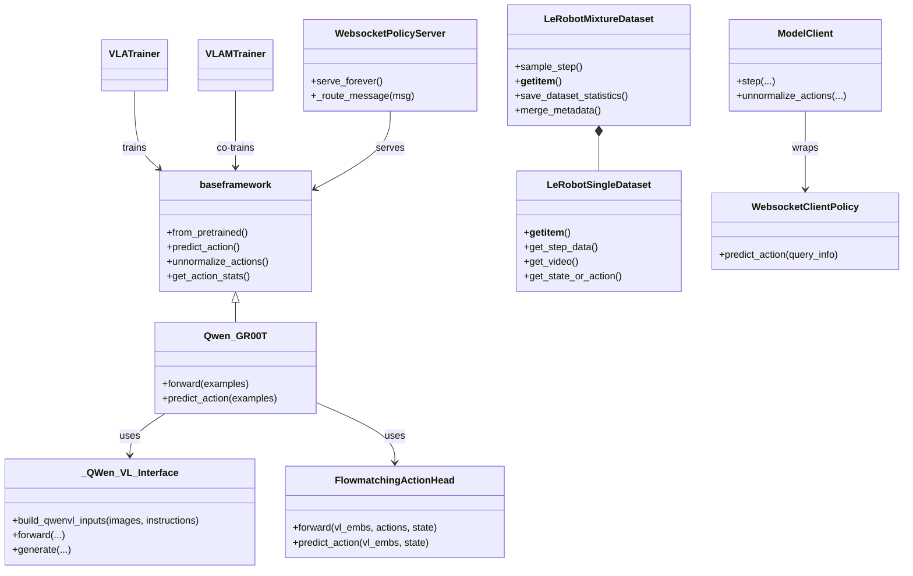
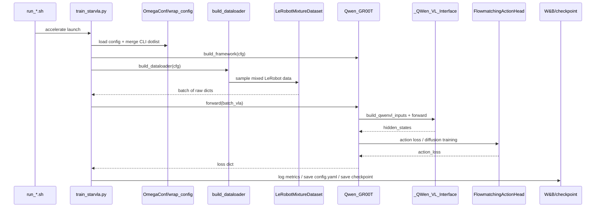
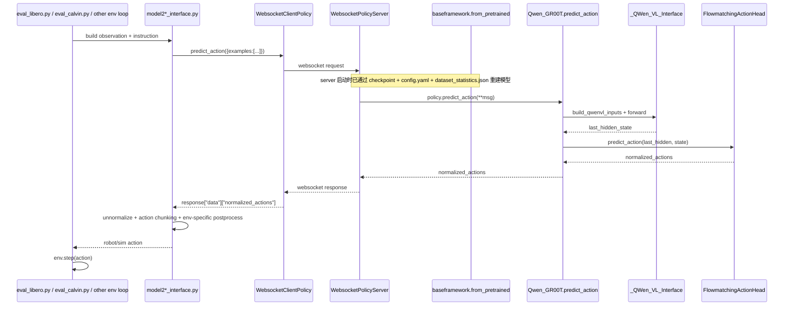

# starVLA 对具身智能 VLA Pipeline 需求的逐项实现分析

## 分析范围与方法
本文基于以下四类证据进行交叉分析：

1. 当前工作区里的 `starVLA` 本地源码与配置，重点分析了 `dataloader`、`training`、`model/framework`、`deployment/model_server`、`examples/*`。
2. `starVLA` 官方 README 与示例文档，用来确认项目自我定位与显式支持边界。
3. 与 starVLA 直接相关的公开资料，包括 GitHub issue `#64`、`#68`、`#158`，用于补充训练效率、自动评测脚本、实验跟踪等社区信息。
4. 相关开源框架/论文，用来做“需求基线”对照，主要包括：
   - `LeRobot`：统一机器人数据格式、元数据与统计信息。
   - `NVIDIA Isaac GR00T`：flow-matching action head 设计来源。
   - `OpenVLA` 论文与官网：强调 LoRA/量化部署/多机器人泛化，是第五阶段需求的一个很强参考基线。

说明：

- 这是一次“静态代码与文档分析”，没有实际跑通完整 benchmark，也没有对训练速度、控制频率做在线实测。
- 因此文中的“满足/部分满足/不满足”，表示“从当前仓库实现证据来看是否已经落地”，而不是“理念上是否可扩展到此能力”。

## 一句话结论
如果把你的需求表看作“完整具身智能 VLA 研发与上线平台”的要求，那么 `starVLA` 当前最强的是：

- 基于 `LeRobot` 的标准化数据消费与归一化处理。
- 模块化 VLA 框架搭建与多种 Qwen 系列 VLA 变体复用。
- 多 GPU / 多节点训练、W&B 追踪、checkpoint 管理。
- 面向多个 benchmark 的评测适配层，以及基于 WebSocket 的推理解耦部署。

当前最明显的缺口是：

- 没有内建“数据采集平台”，更偏向“消费已有数据”而不是“采集数据”。
- 没有真正落地 RL 微调框架，README 里也明确把 RL adaptation 标成未完成。
- 没有 LoRA/QLoRA、量化、TensorRT、ROS/ROS2、安全控制等生产部署能力。
- 评测自动化存在，但主要是 benchmark 脚本层；没有统一成训练器内的一体化 benchmark evaluator。

## 总体判定
| 阶段 | 总体判断 | 结论 |
| --- | --- | --- |
| 第一阶段：数据收集与管理 | 偏弱 | 更像“标准化数据读取/混合框架”，不是“数据采集平台” |
| 第二阶段：数据预处理与增强 | 较强 | 这部分是仓库最扎实的能力之一 |
| 第三阶段：模型训练与实验管理 | 较强但偏 IL | IL/VLM 共训很强，RL 基本未落地 |
| 第四阶段：模型评估 | 中强 | benchmark 覆盖广，但自动化与统一性仍有限 |
| 第五阶段：模型部署与微调 | 中等偏弱 | 有通用推理抽象，但缺少工程化部署优化与安全层 |

## 外部参考对照
### 1. 官方定位
`README.md` 把 starVLA 定义为 “Lego-like Codebase for Vision-Language-Action Model Developing”，强调的是：

- 模块化框架开发。
- 支持 `train your vlm`、`train your vla`、`train your vla with vlm`。
- 支持 `Qwen-FAST`、`Qwen-OFT`、`Qwen-PI`、`Qwen-GR00T` 等多种框架。
- 支持 `LIBERO`、`SimplerEnv`、`RoboCasa`、`RoboTwin`、`BEHAVIOR`、`Calvin` 等 benchmark。
- 在训练策略里明确写了：`Single Imitation Learning`、`Multimodal Multitasks Co-training` 已支持，而 `Reinforcement Learning Adaption` 仍是未勾选状态。

### 2. LeRobot 的影响
`starVLA` 对 `LeRobot` 的复用不是表面兼容，而是深度集成：

- 读取 `meta/modality.json`、`meta/info.json`、`meta/episodes.jsonl` 或 v3 的 parquet 元数据。
- 构造 `DatasetMetadata`、`DatasetStatistics`。
- 对 state/action/video 做统一的 metadata 驱动式变换和统计。

这说明在“标准化数据格式与管理”这一类需求上，starVLA 的核心思路明显建立在 `LeRobot` 生态之上。

### 3. GR00T 的影响
`QwenGR00T` 的 action head 直接来自 `GR00T_ActionHeader.py` 中的 `FlowmatchingActionHead`，其结构和 README 的说明都表明：

- starVLA 并不是自创一套全新的 action decoder；
- 而是把 Qwen-VL 作为 System 2，把 GR00T/flow matching 风格的 action expert 作为 System 1；
- 这也是它能较快复用多个 benchmark 的关键原因。

### 4. OpenVLA 作为部署/微调基线
OpenVLA 论文和官网明确强调了：

- 支持 parameter-efficient fine-tuning，尤其是 LoRA。
- 支持量化部署而不明显损伤成功率。

而这些能力在当前 starVLA 仓库中并未内建，因此第五阶段里很多需求只能判为“不满足”或“部分满足”。

## 关键类图

## 关键时序图
### 1. 训练时序

### 2. 部署与评测时序

## 关键文件与调用关系
### 1. 数据主链
- `starVLA/dataloader/__init__.py`
  -> `starVLA/dataloader/lerobot_datasets.py`
  -> `starVLA/dataloader/gr00t_lerobot/datasets.py`
  -> `starVLA/dataloader/gr00t_lerobot/data_config.py`
  -> `starVLA/dataloader/gr00t_lerobot/transform/state_action.py`
  -> `starVLA/dataloader/gr00t_lerobot/transform/video.py`

### 2. 纯 VLA 训练主链
- `examples/*/train_files/run_*.sh`
  -> `starVLA/training/train_starvla.py`
  -> `starVLA/model/framework/__init__.py`
  -> `starVLA/model/framework/QwenGR00T.py`
  -> `starVLA/model/modules/vlm/QWen2_5.py` 或 `QWen3.py`
  -> `starVLA/model/modules/action_model/GR00T_ActionHeader.py`

### 3. VLA + VLM 共训主链
- `examples/CoTrainVLM/train_files/run_libero_cotrain.sh`
  -> `starVLA/training/train_starvla_cotrain.py`
  -> `starVLA/dataloader/vlm_datasets.py`
  -> 同时跑 `model.forward(batch_vla)` 与 `model.qwen_vl_interface(**batch_vlm)`

### 4. 推理与评测主链
- `deployment/model_server/server_policy.py`
  -> `starVLA/model/framework/base_framework.py`
  -> `deployment/model_server/tools/websocket_policy_server.py`

- `examples/LIBERO/eval_files/eval_libero.py`
  -> `examples/LIBERO/eval_files/model2libero_interface.py`
  -> `deployment/model_server/tools/websocket_policy_client.py`
  -> `framework.predict_action`

- `examples/SimplerEnv/eval_files/model2simpler_interface.py`
  -> `deployment/model_server/tools/websocket_policy_client.py`
  -> `framework.predict_action`

- `examples/Robotwin/eval_files/model2robotwin_interface.py`
  -> `deployment/model_server/tools/websocket_policy_client.py`
  -> `framework.predict_action`

- `examples/Robocasa_tabletop/eval_files/model2robocasa_interface.py`
  -> `deployment/model_server/tools/websocket_policy_client.py`
  -> `framework.predict_action`

## 逐项需求分析
下面按 `docs/具身智能vla系统pipeline的各阶段及其需求表.md` 的每一行需求逐项判定。

---

## 第一阶段：数据收集与管理
### 1. `多源数据采集`：`部分满足`
已实现：
starVLA 可以很好地“消费”多源数据。`DATASET_NAMED_MIXTURES` 支持把 `Bridge`、`RT-1/Fractal`、`LIBERO`、`Robotwin`、`RoboCasa GR1`、`BEHAVIOR` 等数据源按权重混合；`ROBOT_TYPE_CONFIG_MAP` 允许每个 embodiment 配置自己的视频、状态、动作和语言字段。

未实现：
这不是一个数据采集平台。仓库里没有遥操作采集、真实机器人录制、RL rollout 采集、失败轨迹打标、奖励回写、在线标注台。也就是说它支持“导入多源数据”，但不支持“生产这些数据”。

关键文件：
`starVLA/dataloader/gr00t_lerobot/mixtures.py`、`starVLA/dataloader/gr00t_lerobot/data_config.py`、`starVLA/dataloader/lerobot_datasets.py`

### 2. `数据合成 (PCG)`：`不满足`
已实现：
仓库能接入多个仿真 benchmark，例如 `LIBERO`、`SimplerEnv`、`RoboCasa`、`RoboTwin`、`BEHAVIOR`。

未实现：
没有看到 starVLA 自己实现的程序化内容生成模块，也没有统一的场景随机化、纹理/光照/物理属性随机化流水线。随机化如果存在，主要属于外部 benchmark 或环境本身，而不是 starVLA 核心代码。

关键文件：
`examples/LIBERO`、`examples/SimplerEnv`、`examples/Robocasa_tabletop`、`examples/Robotwin`

### 3. `多模态数据同步记录`：`部分满足`
已实现：
在“读取已有数据”这件事上，starVLA 对多模态同步考虑得比较细。`LeRobotSingleDataset.get_video()` 使用轨迹时间戳取视频帧；对于 LeRobot v3，还会读取 `videos/from_timestamps` 做视频时间偏移修正。样本里会对齐图像、语言、动作、状态；`modality.json`/`info.json`/`tasks`/`episodes` 这些元数据也会被读取。

未实现：
它没有“同步记录”模块，只是“同步读取”模块。奖励信号虽然在 `modality_keys` 的示例里出现过 `reward`，但默认训练样本 `_pack_sample()` 并不会把 reward 打包给模型。

关键文件：
`starVLA/dataloader/gr00t_lerobot/datasets.py`、`starVLA/dataloader/gr00t_lerobot/schema.py`

### 4. `标准化数据格式与管理`：`部分满足`
已实现：
这是 starVLA 很强的一点。它深度采用 `LeRobot` 作为统一训练数据接口，支持 v2/v3 元数据，自动构造 `DatasetMetadata`、统计量、动作 mask，并把合并后的 `dataset_statistics.json` 保存到 run 目录，供部署和反归一化复用。

未实现：
需求中提到的数据检索、筛选、版本控制、查询服务，当前仓库并没有数据湖、索引服务、版本注册表、SQL/向量查询层。它更像“统一训练数据约定”而不是“数据管理平台”。

关键文件：
`starVLA/dataloader/gr00t_lerobot/schema.py`、`starVLA/dataloader/gr00t_lerobot/datasets.py`、`starVLA/dataloader/__init__.py`

### 5. `可扩展性`：`不满足`
已实现：
代码层面对多数据集 mixture 的扩展性不错。

未实现：
需求说的是 TB/PB 级数据湖/仓库的水平扩展，这一层 starVLA 没有。当前默认就是本地/共享文件系统上的 `parquet + json/jsonl + video` 文件读写。

关键文件：
`starVLA/dataloader/gr00t_lerobot/datasets.py`

### 6. `高吞吐`：`部分满足`
已实现：
在“训练读取吞吐”层面，starVLA 有一些优化：

- DataLoader 支持多 worker。
- 视频后端支持 `decord`。
- `steps_data_index.pkl` 和统计量带缓存。
- 多 GPU / 多节点训练可通过 `Accelerate + DeepSpeed` 启动。

未实现：
没有高速数据采集写入系统，也没有专门为高频遥操作/并行仿真设计的数据 ingest 服务。

关键文件：
`starVLA/dataloader/__init__.py`、`starVLA/dataloader/gr00t_lerobot/datasets.py`、`starVLA/config/deepseeds/*`

### 7. `易用性`：`部分满足`
已实现：
对“研究者复现训练”来说，易用性不错。README 和 examples 提供了 benchmark 级脚本；dataset、framework 都能单独 smoke test；配置支持 YAML + CLI dotlist 覆盖。

未实现：
对“数据采集员/标注员”的易用性几乎没有支持，因为根本没有这类工具链。

关键文件：
`README.md`、`assets/intro_v1.md`、`examples/*/README.md`

### 8. `数据质量与一致性`：`部分满足`
已实现：
有 metadata 校验、key 完整性检查、时间戳对齐读取、统计文件缓存与 barrier 同步、动作模式一致性变换等。

未实现：
没有专门的数据质量审计、坏轨迹检测、时间同步误差分析、采集端 checksum/事务保证。

关键文件：
`starVLA/dataloader/gr00t_lerobot/datasets.py`、`starVLA/dataloader/gr00t_lerobot/transform/state_action.py`

---

## 第二阶段：数据预处理与增强
### 1. `数据清洗与转换`：`部分满足`
已实现：
starVLA 明确支持动作/状态的规范化与表示转换，包括：

- `q99` / `min_max` / `mean_std` / `binary` 归一化。
- 欧拉角、四元数、axis-angle、rotation_6d 之间转换。
- `abs` / `delta` / `rel` 动作模式转换。
- `include_state`、`delete_pause_frame`、`action_mode_apply_keys` 这类配置驱动的数据裁剪和重组织。

未实现：
没有成体系的低质量轨迹过滤器，也没有专门的清洗规则学习或异常样本修复管线。

关键文件：
`starVLA/dataloader/gr00t_lerobot/transform/state_action.py`、`starVLA/dataloader/gr00t_lerobot/datasets.py`

### 2. `数据切片与序列化`：`满足`
已实现：
这是 starVLA 的核心能力之一。`ModalityConfig.delta_indices` 定义观测窗口和动作窗口；`LeRobotSingleDataset.__getitem__()` 通过 `(trajectory_id, base_index)` 抽样，再调用 `retrieve_data_and_pad()` 组装固定长度片段，越界时按 absolute/relative 规则分别做边界复制或零填充。

为什么说满足：
这已经覆盖了“把连续轨迹切成固定长度片段”和“在时序窗口内随机/顺序采样子序列”的需求。

关键文件：
`starVLA/dataloader/gr00t_lerobot/datasets.py`、`starVLA/dataloader/gr00t_lerobot/data_config.py`

### 3. `数据增强`：`部分满足`
已实现：
视觉侧有 `VideoCrop`、`VideoResize`、`VideoColorJitter`、`RandomRotation`、`HorizontalFlip` 等；时序/状态侧有 `StateActionPerturbation`、`StateActionDropout`、`StateActionSinCosTransform`。

未实现：
没有高级语义增强、生成式增强、时序插值增强框架，也没有统一的 augmentation policy 搜索。

关键文件：
`starVLA/dataloader/gr00t_lerobot/transform/video.py`、`starVLA/dataloader/gr00t_lerobot/transform/state_action.py`

### 4. `模块化处理流程`：`满足`
已实现：
`ComposedModalityTransform` 把每一步 transform 解耦成独立积木；不同 robot type 通过 `data_config.py` 定义自己的 modality 和 transform 组合。模型侧预处理和数据侧预处理也被显式分开，README 还专门强调 dataloader 返回 raw dict，tokenizer/image packing 留在 framework 内。

关键文件：
`starVLA/dataloader/gr00t_lerobot/transform/base.py`、`starVLA/dataloader/gr00t_lerobot/data_config.py`、`README.md`

### 5. `计算效率`：`部分满足`
已实现：

- transform 是 on-the-fly 的。
- steps 和统计量有缓存。
- 支持 `decord` 视频读取。
- 多 GPU 训练下有 barrier 和 rank0 计算缓存再广播式使用。

未实现：
没有单独的离线 preprocessing engine，也没有 GPU 数据预处理流水线或 Arrow/streaming data service。

关键文件：
`starVLA/dataloader/gr00t_lerobot/datasets.py`、`starVLA/dataloader/__init__.py`

### 6. `可复现性`：`部分满足`
已实现：

- 训练脚本显式设置 seed。
- `safe_hash((epoch, index, seed))` 参与 mixture 采样。
- `wrap_config()` 会把真正访问到的配置保存到 `config.yaml`。
- `dataset_statistics.json` 会落盘并用于部署复现。

未实现：
训练态的数据增强依然包含随机变换；此外没有完整的环境封装、容器镜像与 deterministic checklist。

关键文件：
`starVLA/training/train_starvla.py`、`starVLA/training/trainer_utils/config_tracker.py`、`starVLA/dataloader/gr00t_lerobot/datasets.py`

### 7. `可配置性`：`满足`
已实现：
整个仓库把配置设计成核心基础设施：全局 YAML、命令行 dotlist 覆盖、robot-specific data config、framework-specific config、benchmark-specific config 都很成熟。

关键文件：
`starVLA/config/training/*.yaml`、`starVLA/training/trainer_utils/trainer_tools.py`、`assets/intro_v1.md`

---

## 第三阶段：模型训练与实验管理
### 1. `支持“IL 预训练 + RL 微调”范式`：`部分满足`
已实现：
IL 预训练和 VLM/VLA 共训是 starVLA 的核心主线，`train_starvla.py`、`train_starvla_cotrain.py`、`train_starvlm.py` 都是成熟入口。

未实现：
RL 微调没有真正落地。README 明确把 `Reinforcement Learning Adaption` 标成未完成；全仓库也找不到 PPO、SAC、IQL、CQL、TD3+BC 等实现。

关键文件：
`README.md`、`starVLA/training/train_starvla.py`、`starVLA/training/train_starvla_cotrain.py`

### 2. `支持主流算法`：`不满足`
结论非常明确：
当前 starVLA 的训练器是 imitation learning / VLM co-training 取向，不是 RL 框架。无论离线 RL 还是在线 RL，代码里都没有对应算法实现和 replay / actor / critic / value 学习主链。

关键文件：
`starVLA/training/*`、`README.md`

### 3. `关键技术挑战解决方案`：`部分满足`
已实现：

- 通过 `freeze_modules`、`reload_modules`、分组学习率，支持比较灵活的迁移训练。
- `train_starvla_cotrain.py` 允许 VLA loss 与 VLM loss 共存，这在一定程度上可以缓解只训 action head 带来的语言能力漂移。
- `trainer_tools.py` 里有 `pcgrad_project()`、梯度角度统计这类工具，说明作者考虑过多任务冲突。

未实现：
这些工具没有在主训练 loop 中形成系统化策略；也没有面向 RL 的分布偏移、价值过估计、次优数据利用模块。因此只能算“问题意识存在，工程落地不完整”。

关键文件：
`starVLA/training/trainer_utils/trainer_tools.py`、`starVLA/training/train_starvla_cotrain.py`

### 4. `分布式训练与实验管理`：`部分满足`
已实现：

- 训练器基于 `PyTorch + Accelerate + DeepSpeed`。
- 提供 `ZeRO-2`、`ZeRO-3` 配置。
- 脚本里有多机多卡的启动示例。
- 实验追踪支持 `W&B` 和 `summary.jsonl`，访问过的配置会保存到输出目录。

未实现：
没有看到 `TensorBoard` 集成；实验管理更像轻量 tracking，而不是完整 experiment platform。

关键文件：
`starVLA/training/train_starvla.py`、`starVLA/training/train_starvla_cotrain.py`、`starVLA/config/deepseeds/*`

### 5. `训练效率与资源利用率`：`部分满足`
已实现：

- `flash_attention_2`
- bf16 mixed precision
- gradient checkpointing 配置
- DeepSpeed ZeRO-2/3
- 社区 issue `#158` 还发布了实际训练效率报告

未实现：
需求中提到的 `Actor-Learner`、GPU 仿真训练、RLinf、M2Flow 等并不存在。starVLA 的效率优化主要集中在分布式 IL/VLA 训练，而不是 RL 大规模 actor-learner 体系。

关键文件：
`starVLA/model/modules/vlm/QWen2_5.py`、`starVLA/config/deepseeds/*`、GitHub issue `#158`

### 6. `灵活性与易用性`：`部分满足`
已实现：

- `FRAMEWORK_REGISTRY` 和 `build_framework()` 让不同 VLA 结构可插拔。
- `freeze_modules`、`reload_modules`、分组学习率提供了较好的实验灵活性。
- checkpoint 与 config 快照可复用。

未实现：
需求里提到“混合专家与在线数据的 replay pool”，当前没有；因此从完整训练系统角度看仍是部分满足。

关键文件：
`starVLA/model/framework/__init__.py`、`starVLA/model/tools.py`、`starVLA/training/trainer_utils/trainer_tools.py`

### 7. `容错与恢复`：`部分满足`
已实现：
有自动寻找最新 checkpoint 的逻辑，也支持 `pretrained_checkpoint` 与 `is_resume`。

未实现：
作者在 README 中明确说明“不会保存 optimizer state”，所以恢复并不是严格意义上的完整断点续训；更接近“模型权重续训”。

关键文件：
`starVLA/training/train_starvla.py`、`starVLA/training/trainer_utils/trainer_tools.py`、`README.md`

---

## 第四阶段：模型评估
### 1. `标准化评估基准`：`部分满足`
已实现：
支持的 benchmark 很丰富：`LIBERO`、`LIBERO-plus`、`SimplerEnv`、`RoboCasa`、`RoboTwin`、`BEHAVIOR`、`Calvin`。其中 `SimplerEnv` 背后本身与 ManiSkill2 路线相关。

未实现：
你的需求里点名的 `RLBench` 目前 README 仍是未勾选状态，所以不能算完全满足。

关键文件：
`README.md`、`examples/*/README.md`

### 2. `定性与定量评估`：`部分满足`
已实现：

- `eval_libero.py` 会统计 success 并保存回放视频。
- `eval_calvin.py` 会输出长程任务结果。
- `Behavior`、`RoboCasa` 也有视频写出路径。

未实现：
没有统一的“自动生成图表报告系统”。结果更多以日志、json、视频、benchmark 脚本输出为主。

关键文件：
`examples/LIBERO/eval_files/eval_libero.py`、`examples/calvin/eval_files/eval_calvin.py`、`examples/Behavior/start_behavior_env.py`

### 3. `自动化评估流程`：`部分满足`
已实现：

- trainer 内部有 `eval_interval`，会定期跑一次 action 级 MSE 评估。
- `examples/LIBERO/eval_files/auto_eval_scripts` 和 `examples/SimplerEnv/eval_files/auto_eval_scripts` 提供了批量评测脚本。
- `Behavior` 有并行评测脚本。

未实现：
这些自动化更多是脚本级自动化，不是统一集成在 trainer 里的 benchmark evaluator；auto_eval README 也明确说依赖内部平台，外部用户不能无缝复用。

关键文件：
`starVLA/training/train_starvla.py`、`examples/LIBERO/eval_files/auto_eval_scripts/*`、`examples/SimplerEnv/eval_files/auto_eval_scripts/*`

### 4. `可复现性`：`部分满足`
已实现：
评测采用统一的 `client -> websocket -> policy server -> framework.predict_action` 协议，减少环境侧对模型实现的侵入；benchmark 脚本里也大多显式要求 checkpoint、路径、seed。

未实现：
不同 benchmark 还是各自维护脚本，环境依赖差异很大，可复现性更多靠 README 步骤，而不是统一平台封装。

关键文件：
`examples/eval_protocol.md`、`examples/LIBERO/eval_files/eval_libero.py`、`examples/calvin/eval_files/eval_calvin.py`

### 5. `可扩展性`：`部分满足`
已实现：

- `Behavior` 提供并行评测脚本。
- `RoboCasa` 支持 `n_envs`。
- `LIBERO-plus` README 明确建议并行跑多个实例。

未实现：
没有统一的分布式 benchmark orchestrator；扩展能力由各 benchmark 自己实现，风格不统一。

关键文件：
`examples/Behavior/start_parallel_eval.sh`、`examples/Robocasa_tabletop/eval_files/simulation_env.py`、`examples/LIBERO-plus/README.md`

---

## 第五阶段：模型部署与微调
### 1. `模型优化与转换`：`不满足`
结论：
没有发现 PTQ/QAT、剪枝、蒸馏、导出 INT8/INT4 权重、压缩模型图等实现。

对比说明：
这正是 OpenVLA 已经公开强调的能力之一，而 starVLA 当前没有把这部分并进仓库。

关键文件：
全仓库未见对应实现。

### 2. `推理引擎编译优化`：`不满足`
结论：
没有 TensorRT、ONNX Runtime、TensorRT-LLM、算子融合编译、引擎序列化等代码。

关键文件：
全仓库未见对应实现。

### 3. `硬件无关的部署接口`：`部分满足`
已实现：
starVLA 有一个非常清晰的“模型服务抽象层”：

- `server_policy.py` 负责 checkpoint 恢复与起服务。
- `WebsocketPolicyServer` 只暴露 `predict_action`。
- 各 benchmark 用 `model2*_interface.py` 负责动作反归一化、action chunk、ensemble、坐标/动作空间转换。

这说明它已经实现了“环境无关的推理核心”。

未实现：
但这不是 ROS/ROS2 抽象机器人接口。它目前更像“benchmark 无关的 policy server + benchmark 专用 adapter”，而不是“真正硬件无关的一次编写，到处运行”机器人 middleware。

关键文件：
`deployment/model_server/server_policy.py`、`deployment/model_server/tools/websocket_policy_server.py`、`deployment/model_server/tools/websocket_policy_client.py`、`examples/*/eval_files/model2*_interface.py`

### 4. `高效在线微调`：`不满足`
已实现：
有模块冻结、部分加载、不同学习率组、甚至 `QwenAdapter` 这种结构级 parameter-efficient 思路。

未实现：
没有 LoRA/QLoRA/PEFT 库集成，也没有 adapter-weight 单独保存/合并/在线装载逻辑。所以从行业通常意义的 PEFT 来看，应判为不满足。

关键文件：
`starVLA/training/trainer_utils/trainer_tools.py`、`starVLA/model/framework/QwenAdapter.py`

### 5. `低延迟`：`部分满足`
已实现：

- policy server 常驻。
- inference 支持 bf16。
- action chunking 降低了每一步都请求模型的次数。
- benchmark adapter 中有 ensemble/chunk cache 这类在线执行技巧。

未实现：
没有正式的延迟 benchmark，也没有明确承诺 5-20Hz 的真实控制频率；更没有 TensorRT/量化去做系统级 latency optimization。

关键文件：
`deployment/model_server/server_policy.py`、`examples/LIBERO/eval_files/model2libero_interface.py`、`examples/SimplerEnv/eval_files/model2simpler_interface.py`

### 6. `鲁棒性与可靠性`：`部分满足`
已实现：

- server 有 idle timeout。
- client 会等待 server ready。
- mixture dataset 读取失败时有 retry。
- 多个 adapter 对 action shape、chunk、gripper 逻辑做了防御式检查。

未实现：
没有生产级健康检查、超时重试策略中心、故障熔断、日志告警系统。并且部分路径还存在代码不一致迹象，说明可靠性仍偏研究代码。

典型风险：
`examples/Behavior/model2behavior_interface.py` 使用了 `self.client.infer(...)`，但当前通用 client `WebsocketClientPolicy` 只提供 `predict_action(...)`；这表明至少这条 BEHAVIOR 路径可能仍有历史残留。

关键文件：
`deployment/model_server/tools/websocket_policy_server.py`、`deployment/model_server/tools/websocket_policy_client.py`、`examples/Behavior/model2behavior_interface.py`

### 7. `安全性`：`不满足`
结论：
没有显式碰撞检测、力矩限制、速度限制、安全停机、工作空间约束、异常恢复策略等机器人安全模块。

说明：
starVLA 把自己定位在 VLA 训练/评测/推理框架，而不是机器人控制安全栈；安全通常被留给外部 simulator、控制器或真实机器人中间件。

关键文件：
全仓库未见对应实现。

---

## 额外发现的实现风险与不一致
### 1. BEHAVIOR 训练/数据路径可能并不完全打通
`mixtures.py` 里有 `("BEHAVIOR_challenge", 1.0, "R1Pro")`，但 `ROBOT_TYPE_CONFIG_MAP` 中没有读到 `R1Pro` 的对应 data config。说明至少从统一 dataloader 角度，这条链路存在潜在缺口。

### 2. BEHAVIOR 推理接口存在历史残留
如上所述，`model2behavior_interface.py` 调的是 `client.infer()`，但通用 client 暴露的是 `predict_action()`。

### 3. 自动评测脚本并非完全产品化
`examples/LIBERO/eval_files/auto_eval_scripts/REAMDE.md` 与 `examples/SimplerEnv/eval_files/auto_eval_scripts/README.md` 都明确写了：这些脚本依赖作者内部平台，外部用户应把它们视为参考，而不是开箱即用工具。

## 最终判断
如果把你的需求表理解成“一个覆盖数据生产、训练、评测、上线、安全的全栈具身智能平台”，那么 starVLA 当前的定位更准确地说是：

- 一个以 `LeRobot` 标准数据消费为基础、
- 以 `Qwen + 多种 action head` 为核心模型积木、
- 以 `IL / VLM-VLA 共训` 为主要训练范式、
- 以 `benchmark adapter + WebSocket policy server` 为评测/部署边界

的研究型 VLA 框架。

因此：

- 第二、第三、第四阶段里与“研究开发框架”强相关的需求，starVLA 大多已经考虑并部分到充分满足。
- 第一阶段里与“数据采集平台”强相关的需求，starVLA 基本只满足“标准化读取”，不满足“采集系统”。
- 第五阶段里与“工业部署优化、PEFT、ROS、安全控制”强相关的需求，目前多数还没有进入仓库主实现。

## 建议如何解读 starVLA
最合理的解读不是“它已经覆盖了完整具身智能 pipeline”，而是：

1. 它已经提供了一套很好的 VLA 研究骨架。
2. 它在数据标准化、模型乐高化、训练实验化、benchmark 评测适配上做得很到位。
3. 它离“完整生产系统”还差数据采集、RL、PEFT、部署优化、安全控制这四大块。

如果你后续要把这个分析继续深化成“需求 -> 代码证据 -> 改造建议”的设计文档，最适合优先补的四个模块是：

1. 数据采集与标注平台。
2. Offline/Online RL 微调子系统。
3. PEFT 与量化/TensorRT 部署链路。
4. ROS2/真实机器人安全执行中间层。
